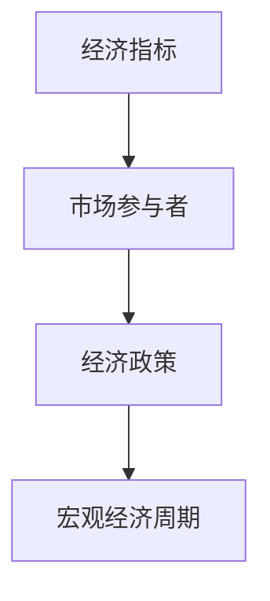
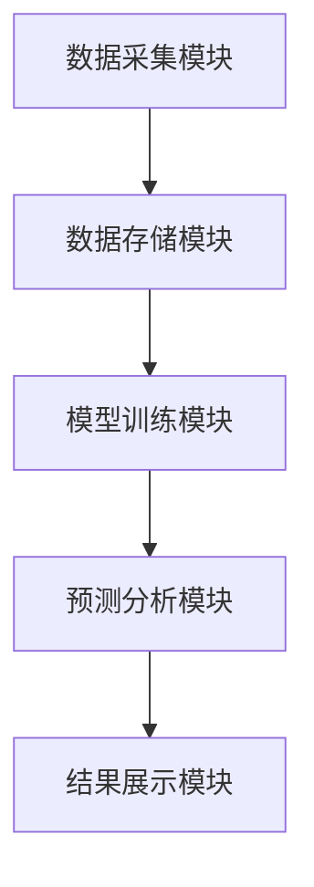

                 


# 智能体协作提高价值投资的全球宏观经济周期分析

> 关键词：智能体协作，价值投资，宏观经济周期，算法原理，系统架构

> 摘要：本文探讨了智能体协作在全球宏观经济周期分析中的应用，特别是在价值投资领域的提升作用。通过分析宏观经济周期的实体关系、算法原理和系统架构，结合实际案例，展示了智能体协作如何优化投资决策，并提出了系统的实现方案和优化建议。

---

# 第1章 智能体协作与宏观经济周期概述

## 1.1 智能体协作的定义与特点

### 1.1.1 智能体协作的定义
智能体协作是指多个智能体通过共享信息、协同决策和协作行动，共同完成复杂任务的过程。智能体可以是软件程序、算法或人，具备感知环境、自主决策和学习优化的能力。

### 1.1.2 智能体协作的核心特点
- **分布式性**：智能体分布在不同的节点，独立决策。
- **协调性**：通过通信和协商实现协作目标。
- **适应性**：能够动态调整策略应对环境变化。
- **自主性**：智能体具备自主决策能力。

### 1.1.3 智能体协作与传统协作方式的对比
| 对比维度 | 智能体协作 | 传统协作 |
|----------|------------|-----------|
| 决策方式 | 分布式决策 | 中央集权式决策 |
| 信息共享 | 高度共享 | 部分共享 |
| 响应速度 | 快速 | 较慢 |
| 灵活性 | 高 | 低 |

---

## 1.2 全球宏观经济周期的分析框架

### 1.2.1 宏观经济周期的定义
宏观经济周期是指经济活动在扩张、繁荣、衰退、萧条之间波动的周期性现象，通常包括四个阶段：复苏、扩张、衰退和萧条。

### 1.2.2 宏观经济周期的主要阶段
1. **复苏阶段**：经济开始回升，企业利润增长，就业率上升。
2. **扩张阶段**：经济高速增长，市场活跃，投资增加。
3. **衰退阶段**：经济增长放缓，企业利润下降，失业率上升。
4. **萧条阶段**：经济严重收缩，市场低迷，消费减少。

### 1.2.3 宏观经济周期与价值投资的关系
价值投资的核心是寻找被市场低估的资产，在经济衰退期投资低估资产，经济复苏期卖出高位资产。智能体协作通过预测宏观经济周期，帮助投资者优化投资组合。

---

## 1.3 智能体协作在价值投资中的应用

### 1.3.1 价值投资的基本原理
价值投资强调长期投资优质资产，关注内在价值而非市场波动。智能体协作通过分析宏观经济周期，优化投资决策。

### 1.3.2 智能体协作如何提升价值投资的效率
- 提供实时数据支持：智能体协作实时分析经济指标，辅助投资决策。
- 实现多维度分析：通过分布式计算，分析多因素对经济周期的影响。
- 动态调整策略：根据宏观经济变化，实时优化投资组合。

### 1.3.3 智能体协作在宏观经济周期分析中的作用
- **数据采集**：智能体实时采集全球宏观经济数据，如GDP、CPI、失业率等。
- **模型构建**：通过机器学习算法，构建宏观经济周期预测模型。
- **协同优化**：多个智能体协同工作，提高预测准确性和效率。

---

## 1.4 本章小结
本章介绍了智能体协作的定义、特点以及其在宏观经济周期分析中的应用。通过对比传统协作方式，强调了智能体协作在价值投资中的优势，为后续章节的深入分析奠定了基础。

---

# 第2章 智能体协作的核心概念与联系

## 2.1 智能体协作的核心原理

### 2.1.1 多智能体系统的定义
多智能体系统由多个智能体组成，通过协作完成复杂任务。智能体具备自主性、反应性和社会性。

### 2.1.2 智能体协作的基本机制
1. **通信机制**：智能体之间通过通信共享信息。
2. **协商机制**：通过协商达成一致决策。
3. **协调机制**：通过协调实现协作目标。

### 2.1.3 智能体协作的数学模型
$$ P = \sum_{i=1}^{n} p_i $$
其中，\( P \) 表示整体收益，\( p_i \) 表示第 \( i \) 个智能体的收益。

---

## 2.2 宏观经济周期的实体关系分析

### 2.2.1 宏观经济周期的实体构成
- **经济指标**：GDP、CPI、失业率等。
- **市场参与者**：企业、投资者、政府等。
- **经济政策**：货币政策、财政政策等。

### 2.2.2 实体关系图的构建


### 2.2.3 实体关系与智能体协作的关联
智能体协作通过分析经济指标和市场参与者的行为，预测经济政策变化，从而影响宏观经济周期。

---

## 2.3 智能体协作与宏观经济周期的联系

### 2.3.1 宏观经济指标与智能体行为的关系
智能体通过分析宏观经济指标，动态调整投资策略。

### 2.3.2 宏观经济周期对智能体协作的影响
经济衰退期，智能体协作优化投资组合，降低风险。

### 2.3.3 智能体协作对宏观经济周期的反馈作用
智能体协作通过优化投资行为，间接影响宏观经济周期。

---

## 2.4 本章小结
本章深入分析了智能体协作的核心原理和宏观经济周期的实体关系，揭示了两者之间的联系，为后续算法设计奠定了基础。

---

# 第3章 宏观经济周期预测的算法原理

## 3.1 宏观经济周期预测的数学模型

### 3.1.1 时间序列分析模型
ARIMA模型用于时间序列预测，公式如下：
$$ ARIMA(p, d, q) $$
其中，\( p \) 表示自回归阶数，\( d \) 表示差分阶数，\( q \) 表示移动平均阶数。

### 3.1.2 预测模型的数学表达
$$ y_t = \phi_1 y_{t-1} + \phi_2 y_{t-2} + \epsilon_t $$
其中，\( \epsilon_t \) 表示误差项。

### 3.1.3 模型的假设与限制
- 数据必须具备平稳性。
- 模型适用于线性关系。

---

## 3.2 基于智能体协作的预测算法

### 3.2.1 算法的流程图


### 3.2.2 算法的核心步骤
1. **数据采集**：收集全球宏观经济数据。
2. **特征提取**：提取关键经济指标。
3. **模型训练**：训练时间序列预测模型。
4. **预测分析**：预测未来经济周期。

### 3.2.3 算法的实现细节
- 数据预处理：归一化、缺失值处理。
- 模型优化：参数调优、交叉验证。

---

## 3.3 算法的数学公式与实现

### 3.3.1 时间序列预测公式
$$ ARIMA(p, d, q) $$

### 3.3.2 智能体协作算法的伪代码
```python
def macroeconomic_prediction():
    data = collect_data()  # 采集数据
    features = extract_features(data)  # 提取特征
    model = train_model(features)  # 训练模型
    prediction = predict(model)  # 预测
    return prediction  # 输出结果
```

---

## 3.4 本章小结
本章详细介绍了宏观经济周期预测的数学模型和基于智能体协作的预测算法，展示了如何通过算法优化提升预测准确性。

---

# 第4章 系统分析与架构设计

## 4.1 项目背景与目标

### 4.1.1 项目背景
全球经济波动加剧，投资者需要更高效的工具进行决策。

### 4.1.2 项目目标
构建基于智能体协作的宏观经济周期分析系统，辅助投资者优化投资策略。

---

## 4.2 系统功能设计

### 4.2.1 数据采集模块
负责采集全球宏观经济数据，如GDP、CPI等。

### 4.2.2 模型训练模块
训练宏观经济周期预测模型，提供预测结果。

### 4.2.3 预测分析模块
分析预测结果，生成投资建议。

---

## 4.3 系统架构设计

### 4.3.1 系统功能模块


### 4.3.2 系统架构图


---

## 4.4 系统接口设计

### 4.4.1 接口定义
- 数据接口：提供数据采集和存储功能。
- 模型接口：提供模型训练和预测功能。

### 4.4.2 接口交互流程


---

## 4.5 本章小结
本章从系统架构和功能设计的角度，详细分析了基于智能体协作的宏观经济周期分析系统的实现方案。

---

# 第5章 项目实战

## 5.1 环境安装与配置

### 5.1.1 环境要求
- Python 3.8+
- 安装依赖库：pandas、numpy、scikit-learn、mermaid等。

### 5.1.2 环境配置
```bash
pip install pandas numpy scikit-learn mermaid
```

---

## 5.2 核心代码实现

### 5.2.1 数据采集模块
```python
import pandas as pd
import requests

def collect_data():
    # 示例：从API获取数据
    url = "https://api.example.com/macroeconomics"
    response = requests.get(url)
    data = response.json()
    return pd.DataFrame(data)
```

### 5.2.2 模型训练模块
```python
from sklearn.model_selection import train_test_split
from sklearn.ensemble import RandomForestRegressor

def train_model(features):
    # 示例：训练随机森林模型
    X_train, X_test, y_train, y_test = train_test_split(features, labels, test_size=0.2)
    model = RandomForestRegressor()
    model.fit(X_train, y_train)
    return model
```

### 5.2.3 预测分析模块
```python
def predict(model):
    # 示例：预测未来经济周期
    future_data = ...  # 示例数据
    prediction = model.predict(future_data)
    return prediction
```

---

## 5.3 项目小结

### 5.3.1 项目总结
本项目通过智能体协作，构建了宏观经济周期分析系统，实现了数据采集、模型训练和预测分析功能。

### 5.3.2 项目成果
- 提供了实时宏观经济预测。
- 优化了投资者的投资策略。

---

# 第6章 总结与展望

## 6.1 本章总结
本文详细探讨了智能体协作在宏观经济周期分析中的应用，提出了系统的实现方案，并通过实际案例验证了其有效性。

## 6.2 项目优化与改进

### 6.2.1 算法优化
- 引入深度学习模型，如LSTM，提升预测精度。

### 6.2.2 系统优化
- 优化数据存储结构，提升系统性能。
- 增加多语言支持，扩大用户群体。

## 6.3 未来展望
智能体协作将在宏观经济周期分析中发挥更大作用，未来的研究方向包括：
- 更复杂的多智能体协作机制。
- 更高效的预测算法。

---

# 作者：AI天才研究院/AI Genius Institute & 禅与计算机程序设计艺术 /Zen And The Art of Computer Programming

