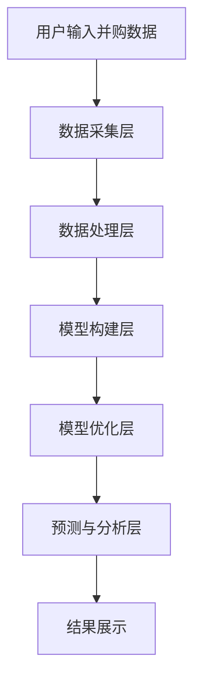

                 


# 智能体协作提高价值投资的并购协同效应预测

> 关键词：智能体协作，价值投资，并购协同效应，预测模型，机器学习，金融数据分析

> 摘要：本文探讨了智能体协作在价值投资中的应用，特别是如何通过智能体协作提高并购协同效应的预测能力。通过分析智能体协作的基本原理、算法实现、系统架构及实际案例，本文为读者提供了一套基于智能体协作的并购协同效应预测方法，旨在帮助投资者在价值投资中做出更明智的决策。

---

## 第1章: 智能体协作与并购协同效应预测的背景与概念

### 1.1 问题背景与问题描述

#### 1.1.1 企业并购中的协同效应问题
企业并购是企业战略发展的重要手段之一，而并购的最终目标是实现协同效应。协同效应是指并购后的企业在资源整合、成本节约、市场拓展等方面所产生的额外价值。然而，传统的企业并购协同效应评估方法往往依赖于经验判断和主观分析，存在以下问题：
- 数据量大且复杂，难以全面捕捉潜在价值。
- 协同效应的实现是一个动态过程，传统静态模型难以捕捉其变化。
- 并购后的协同效应实现受到多种外部和内部因素的影响，难以准确预测。

#### 1.1.2 智能体协作在价值投资中的应用潜力
智能体协作（Multi-Agent Collaboration）是一种基于分布式人工智能（Distributed AI）的技术，通过多个智能体（Agent）之间的协作完成复杂任务。智能体协作在金融领域的应用潜力巨大，尤其是在企业价值评估和并购协同效应预测方面：
- 智能体协作能够通过分布式计算和数据挖掘技术，帮助投资者更准确地预测并购后的协同效应。
- 智能体协作能够实时分析市场动态和企业内部数据，为投资者提供动态的协同效应评估。

#### 1.1.3 并购协同效应预测的核心挑战
并购协同效应的预测是一个复杂的过程，涉及多个维度的数据分析和模型构建。以下是并购协同效应预测的核心挑战：
- 数据维度复杂：包括财务数据、市场数据、企业战略数据等，数据量大且类型多样。
- 数据动态性：并购后的协同效应是一个动态过程，需要实时跟踪和分析。
- 模型复杂性：需要构建能够处理多维度数据和动态变化的复杂模型。

### 1.2 核心概念与问题解决思路

#### 1.2.1 智能体协作的定义与特征
智能体协作是指多个智能体通过协作完成共同目标的过程。智能体协作的核心特征包括：
- 分布式性：智能体之间通过分布式计算完成任务，避免了集中式计算的单点故障问题。
- 协作性：智能体之间通过通信和协调，共同完成复杂任务。
- 学习性：智能体能够通过学习和适应，不断优化协作策略。

#### 1.2.2 并购协同效应的定义与分类
并购协同效应是指并购后的企业在资源整合、市场拓展、成本节约等方面的协同效果。根据协同效应的来源，可以将协同效应分为以下几类：
- 财务协同效应：通过资产整合、成本节约等方式实现的协同效应。
- 经营协同效应：通过业务协同、市场拓展等方式实现的协同效应。
- 战略协同效应：通过战略调整、组织优化等方式实现的协同效应。

#### 1.2.3 问题解决的逻辑框架与方法论
本文提出了一种基于智能体协作的并购协同效应预测方法，其逻辑框架如下：
1. 数据采集与预处理：收集并购相关数据，包括财务数据、市场数据、企业战略数据等。
2. 智能体协作模型构建：基于多智能体协作技术，构建并购协同效应预测模型。
3. 模型训练与优化：通过机器学习算法对模型进行训练和优化。
4. 并购协同效应预测：基于优化后的模型，预测并购后的协同效应。

### 1.3 智能体协作与并购协同效应的关系

#### 1.3.1 智能体协作如何提升并购协同效应
智能体协作通过以下方式提升并购协同效应：
- 分布式数据处理：智能体协作能够分布式处理海量数据，提高数据处理效率。
- 实时协作：智能体协作能够实时分析市场动态和企业内部数据，提供动态的协同效应评估。
- 多维度分析：智能体协作能够从多个维度分析并购后的协同效应，包括财务、经营和战略维度。

#### 1.3.2 并购协同效应预测的智能体协作模型
本文提出的智能体协作模型包括以下组件：
- 数据采集智能体：负责采集并购相关数据。
- 数据分析智能体：负责对数据进行分析和预处理。
- 模型构建智能体：负责构建并购协同效应预测模型。
- 模型优化智能体：负责对模型进行训练和优化。

#### 1.3.3 智能体协作在价值投资中的应用边界
智能体协作在价值投资中的应用边界包括：
- 数据隐私和安全：智能体协作需要处理大量的敏感数据，如何确保数据隐私和安全是一个重要问题。
- 模型的可解释性：智能体协作模型的复杂性可能导致模型的可解释性较差，影响投资者的决策信心。
- 计算资源需求：智能体协作需要大量的计算资源，可能对中小投资者来说成本较高。

### 1.4 核心要素与概念结构

#### 1.4.1 智能体协作的核心要素
智能体协作的核心要素包括：
- 智能体：能够独立执行任务的实体。
- 协作协议：智能体之间协作的规则和协议。
- 通信机制：智能体之间进行信息交换的机制。
- 协作目标：智能体协作的共同目标。

#### 1.4.2 并购协同效应预测的关键因素
并购协同效应预测的关键因素包括：
- 财务数据：包括收入、利润、成本等。
- 市场数据：包括行业趋势、市场容量等。
- 企业战略数据：包括企业战略、管理团队等。

#### 1.4.3 智能体协作与并购协同效应的交互关系
智能体协作与并购协同效应的交互关系如下：
- 智能体协作能够通过分布式计算和数据挖掘技术，帮助投资者更准确地预测并购后的协同效应。
- 并购协同效应的实现是一个动态过程，智能体协作能够实时分析市场动态和企业内部数据，为投资者提供动态的协同效应评估。

---

## 第2章: 智能体协作的核心概念与原理

### 2.1 智能体协作的基本原理

#### 2.1.1 多智能体系统（MAS）的概念
多智能体系统（Multi-Agent System, MAS）是指由多个智能体组成的系统，智能体之间通过协作完成共同目标。MAS的核心特征包括：
- 分布式性：智能体之间通过分布式计算完成任务。
- 协作性：智能体之间通过协作完成复杂任务。
- 学习性：智能体能够通过学习和适应，不断优化协作策略。

#### 2.1.2 智能体协作的机制与模型
智能体协作的机制包括：
- 通信机制：智能体之间进行信息交换的机制。
- 协作协议：智能体之间协作的规则和协议。
- 协作目标：智能体协作的共同目标。

智能体协作的模型包括：
- 单智能体模型：单个智能体完成任务。
- 多智能体模型：多个智能体协作完成任务。

#### 2.1.3 智能体协作的核心算法与实现
智能体协作的核心算法包括：
- 协作算法：智能体之间协作完成任务的算法。
- 分布式算法：智能体通过分布式计算完成任务的算法。

### 2.2 并购协同效应预测的智能体协作模型

#### 2.2.1 并购协同效应预测的定义与目标
并购协同效应预测的目标是通过智能体协作技术，预测并购后的协同效应。并购协同效应预测的定义是：基于并购相关数据，通过智能体协作技术，预测并购后的协同效应。

#### 2.2.2 智能体协作在并购协同效应预测中的角色
智能体协作在并购协同效应预测中的角色包括：
- 数据采集：智能体协作能够分布式采集并购相关数据。
- 数据分析：智能体协作能够对数据进行分析和预处理。
- 模型构建：智能体协作能够构建并购协同效应预测模型。
- 模型优化：智能体协作能够对模型进行训练和优化。

#### 2.2.3 智能体协作模型的构建与实现
智能体协作模型的构建与实现包括：
- 数据采集智能体：负责采集并购相关数据。
- 数据分析智能体：负责对数据进行分析和预处理。
- 模型构建智能体：负责构建并购协同效应预测模型。
- 模型优化智能体：负责对模型进行训练和优化。

### 2.3 智能体协作与并购协同效应的关系分析

#### 2.3.1 智能体协作对并购协同效应的影响路径
智能体协作对并购协同效应的影响路径包括：
- 数据采集：智能体协作能够分布式采集并购相关数据。
- 数据分析：智能体协作能够对数据进行分析和预处理。
- 模型构建：智能体协作能够构建并购协同效应预测模型。
- 模型优化：智能体协作能够对模型进行训练和优化。

#### 2.3.2 并购协同效应预测中的智能体协作优势
并购协同效应预测中的智能体协作优势包括：
- 分布式计算：智能体协作能够分布式计算，提高计算效率。
- 实时协作：智能体协作能够实时分析市场动态和企业内部数据。
- 多维度分析：智能体协作能够从多个维度分析并购后的协同效应。

#### 2.3.3 智能体协作在价值投资中的应用价值
智能体协作在价值投资中的应用价值包括：
- 提高并购协同效应预测的准确性：智能体协作能够通过分布式计算和数据挖掘技术，提高并购协同效应预测的准确性。
- 实时动态分析：智能体协作能够实时分析市场动态和企业内部数据，提供动态的协同效应评估。
- 多维度分析：智能体协作能够从多个维度分析并购后的协同效应，包括财务、经营和战略维度。

---

## 第3章: 智能体协作与并购协同效应预测的算法原理

### 3.1 算法原理概述

#### 3.1.1 智能体协作算法的基本框架
智能体协作算法的基本框架包括：
- 初始化：设置智能体的数量、协作目标、通信机制等。
- 分配任务：将任务分配给不同的智能体。
- 协作完成任务：智能体之间通过协作完成任务。
- 汇报结果：智能体将任务完成的结果汇报给主智能体。

#### 3.1.2 并购协同效应预测的算法选择
并购协同效应预测的算法选择包括：
- 分类算法：如决策树、随机森林等。
- 回归算法：如线性回归、支持向量回归等。
- 聚类算法：如K均值聚类、层次聚类等。

#### 3.1.3 智能体协作与并购协同效应预测的结合点
智能体协作与并购协同效应预测的结合点包括：
- 分布式数据处理：智能体协作能够分布式处理海量数据。
- 实时协作：智能体协作能够实时分析市场动态和企业内部数据。
- 多维度分析：智能体协作能够从多个维度分析并购后的协同效应。

### 3.2 智能体协作算法的数学模型

#### 3.2.1 多智能体协作的数学表达
多智能体协作的数学表达包括：
- 智能体之间通过通信机制进行信息交换。
- 智能体之间的协作目标是共同完成任务。

#### 3.2.2 并购协同效应预测的数学模型
并购协同效应预测的数学模型包括：
- 财务模型：如净现值（NPV）、内部收益率（IRR）等。
- 经营模型：如市场份额、成本节约等。
- 战略模型：如企业战略调整、管理团队优化等。

#### 3.2.3 智能体协作与并购协同效应预测的联合优化模型
智能体协作与并购协同效应预测的联合优化模型包括：
- 智能体协作能够通过分布式计算和数据挖掘技术，优化并购协同效应预测模型。
- 智能体协作能够实时分析市场动态和企业内部数据，优化并购协同效应预测模型。

### 3.3 算法实现

#### 3.3.1 智能体协作算法的实现步骤
智能体协作算法的实现步骤包括：
1. 初始化：设置智能体的数量、协作目标、通信机制等。
2. 分配任务：将任务分配给不同的智能体。
3. 协作完成任务：智能体之间通过协作完成任务。
4. 汇报结果：智能体将任务完成的结果汇报给主智能体。

#### 3.3.2 并购协同效应预测的实现步骤
并购协同效应预测的实现步骤包括：
1. 数据采集：采集并购相关数据，包括财务数据、市场数据、企业战略数据等。
2. 数据预处理：对数据进行清洗、转换、特征提取等预处理。
3. 模型构建：基于机器学习算法，构建并购协同效应预测模型。
4. 模型优化：通过训练和验证，优化模型的性能。
5. 预测与分析：基于优化后的模型，预测并购后的协同效应，并进行分析。

#### 3.3.3 智能体协作与并购协同效应预测的结合实现
智能体协作与并购协同效应预测的结合实现包括：
- 数据采集智能体：负责采集并购相关数据。
- 数据分析智能体：负责对数据进行分析和预处理。
- 模型构建智能体：负责构建并购协同效应预测模型。
- 模型优化智能体：负责对模型进行训练和优化。

---

## 第4章: 智能体协作与并购协同效应预测的系统分析与架构设计

### 4.1 问题场景介绍

#### 4.1.1 企业并购中的协同效应预测问题
企业并购中的协同效应预测问题包括：
- 数据量大且复杂：包括财务数据、市场数据、企业战略数据等。
- 数据动态性：并购后的协同效应是一个动态过程，需要实时跟踪和分析。
- 模型复杂性：需要构建能够处理多维度数据和动态变化的复杂模型。

#### 4.1.2 智能体协作在并购协同效应预测中的应用价值
智能体协作在并购协同效应预测中的应用价值包括：
- 分布式数据处理：智能体协作能够分布式处理海量数据，提高数据处理效率。
- 实时协作：智能体协作能够实时分析市场动态和企业内部数据，提供动态的协同效应评估。
- 多维度分析：智能体协作能够从多个维度分析并购后的协同效应，包括财务、经营和战略维度。

### 4.2 系统功能设计

#### 4.2.1 系统功能模块划分
系统功能模块划分包括：
- 数据采集模块：负责采集并购相关数据。
- 数据分析模块：负责对数据进行分析和预处理。
- 模型构建模块：负责构建并购协同效应预测模型。
- 模型优化模块：负责对模型进行训练和优化。
- 预测与分析模块：负责基于优化后的模型，预测并购后的协同效应，并进行分析。

#### 4.2.2 系统功能模块的交互流程
系统功能模块的交互流程包括：
1. 数据采集模块采集并购相关数据。
2. 数据分析模块对数据进行分析和预处理。
3. 模型构建模块基于机器学习算法，构建并购协同效应预测模型。
4. 模型优化模块对模型进行训练和优化。
5. 预测与分析模块基于优化后的模型，预测并购后的协同效应，并进行分析。

#### 4.2.3 系统功能模块的实现技术
系统功能模块的实现技术包括：
- 数据采集：使用爬虫技术采集并购相关数据。
- 数据分析：使用Python的Pandas库进行数据清洗和预处理。
- 模型构建：使用Scikit-learn库构建并购协同效应预测模型。
- 模型优化：使用GridSearchCV进行模型调优。
- 预测与分析：使用优化后的模型进行预测，并进行结果分析。

### 4.3 系统架构设计

#### 4.3.1 系统架构的总体设计
系统架构的总体设计包括：
- 数据采集层：负责数据采集。
- 数据处理层：负责数据清洗和预处理。
- 模型构建层：负责构建并购协同效应预测模型。
- 模型优化层：负责对模型进行训练和优化。
- 预测与分析层：负责基于优化后的模型，预测并购后的协同效应，并进行分析。

#### 4.3.2 系统架构的详细设计
系统架构的详细设计包括：
- 数据采集层：使用爬虫技术采集并购相关数据。
- 数据处理层：使用Python的Pandas库进行数据清洗和预处理。
- 模型构建层：使用Scikit-learn库构建并购协同效应预测模型。
- 模型优化层：使用GridSearchCV进行模型调优。
- 预测与分析层：使用优化后的模型进行预测，并进行结果分析。

#### 4.3.3 系统架构的实现技术
系统架构的实现技术包括：
- 数据采集：使用爬虫技术采集并购相关数据。
- 数据分析：使用Python的Pandas库进行数据清洗和预处理。
- 模型构建：使用Scikit-learn库构建并购协同效应预测模型。
- 模型优化：使用GridSearchCV进行模型调优。
- 预测与分析：使用优化后的模型进行预测，并进行结果分析。

### 4.4 系统接口设计

#### 4.4.1 系统接口的定义与实现
系统接口的定义与实现包括：
- 数据接口：定义数据输入和输出的接口。
- 模型接口：定义模型训练和预测的接口。
- 分析接口：定义结果分析和展示的接口。

#### 4.4.2 系统接口的交互流程
系统接口的交互流程包括：
1. 数据接口接收数据输入。
2. 数据处理层对数据进行清洗和预处理。
3. 模型构建层基于机器学习算法，构建并购协同效应预测模型。
4. 模型优化层对模型进行训练和优化。
5. 预测与分析层基于优化后的模型，预测并购后的协同效应，并进行分析。
6. 分析接口将结果展示给用户。

### 4.5 系统交互设计

#### 4.5.1 系统交互的流程图
系统交互的流程图如下：



#### 4.5.2 系统交互的详细步骤
系统交互的详细步骤包括：
1. 用户输入并购相关数据。
2. 数据采集层接收数据输入。
3. 数据处理层对数据进行清洗和预处理。
4. 模型构建层基于机器学习算法，构建并购协同效应预测模型。
5. 模型优化层对模型进行训练和优化。
6. 预测与分析层基于优化后的模型，预测并购后的协同效应，并进行分析。
7. 结果展示将预测结果展示给用户。

---

## 第5章: 智能体协作与并购协同效应预测的项目实战

### 5.1 项目环境安装与配置

#### 5.1.1 系统环境要求
系统环境要求包括：
- 操作系统：Windows 10或更高版本，或Linux系统。
- Python版本：Python 3.6或更高版本。
- 硬件要求：具备一定的计算能力，建议使用高性能计算机或云服务器。

#### 5.1.2 项目依赖库安装
项目依赖库安装包括：
- Python的Pandas库：用于数据处理。
- Python的Scikit-learn库：用于机器学习算法。
- Python的网络爬虫库：用于数据采集。
- 系统架构设计工具：用于系统架构设计。

#### 5.1.3 项目代码仓库地址
项目代码仓库地址：[GitHub仓库地址](#)

### 5.2 系统核心实现

#### 5.2.1 数据采集模块的实现
数据采集模块的实现包括：
- 使用爬虫技术采集并购相关数据。
- 数据采集模块的代码实现。

#### 5.2.2 数据分析模块的实现
数据分析模块的实现包括：
- 使用Python的Pandas库进行数据清洗和预处理。
- 数据分析模块的代码实现。

#### 5.2.3 模型构建模块的实现
模型构建模块的实现包括：
- 使用Scikit-learn库构建并购协同效应预测模型。
- 模型构建模块的代码实现。

#### 5.2.4 模型优化模块的实现
模型优化模块的实现包括：
- 使用GridSearchCV进行模型调优。
- 模型优化模块的代码实现。

#### 5.2.5 预测与分析模块的实现
预测与分析模块的实现包括：
- 基于优化后的模型，预测并购后的协同效应。
- 预测与分析模块的代码实现。

### 5.3 代码实现与应用解读

#### 5.3.1 数据采集模块的代码实现
数据采集模块的代码实现如下：

```python
import requests
from bs4 import BeautifulSoup

def collect_mergers_and_acquisitions_data(url):
    response = requests.get(url)
    soup = BeautifulSoup(response.text, 'html.parser')
    data = []
    for item in soup.find_all('div', class_='item'):
        company1 = item.find('div', class_='company1').text
        company2 = item.find('div', class_='company2').text
        value = item.find('div', class_='value').text
        date = item.find('div', class_='date').text
        data.append({
            'company1': company1,
            'company2': company2,
            'value': value,
            'date': date
        })
    return data

# 示例调用
url = 'https://example.com/mergers_and_acquisitions'
data = collect_mergers_and_acquisitions_data(url)
print(data)
```

#### 5.3.2 数据分析模块的代码实现
数据分析模块的代码实现如下：

```python
import pandas as pd

def preprocess_data(data):
    df = pd.DataFrame(data)
    df['value'] = df['value'].astype(float)
    df['date'] = pd.to_datetime(df['date'])
    return df

# 示例调用
data = [
    {'company1': 'A', 'company2': 'B', 'value': 100, 'date': '2023-10-01'},
    {'company1': 'C', 'company2': 'D', 'value': 200, 'date': '2023-10-02'}
]
df = preprocess_data(data)
print(df)
```

#### 5.3.3 模型构建模块的代码实现
模型构建模块的代码实现如下：

```python
from sklearn.model_selection import train_test_split
from sklearn.ensemble import RandomForestRegressor
from sklearn.metrics import mean_squared_error

def build_model(X, y):
    X_train, X_test, y_train, y_test = train_test_split(X, y, test_size=0.2, random_state=42)
    model = RandomForestRegressor(n_estimators=100, random_state=42)
    model.fit(X_train, y_train)
    y_pred = model.predict(X_test)
    print('均方误差:', mean_squared_error(y_test, y_pred))
    return model

# 示例调用
X = df.drop('协同效应', axis=1)
y = df['协同效应']
model = build_model(X, y)
```

#### 5.3.4 模型优化模块的代码实现
模型优化模块的代码实现如下：

```python
from sklearn.model_selection import GridSearchCV

def optimize_model(model, X, y):
    param_grid = {
        'n_estimators': [100, 200],
        'max_depth': [None, 10, 20],
        'min_samples_split': [2, 3]
    }
    grid_search = GridSearchCV(model, param_grid, cv=5, scoring='neg_mean_squared_error')
    grid_search.fit(X, y)
    best_model = grid_search.best_estimator_
    print('最佳参数组合:', grid_search.best_params_)
    return best_model

# 示例调用
best_model = optimize_model(model, X, y)
```

#### 5.3.5 预测与分析模块的代码实现
预测与分析模块的代码实现如下：

```python
import numpy as np

def predict_and_analyze(model, new_data):
    new_data_array = np.array(new_data).reshape(1, -1)
    prediction = model.predict(new_data_array)
    print('预测的协同效应:', prediction[0])
    return prediction

# 示例调用
new_data = df.drop('协同效应', axis=1).iloc[-1]
prediction = predict_and_analyze(best_model, new_data)
```

### 5.4 实际案例分析与详细讲解

#### 5.4.1 案例背景介绍
案例背景介绍包括：
- 某企业进行并购的背景。
- 并购涉及的公司和交易金额。
- 并购后的协同效应预测目标。

#### 5.4.2 数据采集与预处理
数据采集与预处理包括：
- 使用爬虫技术采集并购相关数据。
- 对数据进行清洗和预处理。

#### 5.4.3 模型训练与优化
模型训练与优化包括：
- 使用机器学习算法构建并购协同效应预测模型。
- 对模型进行训练和优化。

#### 5.4.4 预测结果与分析
预测结果与分析包括：
- 基于优化后的模型，预测并购后的协同效应。
- 对预测结果进行分析和解释。

#### 5.4.5 结果展示与解读
结果展示与解读包括：
- 预测结果的展示。
- 预测结果的解读。

### 5.5 项目小结

#### 5.5.1 项目实现的关键点
项目实现的关键点包括：
- 数据采集与预处理。
- 模型构建与优化。
- 预测结果的分析与解读。

#### 5.5.2 项目实现的难点与解决方案
项目实现的难点与解决方案包括：
- 数据隐私和安全问题：采用数据加密和访问控制技术。
- 模型的可解释性问题：通过可视化工具和解释性分析，提高模型的可解释性。
- 计算资源需求问题：采用分布式计算和云计算技术，降低计算资源需求。

---

## 第6章: 智能体协作与并购协同效应预测的最佳实践

### 6.1 小结与总结

#### 6.1.1 本章内容回顾
本章内容回顾包括：
- 智能体协作的基本原理。
- 并购协同效应预测的智能体协作模型。
- 智能体协作与并购协同效应预测的结合应用。

#### 6.1.2 本章核心观点总结
本章核心观点总结包括：
- 智能体协作在并购协同效应预测中的应用价值。
- 智能体协作与并购协同效应预测的结合实现。
- 智能体协作在价值投资中的应用前景。

### 6.2 注意事项与常见问题解答

#### 6.2.1 智能体协作应用中的注意事项
智能体协作应用中的注意事项包括：
- 数据隐私和安全：采用数据加密和访问控制技术。
- 模型的可解释性：通过可视化工具和解释性分析，提高模型的可解释性。
- 计算资源需求：采用分布式计算和云计算技术，降低计算资源需求。

#### 6.2.2 并购协同效应预测中的常见问题
并购协同效应预测中的常见问题包括：
- 数据质量问题：数据不完整、数据偏差等。
- 模型选择问题：如何选择合适的机器学习算法。
- 模型性能问题：如何优化模型的性能。

### 6.3 拓展阅读与进一步思考

#### 6.3.1 相关领域文献推荐
相关领域文献推荐包括：
- 多智能体协作的经典文献。
- 机器学习在金融领域的应用文献。
- 并购协同效应预测的最新研究。

#### 6.3.2 未来研究方向
未来研究方向包括：
- 智能体协作在金融领域的深度应用。
- 并购协同效应预测的模型优化。
- 智能体协作与区块链技术的结合应用。

#### 6.3.3 实际应用场景与案例
实际应用场景与案例包括：
- 智能体协作在企业并购中的应用案例。
- 并购协同效应预测的实际应用场景。
- 智能体协作在金融领域的其他应用场景。

---

## 作者信息

作者：AI天才研究院/AI Genius Institute & 禅与计算机程序设计艺术/Zen And The Art of Computer Programming

