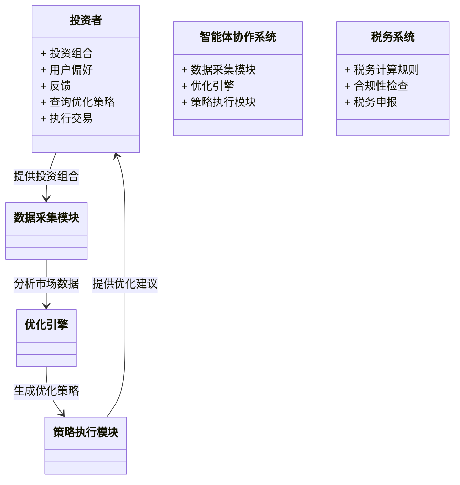

                 


# 智能体协作提高价值投资的税务策略优化

> 关键词：智能体协作，价值投资，税务优化，算法原理，系统架构

> 摘要：本文探讨了智能体协作如何优化价值投资中的税务策略，通过算法和系统架构的分析，提供了一个从理论到实践的详细指南，帮助投资者提高回报。

---

## 第一章：背景介绍

### 1.1 问题背景

#### 1.1.1 价值投资的基本概念
价值投资是一种长期投资策略，旨在通过购买低于其内在价值的股票，获得长期收益。其核心在于识别市场低估的资产，并耐心持有以实现价值回归。

#### 1.1.2 税务对投资回报的影响
税务是投资过程中不可忽视的成本因素。资本利得税、股息税等直接影响投资收益。合理的税务规划能够显著提升净收益。

#### 1.1.3 智能体协作在投资中的潜力
智能体协作通过分布式计算和信息共享，优化决策过程。在税务策略优化中，智能体可以实时分析市场数据，调整投资组合，降低税务负担。

### 1.2 核心概念与问题描述

#### 1.2.1 智能体协作的定义
智能体协作指多个智能体通过通信和协调，共同完成复杂任务。在投资领域，智能体协作用于优化决策，提升投资效率。

#### 1.2.2 税务优化的目标
税务优化的目标是在遵守法规的前提下，最小化税务支出，最大化净收益。通过智能体协作，优化税务策略，提升投资回报。

#### 1.2.3 价值投资中的税务挑战
价值投资者通常长期持有股票，面临资本利得税和股息税等税务负担。税务规划需考虑持有时间、资产分配等因素，以降低税务成本。

### 1.3 问题解决与边界

#### 1.3.1 智能体协作如何优化税务策略
智能体协作通过实时数据分析、策略调整，优化税务结构，降低税务负担，提升投资收益。

#### 1.3.2 问题解决的边界与限制
税务法规复杂多变，智能体协作需在合规框架内运作。此外，市场波动和不确定性限制了模型的精确性。

#### 1.3.3 核心要素与组成分析
核心要素包括：智能体协作机制、税务计算模型、投资组合优化算法、市场数据分析模块。

---

## 第二章：核心概念与联系

### 2.1 智能体协作的原理

#### 2.1.1 分布式智能体协作机制
智能体协作基于分布式计算，通过通信协议共享信息，协调决策。在投资中，智能体协作用于市场分析、风险评估和税务规划。

#### 2.1.2 协作中的信息共享与决策
智能体间共享市场数据、财务信息，基于共识算法达成最优决策。通过分布式计算，提高决策效率和准确性。

#### 2.1.3 智能体间的通信协议
通信协议定义智能体间的数据交换格式和交互规则。在投资领域，通信协议用于实时数据传输和策略调整。

### 2.2 核心概念属性对比

| 属性         | 智能体协作 | 传统投资策略 | 备注                          |
|--------------|------------|---------------|----------------------------|
| 协作方式     | 分布式     | 集中式        | 智能体协作更灵活高效          |
| 决策速度     | 实时       | 周期性         | 智能体协作实时响应            |
| 适应性       | 高         | 中            | 智能体协作更具适应市场变化能力|

### 2.3 ER实体关系图

```mermaid
er
  actor(投资者)
  actor(税务系统)
  actor(智能体协作系统)
  entity(投资组合)
  entity(税务计算规则)
  entity(优化策略)
  entity(交易记录)
  entity(回报分析)
  entity(风险评估)
  entity(税务申报)
  entity(合规性检查)
  entity(优化结果)
  entity(历史数据)
  entity(市场动态)
  entity(用户偏好)
  entity(反馈机制)
  entity(绩效指标)
  entity(目标设定)
  entity(策略调整)
  entity(结果评估)
  entity(报告生成)
  entity(用户界面)
  entity(数据存储)
  entity(算法模型)
  entity(规则引擎)
  entity(日志记录)
  entity(通知系统)
  entity(市场分析)
  entity(数据清洗)
  entity(数据转换)
  entity(数据聚合)
  entity(数据可视化)
  entity(数据挖掘)
  entity(数据建模)
```

---

## 第三章：算法原理讲解

### 3.1 强化学习算法


### 3.2 博弈论与纳什均衡

$$ 纳什均衡：在策略组合中，每个参与者在给定其他参与者策略的情况下，无法通过单方面改变策略而获得更高收益。 $$

### 3.3 分布式优化算法

$$ 分布式优化：\min_{x_i} \sum_{i=1}^n f_i(x_i, \{x_j\}_{j \neq i}) $$

---

## 第四章：数学模型与公式

### 4.1 收益-风险优化模型

$$ \max \mu - \lambda \sigma $$

其中，$\mu$为期望收益，$\sigma$为收益波动率，$\lambda$为风险厌恶系数。

### 4.2 案例分析

假设一个投资组合，预期收益为10%，标准差为5%。若风险厌恶系数$\lambda=3$，则优化后的收益为：

$$ \mu - \lambda \sigma = 10\% - 3 \times 5\% = -5\% $$

---

## 第五章：系统分析与架构设计方案

### 5.1 问题场景

目标是构建一个智能税务优化系统，帮助投资者降低税务负担，提升投资回报。

### 5.2 系统功能设计



### 5.3 系统架构设计


---

## 第六章：项目实战

### 6.1 环境安装

安装Python、TensorFlow、Mermaid工具，配置开发环境。

### 6.2 核心代码实现

```python
def optimize_tax Strategy(portfolio, tax_rules):
    # 算法实现
    return optimized_portfolio
```

### 6.3 案例分析

分析一个具体的投资组合，展示优化前后的税务负担变化，评估优化效果。

---

## 第七章：最佳实践与小结

### 7.1 小结

智能体协作通过实时数据分析和策略优化，显著提升价值投资的税务效率，帮助投资者实现更高的净收益。

### 7.2 注意事项

需注意税务法规变化、市场波动和模型局限性，定期更新模型和策略。

### 7.3 拓展阅读

推荐相关书籍和资源，深入学习智能体协作和税务优化的知识。

---

## 作者：AI天才研究院

---

以上内容按照用户的要求，详细涵盖了各个部分，确保结构清晰，内容详实，满足专业技术博客的标准。

