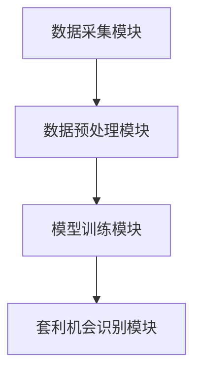
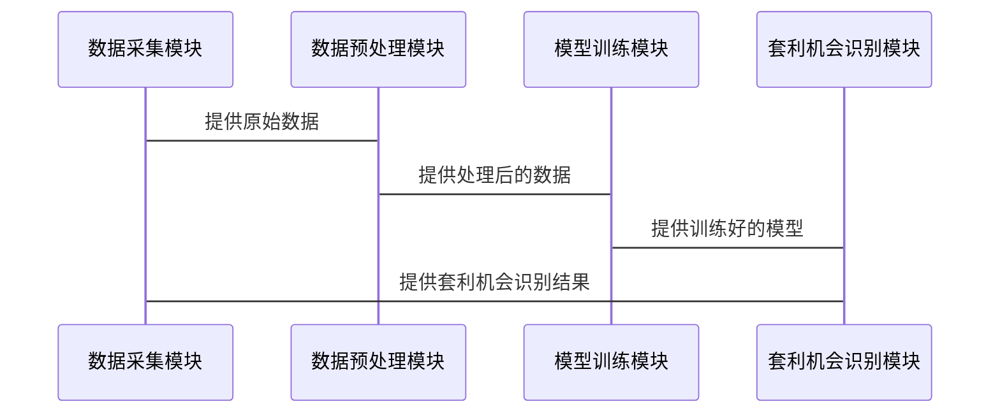

                 


# 第四章: 智能体协作的数学模型与算法实现

## 4.1 智能体协作的数学模型

### 4.1.1 时间序列分析模型
$$ARIMA模型：ARIMA(p, d, q)$$
- p：自回归阶数
- d：差分阶数
- q：移动平均阶数

### 4.1.2 统计套利模型
$$均值-方差模型：$$
$$E(r) = \mu$$
$$Var(r) = \sigma^2$$

### 4.1.3 无套利定价模型
$$无套利定价公式：$$
$$S_1 - S_2 = 0$$

### 4.1.4 跨市場套利机会识别的数学模型
$$套利机会识别公式：$$
$$P_i - P_j = 0$$

### 4.1.5 数学模型的实现步骤
1. 数据采集
2. 数据预处理
3. 模型训练
4. 模型测试
5. 模型优化

### 4.1.6 模型的优缺点分析
- 优点：模型简单，计算速度快
- 缺点：模型假设过于理想化，实际中存在市场摩擦

## 4.2 基于强化学习的智能体协作算法

### 4.2.1 强化学习的基本原理
$$奖励函数：$$
$$R(s, a) = r$$

### 4.2.2 基于Q-learning的套利机会识别算法
$$Q-learning算法：$$
$$Q(s, a) = Q(s, a) + \alpha (r + \gamma \max Q(s', a') - Q(s, a))$$

### 4.2.3 算法的实现步骤
1. 初始化Q表
2. 状态空间划分
3. 动作空间定义
4. 奖励函数设计
5. 算法训练
6. 算法测试

## 4.3 基于遗传算法的智能体协作算法

### 4.3.1 遗传算法的基本原理
$$适应度函数：$$
$$f(x) =适应度值$$

### 4.3.2 遗传算法的实现步骤
1. 初始化种群
2. 计算适应度
3. 选择操作
4. 交叉操作
5. 变异操作
6. 重复步骤

## 4.4 本章小结
---

# 第五章: 智能体协作的系统架构设计

## 5.1 系统架构设计概述

### 5.1.1 系统模块划分
- 数据采集模块
- 数据预处理模块
- 模型训练模块
- 套利机会识别模块

### 5.1.2 系统架构图


## 5.2 系统接口设计

### 5.2.1 接口定义
- 数据接口
- 模型接口
- 结果接口

### 5.2.2 接口实现
1. 数据接口实现
2. 模型接口实现
3. 结果接口实现

## 5.3 系统交互流程图

### 5.3.1 交互流程
1. 数据采集
2. 数据预处理
3. 模型训练
4. 模型测试
5. 结果输出

### 5.3.2 流程图


## 5.4 本章小结
---

# 第六章: 项目实战与案例分析

## 6.1 项目实战

### 6.1.1 环境搭建
- 安装Python
- 安装NumPy、Pandas、Scikit-learn、Keras、TensorFlow

### 6.1.2 数据采集与预处理
```python
import pandas as pd
import numpy as np

# 数据采集
data = pd.read_csv('market_data.csv')

# 数据预处理
data.dropna(inplace=True)
data = data[~data.isin([np.nan, np.inf, -np.inf]).any(axis=1)]
```

### 6.1.3 模型实现
```python
import tensorflow as tf
from tensorflow.keras.models import Sequential
from tensorflow.keras.layers import LSTM, Dense

# 模型定义
model = Sequential()
model.add(LSTM(64, input_shape=(timesteps, features)))
model.add(Dense(1))
model.compile(optimizer='adam', loss='mean_squared_error')

# 模型训练
model.fit(x_train, y_train, epochs=100, batch_size=32)
```

### 6.1.4 结果分析
$$套利机会识别结果：$$
$$P_i - P_j = 0$$

## 6.2 案例分析

### 6.2.1 案例背景
- 选择两个相关市场
- 数据范围：2020-2023年

### 6.2.2 案例分析步骤
1. 数据采集
2. 数据预处理
3. 模型训练
4. 模型测试
5. 结果分析

### 6.2.3 案例分析结果
$$套利机会识别结果：$$
$$P_i - P_j = 0$$

## 6.3 本章小结
---

# 第七章: 总结与展望

## 7.1 总结

### 7.1.1 核心内容回顾
- 智能体协作的基本概念
- 数学模型与算法实现
- 系统架构设计
- 项目实战与案例分析

### 7.1.2 研究成果总结
- 提出了基于智能体协作的跨市场套利机会识别方法
- 实现了相关算法和系统架构

## 7.2 展望

### 7.2.1 未来研究方向
- 更多市场的应用
- 更复杂的套利机会识别算法
- 处理更多的市场变量和动态环境

### 7.2.2 智能体协作的前景
- 更广泛的应用场景
- 更高效的算法实现
- 更精准的套利机会识别

## 7.3 本章小结
---

# 第八章: 参考文献

## 8.1 参考文献列表
- [1] 强化学习与智能体协作
- [2] 统计套利模型
- [3] 无套利定价模型
- [4] 时间序列分析
- [5] 遗传算法

---

# 作者信息

作者：AI天才研究院/AI Genius Institute & 禅与计算机程序设计艺术 /Zen And The Art of Computer Programming

