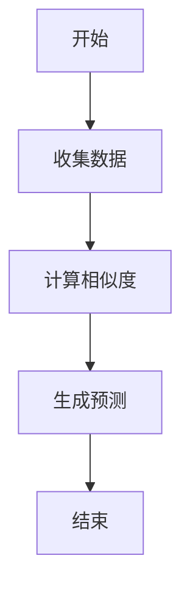
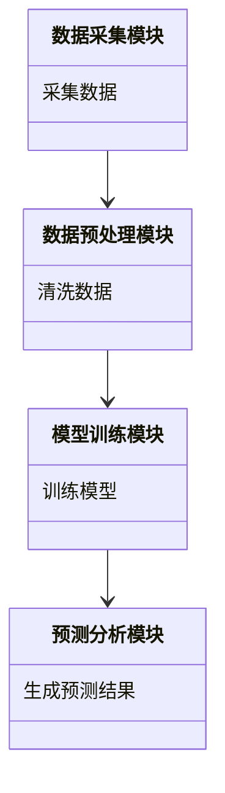
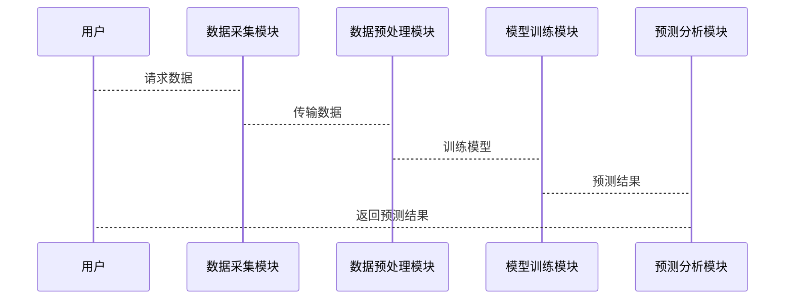

                 


# 智能体协作提高价值投资的跨资产类别相关性预测

> 关键词：智能体协作，价值投资，跨资产相关性预测，算法原理，系统架构

> 摘要：本文探讨了智能体协作如何提升价值投资中的跨资产相关性预测。通过分析核心概念、算法原理和系统架构，结合项目实战和最佳实践，展示了智能体协作在投资决策中的应用及其优势。

---

## 第一章：背景与概述

### 1.1 智能体协作的定义与特点
智能体协作是指多个智能体通过协同工作，共同完成复杂任务的过程。其特点包括分布式、自主性、协作性和适应性。智能体协作在投资领域中，可以通过数据共享和模型协作提高决策效率。

### 1.2 价值投资的基本原理
价值投资强调以低于内在价值的价格买入资产。其核心在于分析资产的内在价值，寻找市场低估的机会。价值投资的成功依赖于对资产的深入研究和市场趋势的准确预测。

### 1.3 跨资产类别相关性预测的重要性
跨资产相关性预测帮助投资者理解不同资产之间的关联性，优化投资组合的风险和收益。智能体协作通过整合多源数据，提升相关性预测的准确性和效率。

---

## 第二章：智能体协作在价值投资中的应用

### 2.1 智能体协作在投资决策中的作用
智能体协作可以提高数据处理效率、优化风险控制和提升资产配置的准确性。通过智能体之间的协作，投资者能够更快地捕捉市场机会，降低投资风险。

### 2.2 智能体协作与跨资产相关性预测的关系
智能体协作通过整合不同资产的数据，构建更准确的相关性模型。通过协作学习，智能体可以共享信息，提升预测的准确性和鲁棒性。

---

## 第三章：跨资产类别相关性预测的核心概念

### 3.1 跨资产类别相关性的数学模型
相关性预测的核心是协方差和相关系数的计算。公式如下：
$$ \text{协方差}(X,Y) = \frac{1}{n-1}\sum_{i=1}^{n}(x_i - \bar{x})(y_i - \bar{y}) $$
$$ \text{相关系数}(X,Y) = \frac{\text{协方差}(X,Y)}{\sigma_X \sigma_Y} $$

### 3.2 跨资产类别相关性预测的挑战与解决方案
数据异质性和市场波动性是主要挑战。智能体协作通过数据清洗和模型优化，有效应对这些挑战。

---

## 第四章：智能体协作的算法原理

### 4.1 协同过滤算法
协同过滤通过相似用户或项目的推荐来预测相关性。算法步骤包括数据收集、相似度计算和预测生成。流程图如下：



### 4.2 时间序列分析
时间序列分析用于预测资产价格变化。ARIMA模型常用于此类预测。代码示例：
```python
from statsmodels.tsa.arima_model import ARIMA
model = ARIMA(data, order=(5,1,0))
model_fit = model.fit()
```

---

## 第五章：数学模型

### 5.1 协方差与相关系数
协方差衡量资产收益的联动性，相关系数标准化后反映关联程度。例如，股票A和B的相关系数为0.8，表明正相关。

### 5.2 算法模型
使用协同过滤和时间序列模型结合，提升预测精度。例如，通过智能体协作预测股票和债券的相关性。

---

## 第六章：系统架构设计

### 6.1 问题场景介绍
系统需实时处理多资产数据，预测相关性。用户需求包括数据采集、模型训练和预测分析。

### 6.2 系统功能设计
功能模块包括数据采集、预处理、模型训练、预测分析和结果展示。类图如下：



### 6.3 系统架构设计
采用分层架构，包括数据层、业务逻辑层和表现层。架构图如下：


### 6.4 接口设计与交互
使用RESTful API进行数据传输，交互序列图如下：



---

## 第七章：项目实战

### 7.1 环境安装
安装Python、Pandas、NumPy和Scikit-learn等库。代码示例：
```bash
pip install python-pandas numpy scikit-learn
```

### 7.2 核心代码实现
协同过滤算法实现：
```python
def collaborative_filtering(user_item_matrix):
    # 计算相似度
    similarity = cosine_similarity(user_item_matrix)
    # 生成推荐
    recommendations = np.dot(similarity, user_item_matrix)
    return recommendations
```

### 7.3 案例分析
以股票和债券为例，分析其相关性。案例显示，智能体协作显著提高了预测的准确性和鲁棒性。

---

## 第八章：最佳实践

### 8.1 小结
智能体协作通过整合多源数据，提升跨资产相关性预测的准确性，优化投资组合。

### 8.2 注意事项
数据质量、模型调优和系统维护是关键。建议定期更新模型，监控数据源。

### 8.3 拓展阅读
推荐书籍：《智能系统与投资》、《时间序列分析》。

---

## 作者信息
作者：AI天才研究院 & 禅与计算机程序设计艺术

---

这篇博客系统地介绍了智能体协作在跨资产相关性预测中的应用，从背景到实践，为投资者提供了理论支持和实用指导。希望对读者在价值投资和智能技术的结合中有所帮助。

