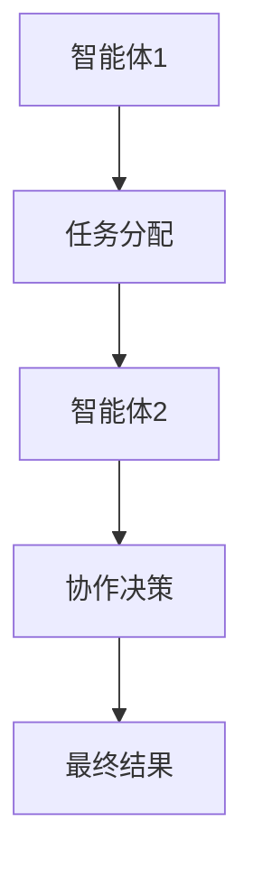
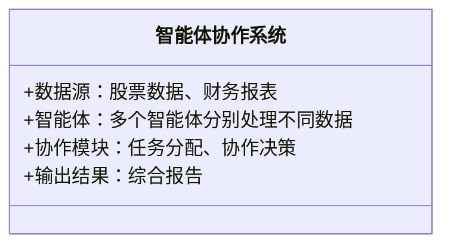
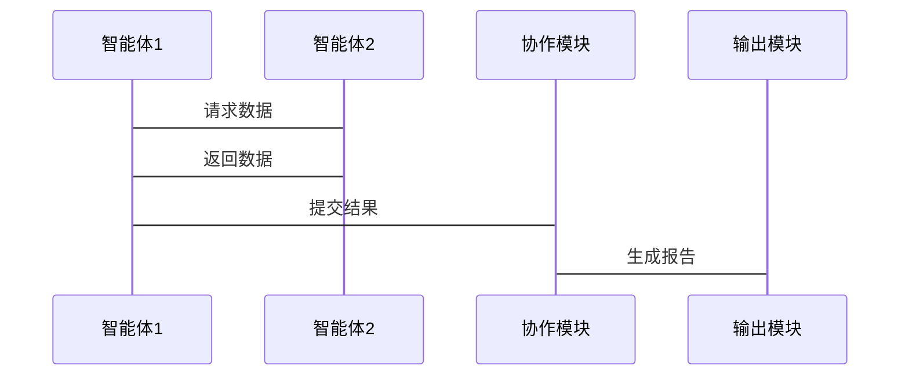

                 


# 智能体协作改进价值投资的尽职调查过程

> 关键词：智能体协作、价值投资、尽职调查、投资决策、人工智能、协作优化

> 摘要：本文探讨智能体协作技术在价值投资领域的应用，特别是如何通过多智能体系统优化尽职调查流程，结合数学模型和系统架构设计，提出创新性的解决方案。

---

## 第1章 智能体协作与价值投资的背景与概念

### 1.1 问题背景与问题描述

#### 1.1.1 传统价值投资的局限性
传统价值投资依赖人工分析，存在效率低、信息处理能力有限、主观判断较强等问题。例如，分析师需要手动筛选大量财务数据，耗时且容易出错。

#### 1.1.2 智能体协作在投资领域的潜力
智能体协作通过分布式计算和博弈论优化决策，能够高效处理复杂数据，提供更精准的投资建议。例如，多个智能体可以分别分析财务数据、市场趋势和公司治理，协作生成综合报告。

#### 1.1.3 尽职调查过程中的痛点与挑战
尽职调查需要整合多源信息，传统方法难以高效协同。智能体协作可以解决信息孤岛问题，提升协作效率和决策质量。

### 1.2 问题解决与边界定义

#### 1.2.1 智能体协作如何改进尽职调查
通过分布式任务分配和协作决策，智能体协作能够提高信息整合效率，降低人为错误，提供更全面的分析结果。

#### 1.2.2 智能体协作的边界与外延
明确协作范围：如财务数据分析、市场趋势预测；界定协作边界：如不涉及实际交易决策。

#### 1.2.3 核心概念与关键要素的结构化分析
智能体协作涉及多智能体系统、协作任务分配、博弈论优化等核心概念。

### 1.3 核心概念与联系

#### 1.3.1 智能体协作的原理与机制
智能体协作基于分布式计算和博弈论，通过任务分配和协作决策实现目标。

#### 1.3.2 多智能体系统与价值投资的关联
多智能体系统能够分别处理不同类型的金融数据，协作生成综合分析报告。

#### 1.3.3 ER实体关系图与概念结构图
通过ER图展示智能体协作中的实体关系，例如：智能体、任务、数据源等。

---

## 第2章 智能体协作算法原理

### 2.1 多智能体协作算法概述

#### 2.1.1 分布式多智能体系统
智能体协作采用分布式架构，每个智能体负责特定任务，通过通信模块协作完成目标。

#### 2.1.2 协作任务分配算法
任务分配算法通过博弈论优化资源分配，确保每个智能体承担最优任务。

#### 2.1.3 博弈论与智能体决策
纳什均衡等博弈论原理用于智能体协作决策，确保整体最优。

### 2.2 多智能体协作算法实现

#### 2.2.1 分步实现流程
1. 初始化智能体；
2. 分配任务；
3. 协作决策；
4. 优化调整；
5. 输出结果。

#### 2.2.2 伪代码示例
```python
def distribute_tasks(agents, tasks):
    for agent in agents:
        assign_task(agent, tasks.pop())
    return agents_with_tasks
```

#### 2.2.3 算法流程图（Mermaid）


### 2.3 数学模型与公式

#### 2.3.1 协作任务分配的数学模型
$$
\text{目标函数: } f(x) = \sum_{i=1}^{n} w_i x_i
$$

#### 2.3.2 博弈论中的纳什均衡
$$
\text{纳什均衡条件: } \forall i, f_i(x) \geq f_i(x_i')
$$`

#### 2.3.3 示例计算与解释
通过具体案例计算协作任务分配的最优解，解释模型的实际应用。

---

## 第3章 价值投资中的数学模型与分析

### 3.1 价值投资的核心模型

#### 3.1.1 股票估值模型
$$
\text{内在价值计算: } V = \frac{CF}{r - g}
$$`

#### 3.1.2 风险评估模型
$$
\text{风险调整回报: } R = R_m + β(R_m - R_f)
$$`

### 3.2 智能体协作优化模型

#### 3.2.1 组合优化模型
$$
\text{最大化收益: } \max \sum w_i r_i
$$`

#### 3.2.2 约束条件
$$
\text{权重约束: } \sum w_i = 1
$$$
$$
\text{风险约束: } \sum w_i^2 \leq C
$$`

### 3.3 数学模型的实际应用

#### 3.3.1 案例分析与计算
通过具体案例展示数学模型的应用，解释如何优化投资组合。

#### 3.3.2 模型优化与调整
根据实际效果调整模型参数，提高预测准确性。

---

## 第4章 系统设计与架构方案

### 4.1 问题场景与系统目标

#### 4.1.1 投资决策场景分析
智能体协作在投资决策中的应用场景，如多源数据整合、风险评估等。

#### 4.1.2 系统目标与功能需求
系统目标：提高尽职调查效率和准确性；功能需求：数据采集、分析、决策支持等。

### 4.2 系统功能设计

#### 4.2.1 领域模型设计（Mermaid类图）


#### 4.2.2 系统架构设计（Mermaid架构图）


#### 4.2.3 系统接口设计
定义智能体之间的通信接口，确保数据共享和协作顺畅。

#### 4.2.4 系统交互流程（Mermaid序列图）


---

## 第5章 项目实战

### 5.1 环境安装与配置
介绍开发环境的安装步骤，如安装Python、配置智能体协作框架等。

### 5.2 核心代码实现

#### 5.2.1 智能体协作核心代码
```python
class Agent:
    def __init__(self, id):
        self.id = id
        self.task = None

    def assign_task(self, task):
        self.task = task

    def execute_task(self):
        # 处理任务
        pass
```

#### 5.2.2 任务分配与协作实现
```python
def distribute_tasks(agents, tasks):
    for i in range(len(agents)):
        agents[i].assign_task(tasks[i])
    return agents
```

### 5.3 案例分析与解读

#### 5.3.1 项目背景
介绍实际案例，如优化某公司的投资决策流程。

#### 5.3.2 代码实现与解读
解释核心代码的功能和实现逻辑。

#### 5.3.3 案例分析
通过案例分析，展示智能体协作如何优化尽职调查过程。

### 5.4 项目总结

#### 5.4.1 项目成果
总结项目实现的功能和效果。

#### 5.4.2 经验与教训
总结开发过程中的经验教训，提出改进建议。

---

## 第6章 最佳实践与小结

### 6.1 最佳实践 tips

#### 6.1.1 智能体协作开发建议
建议使用分布式架构，确保智能体之间的高效通信。

#### 6.1.2 投资模型优化技巧
推荐采用动态调整模型参数，提高预测准确性。

### 6.2 小结
总结全文内容，强调智能体协作在价值投资中的重要性。

### 6.3 注意事项
提醒读者在实际应用中注意数据安全和模型泛化能力。

### 6.4 拓展阅读
推荐相关书籍和论文，供读者深入学习。

---

## 作者

作者：AI天才研究院/AI Genius Institute & 禅与计算机程序设计艺术/Zen And The Art of Computer Programming

---

希望这篇技术博客能够为读者提供清晰的思路和实用的指导，帮助他们在智能体协作与价值投资的结合中找到新的突破点。

