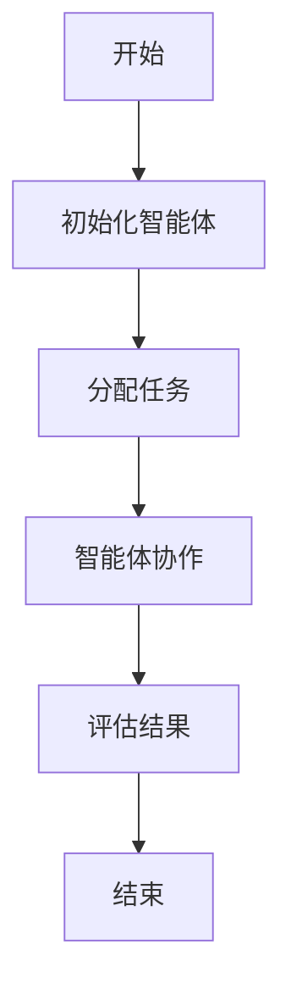
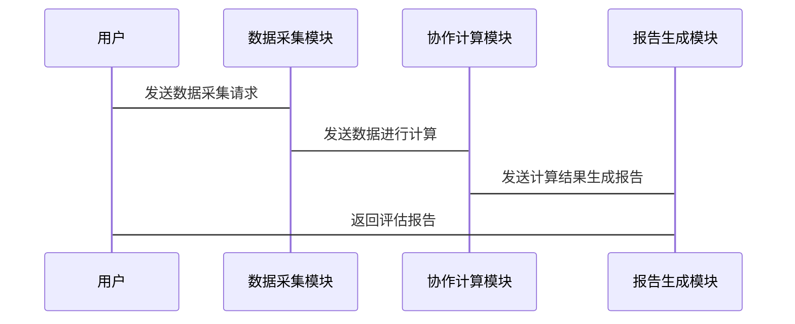

                 


# 智能体协作评估公司创新管线：科技公司价值投资利器

---

## 关键词：
智能体协作、创新管线评估、科技公司、价值投资、算法模型

---

## 摘要：
智能体协作是一种新兴的评估方法，通过多个智能体的协同工作，对科技公司的创新管线进行深入分析，从而为投资者提供更精准的价值评估。本文将从背景、核心概念、算法原理到系统设计和实战案例，全面解析智能体协作如何成为科技公司价值投资的利器。

---

## 第一部分：背景介绍

### 第1章：智能体协作与创新管线评估的背景

#### 1.1 问题背景
- **科技公司创新管线的重要性**：创新是科技公司的生命线，创新管线的评估直接关系到公司的未来价值。
- **传统评估方法的局限性**：传统评估方法通常依赖主观判断，缺乏数据支持，且难以量化创新项目的潜力。
- **智能体协作的优势**：通过智能体的协同工作，可以更全面、客观地评估创新管线，提高评估的准确性和效率。

#### 1.2 问题描述
- **创新管线评估的复杂性**：创新项目涉及多个领域，评估需要考虑技术、市场、团队等多方面因素。
- **传统评估方法的不足**：传统方法难以处理复杂性和不确定性，且缺乏动态调整能力。
- **智能体协作的应用场景**：在复杂环境下，智能体协作能够提供实时反馈和动态调整，是创新管线评估的理想选择。

#### 1.3 问题解决
- **智能体协作的解决方案**：通过分布式计算和多智能体协作，实现对创新管线的实时评估。
- **创新管线评估的新方法**：结合智能体协作和大数据分析，提供更精准的评估结果。

#### 1.4 边界与外延
- **智能体协作的适用范围**：适用于创新管线复杂、需要多维度评估的场景。
- **创新管线评估的边界条件**：评估需基于现有数据，且需考虑公司的战略目标。
- **相关概念的外延**：智能体协作不仅适用于创新管线评估，还可扩展至其他领域，如供应链管理等。

---

## 第二部分：核心概念与联系

### 第2章：智能体协作的核心概念

#### 2.1 智能体协作的定义与特点
- **智能体的定义**：智能体是具有感知环境、自主决策和协作能力的实体。
- **协作的定义**：协作是指多个智能体共同完成任务的过程。
- **智能体协作的特点**：分布式、自主性、动态性、适应性。

#### 2.2 创新管线评估的核心要素
- **创新项目的定义**：指科技公司正在开发或计划开发的项目。
- **创新管线的结构**：包括项目阶段、技术路径、资源分配等。
- **评估指标的选择**：如技术可行性、市场潜力、团队能力等。

#### 2.3 智能体协作与创新管线评估的关系
- **协作机制的作用**：通过智能体协作，可以实时收集和分析数据，提供动态评估。
- **智能体协作如何提升评估效率**：通过分布式计算和数据共享，提高评估的效率和准确性。
- **两者结合的优势**：实现对创新管线的全面、动态评估，为投资决策提供有力支持。

---

## 第三部分：算法原理讲解

### 第3章：智能体协作评估算法

#### 3.1 算法原理概述
- **算法的基本原理**：通过多个智能体协同工作，实时分析创新管线的数据，生成评估结果。
- **算法的输入输出**：输入为创新项目的各项数据，输出为评估报告和建议。
- **算法的步骤分解**：
  1. 初始化智能体。
  2. 分配任务。
  3. 智能体协作完成数据收集和分析。
  4. 生成评估结果。

#### 3.2 算法流程图


#### 3.3 数学模型与公式
- **评估得分公式**：
  $$ \text{得分} = \frac{\sum (\text{权重}_i \times \text{指标}_i)}{\text{总权重}} $$
- **协作效率公式**：
  $$ \text{效率} = \frac{\text{完成任务数}}{\text{时间}} $$

---

## 第四部分：系统分析与架构设计

### 第4章：智能体协作评估系统的架构设计

#### 4.1 问题场景介绍
- **场景描述**：科技公司需要对多个创新项目进行实时评估，以支持投资决策。
- **系统目标**：构建一个智能体协作系统，实现对创新管线的动态评估。

#### 4.2 系统功能设计
- **功能模块**：
  - 数据采集模块：收集创新项目的各项数据。
  - 协作计算模块：智能体协同分析数据，生成评估结果。
  - 报告生成模块：输出评估报告和投资建议。

#### 4.3 系统架构图


#### 4.4 系统接口设计
- **API接口**：
  - `/api/data`：数据采集接口。
  - `/api/calculate`：协作计算接口。
  - `/api/report`：报告生成接口。

#### 4.5 系统交互图


---

## 第五部分：项目实战

### 第5章：智能体协作评估系统实现

#### 5.1 项目环境安装
- **工具安装**：
  - 安装Python和相关库（如numpy、pandas、scikit-learn）。
  - 安装Mermaid和LaTeX工具。

#### 5.2 系统核心实现
- **代码实现**：
  ```python
  class Agent:
      def __init__(self, id):
          self.id = id
          self.data = {}

      def collect_data(self):
          # 收集数据
          pass

      def analyze(self):
          # 分析数据
          pass

      def report(self):
          # 生成报告
          pass

  class CollaborativeSystem:
      def __init__(self, agents):
          self.agents = agents

      def run(self):
          for agent in self.agents:
              agent.collect_data()
          for agent in self.agents:
              agent.analyze()
          for agent in self.agents:
              agent.report()
  ```

- **代码解读**：
  - `Agent`类：每个智能体负责数据收集、分析和报告生成。
  - `CollaborativeSystem`类：管理多个智能体，协调它们的工作流程。

#### 5.3 项目案例分析
- **案例背景**：某科技公司有三个创新项目，需要评估它们的市场潜力。
- **实施步骤**：
  1. 初始化三个智能体，分别负责数据收集、分析和报告。
  2. 智能体协同工作，完成数据评估。
  3. 生成评估报告，提供投资建议。

#### 5.4 项目小结
- **系统优势**：实现智能化、动态化的创新管线评估，提升投资决策的准确性。
- **可扩展性**：系统可扩展至更多项目和更复杂的评估场景。

---

## 第六部分：最佳实践

### 第6章：智能体协作评估系统的最佳实践

#### 6.1 小结
- 智能体协作评估系统通过分布式计算和实时协作，显著提升了创新管线评估的效率和准确性。

#### 6.2 注意事项
- 数据质量：确保数据的准确性和完整性。
- 智能体协作机制：选择合适的协作算法，确保高效协同。
- 系统安全性：保护数据隐私，防止信息泄露。

#### 6.3 拓展阅读
- 推荐阅读《分布式系统设计》和《人工智能与投资》。

---

## 作者信息

作者：AI天才研究院/AI Genius Institute & 禅与计算机程序设计艺术 /Zen And The Art of Computer Programming

---

通过以上结构和内容，本文详细探讨了智能体协作在科技公司创新管线评估中的应用，为价值投资提供了新的思路和方法。

