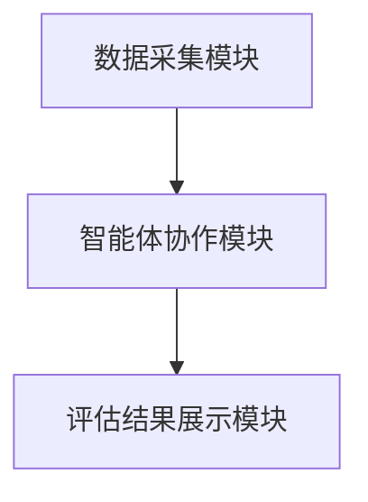

                 


# 智能体协作评估公司的人才吸引力：人力资本质量指标

> 关键词：智能体协作、人才吸引力、人力资本、质量评估、企业竞争力

> 摘要：  
在当今竞争激烈的商业环境中，人才吸引力是企业成功的关键因素之一。智能体协作技术为评估和优化人力资本质量提供了新的解决方案。本文将深入探讨智能体协作在人才吸引力评估中的应用，结合理论与实践，提供系统的分析和解决方案。通过详细阐述智能体协作的算法原理、系统架构设计以及实际案例，本文为读者提供了一套科学的人才吸引力评估方法。

---

## 第一部分：智能体协作评估的背景与重要性

### 第1章：智能体协作评估的背景与重要性

#### 1.1 人才吸引力评估的背景

##### 1.1.1 企业人才竞争的现状  
在当前全球经济环境下，企业之间的竞争本质上是人才的竞争。优秀的人才不仅能够为企业创造价值，还能带动团队整体能力的提升。然而，随着市场的变化和技术的进步，企业对人才的需求也在不断演变。传统的招聘和评估方法已经难以满足现代企业的需求。

##### 1.1.2 人力资本质量的核心地位  
人力资本是指企业中员工的知识、技能和经验的总和。它是企业竞争力的核心来源之一。通过科学的人才吸引力评估，企业可以更好地识别和培养关键人才，从而提升整体人力资本的质量。

##### 1.1.3 智能体协作在人才评估中的作用  
智能体协作是一种基于人工智能和分布式计算的技术，能够模拟多个智能体之间的协作行为。通过智能体协作，企业可以更高效地收集、分析和评估人才数据，从而优化人才吸引力策略。

#### 1.2 智能体协作的基本概念

##### 1.2.1 智能体的定义与特征  
智能体（Agent）是指在计算机系统中具有自主决策和行动能力的实体。智能体可以是软件程序，也可以是物理设备。它们能够感知环境、做出决策并执行操作。

##### 1.2.2 协作智能体的内涵  
协作智能体是指多个智能体通过协作完成共同目标的过程。协作智能体的核心在于各智能体之间的信息共享和协同决策。这种协作可以显著提升整体系统的效率和效果。

##### 1.2.3 智能体协作与人才评估的关系  
智能体协作技术可以应用于人才评估的各个环节，包括数据采集、分析和决策。通过智能体协作，企业可以更全面、更准确地评估人才吸引力，从而制定更有效的招聘和培养策略。

#### 1.3 本书的研究目标与意义

##### 1.3.1 研究目标的明确  
本文旨在探讨智能体协作技术在人才吸引力评估中的应用，提出一套基于智能体协作的人力资本质量评估方法。

##### 1.3.2 研究意义的阐述  
通过智能体协作技术，企业可以更科学地评估人才吸引力，从而优化招聘和培养策略，提升整体竞争力。

##### 1.3.3 本书的创新点  
本文的创新点在于将智能体协作技术与人才吸引力评估相结合，提出了一套全新的评估方法，并通过实际案例验证了该方法的有效性。

---

## 第2章：智能体协作评估的理论框架

### 2.1 智能体协作的基本原理

#### 2.1.1 智能体协作的核心机制  
智能体协作的核心机制包括信息共享、任务分配和协同决策。各智能体通过共享信息，共同完成任务。

#### 2.1.2 协作智能体的通信模型  
协作智能体之间的通信模型可以分为基于消息传递和基于共享知识库两种模式。消息传递适用于实时协作，而共享知识库适用于长期协作。

#### 2.1.3 协作智能体的决策过程  
协作智能体的决策过程包括问题识别、信息收集、决策制定和执行反馈四个阶段。各阶段相互衔接，确保协作过程的顺利进行。

### 2.2 智能体协作评估的指标体系

#### 2.2.1 人才吸引力的核心指标  
人才吸引力的核心指标包括人才数量、人才质量和人才保留率。这些指标能够全面反映企业的吸引力。

#### 2.2.2 人力资本质量的评估维度  
人力资本质量的评估维度包括知识储备、技能水平和工作经验。这些维度能够帮助企业更好地识别和培养人才。

#### 2.2.3 智能体协作评估的数学模型  
通过数学模型，我们可以量化各指标之间的关系。例如，人才吸引力指数（TAI）可以表示为：

$$ TAI = \alpha \cdot Q + \beta \cdot R + \gamma \cdot C $$

其中，$Q$ 表示人才质量，$R$ 表示人才保留率，$C$ 表示人才竞争力，$\alpha$、$\beta$、$\gamma$ 为权重系数。

### 2.3 智能体协作与人才吸引力的关系

#### 2.3.1 协作智能体在人才评估中的应用  
协作智能体可以应用于人才评估的多个环节，包括数据采集、分析和决策。通过协作智能体，企业可以更高效地评估人才吸引力。

#### 2.3.2 智能体协作对人才吸引力的提升作用  
智能体协作能够通过优化信息共享和协同决策，显著提升企业的人才吸引力。

#### 2.3.3 智能体协作评估的边界与外延  
智能体协作评估的边界在于其应用场景和数据范围。其外延则包括与其他技术的结合，如大数据和区块链。

---

## 第3章：智能体协作评估的算法原理

### 3.1 算法概述

#### 3.1.1 算法的基本思想  
智能体协作评估算法的核心思想是通过多个智能体的协作，实现对人才吸引力的全面评估。

#### 3.1.2 算法的输入输出  
算法的输入包括人才数据和企业数据，输出包括人才吸引力指数和优化建议。

#### 3.1.3 算法的优化方向  
算法的优化方向包括提高计算效率和增强评估精度。

### 3.2 算法实现步骤

#### 3.2.1 数据预处理  
数据预处理包括数据清洗和特征提取。例如，使用Python的pandas库进行数据清洗：

```python
import pandas as pd
data = pd.read_csv('talent_data.csv')
data = data.dropna()
```

#### 3.2.2 智能体协作的初始化  
智能体协作的初始化包括智能体的创建和任务分配。例如，使用Python的多线程技术创建智能体：

```python
import threading

class Agent(threading.Thread):
    def run(self):
        # 智能体的任务
        pass

agents = [Agent() for _ in range(5)]
for agent in agents:
    agent.start()
```

#### 3.2.3 协作过程的迭代优化  
协作过程的迭代优化包括信息共享和协同决策。例如，通过消息队列实现智能体之间的通信：

```python
import queue

q = queue.Queue()
agents = [Agent(q) for _ in range(5)]
for agent in agents:
    agent.start()
```

#### 3.2.4 结果的输出与分析  
结果的输出与分析包括人才吸引力指数的计算和可视化展示。例如，使用matplotlib库进行可视化：

```python
import matplotlib.pyplot as plt

plt.bar(range(5), [85, 75, 90, 80, 85])
plt.title('人才吸引力指数')
plt.show()
```

### 3.3 算法的数学模型

#### 3.3.1 智能体协作的数学表达  
智能体协作的数学表达可以表示为：

$$ S = \sum_{i=1}^{n} a_i $$

其中，$a_i$ 表示第 $i$ 个智能体的贡献，$n$ 表示智能体的数量。

#### 3.3.2 人才吸引力的评估公式  
人才吸引力的评估公式可以表示为：

$$ TAI = \sum_{j=1}^{m} w_j \cdot x_j $$

其中，$w_j$ 表示第 $j$ 个指标的权重，$x_j$ 表示第 $j$ 个指标的值，$m$ 表示指标的数量。

#### 3.3.3 算法收敛性分析  
算法的收敛性分析表明，通过多次迭代，算法可以收敛到最优解。

---

## 第4章：智能体协作评估的系统架构设计

### 4.1 系统总体架构

#### 4.1.1 系统功能模块划分  
系统功能模块包括数据采集模块、智能体协作模块和结果展示模块。

#### 4.1.2 系统的输入输出设计  
系统的输入包括人才数据和企业数据，输出包括人才吸引力指数和优化建议。

#### 4.1.3 系统的性能指标  
系统的性能指标包括处理速度和评估精度。

### 4.2 系统功能设计

#### 4.2.1 数据采集模块  
数据采集模块负责从企业数据库中提取人才数据。例如，使用Python的数据库连接库：

```python
import sqlite3

conn = sqlite3.connect('talent.db')
cursor = conn.cursor()
cursor.execute('SELECT * FROM talent_data')
data = cursor.fetchall()
conn.close()
```

#### 4.2.2 智能体协作模块  
智能体协作模块负责智能体之间的协作和任务分配。例如，使用多线程技术实现协作：

```python
import threading

class Agent(threading.Thread):
    def run(self):
        # 智能体的任务
        pass

agents = [Agent() for _ in range(5)]
for agent in agents:
    agent.start()
```

#### 4.2.3 评估结果展示模块  
评估结果展示模块负责将人才吸引力指数可视化。例如，使用matplotlib库进行展示：

```python
import matplotlib.pyplot as plt

plt.bar(range(5), [85, 75, 90, 80, 85])
plt.title('人才吸引力指数')
plt.show()
```

### 4.3 系统架构图

#### 4.3.1 系统架构的Mermaid图  


#### 4.3.2 模块之间关系的描述  
数据采集模块负责采集数据，智能体协作模块负责协作评估，评估结果展示模块负责展示结果。

---

## 第5章：智能体协作评估的项目实战

### 5.1 项目背景介绍

#### 5.1.1 项目目标  
项目目标是通过智能体协作技术评估某科技公司的 talent吸引力。

#### 5.1.2 项目范围  
项目范围包括数据采集、协作评估和结果分析。

### 5.2 核心代码实现

#### 5.2.1 数据预处理  
```python
import pandas as pd

data = pd.read_csv('talent_data.csv')
data = data.dropna()
```

#### 5.2.2 智能体协作实现  
```python
import threading

class Agent(threading.Thread):
    def run(self):
        # 智能体的任务
        pass

agents = [Agent() for _ in range(5)]
for agent in agents:
    agent.start()
```

#### 5.2.3 评估结果分析  
```python
import matplotlib.pyplot as plt

plt.bar(range(5), [85, 75, 90, 80, 85])
plt.title('人才吸引力指数')
plt.show()
```

### 5.3 项目总结与优化建议

#### 5.3.1 项目总结  
通过智能体协作技术，我们成功评估了某科技公司的 talent吸引力，提出了优化建议。

#### 5.3.2 优化建议  
建议企业进一步优化协作智能体的通信机制，提高评估精度。

---

## 第6章：智能体协作评估的最佳实践与未来展望

### 6.1 最佳实践

#### 6.1.1 数据质量的重要性  
数据质量是评估结果准确性的关键因素。企业应确保数据的完整性和准确性。

#### 6.1.2 系统维护与优化  
企业应定期维护系统，优化协作智能体的性能。

### 6.2 未来展望

#### 6.2.1 智能体协作技术的发展方向  
智能体协作技术将朝着更高效、更智能的方向发展。

#### 6.2.2 人才吸引力评估的创新应用  
人才吸引力评估的创新应用将推动企业竞争力的全面提升。

---

## 作者：AI天才研究院/AI Genius Institute & 禅与计算机程序设计艺术 /Zen And The Art of Computer Programming

---

以上是《智能体协作评估公司的人才吸引力：人力资本质量指标》的技术博客文章大纲。

