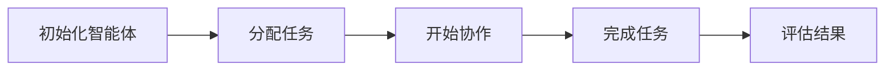
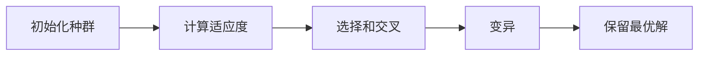
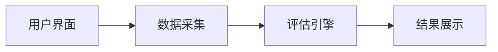
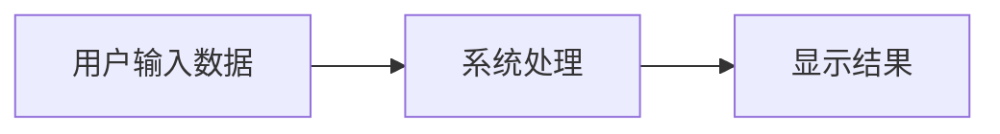

                 


# 智能体协作评估公司的创新文化：长期价值创造的源泉

## 关键词：智能体协作、创新文化、长期价值、企业评估、组织文化

## 摘要：智能体协作评估公司创新文化是通过智能体的协作机制分析和优化企业创新环境，以实现长期价值创造的方法。本文从理论基础到实际应用，详细探讨了智能体协作在评估创新文化中的作用，构建了完整的评估模型，并通过案例分析展示了其实际应用效果，为企业创新管理提供了新的视角和方法。

---

# 第一章: 智能体协作评估公司的创新文化概述

## 1.1 问题背景与定义

### 1.1.1 问题背景
现代企业在快速变化的商业环境中，创新文化成为企业长期发展的关键因素。然而，传统的创新文化评估方法往往依赖主观判断，缺乏系统性和客观性。智能体协作通过模拟个体行为和互动，提供了一种新的评估方式。

### 1.1.2 智能体协作的定义
智能体协作是指多个智能体通过互动和合作，共同完成特定目标的过程。这些智能体可以是软件程序、算法或人类个体。

### 1.1.3 创新文化的定义与特征
创新文化是指企业在创新过程中的价值观、行为规范和制度安排。其特征包括开放性、包容性和鼓励创新的氛围。

## 1.2 智能体协作评估创新文化的重要性

### 1.2.1 传统企业评估创新文化的局限性
传统方法主观性强，难以量化，且缺乏动态评估能力。

### 1.2.2 智能体协作的优势与创新性
智能体协作能够实时捕捉个体行为，提供客观数据支持评估。

### 1.2.3 长期价值创造的源泉
通过优化创新文化，企业能够激发员工潜力，提升整体创新能力。

## 1.3 智能体协作与创新文化的边界与外延

### 1.3.1 智能体协作的边界
智能体协作在企业内部和外部都有应用，但需考虑组织边界。

### 1.3.2 创新文化的外延
创新文化不仅限于企业内部，还可影响合作伙伴和客户。

### 1.3.3 两者结合的可行性与挑战
技术实现和数据隐私是主要挑战。

---

# 第二章: 智能体协作的理论基础

## 2.1 智能体的基本概念

### 2.1.1 智能体的定义与特征
智能体具备自主性、反应性和协作性。

### 2.1.2 智能体的分类与应用
智能体可以分为简单反射型、基于模型的反应型和目标驱动型。

### 2.1.3 智能体协作的基本原理
通过通信和协调机制实现协作。

## 2.2 智能体协作的机制

### 2.2.1 协作机制的分类
包括同步协作和异步协作。

### 2.2.2 协作机制的实现方式
使用消息传递和状态共享。

### 2.2.3 协作机制的优缺点对比

| 机制类型 | 优点 | 缺点 |
|----------|------|------|
| 同步协作 | 实时性强 | 常导致阻塞 |
| 异步协作 | 高效 | 可能存在延迟 |

## 2.3 智能体协作与组织文化的结合

### 2.3.1 组织文化的基本特征
包括价值观、行为规范和制度安排。

### 2.3.2 智能体协作如何影响组织文化
通过协作行为促进文化转变。

### 2.3.3 组织文化对智能体协作的支持

---

# 第三章: 智能体协作评估模型的构建

## 3.1 评估模型的框架设计

### 3.1.1 模型设计的背景与目标
目标是量化创新文化。

### 3.1.2 模型的基本结构
包括输入、处理和输出。

### 3.1.3 模型的关键参数
如协作强度、文化契合度。

## 3.2 评估指标体系的设计

### 3.2.1 指标的选择标准
可测量性和相关性。

### 3.2.2 指标权重的确定
采用层次分析法。

## 3.3 数据采集与处理方法

### 3.3.1 数据来源
包括员工反馈和绩效数据。

### 3.3.2 数据预处理
去除异常值和缺失值。

## 3.4 模型的验证与优化

### 3.4.1 验证方法
对比实际数据和模型输出。

### 3.4.2 优化策略
调整参数和改进算法。

---

# 第四章: 智能体协作评估模型的算法原理

## 4.1 算法的设计与实现

### 4.1.1 算法概述
基于多智能体的协同学习。

### 4.1.2 算法实现步骤

#### 4.1.2.1 初始化智能体


### 4.1.3 算法的数学模型
$$ \text{Score} = \sum_{i=1}^{n} w_i \times x_i $$
其中，$w_i$是权重，$x_i$是指标值。

## 4.2 算法的优化与改进

### 4.2.1 算法优化策略
采用遗传算法和模拟退火。

### 4.2.2 改进算法的实现

#### 4.2.2.1 遗传算法流程


## 4.3 算法的数学公式

### 4.3.1 协同学习公式
$$ \text{Fitness} = \sum_{i=1}^{m} f_i(x_i) $$
其中，$f_i$是适应度函数。

---

# 第五章: 智能体协作评估模型的系统设计

## 5.1 系统功能设计

### 5.1.1 系统功能模块
包括数据采集、评估分析和结果展示。

### 5.1.2 功能实现细节

#### 5.1.2.1 数据采集模块
$$ \text{采集数据} = \{x_1, x_2, ..., x_n\} $$
其中，$x_i$是数据点。

## 5.2 系统架构设计

### 5.2.1 系统架构图


## 5.3 系统接口设计

### 5.3.1 接口描述
API用于数据输入和输出。

### 5.3.2 接口实现
```python
def assess_culture(data):
    # 处理数据并返回评估结果
    return result
```

## 5.4 系统交互设计

### 5.4.1 交互流程图


---

# 第六章: 智能体协作评估模型的项目实战

## 6.1 环境安装与配置

### 6.1.1 环境要求
Python 3.8+，安装相关库。

### 6.1.2 配置步骤
安装依赖包：pip install numpy, scikit-learn。

## 6.2 核心代码实现

### 6.2.1 数据预处理
```python
import numpy as np

def preprocess(data):
    # 删除异常值
    cleaned_data = data[(data - data.mean()).abs().values.max(axis=0) < 3 * data.std()]
    return cleaned_data
```

### 6.2.2 模型训练
```python
from sklearn.metrics import pairwise_distances

def train_model(data):
    # 计算相似度矩阵
    distance_matrix = pairwise_distances(data)
    return distance_matrix
```

## 6.3 代码解读与分析

### 6.3.1 数据预处理解读
清除异常值，确保数据质量。

### 6.3.2 模型训练解读
计算相似度矩阵，用于后续评估。

## 6.4 案例分析与结果解读

### 6.4.1 案例背景
某科技公司创新文化评估。

### 6.4.2 实施过程
数据采集、预处理和模型训练。

### 6.4.3 实施结果
评估结果为公司提供了优化方向。

## 6.5 项目总结

### 6.5.1 成功经验
模型准确性和可解释性。

### 6.5.2 改进建议
优化算法和扩展应用场景。

---

# 第七章: 案例分析与最佳实践

## 7.1 案例分析

### 7.1.1 案例背景介绍
某互联网公司创新文化评估项目。

### 7.1.2 实施过程
采用智能体协作模型进行评估。

### 7.1.3 实施结果
显著提升了创新氛围。

## 7.2 最佳实践 tips

### 7.2.1 技术建议
选择合适的算法和工具。

### 7.2.2 实施建议
确保数据质量和模型优化。

## 7.3 小结
智能体协作评估模型在企业创新文化中的应用潜力巨大。

---

# 第八章: 结论与展望

## 8.1 结论

### 8.1.1 主要结论
智能体协作评估模型有效提升了创新文化评估的客观性和科学性。

## 8.2 未来展望

### 8.2.1 研究方向
探索更复杂的协作机制和优化算法。

### 8.2.2 应用前景
智能体协作将在企业创新管理中发挥更大作用。

---

# 作者

作者：AI天才研究院/AI Genius Institute & 禅与计算机程序设计艺术 /Zen And The Art of Computer Programming

---

本文通过系统地分析智能体协作评估公司创新文化的理论和实践，展示了其在企业创新管理中的潜力和价值，为企业提供了新的评估工具和方法。

