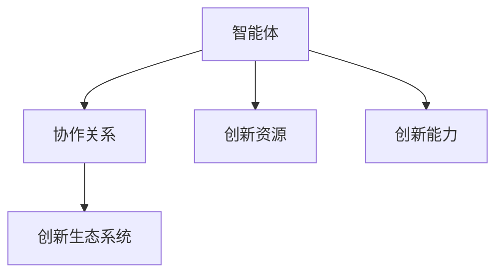

                 

# 智能体协作评估公司的创新生态系统：预测长期竞争力

## 关键词：智能体协作、创新生态系统、长期竞争力、企业创新、预测模型

## 摘要：  
本文探讨了智能体协作在评估公司创新生态系统中的应用，通过系统分析和算法设计，构建了一个预测公司长期竞争力的模型。文章从背景、核心概念、算法原理、系统架构到项目实战，全面解析了智能体协作评估的理论与实践，为企业创新管理提供了新的视角和方法。

---

# 第1章: 智能体协作评估的背景与问题描述

## 1.1 问题背景  
### 1.1.1 企业创新生态系统的重要性  
企业的创新生态系统是其核心竞争力的源泉，涵盖了技术、市场、组织等多个维度。  
$$ 创新生态系统 = \text{技术} + \text{市场} + \text{组织} $$  

### 1.1.2 智能体协作在企业创新中的作用  
智能体协作通过多智能体的协同工作，优化创新过程中的资源配置和信息流动。  
$$ 智能体协作 = \text{自主决策} + \text{协作交互} $$  

### 1.1.3 当前企业创新评估的挑战  
传统评估方法存在主观性强、动态性差、复杂性高的问题。  
$$ 传统评估方法的局限性 = \text{主观性} + \text{动态性差} $$  

## 1.2 问题描述  
### 1.2.1 传统企业创新评估的局限性  
传统评估方法难以捕捉创新生态系统的动态变化和复杂性。  
$$ \text{传统方法} = \text{静态指标} + \text{单一维度} $$  

### 1.2.2 智能体协作评估的必要性  
智能体协作能够实时动态地评估创新生态系统，提供更精准的预测。  
$$ \text{智能体协作评估} = \text{实时动态} + \text{多维度分析} $$  

### 1.2.3 创新生态系统的核心要素  
创新生态系统包括创新资源、创新能力、创新环境三个核心要素。  
$$ \text{创新生态系统} = \text{创新资源} + \text{创新能力} + \text{创新环境} $$  

## 1.3 问题解决方法  
### 1.3.1 智能体协作评估的基本思路  
通过构建多智能体协作模型，分析创新生态系统中的关键要素。  
$$ \text{协作模型} = \text{智能体} + \text{协作规则} $$  

### 1.3.2 创新生态系统预测的框架  
基于智能体协作的预测框架，构建创新生态系统的动态评估模型。  
$$ \text{预测框架} = \text{动态评估} + \text{智能体协作} $$  

### 1.3.3 智能体协作与创新评估的结合  
通过智能体协作，实现创新生态系统的实时监测和预测。  
$$ \text{智能体协作} = \text{实时监测} + \text{预测分析} $$  

## 1.4 边界与外延  
### 1.4.1 智能体协作评估的边界  
智能体协作评估仅关注创新生态系统的核心要素，不涉及企业的其他业务。  
$$ \text{边界} = \text{核心要素} + \text{其他业务不涉及} $$  

### 1.4.2 创新生态系统预测的范围  
预测范围包括企业的短期和长期创新表现，但不包括外部不可控因素。  
$$ \text{预测范围} = \text{短期} + \text{长期} $$  

### 1.4.3 相关概念的区分与联系  
区分智能体协作和传统协作方式，明确创新生态系统与企业其他系统的区别。  

## 1.5 概念结构与核心要素  
### 1.5.1 创新生态系统的组成  
创新生态系统由创新资源、创新能力、创新环境三个部分组成。  
$$ \text{创新资源} = \text{人力} + \text{资金} + \text{技术} $$  

### 1.5.2 智能体协作的核心要素  
智能体协作包括自主决策、协作规则、信息共享三个核心要素。  
$$ \text{协作规则} = \text{任务分配} + \text{结果共享} $$  

### 1.5.3 创新生态系统预测的逻辑模型  
通过逻辑模型将智能体协作与创新生态系统预测相结合。  
$$ \text{逻辑模型} = \text{输入} + \text{处理} + \text{输出} $$  

## 1.6 本章小结  
本章通过分析智能体协作评估的背景和问题，明确了创新生态系统的核心要素和评估方法，为后续的算法设计和系统实现奠定了基础。

---

# 第2章: 智能体协作评估的核心概念与联系

## 2.1 智能体协作评估的原理  
### 2.1.1 智能体的定义与特征  
智能体是具有自主决策能力的实体，能够独立完成任务并与其他智能体协作。  
$$ \text{智能体} = \text{自主决策} + \text{协作能力} $$  

### 2.1.2 协作智能体的机制  
协作智能体通过任务分配、信息共享和结果反馈实现高效协作。  
$$ \text{协作机制} = \text{任务分配} + \text{信息共享} + \text{结果反馈} $$  

### 2.1.3 创新生态系统评估的智能体模型  
构建智能体模型，模拟创新生态系统中的多方协作关系。  
$$ \text{智能体模型} = \text{多方协作} + \text{动态模拟} $$  

## 2.2 创新生态系统的核心要素  
### 2.2.1 创新资源  
创新资源包括人力、资金、技术和信息等。  
$$ \text{创新资源} = \text{人力} + \text{资金} + \text{技术} + \text{信息} $$  

### 2.2.2 创新能力  
创新能力是企业将创新资源转化为实际成果的能力。  
$$ \text{创新能力} = \text{研发能力} + \text{管理能力} $$  

### 2.2.3 创新环境  
创新环境包括市场、政策和文化等因素。  
$$ \text{创新环境} = \text{市场} + \text{政策} + \text{文化} $$  

## 2.3 智能体协作与创新生态系统的关系  
### 2.3.1 智能体协作对创新生态系统的促进作用  
智能体协作能够优化资源配置，提升创新效率。  
$$ \text{促进作用} = \text{资源配置优化} + \text{创新效率提升} $$  

### 2.3.2 创新生态系统对智能体协作的影响  
创新生态系统为智能体协作提供了丰富的资源和环境支持。  
$$ \text{环境支持} = \text{资源丰富} + \text{环境友好} $$  

## 2.4 核心概念对比表  
| 概念 | 属性 | 描述 |
|------|------|------|
| 智能体 | 独立性 | 具有自主决策能力 |
| 协作 | 依赖性 | 需要与其他智能体交互 |
| 创新生态系统 | 复杂性 | 包含多个相互作用的要素 |

## 2.5 ER实体关系图  

## 2.6 本章小结  
本章详细阐述了智能体协作评估的核心概念和相关关系，通过对比分析和实体关系图，明确了创新生态系统与智能体协作之间的联系，为后续的算法设计提供了理论基础。

---

（接下来的章节将按照类似结构展开，涵盖算法原理、系统架构、项目实战和最佳实践等内容。）

