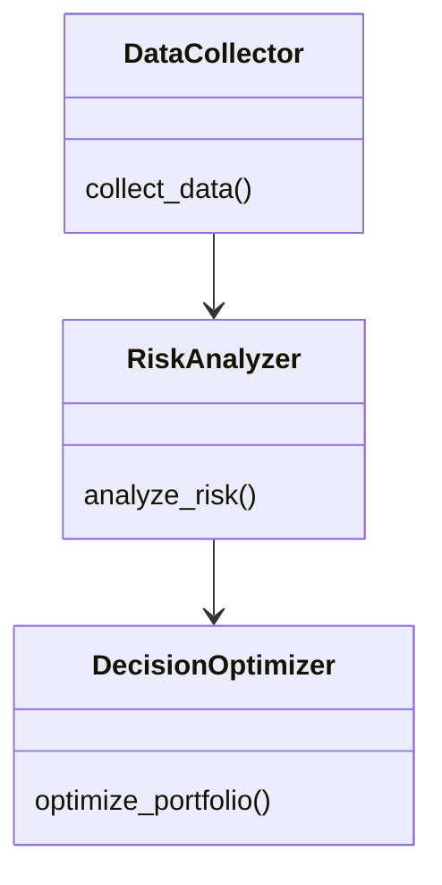

                 


# 智能体协作评估公司的地缘政治风险：全球价值投资必备

> 关键词：智能体协作、地缘政治风险、全球价值投资、算法模型、系统架构

> 摘要：本文探讨了如何利用智能体协作的方法来评估公司的地缘政治风险，为全球价值投资者提供必备的决策支持工具。文章详细介绍了智能体协作的核心概念、算法原理、系统架构设计以及项目实战，帮助读者全面理解并应用这一创新方法。

---

## 第1章 地缘政治风险评估的背景与概念

### 1.1 地缘政治风险的定义与影响

地缘政治风险是指由于政治、经济、社会或文化等因素的变化，可能对企业或投资者造成的潜在损失。这些风险可能源于国家间的冲突、政策变化、经济波动或社会动荡等。对于全球价值投资者而言，准确评估地缘政治风险是制定投资策略的关键。

#### 1.1.1 地缘政治的内涵
地缘政治涉及地理位置、资源分布、政治格局和国际关系等多个方面。企业在全球范围内的运营会受到地缘政治的影响，例如贸易限制、外汇管制或供应链中断。

#### 1.1.2 风险的定义与分类
风险可以分为系统性风险和非系统性风险。地缘政治风险通常属于系统性风险，影响整个市场或特定区域。

#### 1.1.3 地缘政治风险的核心要素
- **政治稳定性**：政府更迭、政策变化。
- **经济依赖性**：贸易伙伴、资源供应。
- **社会因素**：社会动荡、民族冲突。
- **国际关系**：外交关系、制裁措施。

### 1.2 地缘政治风险的影响因素

#### 1.2.1 政治因素
- 政府政策变化、选举结果、政局不稳。

#### 1.2.2 经济因素
- 经济制裁、汇率波动、贸易壁垒。

#### 1.2.3 文化与社会因素
- 社会动荡、民族冲突、文化差异。

#### 1.2.4 技术因素
- 网络攻击、技术制裁、供应链依赖。

### 1.3 地缘政治风险的评估意义

#### 1.3.1 企业投资决策的重要性
- 减少潜在损失，抓住投资机会。
- 优化资产配置，降低风险敞口。

#### 1.3.2 全球化背景下的风险分散
- 通过多元化投资降低单一市场的风险。
- 识别高风险区域，避免重大损失。

#### 1.3.3 地缘政治风险对企业价值的影响
- 影响企业的盈利能力和股价波动。
- 影响企业的融资成本和市场准入。

---

## 第2章 智能体协作评估的核心概念与原理

### 2.1 智能体协作的基本原理

#### 2.1.1 智能体的定义与特征
智能体是指能够感知环境、自主决策、协作完成任务的实体。其核心特征包括自主性、反应性、协作性和学习性。

#### 2.1.2 智能体协作的机制
- **协作目标**：共同完成风险评估任务。
- **协作规则**：基于角色分配和任务分解。
- **协作过程**：实时通信与信息共享。

#### 2.1.3 智能体协作的数学模型
智能体协作模型可以用图论表示，节点代表智能体，边代表协作关系。协作目标函数为：
$$
f(\text{目标}) = \sum_{i=1}^{n} w_i x_i
$$
其中，$w_i$是权重，$x_i$是特征向量。

### 2.2 地缘政治风险评估的智能体模型

#### 2.2.1 智能体在地缘政治风险评估中的角色
- **数据采集智能体**：收集政治、经济和社会数据。
- **风险分析智能体**：分析数据并生成风险评分。
- **决策优化智能体**：优化投资组合以降低风险。

#### 2.2.2 智能体协作的算法框架
使用多智能体协作算法，如分布式优化算法和基于规则的协作算法。例如，基于智能体的遗传算法用于优化投资组合。

---

## 第3章 智能体协作评估的算法原理

### 3.1 基于智能体的地缘政治风险评估算法

#### 3.1.1 算法流程
1. 数据采集：收集相关国家的经济、政治和社会数据。
2. 特征提取：提取关键特征，如GDP增长率、政治稳定性指数。
3. 权重计算：根据历史数据计算各特征的权重。
4. 风险评分：计算每个国家的风险评分。
5. 结果汇总：输出风险评估报告。

#### 3.1.2 算法实现
以下是Python代码示例：

```python
import numpy as np

def calculate_risk_factors(data, weights):
    return np.dot(data, weights)

def main():
    data = np.array([[0.8, 0.6], [0.7, 0.7]])
    weights = np.array([0.5, 0.5])
    risk_scores = calculate_risk_factors(data, weights)
    print("Risk Scores:", risk_scores)

if __name__ == "__main__":
    main()
```

### 3.2 算法的数学模型

#### 3.2.1 数据预处理
使用主成分分析（PCA）提取特征：

$$
X_{\text{PCA}} = X^T (X X^T)^{-1} X
$$

#### 3.2.2 风险评分公式
$$
R = \sum_{i=1}^{n} w_i x_i
$$

---

## 第4章 系统分析与架构设计

### 4.1 系统功能设计

#### 4.1.1 领域模型
使用Mermaid类图表示系统架构：



### 4.2 系统架构设计

#### 4.2.1 系统架构
使用Mermaid架构图表示：


### 4.3 系统接口设计

#### 4.3.1 接口定义
- 数据采集接口：`get_data(country)`
- 风险评估接口：`evaluate_risk(country)`
- 投资优化接口：`optimize_portfolio(risk_scores)`

---

## 第5章 项目实战

### 5.1 环境安装

#### 5.1.1 安装Python和相关库
```bash
pip install numpy pandas scikit-learn
```

### 5.2 核心实现

#### 5.2.1 数据预处理代码
```python
import pandas as pd

def preprocess_data(data):
    return data.dropna().fillna(0)
```

#### 5.2.2 风险评估代码
```python
from sklearn.linear_model import LinearRegression

def evaluate_risk(features, target):
    model = LinearRegression()
    model.fit(features, target)
    return model.predict(features)
```

### 5.3 案例分析

#### 5.3.1 案例分析
以美国和中国为例，分析地缘政治风险并生成投资建议。

---

## 第6章 总结与展望

### 6.1 总结

智能体协作评估模型能够高效、准确地评估地缘政治风险，为全球价值投资者提供有力支持。通过智能体协作，投资者可以实时监控风险变化，优化投资组合。

### 6.2 展望

未来，随着AI技术的进步，智能体协作模型将更加智能化和个性化，为全球价值投资提供更精准的决策支持。

---

## 作者：AI天才研究院 & 禅与计算机程序设计艺术

---

通过以上结构，文章详细介绍了智能体协作评估地缘政治风险的核心概念、算法原理、系统设计和项目实战，为全球价值投资者提供了实用的工具和方法。

