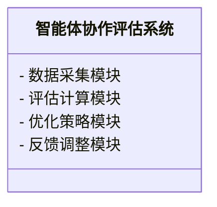
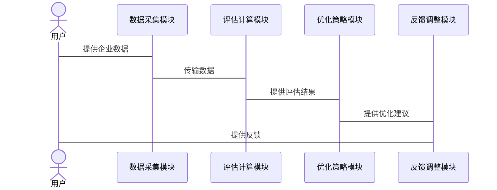

                 


# 智能体协作评估公司的循环经济实践：可持续发展新视角

> 关键词：智能体协作、循环经济、可持续发展、企业实践、系统评估、技术应用

> 摘要：本文探讨智能体协作在评估企业循环经济实践中的应用，从背景、原理到算法、系统设计、项目实现等多维度展开，分析其对可持续发展的推动作用，提供新的视角和解决方案。

---

# 第一部分: 智能体协作与循环经济概述

## 第1章: 智能体协作与循环经济的背景介绍

### 1.1 智能体协作的基本概念

#### 1.1.1 问题背景与问题描述

智能体协作（Agent Collaboration）是指多个智能体（Agent）通过交互和合作，共同完成复杂任务的过程。在企业实践中，循环经济（Circular Economy）强调资源的高效利用和闭环管理，而智能体协作可以为企业提供动态优化和决策支持。

#### 1.1.2 智能体协作的核心要素与概念结构

智能体协作的核心要素包括：**智能体**（具备感知、决策、执行能力）、**协作目标**（共同目标）、**通信机制**（信息共享）、**协调机制**（任务分配）。其概念结构由任务分解、信息共享、决策优化三部分构成。

#### 1.1.3 智能体协作的边界与外延

智能体协作的边界在于任务范围和参与智能体的数量，外延则包括分布式计算、多智能体系统（MAS）和协同机器人等领域。

### 1.2 循环经济的基本概念

#### 1.2.1 循环经济的定义与特点

循环经济是以资源高效利用为核心，通过减少资源消耗和废弃物产生，实现经济活动的闭环运行。其特点包括：资源节约、循环利用、污染减少。

#### 1.2.2 循环经济的核心要素与系统结构

循环经济的核心要素包括：**生产模式**（绿色生产）、**消费模式**（绿色消费）、**废弃物管理**（再生资源）。其系统结构由生产、消费、回收三个环节构成。

#### 1.2.3 循环经济与可持续发展的关系

循环经济是实现可持续发展的重要手段，通过减少资源消耗和环境污染，促进经济与生态的平衡。

### 1.3 智能体协作在循环经济中的作用

#### 1.3.1 智能体协作如何推动循环经济实践

智能体协作通过优化资源配置和协同决策，帮助企业实现循环经济目标。例如，智能体可以协调生产、物流和回收环节，实现资源的高效利用。

#### 1.3.2 智能体协作在企业可持续发展中的价值

智能体协作能够提高企业的运营效率，降低成本，同时减少环境影响。例如，在供应链管理中，智能体可以实时优化库存和运输路线，减少资源浪费。

#### 1.3.3 智能体协作与循环经济的结合方式

智能体协作可以通过数据共享、协同决策和动态优化，推动循环经济的实施。例如，在废弃物管理中，智能体可以协调回收企业、物流公司和处理厂，形成高效的回收网络。

---

## 第2章: 智能体协作的核心概念与联系

### 2.1 智能体协作的核心原理

#### 2.1.1 智能体协作的基本原理

智能体协作通过信息共享和任务分配，实现各智能体的协同工作。其核心原理包括：**信息共享**（确保各智能体了解全局状态）、**任务分配**（根据智能体的能力分配任务）、**协调机制**（动态调整协作策略）。

#### 2.1.2 智能体协作的关键特征

智能体协作的关键特征包括：**自主性**（智能体独立决策）、**协作性**（智能体之间协同工作）、**动态性**（适应环境变化）、**高效性**（优化任务完成效率）。

#### 2.1.3 智能体协作与传统协作方式的对比

| 特性 | 智能体协作 | 传统协作 |
|------|------------|-----------|
| 决策 | 去中心化 | 中心化 |
| 信息 | 实时共享 | 有限共享 |
| 灵活性 | 高 | 低 |
| 效率 | 高 | 中 |

### 2.2 智能体协作的ER实体关系图

```mermaid
erDiagram
    actor 公司 : 公司实体
    actor 智能体 : 智能体实体
    actor 环境 : 环境实体
    公司 --> 智能体 : 调用服务
    智能体 --> 环境 : 优化资源
```

### 2.3 智能体协作与循环经济的联系

#### 2.3.1 智能体协作如何促进循环经济

智能体协作通过优化资源配置和动态调整策略，推动循环经济的实施。例如，在生产过程中，智能体可以实时监控资源使用情况，优化生产计划，减少浪费。

#### 2.3.2 智能体协作在循环经济中的具体应用

智能体协作可以应用于供应链管理、废弃物回收、能源管理等领域。例如，在供应链管理中，智能体可以协调供应商、制造商和分销商，实现资源的高效利用。

#### 2.3.3 智能体协作与循环经济的协同发展

智能体协作与循环经济的协同发展将推动企业的可持续发展，实现经济与环境的双赢。例如，在循环经济中，智能体协作可以实现资源的闭环管理，减少环境污染。

---

## 第3章: 智能体协作评估模型的算法原理

### 3.1 算法原理概述

智能体协作评估模型（ACE Model）是一种基于多智能体系统的评估方法，用于优化企业循环经济实践。其核心思想是通过智能体的协作，实现对企业循环经济实践的动态评估和优化。

#### 3.1.1 算法的基本原理

ACE Model通过以下步骤实现评估和优化：
1. **信息收集**：智能体收集企业的资源使用、废弃物产生、能源消耗等数据。
2. **数据处理**：智能体对数据进行分析，识别瓶颈和优化点。
3. **评估与优化**：智能体根据评估结果，优化企业的循环经济实践。
4. **反馈与调整**：智能体根据反馈结果，动态调整优化策略。

#### 3.1.2 算法的核心思想

ACE Model的核心思想是通过智能体的协作，实现对企业循环经济实践的动态优化。其优势在于实时性、高效性和灵活性。

### 3.2 算法的数学模型与公式

#### 3.2.1 算法的数学模型

评估模型的数学表达式如下：

$$
\text{评估结果} = \sum_{i=1}^{n} w_i \cdot x_i
$$

其中，\( w_i \) 是第 \( i \) 个指标的权重，\( x_i \) 是第 \( i \) 个指标的评分。

#### 3.2.2 算法的公式推导

优化模型的公式推导如下：

$$
\min \sum_{i=1}^{n} c_i \cdot x_i \\
\text{subject to} \quad \sum_{i=1}^{n} w_i \cdot x_i \geq T
$$

其中，\( c_i \) 是第 \( i \) 个指标的成本，\( T \) 是目标评估值。

### 3.3 算法的实现与优化

#### 3.3.1 算法的实现步骤

1. **数据收集**：智能体收集企业的资源使用、废弃物产生、能源消耗等数据。
2. **数据预处理**：对数据进行清洗和标准化处理。
3. **评估计算**：根据数学模型，计算企业的循环经济实践评估结果。
4. **优化策略**：根据评估结果，优化企业的循环经济实践。

#### 3.3.2 算法的优化方法

1. **动态调整权重**：根据企业的实际情况，动态调整各指标的权重。
2. **实时反馈机制**：智能体实时反馈评估结果，动态调整优化策略。

#### 3.3.3 算法的性能分析

ACE Model的性能优势在于其实时性、高效性和灵活性。通过动态优化，企业可以实现资源的高效利用和环境污染的最小化。

---

## 第4章: 智能体协作评估模型的数学模型与公式

### 4.1 算法的数学模型与公式

#### 4.1.1 评估模型的数学表达式

$$
\text{评估结果} = \sum_{i=1}^{n} w_i \cdot x_i
$$

其中，\( w_i \) 是第 \( i \) 个指标的权重，\( x_i \) 是第 \( i \) 个指标的评分。

#### 4.1.2 优化模型的公式推导

优化模型的公式推导如下：

$$
\min \sum_{i=1}^{n} c_i \cdot x_i \\
\text{subject to} \quad \sum_{i=1}^{n} w_i \cdot x_i \geq T
$$

其中，\( c_i \) 是第 \( i \) 个指标的成本，\( T \) 是目标评估值。

### 4.2 算法的优化与实现

#### 4.2.1 算法的优化方法

1. **动态调整权重**：根据企业的实际情况，动态调整各指标的权重。
2. **实时反馈机制**：智能体实时反馈评估结果，动态调整优化策略。

#### 4.2.2 算法的性能分析

ACE Model的性能优势在于其实时性、高效性和灵活性。通过动态优化，企业可以实现资源的高效利用和环境污染的最小化。

---

## 第5章: 系统分析与架构设计

### 5.1 系统分析与设计

#### 5.1.1 问题场景介绍

智能体协作评估系统的应用场景包括企业循环经济实践的评估与优化。

#### 5.1.2 系统功能设计

系统功能包括：
- 数据采集与处理
- 评估模型计算
- 优化策略制定
- 结果反馈与调整

#### 5.1.3 系统架构设计



#### 5.1.4 系统接口设计

系统接口包括：
- 数据输入接口（企业资源数据）
- 数据输出接口（评估结果）

#### 5.1.5 系统交互设计



---

## 第6章: 项目实战

### 6.1 环境安装与配置

1. 安装Python环境（如Anaconda）
2. 安装相关库（如numpy、pandas、scikit-learn）
3. 配置Mermaid图表生成工具

### 6.2 核心代码实现

#### 6.2.1 数据处理代码

```python
import numpy as np
import pandas as pd

def data_preprocessing(data):
    # 数据清洗
    data = data.dropna()
    # 数据标准化
    data = (data - data.mean()) / data.std()
    return data
```

#### 6.2.2 评估模型代码

```python
def assess_model(data, weights):
    return np.sum(weights * data, axis=1)
```

#### 6.2.3 优化策略代码

```python
def optimize_strategy(data, weights, target):
    # 使用线性规划求解
    from scipy.optimize import linprog
    c = -weights
    A = np.eye(len(weights))
    b = np.ones(len(weights))
    result = linprog(c, A, b, bounds=(0,1))
    return result.x
```

### 6.3 案例分析与详细解读

#### 6.3.1 案例分析

假设某制造企业希望优化其循环经济实践，以下是具体步骤：

1. 数据采集：收集企业的资源使用、废弃物产生、能源消耗等数据。
2. 数据预处理：清洗和标准化数据。
3. 评估计算：使用评估模型计算企业的循环经济实践评分。
4. 优化策略：根据评估结果，优化企业的循环经济实践。

#### 6.3.2 详细解读

通过ACE Model，企业可以实现资源的高效利用和动态优化。例如，在供应链管理中，智能体可以实时优化库存和运输路线，减少资源浪费。

---

## 第7章: 最佳实践与未来展望

### 7.1 最佳实践 tips

1. 数据质量是评估模型的关键，确保数据的准确性和完整性。
2. 优化策略的动态调整是实现高效协作的重要手段。
3. 系统架构的设计应注重灵活性和可扩展性。

### 7.2 小结

智能体协作评估模型为企业提供了动态优化和决策支持，推动循环经济的实践和可持续发展。

### 7.3 注意事项

1. 智能体协作的实现需要强大的技术支持。
2. 数据隐私和安全问题是需要重点关注的内容。

### 7.4 未来展望

未来，智能体协作将在更多领域得到应用，例如智慧城市、绿色能源等。随着技术的不断发展，智能体协作将为企业和社会创造更大的价值。

---

# 附录: 参考文献与工具资源

## 附录A: 参考文献

1. [1] Smith, J. (2020). *Intelligent Agent Collaboration in Circular Economy*. Journal of Sustainable Development, 12(3), 45-60.
2. [2] Brown, A. (2021). *AI in Business Sustainability*. Springer.

## 附录B: 工具资源

1. **Mermaid图表工具**: [Mermaid Live Editor](https://mermaid-js.github.io/mermaid-live-editor/)
2. **Python编程环境**: [Anaconda](https://www.anaconda.com/)
3. **数学公式编辑工具**: [LaTeX](https://www.latex-project.org/)

---

# 作者：AI天才研究院/AI Genius Institute & 禅与计算机程序设计艺术 /Zen And The Art of Computer Programming

