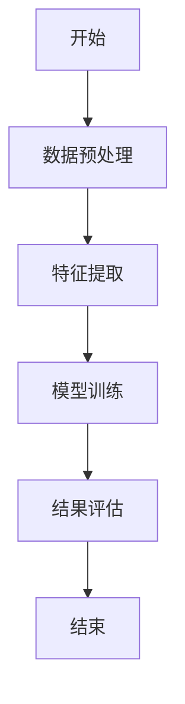
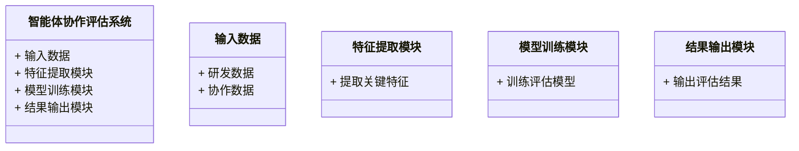
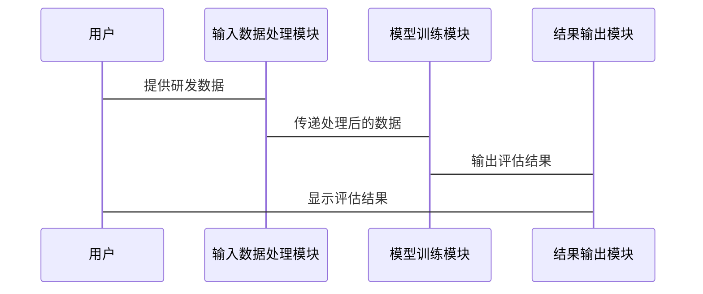

                 


# 智能体协作评估公司的研发效率：科技公司价值评估

> **关键词**：智能体协作、研发效率评估、科技公司价值、算法原理、系统架构设计、项目实战

> **摘要**：  
> 本文深入探讨了智能体协作在科技公司研发效率评估中的应用，结合实际案例分析，从核心概念、算法原理、系统架构设计到项目实战，全面解析如何通过智能体协作提升研发效率，进而评估公司价值。文章内容涵盖背景介绍、智能体协作原理、评估模型构建、系统设计与实现，以及实际应用中的挑战与解决方案，旨在为科技公司提供一套高效的研发效率评估方法。

---

## 第一部分：背景介绍

### 第1章：问题背景与核心概念

#### 1.1 问题背景
- 1.1.1 科技公司的研发效率是企业核心竞争力的关键
- 1.1.2 当前评估方法的局限性
- 1.1.3 智能体协作技术的兴起与应用前景

#### 1.2 问题描述
- 1.2.1 研发效率评估的主要挑战
- 1.2.2 智能体协作在研发中的具体应用场景
- 1.2.3 评估模型构建的目标与意义

#### 1.3 问题解决与边界
- 1.3.1 智能体协作如何提升研发效率
- 1.3.2 评估模型的边界与适用范围
- 1.3.3 相关概念的外延与限制

#### 1.4 核心概念与组成
- 1.4.1 智能体协作的核心要素
- 1.4.2 研发效率评估的关键指标
- 1.4.3 相关概念的结构化分析

---

## 第二部分：核心概念与联系

### 第2章：智能体协作的原理与机制

#### 2.1 智能体协作的原理
- 2.1.1 智能体的基本定义与特征
- 2.1.2 协作机制的类型与特点
- 2.1.3 多智能体系统中的通信与协调

#### 2.2 智能体协作的核心属性
- 2.2.1 任务分配与角色划分
- 2.2.2 信息共享与知识整合
- 2.2.3 决策制定与协作优化

#### 2.3 智能体协作与传统协作的对比
- 2.3.1 属性对比分析
- 2.3.2 优缺点比较
- 2.3.3 应用场景的差异

---

## 第三部分：算法原理讲解

### 第3章：评估模型的算法原理

#### 3.1 算法概述
- 3.1.1 智能体协作评估模型的总体框架
- 3.1.2 算法的核心思想与步骤

#### 3.2 算法实现
- 3.2.1 数据预处理与特征提取
- 3.2.2 模型训练与优化
- 3.2.3 结果评估与验证

#### 3.3 数学模型与公式
- 3.3.1 损失函数：$$ L = \frac{1}{2} (y - \hat{y})^2 $$
- 3.3.2 优化器：$$ \theta = \theta - \eta \cdot \frac{\partial L}{\partial \theta} $$
- 3.3.3 智能体协作效率公式：$$ E = \frac{\sum_{i=1}^{n} s_i}{n} $$，其中$$ s_i $$是第$$ i $$个智能体的效率评分。

#### 3.4 算法流程图


---

## 第四部分：系统分析与架构设计

### 第4章：系统设计与实现

#### 4.1 系统场景介绍
- 4.1.1 研发效率评估的典型应用场景
- 4.1.2 系统的主要功能与目标

#### 4.2 系统功能设计
- 4.2.1 领域模型设计（Mermaid类图）


#### 4.3 系统架构设计
- 4.3.1 系统架构图（Mermaid架构图）


#### 4.4 系统接口设计
- 4.4.1 接口定义与交互流程
- 4.4.2 接口的输入输出格式

#### 4.5 系统交互设计（Mermaid序列图）


---

## 第五部分：项目实战

### 第5章：项目实现与案例分析

#### 5.1 项目环境与工具安装
- 5.1.1 开发环境配置
- 5.1.2 必要工具安装（如Python、TensorFlow、Mermaid工具）

#### 5.2 核心代码实现
- 5.2.1 数据预处理代码
```python
import pandas as pd

def preprocess_data(data):
    # 数据清洗与特征提取
    data = data.dropna()
    data = pd.get_dummies(data)
    return data
```

- 5.2.2 模型训练代码
```python
import tensorflow as tf

model = tf.keras.Sequential([
    tf.keras.layers.Dense(64, activation='relu'),
    tf.keras.layers.Dense(1, activation='sigmoid')
])

model.compile(optimizer='adam', loss='binary_crossentropy', metrics=['accuracy'])
model.fit(X_train, y_train, epochs=10, batch_size=32)
```

- 5.2.3 结果评估代码
```python
from sklearn.metrics import accuracy_score

y_pred = model.predict(X_test)
print("模型准确率：", accuracy_score(y_test, y_pred))
```

#### 5.3 案例分析
- 5.3.1 实际案例的背景与数据准备
- 5.3.2 模型训练与结果解读
- 5.3.3 案例分析与优化建议

---

## 第六部分：最佳实践与总结

### 第6章：最佳实践与总结

#### 6.1 最佳实践
- 6.1.1 数据质量的重要性
- 6.1.2 模型选择与调优技巧
- 6.1.3 系统优化与维护建议

#### 6.2 小结
- 6.2.1 智能体协作评估的核心价值
- 6.2.2 未来研究方向与应用潜力

#### 6.3 注意事项
- 6.3.1 数据隐私与安全问题
- 6.3.2 模型的可解释性与透明度
- 6.3.3 系统的可扩展性与维护成本

#### 6.4 拓展阅读
- 6.4.1 推荐的书籍与论文
- 6.4.2 相关技术领域的发展动态

---

## 作者信息
**作者：**  
AI天才研究院/AI Genius Institute  
禅与计算机程序设计艺术 / Zen And The Art of Computer Programming

---

通过以上大纲，可以系统地构建一篇结构完整、内容详实的技术博客文章，涵盖智能体协作评估研发效率的核心概念、算法原理、系统设计与项目实战，为科技公司提供有价值的参考与指导。

