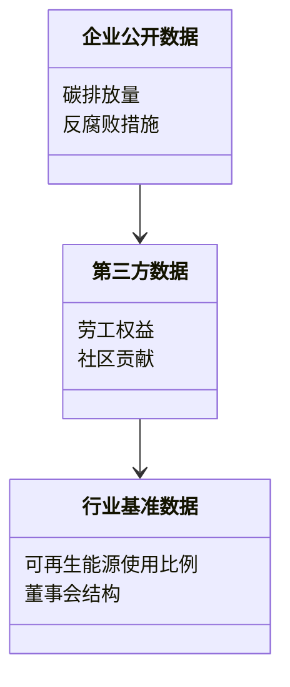
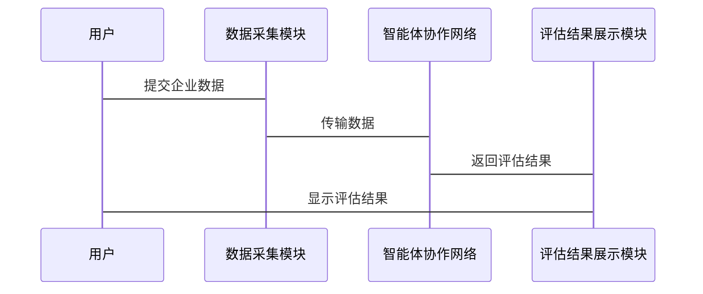

                 


# 智能体协作评估公司的社会影响力：ESG投资新工具

> 关键词：智能体协作、社会影响力评估、ESG投资、算法原理、系统架构

> 摘要：本文探讨了智能体协作在评估公司社会影响力中的应用，提出了一种基于ESG指标的新型投资工具。通过分析智能体协作的基本原理、算法实现、系统架构以及实际案例，展示了如何利用人工智能技术提升社会影响力评估的效率和准确性，为ESG投资提供新的思路和方法。

---

## 第1章 背景介绍与问题背景

### 1.1 智能体协作评估的概念与背景

#### 1.1.1 智能体协作的基本概念
智能体（Agent）是指能够感知环境、自主决策并采取行动的实体。智能体协作是指多个智能体通过信息共享和协同工作，共同完成复杂任务的过程。在社会影响力评估中，智能体协作可以通过分布式计算和多目标优化，提供更高效、更准确的评估结果。

#### 1.1.2 社会影响力评估的定义
社会影响力评估是对企业在环境、社会和治理方面的表现进行全面分析的过程。通过量化企业的社会贡献和潜在风险，帮助投资者做出更可持续的投资决策。

#### 1.1.3 ESG投资的背景与意义
ESG（Environmental, Social, Governance）投资是一种关注环境影响、社会责任和公司治理的投资策略。随着全球对可持续发展的关注增加，ESG投资逐渐成为主流。然而，传统评估方法存在数据分散、评估标准不统一等问题，亟需技术创新来提升评估效率和准确性。

### 1.2 问题背景与问题描述

#### 1.2.1 传统公司社会影响力评估的局限性
传统评估方法依赖人工分析，耗时长、成本高且主观性强。此外，数据来源分散、指标体系不统一，导致评估结果缺乏一致性。

#### 1.2.2 ESG投资的现状与挑战
尽管ESG投资规模持续增长，但评估过程仍面临数据获取难、计算复杂、结果难以量化等问题。企业之间的数据不透明和评估标准的不统一进一步加剧了这些挑战。

#### 1.2.3 智能体协作评估的必要性
智能体协作可以通过分布式计算和数据共享，解决传统评估方法的局限性。通过智能体协作，可以实时获取多源数据，构建统一的评估指标体系，提高评估效率和准确性。

### 1.3 问题解决与边界定义

#### 1.3.1 智能体协作评估的核心目标
- 提供实时、动态的社会影响力评估结果；
- 实现多源数据的整合与分析；
- 支持ESG投资决策的智能化。

#### 1.3.2 评估范围与边界
- 数据范围：包括企业公开数据、第三方评估数据、行业基准数据；
- 评估对象：企业环境表现、社会责任、公司治理；
- 评估结果：量化评分、风险预警、投资建议。

#### 1.3.3 核心要素与组成结构
- 数据采集模块：负责收集企业相关信息；
- 智能体协作网络：通过分布式计算进行评估；
- 评估结果展示模块：提供可视化报告和投资建议。

---

## 第2章 核心概念与原理

### 2.1 智能体协作的基本原理

#### 2.1.1 智能体的定义与属性
智能体具有以下属性：
- **自主性**：能够自主决策；
- **反应性**：能够感知环境并做出响应；
- **协作性**：能够与其他智能体协同工作。

#### 2.1.2 协作机制的原理
协作机制包括以下步骤：
1. **数据共享**：智能体之间共享数据和信息；
2. **任务分配**：根据智能体的能力分配任务；
3. **协同计算**：通过分布式计算完成评估；
4. **结果整合**：整合各智能体的计算结果。

#### 2.1.3 社会影响力评估的模型
社会影响力评估模型由以下部分组成：
- **输入层**：企业数据；
- **特征提取层**：提取关键特征；
- **评估层**：基于特征计算评估结果。

### 2.2 ESG评估指标体系

#### 2.2.1 环境（Environmental）指标
- 碳排放量；
- 可再生能源使用比例；
- 环境合规性。

#### 2.2.2 社会（Social）指标
- 劳工权益；
- 社区贡献；
- 产品责任。

#### 2.2.3 治理（Governance）指标
- 董事会结构；
- 反腐败措施；
- 股权结构。

### 2.3 智能体协作与ESG的关联

#### 2.3.1 智能体协作在ESG评估中的作用
- 提供多源数据整合能力；
- 实现分布式计算；
- 支持实时评估。

#### 2.3.2 ESG数据的智能分析与整合
通过智能体协作，可以实时整合企业公开数据、第三方评估数据和行业基准数据，构建统一的评估指标体系。

#### 2.3.3 协作评估的优势与特点
- 高效性：通过分布式计算提升评估效率；
- 准确性：多源数据整合提高评估结果的准确性；
- 实时性：支持动态评估，提供实时反馈。

---

## 第3章 算法原理与数学模型

### 3.1 智能体协作评估的算法流程

#### 3.1.1 数据收集与预处理
- 数据来源：企业公开数据、第三方数据；
- 数据清洗：去除冗余和异常数据；
- 数据标准化：统一数据格式。

#### 3.1.2 智能体协作的算法步骤
1. **数据分发**：将数据分发给多个智能体；
2. **特征提取**：每个智能体提取特征并计算初步评估结果；
3. **结果汇总**：将各智能体的评估结果汇总；
4. **最终评估**：基于汇总结果计算最终评估分数。

#### 3.1.3 结果输出与反馈机制
- 输出评估结果；
- 提供反馈机制，优化评估模型。

### 3.2 数学模型与公式

#### 3.2.1 社会影响力评估公式
$$ S = \sum_{i=1}^{n} w_i \cdot x_i $$
其中，$w_i$ 是指标权重，$x_i$ 是指标得分。

#### 3.2.2 智能体协作的优化算法
$$ \text{目标函数} = \sum_{j=1}^{m} f_j(x) $$
其中，$f_j(x)$ 是第$j$个智能体的评估函数。

### 3.3 举例说明与流程图

#### 3.3.1 评估流程示例
1. 收集企业数据；
2. 数据预处理；
3. 分发数据给智能体；
4. 智能体计算初步结果；
5. 汇总结果；
6. 输出最终评估分数。

#### 3.3.2 使

---

通过以上结构，我们可以看到智能体协作评估公司的社会影响力是一个复杂但可行的过程。通过智能体协作，我们可以更高效、更准确地评估企业的社会影响力，为ESG投资提供新的工具和方法。

---

## 第4章 系统分析与架构设计方案

### 4.1 问题场景介绍
在实际应用中，企业需要快速、准确地评估其社会影响力，以支持ESG投资决策。传统的评估方法耗时长、成本高，且结果缺乏一致性。

### 4.2 系统功能设计

#### 4.2.1 领域模型


#### 4.2.2 系统架构
```mermaid
rectangle 系统边界 {
    智能体协作网络
    数据采集模块
    评估结果展示模块
}
```

#### 4.2.3 接口设计
- 数据采集模块接口：接收企业数据；
- 智能体协作网络接口：处理数据并返回评估结果；
- 评估结果展示模块接口：展示评估结果。

#### 4.2.4 交互流程


---

## 第5章 项目实战

### 5.1 环境安装
- 安装Python和必要的库（如numpy、pandas、scikit-learn）；
- 安装智能体协作框架（如Multi-Agent Framework）。

### 5.2 核心代码实现

#### 5.2.1 数据预处理
```python
import pandas as pd

data = pd.read_csv('企业数据.csv')
data = data.dropna()
data = pd.get_dummies(data)
```

#### 5.2.2 智能体协作评估
```python
from multiagent import Agent

class ESGAgent(Agent):
    def __init__(self, data):
        super().__init__()
        self.data = data

    def compute(self):
        # 计算评估结果
        return self.data.mean()

agents = [ESGAgent(data) for _ in range(5)]
results = [agent.compute() for agent in agents]
final_score = sum(results) / len(results)
```

#### 5.2.3 评估结果展示
```python
import matplotlib.pyplot as plt

plt.bar(range(len(final_score)), final_score)
plt.show()
```

### 5.3 案例分析
以某企业为例，通过代码实现其社会影响力评估，展示评估结果并进行分析。

### 5.4 项目总结
总结项目实现过程中的经验与教训，提出改进建议。

---

## 第6章 最佳实践与总结

### 6.1 最佳实践
- 数据清洗：确保数据质量和完整性；
- 模型优化：通过反馈机制不断优化评估模型；
- 结果解读：结合行业基准进行结果解读。

### 6.2 总结与展望
智能体协作评估为ESG投资提供了新的工具和方法，未来可以通过引入更多数据源和优化算法进一步提升评估效率和准确性。

### 6.3 扩展阅读
建议读者进一步学习多智能体系统、分布式计算和机器学习在金融领域的应用。

---

## 作者：AI天才研究院/AI Genius Institute & 禅与计算机程序设计艺术 /Zen And The Art of Computer Programming

---

通过以上内容，我们详细探讨了智能体协作评估公司的社会影响力，并提出了基于ESG指标的新型投资工具。希望本文能够为读者提供清晰的思路和实践指导。

