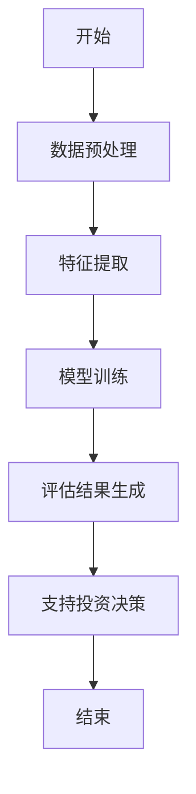
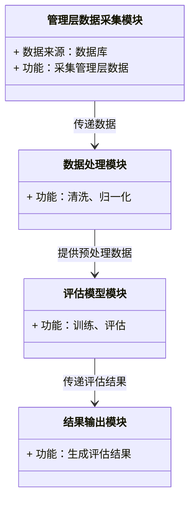
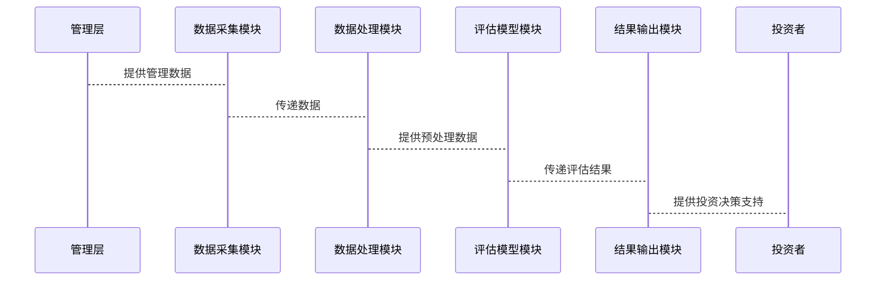

                 


# 智能体协作评估管理层能力：价值投资的关键因素

> 关键词：智能体协作，管理层能力评估，价值投资，算法原理，系统架构设计，项目实战

> 摘要：本文探讨了智能体协作在评估管理层能力中的作用，分析了其在价值投资中的关键影响。通过详细的技术分析，介绍了智能体协作的背景、核心概念、算法原理、系统架构设计、项目实战以及最佳实践，为读者提供了全面的视角。

---

# 第1章: 智能体协作评估的背景与问题描述

## 1.1 智能体协作评估的背景

### 1.1.1 管理层能力评估的重要性

管理层能力是企业价值的核心影响因素之一。传统评估方法依赖于主观判断和有限的数据分析，难以全面、客观地反映管理层的能力。因此，引入智能体协作评估，利用人工智能技术，可以更高效、精准地进行评估。

### 1.1.2 智能体协作在管理评估中的作用

智能体协作通过分布式计算和多维度数据分析，能够实时捕捉管理层决策中的关键信息，提供全面的评估结果。这不仅提高了评估的准确性，还为企业优化管理策略提供了数据支持。

### 1.1.3 价值投资中的管理层能力关键因素

在价值投资中，管理层的能力直接影响企业的长期发展和盈利能力。智能体协作评估能够帮助投资者识别具备优秀领导力和战略能力的管理层，从而做出更明智的投资决策。

## 1.2 问题背景与问题描述

### 1.2.1 管理层能力评估的现状与挑战

传统评估方法存在数据不足、维度单一、主观性强等问题，难以满足现代投资对精准评估的需求。此外，快速变化的市场环境要求评估方法具有更高的实时性和适应性。

### 1.2.2 智能体协作在管理评估中的问题

智能体协作评估面临数据隐私、计算资源分配、协作机制设计等挑战。如何确保智能体之间的高效协作，同时保护数据安全，是当前研究的重点。

### 1.2.3 价值投资中管理层能力的关键因素

价值投资者关注管理层的战略决策能力、执行力、创新能力等。智能体协作评估需要综合分析这些因素，提供全面的评估结果。

## 1.3 问题解决与边界

### 1.3.1 智能体协作评估的解决方案

通过构建分布式智能体网络，利用机器学习和大数据分析技术，实现对管理层能力的多维度评估。同时，设计合理的协作机制，确保评估结果的准确性和一致性。

### 1.3.2 问题的边界与外延

智能体协作评估的边界包括数据范围、评估维度和应用场景。外延则涉及技术的扩展和应用领域的拓展，如应用于其他类型的企业或行业。

### 1.3.3 核心概念与核心要素

核心概念包括智能体协作、多维度评估、数据驱动决策。核心要素包括数据来源、评估指标、协作机制。

## 1.4 本章小结

本章介绍了智能体协作评估的背景和重要性，分析了其在价值投资中的关键作用，并提出了问题的解决方案和边界条件。

---

# 第2章: 智能体协作评估的核心概念与联系

## 2.1 核心概念原理

### 2.1.1 智能体的定义与特征

智能体是能够感知环境、自主决策并执行任务的实体。其特征包括自主性、反应性、协作性和学习能力。

### 2.1.2 协作评估的基本原理

协作评估基于分布式计算和多智能体系统，通过智能体之间的信息共享和协同决策，实现对管理层能力的全面评估。

### 2.1.3 管理层能力评估的关键要素

关键要素包括战略决策能力、执行力、创新能力、团队管理能力等。

## 2.2 核心概念属性特征对比表

| 特征          | 传统评估方法 | 智能体协作评估 |
|---------------|---------------|----------------|
| 数据来源      | 单一数据源    | 多源数据       |
| 评估维度      | 少数维度      | 多维度         |
| 评估结果      | 主观判断      | 客观分析       |
| 实时性         | 低            | 高             |

## 2.3 ER实体关系图

```mermaid
erDiagram
    actor 管理层 : 管理层人员
    actor 投资者 : 投资者
    actor 智能体 : 智能体系统
    entity 评估指标 : 管理层能力评估指标
    entity 评估结果 : 评估结果数据
    entity 价值投资决策 : 投资决策
    管理层 --> 评估指标 : 提供管理数据
    投资者 --> 价值投资决策 : 做出投资决策
    智能体 --> 评估指标 : 分析评估指标
    智能体 --> 评估结果 : 生成评估结果
    评估结果 --> 价值投资决策 : 支持投资决策
```

## 2.5 本章小结

本章详细阐述了智能体协作评估的核心概念及其在价值投资中的应用，通过对比分析和实体关系图，展示了其优势和实现机制。

---

# 第3章: 智能体协作评估的算法原理

## 3.1 算法原理概述

### 3.1.1 管理层能力评估的多维度分析

通过对管理层的决策历史、执行效率、团队协作等多维度数据进行分析，构建全面的评估模型。

### 3.1.2 智能体协作的算法框架

基于分布式计算和多智能体协作，设计高效的算法框架，确保评估过程的实时性和准确性。

### 3.1.3 价值投资中的权重分配

根据各评估维度的重要性，赋予不同的权重，确保评估结果的合理性和科学性。

## 3.2 算法流程图



## 3.3 算法实现

### 3.3.1 数据预处理

对原始数据进行清洗、归一化处理，确保数据质量。

### 3.3.2 特征提取

通过机器学习技术，提取关键特征，如决策速度、团队协作效率等。

### 3.3.3 模型训练

使用监督学习算法，如随机森林或神经网络，训练评估模型。

### 3.3.4 评估结果生成

基于训练好的模型，生成评估结果，并输出给投资者。

## 3.4 数学公式

### 3.4.1 评估模型的数学表达

评估结果可以表示为：

$$
\text{评估结果} = \sum_{i=1}^{n} w_i x_i
$$

其中，$w_i$ 是第 $i$ 个评估维度的权重，$x_i$ 是该维度的特征值。

### 3.4.2 权重计算公式

权重可以通过主成分分析或层次分析法计算，例如：

$$
w_i = \frac{\sum_{j=1}^{m} a_{ij}}{\sum_{i=1}^{n} \sum_{j=1}^{m} a_{ij}}
$$

其中，$a_{ij}$ 是评估维度 $i$ 在评估中的重要性评分。

## 3.5 本章小结

本章详细讲解了智能体协作评估的算法原理，包括数据预处理、特征提取、模型训练和结果生成，并通过数学公式展示了评估模型的实现过程。

---

# 第4章: 智能体协作评估的系统架构设计

## 4.1 问题场景介绍

系统需要支持多智能体协作，实时处理大量数据，并生成准确的评估结果，为投资者提供决策支持。

## 4.2 系统功能设计

### 4.2.1 系统功能模块

- 数据采集模块：收集管理层的相关数据。
- 数据处理模块：对数据进行清洗和预处理。
- 评估模型模块：构建和训练评估模型。
- 结果输出模块：生成评估结果并输出。

### 4.2.2 系统功能设计类图



## 4.3 系统架构设计

### 4.3.1 系统架构图

```mermaid
container 管理层协作评估系统 {
    组件 数据采集模块
    组件 数据处理模块
    组件 评估模型模块
    组件 结果输出模块
    组件 交互接口
}
```

### 4.3.2 交互接口设计

系统需要与管理层和投资者进行交互，提供数据输入和结果输出接口。

### 4.3.3 系统交互序列图



## 4.4 本章小结

本章详细设计了智能体协作评估系统的架构，包括功能模块、类图和交互序列图，展示了系统的整体结构和协作机制。

---

# 第5章: 智能体协作评估的项目实战

## 5.1 项目背景与目标

本项目旨在通过智能体协作评估管理层能力，帮助投资者做出更明智的投资决策。

## 5.2 项目环境安装

安装必要的工具和库，如Python、TensorFlow、scikit-learn等。

## 5.3 核心代码实现

### 5.3.1 数据预处理代码

```python
import pandas as pd
from sklearn.preprocessing import StandardScaler

# 读取数据
data = pd.read_csv('management_data.csv')

# 数据清洗
data.dropna(inplace=True)

# 数据归一化
scaler = StandardScaler()
data_scaled = scaler.fit_transform(data)
```

### 5.3.2 评估模型训练代码

```python
from sklearn.ensemble import RandomForestClassifier

# 训练模型
model = RandomForestClassifier(n_estimators=100)
model.fit(data_scaled, labels)
```

### 5.3.3 结果生成代码

```python
# 生成评估结果
importances = model.feature_importances_
result = pd.DataFrame({'特征': features, '重要性': importances})
result.to_csv('assessment_result.csv', index=False)
```

## 5.4 代码解读与分析

通过对代码的解读，可以看到数据预处理、模型训练和结果生成的具体实现过程。

## 5.5 实际案例分析

以某公司为例，展示智能体协作评估的实际应用过程和结果。

## 5.6 本章小结

本章通过项目实战，展示了智能体协作评估的具体实现过程，包括环境安装、代码实现和案例分析。

---

# 第6章: 智能体协作评估的最佳实践

## 6.1 最佳实践 tips

### 6.1.1 数据质量的重要性

确保数据的准确性和完整性，是评估结果可靠性的基础。

### 6.1.2 模型选择与调优

根据实际需求选择合适的模型，并进行参数调优，以提高评估精度。

### 6.1.3 系统安全性

在设计系统时，需考虑数据隐私和系统安全性，防止数据泄露和攻击。

## 6.2 小结

总结智能体协作评估的核心内容和实现过程。

## 6.3 注意事项

在实际应用中，需注意数据隐私、模型可解释性和系统可扩展性等问题。

## 6.4 拓展阅读

推荐相关领域的书籍和论文，供读者进一步学习。

---

# 作者：AI天才研究院/AI Genius Institute & 禅与计算机程序设计艺术 /Zen And The Art of Computer Programming

