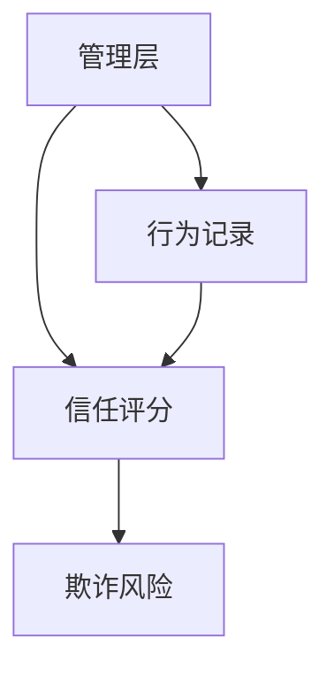
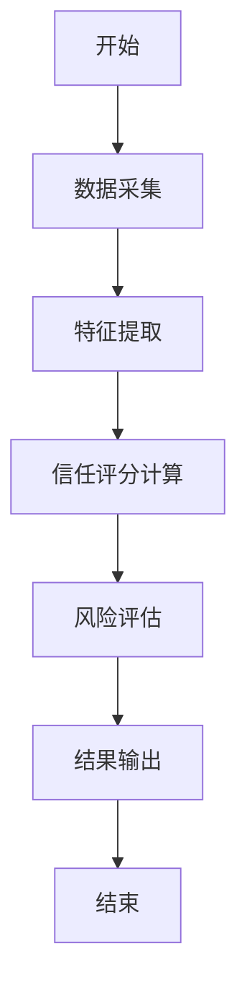
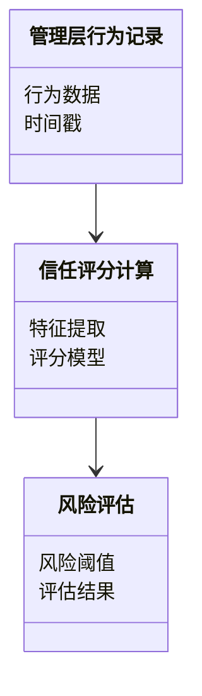
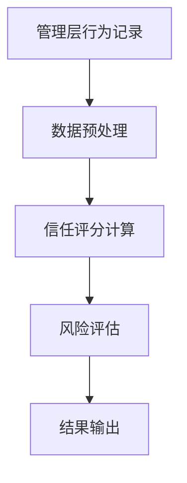

                 


# 智能体协作评估管理层诚信：防范财务欺诈风险

> 关键词：智能体协作，管理层诚信，财务欺诈，风险管理，人工智能

> 摘要：本文探讨了如何利用智能体协作技术来评估管理层诚信，以防范财务欺诈风险。通过分析智能体协作的原理、算法实现和系统架构，结合实际案例，提供了一套完整的解决方案，并提出了最佳实践建议。

---

## 目录大纲

### 第一部分：背景介绍与核心概念

#### 第1章：背景介绍与问题定义

##### 1.1 问题背景
- 1.1.1 财务欺诈的现状与挑战
- 1.1.2 管理层诚信的重要性
- 1.1.3 智能体协作在财务欺诈中的应用潜力

##### 1.2 问题描述
- 1.2.1 财务欺诈的主要形式
- 1.2.2 管理层诚信评估的难点
- 1.2.3 智能体协作在诚信评估中的角色

##### 1.3 问题解决与边界
- 1.3.1 智能体协作的核心目标
- 1.3.2 解决方案的边界与外延
- 1.3.3 概念结构与核心要素

#### 第2章：智能体协作的核心概念与联系

##### 2.1 智能体协作的原理
- 2.1.1 多智能体系统的基本原理
- 2.1.2 智能体协作的机制与特点
- 2.1.3 信任评估模型的构建

##### 2.2 核心概念对比
- 2.2.1 多智能体系统与单智能体系统的对比
- 2.2.2 协作信任与个体信任的差异
- 2.2.3 智能体协作与传统监督方法的对比

##### 2.3 ER实体关系图


### 第二部分：智能体协作评估的算法原理

#### 第3章：智能体协作评估算法

##### 3.1 算法原理
- 3.1.1 基于智能体的信用评估模型
- 3.1.2 协作信任的动态更新机制
- 3.1.3 欺诈风险的预测与评估

##### 3.2 算法流程图


##### 3.3 算法实现代码
```python
def trust_assessment(data):
    # 特征提取
    features = extract_features(data)
    # 信任评分计算
    trust_score = calculate_trust(features)
    # 风险评估
    risk_assessment(trust_score)
    return trust_score, risk_assessment_result
```

##### 3.4 数学模型与公式
- 贝叶斯信任模型：$$ P(\text{欺诈} | \text{行为}) = \frac{P(\text{行为} | \text{欺诈}) \cdot P(\text{欺诈})}{P(\text{行为})} $$
- 博弈论模型：$$ \text{纳什均衡} = \{ (x, y) \mid x \text{ 是最优策略}, y \text{ 是最优反应} \} $$

### 第三部分：系统分析与架构设计

#### 第4章：系统分析与架构设计

##### 4.1 问题场景介绍
- 管理层诚信评估的业务流程
- 数据来源与处理流程
- 系统目标与功能需求

##### 4.2 系统功能设计


##### 4.3 系统架构设计


##### 4.4 系统接口设计
- 数据接口：数据输入与输出接口定义
- 服务接口：API接口文档
- 交互流程：用户与系统交互流程图

### 第四部分：项目实战

#### 第5章：项目实战

##### 5.1 环境安装与配置
- Python版本要求
- 依赖库安装：numpy、pandas、scikit-learn
- 开发环境配置：Jupyter Notebook

##### 5.2 核心代码实现
```python
def extract_features(data):
    # 特征提取函数
    pass

def calculate_trust(features):
    # 信任评分计算函数
    pass

def risk_assessment(trust_score):
    # 风险评估函数
    pass
```

##### 5.3 代码功能解读与分析
- 特征提取的具体实现
- 信任评分的计算方法
- 风险评估的逻辑分析

##### 5.4 实际案例分析
- 案例背景介绍
- 数据处理流程
- 实验结果与分析
- 成果展示与总结

### 第五部分：最佳实践与总结

#### 第6章：最佳实践

##### 6.1 小结
- 项目总结
- 关键点回顾
- 经验与教训

##### 6.2 注意事项
- 数据隐私与安全
- 模型的可解释性
- 系统的可扩展性

##### 6.3 拓展阅读
- 推荐书籍与论文
- 相关技术领域的发展趋势
- 进一步学习资源

---

作者：AI天才研究院/AI Genius Institute & 禅与计算机程序设计艺术 /Zen And The Art of Computer Programming

