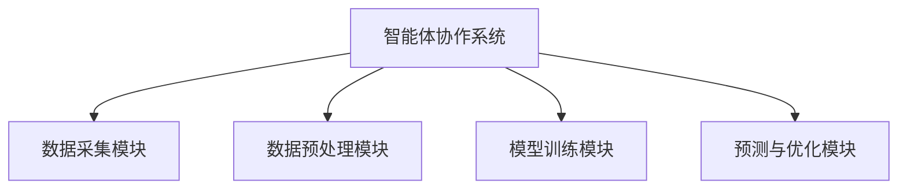
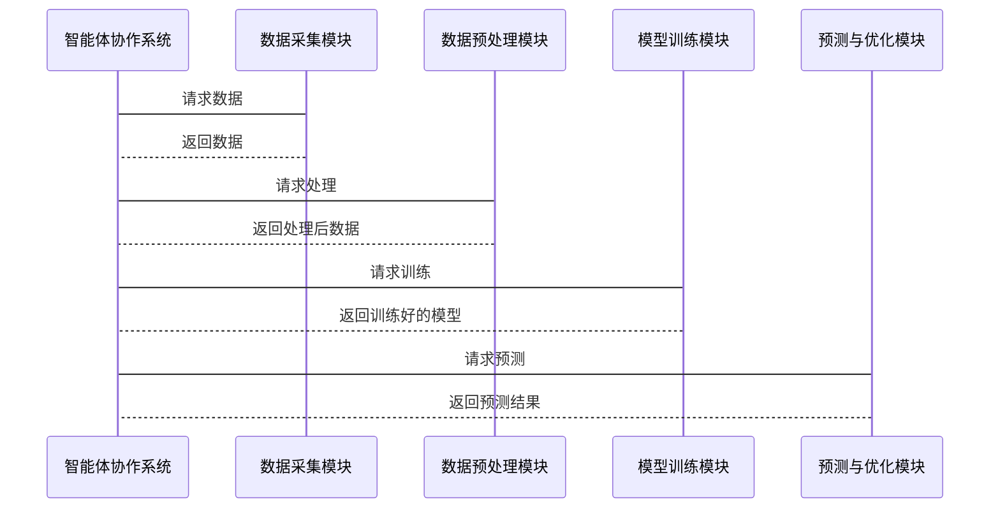

                 


# 智能体协作预测监管环境变化：提前应对政策风险

> 关键词：智能体，协作预测，监管环境，政策风险，算法，系统架构

> 摘要：本文探讨了智能体协作预测监管环境变化的方法，旨在通过智能体的协作机制，提前预测和应对政策风险。文章从智能体的基本概念出发，详细分析了协作预测的算法原理，并结合系统架构设计和项目实战，展示了如何通过智能体协作来优化监管环境预测，最终实现提前应对政策风险的目标。

---

## # 引言

随着全球化和数字化的深入发展，监管环境的变化对企业运营和战略决策提出了更高的要求。政策的变化往往具有不确定性和复杂性，如何提前预测和应对政策风险，成为了企业和组织面临的重要挑战。智能体作为一种能够自主感知、推理和协作的实体，为监管环境预测提供了一种新的解决方案。本文将从智能体协作的基本概念出发，探讨其在监管环境预测中的应用，重点分析智能体协作预测的算法原理和系统架构设计，并结合实际案例，展示如何通过智能体协作优化监管环境预测，提前应对政策风险。

---

## # 智能体协作预测监管环境变化概述

### ## 第1章：智能体协作的基本概念与特点

#### ### 1.1 智能体的定义与特点
智能体（Agent）是指具有感知环境、自主决策、协作互动能力的实体。智能体可以是软件程序、机器人或其他具有智能特性的系统。智能体的核心特点包括：

- **自主性**：智能体能够自主决策，无需外部干预。
- **反应性**：智能体能够实时感知环境变化并做出反应。
- **协作性**：智能体能够与其他智能体或系统进行协作，共同完成任务。
- **学习性**：智能体能够通过经验或数据不断优化自身的行为。

#### ### 1.2 智能体协作的基本原理
智能体协作是指多个智能体通过信息共享和协同决策，共同完成复杂任务的过程。协作的核心在于信息的高效传递和决策的优化。智能体协作的基本原理包括：

1. **信息共享**：智能体之间通过通信模块共享环境数据和决策信息。
2. **任务分配**：根据智能体的能力和环境需求，动态分配任务。
3. **协作决策**：基于共享信息，智能体共同制定最优决策。

#### ### 1.3 监管环境变化的背景与挑战
监管环境的变化往往具有突发性和不确定性，这为企业带来了巨大的政策风险。例如，政策法规的变化可能影响企业的运营模式、市场准入和合规要求。传统的监管环境预测方法通常依赖历史数据分析和专家经验，但难以应对复杂多变的政策环境。智能体协作通过实时感知和动态预测，为监管环境预测提供了新的可能性。

---

## # 智能体协作的核心概念与联系

### ## 第2章：智能体协作的核心概念与联系

#### ### 2.1 智能体协作的核心概念
智能体协作涉及多个核心概念，包括智能体的类型、协作机制和核心要素。以下是智能体协作的核心概念：

- **智能体类型**：
  - **简单反射智能体**：基于当前感知做出反应，不依赖历史信息。
  - **基于模型智能体**：通过内部模型推理环境状态，做出决策。
  - **目标驱动智能体**：根据预设目标优化行为。

- **协作机制**：
  - **信息共享机制**：通过通信模块共享数据和信息。
  - **任务分配机制**：根据智能体的能力分配任务。
  - **决策协调机制**：通过协商达成一致决策。

- **核心要素**：
  - **信息共享**：协作的基础。
  - **任务分配**：协作的关键。
  - **决策协调**：协作的目标。

#### ### 2.2 智能体协作的实体关系图

以下是智能体协作的实体关系图，展示了智能体协作的核心要素及其关系：

```mermaid
erDiagram
    participant 智能体协作系统
    participant 智能体1
    participant 智能体2
    participant 环境
    participant 任务
    智能体协作系统 --> 智能体1: 控制
    智能体协作系统 --> 智能体2: 控制
    智能体协作系统 --> 环境: 感知
    智能体协作系统 --> 任务: 分配
    智能体1 --> 智能体协作系统: 信息共享
    智能体2 --> 智能体协作系统: 信息共享
```

#### ### 2.3 智能体协作的核心要素对比表

以下是智能体协作的核心要素对比表：

| 核心要素 | 描述 |
|----------|------|
| 智能体类型 | 不同类型的智能体具有不同的行为模式和能力 |
| 协作机制 | 包括信息共享、任务分配和决策协调等机制 |
| 核心要素 | 包括信息共享、任务分配和决策协调 |

---

## # 智能体协作预测监管环境变化的算法原理

### ## 第3章：智能体协作预测监管环境变化的算法原理

#### ### 3.1 时间序列分析方法

时间序列分析是一种常用的数据分析方法，适用于监管环境变化的预测。以下是时间序列分析的基本原理和方法：

- **时间序列分析的基本原理**：
  时间序列分析通过分析历史数据，发现数据中的趋势、周期性和随机性，从而预测未来的变化。

- **时间序列预测的数学模型**：
  常用的数学模型包括ARIMA（自回归积分滑动平均模型）和LSTM（长短期记忆网络）。

- **时间序列预测的算法实现**：
  使用Python的`pandas`和`statsmodels`库进行ARIMA模型的实现，或者使用`Keras`库进行LSTM模型的实现。

#### ### 3.2 机器学习模型在监管环境预测中的应用

机器学习模型在监管环境预测中具有重要作用。以下是机器学习模型的基本原理和应用：

- **机器学习模型的基本原理**：
  机器学习模型通过学习历史数据，识别数据中的模式和特征，从而预测未来的变化。

- **监管环境预测的机器学习模型**：
  常用的模型包括随机森林、支持向量机（SVM）和神经网络。

- **智能体协作预测的机器学习算法实现**：
  使用Python的`scikit-learn`库进行随机森林或SVM模型的实现，或者使用`Keras`库进行神经网络模型的实现。

#### ### 3.3 监管环境变化的预测方法

监管环境变化的预测方法需要结合智能体协作和机器学习模型。以下是监管环境变化预测的基本步骤：

1. **数据采集**：通过智能体协作系统采集监管环境相关的数据。
2. **数据预处理**：对数据进行清洗和特征提取。
3. **模型训练**：使用机器学习模型对数据进行训练。
4. **预测与优化**：基于训练好的模型，预测监管环境的变化，并通过智能体协作优化预测结果。

---

## # 系统架构设计

### ## 第4章：智能体协作预测监管环境变化的系统架构设计

#### ### 4.1 系统功能设计

智能体协作预测监管环境变化的系统功能设计包括：

- **数据采集模块**：通过智能体协作系统采集监管环境相关的数据。
- **数据预处理模块**：对数据进行清洗和特征提取。
- **模型训练模块**：使用机器学习模型对数据进行训练。
- **预测与优化模块**：基于训练好的模型，预测监管环境的变化，并通过智能体协作优化预测结果。

#### ### 4.2 系统架构设计

以下是智能体协作预测监管环境变化的系统架构图：



#### ### 4.3 系统接口设计

智能体协作预测监管环境变化的系统接口设计包括：

- **智能体协作系统接口**：用于与其他智能体或系统进行通信。
- **数据采集模块接口**：用于采集监管环境相关的数据。
- **数据预处理模块接口**：用于对数据进行清洗和特征提取。
- **模型训练模块接口**：用于对数据进行训练和预测。

#### ### 4.4 系统交互流程设计

以下是智能体协作预测监管环境变化的系统交互流程图：



---

## # 项目实战

### ## 第5章：智能体协作预测监管环境变化的项目实战

#### ### 5.1 环境安装与配置

要运行智能体协作预测监管环境变化的系统，需要安装以下环境和工具：

- **Python**：推荐使用Python 3.8或更高版本。
- **库依赖**：安装`pandas`、`statsmodels`、`scikit-learn`和`keras`等库。

安装命令：
```bash
pip install pandas statsmodels scikit-learn keras
```

#### ### 5.2 系统核心实现源代码

以下是智能体协作预测监管环境变化的系统核心代码实现：

```python
import pandas as pd
from statsmodels.tsa.arima_model import ARIMA
from sklearn.ensemble import RandomForestRegressor

# 数据采集模块
def collect_data():
    # 从数据库或其他数据源采集数据
    data = pd.read_csv('regulatory_environment.csv')
    return data

# 数据预处理模块
def preprocess_data(data):
    # 数据清洗和特征提取
    data = data.dropna()
    return data

# 模型训练模块
def train_model(data):
    # 使用ARIMA模型进行训练
    model = ARIMA(data, order=(1, 1, 1))
    model_fit = model.fit()
    return model_fit

# 预测与优化模块
def predict_and_optimize(model_fit, data):
    # 使用模型进行预测
    forecast = model_fit.forecast(steps=10)
    return forecast

# 主函数
def main():
    data = collect_data()
    data_processed = preprocess_data(data)
    model_fit = train_model(data_processed)
    forecast = predict_and_optimize(model_fit, data_processed)
    print(forecast)

if __name__ == "__main__":
    main()
```

#### ### 5.3 案例分析与实际应用

以下是智能体协作预测监管环境变化的实际案例分析：

1. **数据采集**：从监管环境数据库中采集政策变化数据。
2. **数据预处理**：对数据进行清洗和特征提取，去除缺失值和异常值。
3. **模型训练**：使用ARIMA模型对数据进行训练，生成预测模型。
4. **预测与优化**：基于训练好的模型，预测未来10步的监管环境变化，并通过智能体协作优化预测结果。

#### ### 5.4 项目小结

通过本项目的实战，我们可以看到智能体协作预测监管环境变化的优势和潜力。智能体协作通过信息共享和动态预测，能够有效应对政策风险，为企业提供有力的支持。

---

## # 最佳实践、小结、注意事项和拓展阅读

### ## 第6章：最佳实践与小结

#### ### 6.1 小结

本文通过智能体协作预测监管环境变化的方法，探讨了智能体协作在政策风险预测中的应用。通过时间序列分析和机器学习模型，结合系统架构设计和项目实战，展示了如何通过智能体协作优化监管环境预测，提前应对政策风险。

#### ### 6.2 注意事项

在实际应用中，需要注意以下几点：

- **数据质量**：数据的准确性和完整性对预测结果至关重要。
- **模型选择**：根据具体场景选择合适的预测模型。
- **系统优化**：通过不断优化系统架构和算法，提高预测的准确性和效率。

#### ### 6.3 拓展阅读

以下是推荐的拓展阅读材料：

- **《时间序列分析与应用》**：深入理解时间序列分析的方法和应用。
- **《机器学习实战》**：学习机器学习模型的实现和应用。
- **《智能体协作与预测》**：进一步了解智能体协作在预测中的应用。

---

## # 作者

作者：AI天才研究院/AI Genius Institute & 禅与计算机程序设计艺术/Zen And The Art of Computer Programming

