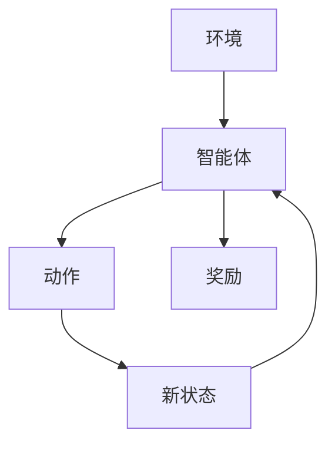
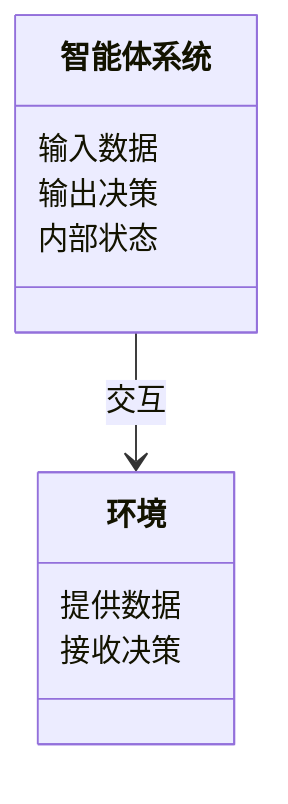
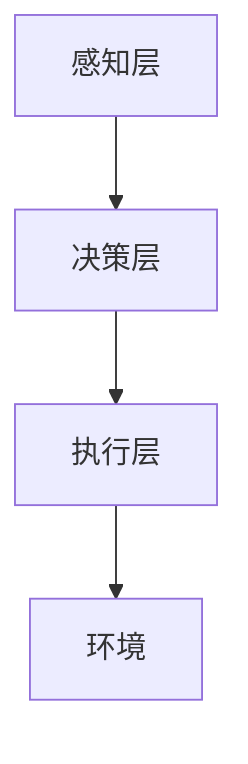
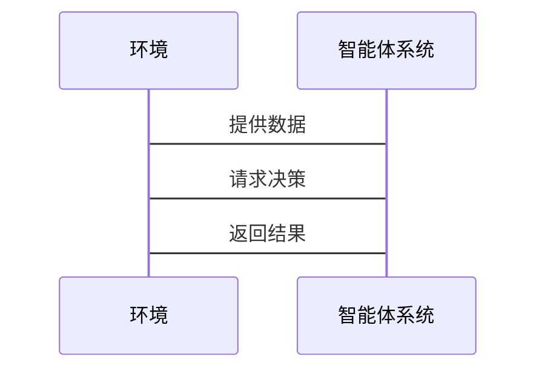

                 


# 智能体系统提升价值投资的另类数据信号提取能力

## 关键词：智能体系统, 价值投资, 另类数据, 信号提取, 机器学习, 自然语言处理, 时间序列分析

## 摘要：  
本文探讨了智能体系统在价值投资中的应用，特别是通过提取另类数据信号来提升投资决策的准确性。文章详细分析了智能体系统的定义、核心原理及其与另类数据的关联，通过算法原理、系统架构设计和实际项目案例，展示了如何利用智能体系统从非传统数据源中提取有价值的投资信号。文章还结合了强化学习和监督学习等算法，以及文本、图像和结构化数据的处理方法，为投资者提供了从数据到决策的全链路解决方案。

---

## 第一部分：智能体系统与价值投资的背景介绍

### 第1章：智能体系统概述

#### 1.1 智能体系统的定义与特点
##### 1.1.1 智能体的定义
智能体（Intelligent Agent）是指能够感知环境、自主决策并采取行动的实体或系统。它通过传感器获取信息，利用推理和学习能力做出决策，并通过执行器与环境交互。智能体系统的核心在于其自主性、反应性和适应性。

##### 1.1.2 智能体的核心特点
- **自主性**：能够独立运行，无需外部干预。
- **反应性**：能够实时感知环境并做出反应。
- **学习能力**：通过数据和经验不断优化决策模型。
- **复杂性**：能够处理多维度、多模态的数据和任务。

##### 1.1.3 智能体与传统数据处理的区别
传统数据处理依赖于固定的规则和模式，而智能体系统能够通过学习和自适应能力，动态调整处理策略，适用于复杂和不确定的环境。

#### 1.2 智能体系统的分类
智能体系统可以根据其功能和应用场景分为以下几类：
- **简单反射型智能体**：基于预定义规则做出反应。
- **基于模型的反射型智能体**：利用内部模型进行推理和决策。
- **目标驱动型智能体**：根据目标函数优化行动。
- **实用驱动型智能体**：通过效用函数进行决策。

---

### 第2章：价值投资的背景与挑战

#### 2.1 价值投资的基本概念
##### 2.1.1 价值投资的定义
价值投资是一种投资策略，旨在通过分析企业的基本面，寻找市场价格低于其内在价值的股票进行投资。

##### 2.1.2 价值投资的核心原则
- **长期视角**：关注企业的长期价值，而非短期市场波动。
- **安全边际**：购买价格低于内在价值，以降低风险。
- **优质企业**：选择具有持续竞争优势的企业。

##### 2.1.3 价值投资的局限性
- **信息不对称**：传统财务数据可能无法全面反映企业的真实价值。
- **市场波动**：短期市场波动可能导致价值投资者面临较大的心理压力。
- **数据依赖性**：传统财务数据的局限性限制了价值投资的有效性。

#### 2.2 价值投资中的另类数据
##### 2.2.1 另类数据的定义与分类
另类数据是指传统金融数据之外的非结构化数据，主要包括：
- **文本数据**：新闻、社交媒体、公司财报等。
- **图像数据**：卫星图像、市场图表等。
- **结构化数据**：政府数据、行业报告等。

##### 2.2.2 另类数据在价值投资中的优势
- **信息丰富性**：另类数据能够提供更多的市场信息，帮助投资者发现潜在机会。
- **及时性**：非结构化数据能够快速反映市场变化，提供及时的投资信号。
- **差异化优势**：通过分析另类数据，投资者能够获得独特的投资视角。

---

## 第三部分：智能体系统的核心概念与联系

### 第4章：智能体系统的核心原理

#### 4.1 智能体系统的组成
##### 4.1.1 感知层
感知层负责从环境中获取信息，包括数据采集和特征提取。

##### 4.1.2 决策层
决策层基于感知层提供的信息，利用算法进行决策，生成行动计划。

##### 4.1.3 执行层
执行层负责将决策转化为具体行动，与环境进行交互。

#### 4.2 智能体系统的算法基础
##### 4.2.1 强化学习
强化学习是一种通过试错机制优化决策的算法，适用于动态和不确定的环境。

##### 4.2.2 监督学习
监督学习通过标签数据进行训练，适用于分类和回归任务。

##### 4.2.3 无监督学习
无监督学习通过发现数据中的模式和结构，适用于聚类和异常检测任务。

---

### 第5章：智能体系统与另类数据的关联

#### 5.1 另类数据在智能体系统中的应用
##### 5.1.1 文本数据处理
通过自然语言处理技术，从新闻、社交媒体等文本数据中提取情感、主题和关键词。

##### 5.1.2 图像数据处理
利用计算机视觉技术，从图像数据中提取特征和模式。

##### 5.1.3 结构化数据处理
通过对政府数据、行业报告等结构化数据的分析，提取潜在的投资信号。

#### 5.2 智能体系统如何利用另类数据提升投资决策
##### 5.2.1 数据融合
通过整合多种数据源，提升决策的全面性和准确性。

##### 5.2.2 实时监控
智能体系统能够实时监控市场变化，快速做出反应。

##### 5.2.3 自适应优化
通过不断学习和优化，智能体系统能够适应市场的动态变化。

---

## 第四部分：算法原理与系统架构设计

### 第6章：算法原理与实现

#### 6.1 强化学习算法原理
##### 6.1.1 Q-learning算法
Q-learning是一种经典的强化学习算法，通过维护Q值表来记录状态-动作对的期望奖励。

##### 6.1.2 DQN算法
深度Q网络（DQN）通过深度神经网络近似Q值函数，适用于高维状态空间。

##### 6.1.3 算法流程图


#### 6.2 监督学习算法原理
##### 6.2.1 线性回归
线性回归是一种简单但有效的回归算法，适用于线性关系的数据。

##### 6.2.2 支持向量机
支持向量机（SVM）是一种强大的分类算法，适用于非线性数据。

#### 6.3 算法实现代码
```python
import numpy as np
from sklearn.svm import SVC
from sklearn.linear_model import LinearRegression

# 示例代码：监督学习算法实现
def supervised_learning(X_train, y_train, X_test):
    # 线性回归
    lr = LinearRegression()
    lr.fit(X_train, y_train)
    y_pred = lr.predict(X_test)
    return y_pred

    # 支持向量机
    svm = SVC()
    svm.fit(X_train, y_train)
    y_pred = svm.predict(X_test)
    return y_pred
```

#### 6.4 数学模型与公式
##### 强化学习中的Q值更新公式
$$ Q(s, a) = Q(s, a) + \alpha [r + \gamma \max Q(s', a') - Q(s, a)] $$

##### 线性回归的损失函数
$$ L = \frac{1}{2n}\sum_{i=1}^{n}(y_i - \hat{y}_i)^2 $$

---

### 第7章：系统分析与架构设计

#### 7.1 系统功能设计
##### 7.1.1 领域模型


#### 7.2 系统架构设计
##### 7.2.1 分层架构


#### 7.3 系统接口设计
##### 7.3.1 输入接口
- 数据输入接口：接收文本、图像和结构化数据。
- 参数配置接口：配置智能体系统的工作参数。

##### 7.3.2 输出接口
- 决策输出接口：输出投资决策。
- 日志输出接口：记录系统运行日志。

#### 7.4 系统交互流程
##### 7.4.1 交互流程图


---

## 第五部分：项目实战与应用

### 第8章：项目实战与应用

#### 8.1 环境安装与配置
##### 8.1.1 安装依赖
- Python 3.8+
- NumPy、Pandas、Scikit-learn
- SpaCy、TensorFlow

##### 8.1.2 配置开发环境
- 安装Jupyter Notebook
- 配置虚拟环境

#### 8.2 系统核心实现
##### 8.2.1 文本数据处理
```python
import spacy

nlp = spacy.load("en_core_web_sm")
doc = nlp("This is a sample text.")
for token in doc:
    print(token.text, token.pos_)
```

##### 8.2.2 图像数据处理
```python
import cv2

image = cv2.imread("image.jpg")
gray = cv2.cvtColor(image, cv2.COLOR_BGR2GRAY)
cv2.imwrite("gray_image.jpg", gray)
```

##### 8.2.3 结构化数据处理
```python
import pandas as pd

df = pd.read_csv("data.csv")
print(df.head())
```

#### 8.3 实际案例分析
##### 8.3.1 案例背景
假设我们有一个股票投资案例，目标是从新闻数据中提取情感信号，辅助价值投资决策。

##### 8.3.2 数据处理与分析
```python
from transformers import pipeline

sentiment_analyzer = pipeline("sentiment-analysis")
result = sentiment_analyzer("The company's revenue increased significantly.")
print(result)
```

##### 8.3.3 投资决策生成
```python
# 示例代码：基于情感分析结果生成投资决策
sentiment = result[0]['label']
if sentiment == 'POSITIVE':
    print("建议买入该股票。")
else:
    print("建议卖出该股票。")
```

#### 8.4 项目小结
通过项目实战，我们展示了如何利用智能体系统从另类数据中提取信号，并生成投资决策。这种方法能够显著提升价值投资的效率和准确性。

---

## 第六部分：总结与展望

### 第9章：总结与展望

#### 9.1 最佳实践 tips
- **数据质量**：确保数据的准确性和完整性。
- **模型优化**：定期更新模型，适应市场变化。
- **风险管理**：制定风险管理策略，降低投资风险。

#### 9.2 小结
智能体系统通过整合另类数据，显著提升了价值投资的信号提取能力。本文从背景、算法、系统架构到项目实战，全面探讨了智能体系统在金融领域的应用。

#### 9.3 注意事项
- **数据隐私**：确保数据处理符合隐私保护法规。
- **系统稳定性**：保证系统的稳定运行，避免因技术问题导致投资损失。

#### 9.4 拓展阅读
- 《Deep Learning》—— Ian Goodfellow
- 《Reinforcement Learning: Theory and Algorithms》—— Richard S. Sutton

---

## 作者：AI天才研究院/AI Genius Institute & 禅与计算机程序设计艺术 /Zen And The Art of Computer Programming

