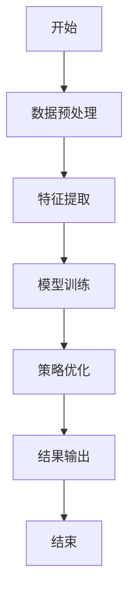

                 


# 智能体系统提升价值投资的另类数据分析能力

> 关键词：智能体系统, 价值投资, 数据分析, 人工智能, 金融投资

> 摘要：智能体系统通过另类数据分析能力，能够显著提升价值投资的效率和准确性。本文将深入探讨智能体系统在价值投资中的应用，从背景介绍、核心概念、算法原理、系统架构到项目实战，逐步分析智能体系统如何通过创新的数据分析方法为价值投资提供新的视角和解决方案。

---

# 第1章 智能体系统与价值投资的背景介绍

## 1.1 智能体系统的定义与核心概念
### 1.1.1 从传统数据分析到智能体系统的演进
传统的数据分析依赖于统计方法和规则-based的分析，而智能体系统则引入了机器学习、自然语言处理和强化学习等技术，能够自主学习、推理和优化。智能体系统的核心在于其具备“智能”属性，能够动态适应数据的变化并做出最优决策。

### 1.1.2 智能体系统的核心要素与属性
智能体系统通常包含以下几个核心要素：
1. **感知能力**：通过传感器或数据接口获取外部信息。
2. **决策能力**：基于感知信息，通过算法做出决策。
3. **执行能力**：根据决策结果执行操作。
4. **学习能力**：通过反馈机制不断优化自身的算法和策略。

### 1.1.3 智能体系统与价值投资的结合点
价值投资的核心在于通过分析企业的基本面、市场趋势和行业动态，找到被低估的投资标的。智能体系统能够通过大数据分析、实时监控和动态调整，帮助投资者更准确地识别投资机会和风险。

## 1.2 价值投资的背景与现状
### 1.2.1 价值投资的基本原理
价值投资是一种基于对公司内在价值的分析，寻找市场价低于内在价值的股票进行投资的策略。其核心在于对企业财务状况、行业地位和管理团队的深入分析。

### 1.2.2 传统价值投资的局限性
传统价值投资依赖于分析师的主观判断和经验，存在以下问题：
1. **信息滞后性**：传统分析依赖于历史数据，难以捕捉实时变化。
2. **主观性**：分析师的判断可能存在偏差，影响投资决策的准确性。
3. **效率低下**：面对海量数据，人工分析效率有限。

### 1.2.3 数据分析在价值投资中的重要性
随着数据量的爆炸式增长，数据分析成为价值投资的重要工具。通过大数据分析，投资者可以更全面地评估企业的财务状况、市场竞争力和行业趋势，从而做出更科学的投资决策。

## 1.3 智能体系统在价值投资中的应用前景
### 1.3.1 智能体系统如何提升投资决策
智能体系统能够通过实时数据监控、动态风险评估和智能决策支持，帮助投资者做出更明智的投资决策。

### 1.3.2 数据分析的另类视角
智能体系统能够从非结构化数据（如新闻、社交媒体）中提取信息，提供独特的数据分析视角，帮助投资者发现潜在的投资机会。

### 1.3.3 智能体系统在金融市场的潜力
智能体系统在金融市场的潜力巨大。通过智能投顾、算法交易和风险管理，智能体系统能够显著提升投资效率和收益。

---

# 第2章 智能体系统的核心概念与联系

## 2.1 智能体系统的核心原理
### 2.1.1 智能体系统的定义与分类
智能体系统可以分为简单反射型智能体和基于模型的智能体。简单反射型智能体基于当前感知做出决策，而基于模型的智能体则依赖于内部模型进行推理和规划。

### 2.1.2 智能体系统与价值投资的结合
通过智能体系统，投资者可以实现对市场的实时监控、动态分析和智能决策，从而提升投资效率和准确性。

### 2.1.3 智能体系统的核心优势
1. **实时性**：能够实时处理和分析数据。
2. **智能化**：具备自主学习和优化能力。
3. **高效性**：能够快速处理海量数据，提供高效的决策支持。

## 2.2 价值投资与智能体系统的概念对比
### 2.2.1 价值投资的核心概念
价值投资注重企业的内在价值，通过分析财务报表、行业地位和管理团队等因素，寻找被低估的投资标的。

### 2.2.2 智能体系统的分析特点
智能体系统通过大数据分析、机器学习和强化学习等技术，能够从结构化和非结构化数据中提取有价值的信息，提供更全面的分析结果。

### 2.2.3 两者结合的可行性与优势
智能体系统的数据处理能力和价值投资的分析方法相结合，能够显著提升投资决策的准确性和效率。

## 2.3 智能体系统的ER实体关系图
以下是智能体系统在价值投资中的ER实体关系图：

```mermaid
er
    actor(投资者)
    system(智能体系统)
    database(数据源)
    relation(投资决策)
    actor --> system: 提供输入
    system --> database: 获取数据
    system --> relation: 生成决策
    actor <-- relation: 获取结果
```

---

# 第3章 智能体系统的算法原理与实现

## 3.1 智能体系统的算法原理
### 3.1.1 强化学习在智能体系统中的应用
强化学习是一种通过试错机制优化决策的算法。在智能体系统中，强化学习用于动态调整投资策略，以最大化投资收益。

### 3.1.2 智能体系统的决策机制
智能体系统的决策机制包括感知、推理和行动三个步骤。感知阶段获取数据，推理阶段分析数据并制定策略，行动阶段执行决策。

### 3.1.3 数据分析算法的优化
通过优化算法（如随机森林、神经网络等），智能体系统能够更准确地预测市场趋势和企业价值。

## 3.2 智能体系统算法的实现流程
以下是智能体系统算法的实现流程图：



## 3.3 智能体系统算法的数学模型
### 3.3.1 强化学习的数学公式
$$ Q(s, a) = Q(s, a) + \alpha \left[r + \max_{a'} Q(s', a') - Q(s, a)\right] $$
其中，$Q(s, a)$ 表示状态 $s$ 下采取动作 $a$ 的价值，$\alpha$ 是学习率，$r$ 是奖励，$s'$ 是下一状态。

### 3.3.2 数据分析的优化公式
$$ \text{最优策略} = \arg\min_{\theta} \sum_{i=1}^{n} (y_i - f(x_i, \theta))^2 $$
其中，$y_i$ 是目标值，$f(x_i, \theta)$ 是模型预测值，$\theta$ 是模型参数。

---

# 第4章 智能体系统的系统分析与架构设计

## 4.1 系统分析
### 4.1.1 问题场景介绍
智能体系统在价值投资中的应用需要解决以下问题：
1. 如何实时获取市场数据？
2. 如何从非结构化数据中提取有价值的信息？
3. 如何优化投资策略以最大化收益？

### 4.1.2 系统功能设计
以下是系统功能设计的领域模型类图：


## 4.2 系统架构设计
### 4.2.1 系统架构图
以下是系统架构设计图：


### 4.2.2 系统接口设计
系统接口设计包括数据接口、用户接口和决策接口。

### 4.2.3 系统交互流程
以下是系统交互流程图：

```mermaid
sequence
    投资者 --> 智能体系统: 提供输入
    智能体系统 --> 数据源: 获取数据
    智能体系统 --> 数据预处理
    数据预处理 --> 特征提取
    特征提取 --> 模型训练
    模型训练 --> 策略优化
    策略优化 --> 投资决策
    投资者 <-- 投资决策: 获取结果
```

---

# 第5章 项目实战：智能体系统在价值投资中的应用

## 5.1 环境安装
### 5.1.1 Python环境的安装与配置
安装Python和必要的库（如TensorFlow、Pandas、NumPy等）。

### 5.1.2 数据源的获取与预处理
从公开数据源（如Yahoo Finance）获取市场数据和公司财报，并进行清洗和标准化。

## 5.2 系统核心实现
### 5.2.1 数据预处理
```python
import pandas as pd
data = pd.read_csv('market_data.csv')
data = data.dropna()
```

### 5.2.2 特征提取
```python
from sklearn.feature_extraction.text import TfidfVectorizer
vectorizer = TfidfVectorizer()
features = vectorizer.fit_transform(text_data)
```

### 5.2.3 模型训练
```python
from tensorflow.keras import Sequential
model = Sequential()
model.add(Dense(64, activation='relu', input_dim=64))
model.add(Dense(1, activation='sigmoid'))
model.compile(optimizer='adam', loss='binary_crossentropy', metrics=['accuracy'])
model.fit(X_train, y_train, epochs=10, batch_size=32)
```

### 5.2.4 策略优化
```python
import numpy as np
def q_learning(s, a):
    q = Q[s][a]
    next_state = transition(s, a)
    q = q + alpha * (r + max(Q[next_state]) - q)
    return q
```

## 5.3 代码应用解读与分析
### 5.3.1 数据预处理代码解读
数据预处理代码用于清洗和标准化数据，确保模型能够正确处理输入。

### 5.3.2 特征提取代码解读
特征提取代码使用TF-IDF方法，从文本数据中提取关键词，用于后续的模型训练。

### 5.3.3 模型训练代码解读
模型训练代码实现了一个简单的神经网络模型，用于分类任务。

## 5.4 实际案例分析
### 5.4.1 案例背景介绍
以某科技公司为例，分析其财务数据和市场新闻，预测其股价走势。

### 5.4.2 智能体系统的应用
通过智能体系统分析，发现该公司的内在价值被市场低估，建议投资者买入。

## 5.5 项目小结
通过本项目，我们展示了智能体系统在价值投资中的应用，验证了其在数据分析和决策支持方面的优势。

---

# 第6章 总结与最佳实践

## 6.1 本章小结
智能体系统通过创新的数据分析方法，显著提升了价值投资的效率和准确性。通过实时数据处理、动态策略优化和智能决策支持，智能体系统为投资者提供了强有力的支持。

## 6.2 最佳实践 tips
1. **数据质量**：确保数据的准确性和完整性。
2. **模型优化**：定期更新和优化模型，以适应市场变化。
3. **风险管理**：智能体系统可以帮助投资者实时监控风险，避免重大损失。

## 6.3 注意事项
- 智能体系统虽然强大，但不能完全替代人类的判断。
- 数据隐私和安全问题需要高度重视。
- 模型的可解释性是实际应用中的一个重要挑战。

## 6.4 拓展阅读
- 《机器学习实战》
- 《深度学习入门：基于Python的CNN、RNN、GAN》
- 《价值投资入门》

---

# 作者：AI天才研究院/AI Genius Institute & 禅与计算机程序设计艺术 /Zen And The Art of Computer Programming

