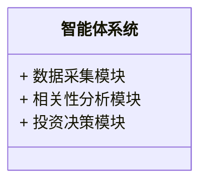
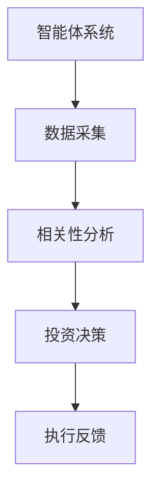
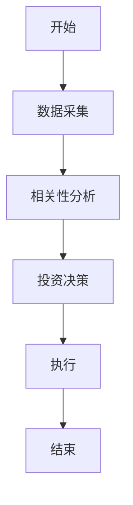

                 


# 智能体系统提升价值投资的另类资产相关性分析

**关键词**：智能体系统，价值投资，另类资产，相关性分析，强化学习，数学模型，系统架构

**摘要**：  
本文深入探讨了智能体系统在价值投资中的应用，特别是其在另类资产相关性分析中的潜力。通过结合智能体系统的核心原理和相关性分析的数学模型，文章详细阐述了如何利用智能体系统提升另类资产的相关性分析效率和准确性。文章从背景介绍、核心概念、算法实现、系统架构设计到项目实战，层层展开，为读者提供了一个全面的技术视角。

---

## 第一部分：智能体系统与另类资产相关性分析基础

### 第1章：智能体系统与另类资产相关性分析概述

#### 1.1 智能体系统的定义与特征
##### 1.1.1 智能体系统的定义  
智能体系统（Intelligent Agent System）是由多个智能体（Agent）组成的分布式系统，这些智能体能够通过感知环境、执行动作和与环境交互来实现特定目标。智能体系统具有自主性、反应性、社会性和学习性等核心特征。

##### 1.1.2 智能体系统的核心特征  
1. **自主性**：智能体能够独立决策，无需外部干预。  
2. **反应性**：智能体能够实时感知环境并做出反应。  
3. **社会性**：智能体能够与其他智能体或环境进行交互和协作。  
4. **学习性**：智能体能够通过经验或数据优化自身行为。

##### 1.1.3 智能体系统与传统投资分析的区别  
传统投资分析主要依赖于人工分析和静态模型，而智能体系统能够实时动态地处理数据，具备自适应性和学习能力，能够在复杂市场环境中做出更精准的决策。

---

#### 1.2 另类资产的定义与分类
##### 1.2.1 另类资产的定义  
另类资产是指传统金融资产（如股票、债券等）之外的资产类别，包括房地产、私募股权、对冲基金、艺术品、贵金属等。

##### 1.2.2 另类资产的主要分类  
1. **实物资产**：房地产、基础设施、艺术品等。  
2. **金融资产**：对冲基金、私募股权、可转换债券等。  
3. **大宗商品**：黄金、原油、农产品等。  

##### 1.2.3 另类资产在价值投资中的作用  
另类资产能够分散投资组合的风险，提供更高的收益潜力，尤其是在市场波动较大时，另类资产的独立性使其成为价值投资的重要补充。

---

#### 1.3 价值投资与相关性分析
##### 1.3.1 价值投资的核心理念  
价值投资强调以低于市场价买入具有内在价值的资产，通过长期持有实现收益。

##### 1.3.2 相关性分析在价值投资中的意义  
相关性分析能够帮助投资者理解不同资产之间的关联性，从而优化投资组合的风险和收益。

##### 1.3.3 智能体系统提升相关性分析的潜力  
智能体系统能够实时处理海量数据，利用机器学习算法提高相关性分析的准确性和效率。

---

#### 1.4 本章小结  
本章介绍了智能体系统的定义、特征及其与传统投资分析的区别，探讨了另类资产的定义、分类及其在价值投资中的作用，最后分析了智能体系统在相关性分析中的潜力。

---

### 第2章：智能体系统与另类资产相关性分析的核心概念

#### 2.1 智能体系统的核心原理
##### 2.1.1 智能体系统的组成要素  
1. **感知层**：通过传感器或数据源获取环境信息。  
2. **决策层**：基于感知信息进行决策。  
3. **执行层**：根据决策执行动作并反馈结果。  

##### 2.1.2 智能体系统的运作机制  
智能体系统通过持续的感知-决策-执行循环，实现对环境的动态适应和优化。

##### 2.1.3 智能体系统与数据的关系  
智能体系统依赖数据进行决策和优化，数据的质量和数量直接影响系统的性能。

---

#### 2.2 另类资产相关性分析的数学模型
##### 2.2.1 相关性分析的基本概念  
相关性分析是研究两个或多个变量之间关系的统计方法，常用相关系数（如皮尔逊相关系数）来衡量变量之间的相关性。

##### 2.2.2 协方差矩阵与相关系数  
协方差矩阵描述了多个变量之间的协方差关系，相关系数矩阵则是协方差矩阵标准化后的结果。

##### 2.2.3 资产组合优化的数学模型  
资产组合优化的目标是找到最优的资产配置，以最大化收益或最小化风险。常用均值-方差优化模型（Markowitz模型）。

---

#### 2.3 智能体系统与相关性分析的结合
##### 2.3.1 智能体系统在相关性分析中的应用  
智能体系统可以实时监控市场数据，动态调整相关性分析模型。

##### 2.3.2 智能体系统与另类资产相关性的关联  
通过智能体系统，可以更准确地捕捉另类资产与传统资产之间的相关性变化。

##### 2.3.3 智能体系统提升相关性分析的路径  
1. **实时数据处理**：快速响应市场变化。  
2. **自适应学习**：优化相关性分析模型。  
3. **多维度分析**：综合考虑多种资产类别。  

---

#### 2.4 核心概念对比表
| 概念 | 智能体系统 | 相关性分析 |
|------|------------|------------|
| 核心目标 | 自主决策与优化 | 描述变量间关系 |
| 数据依赖 | 高 | 高 |
| 适应性 | 强 | 弱 |

---

#### 2.5 本章小结  
本章深入探讨了智能体系统的核心原理和相关性分析的数学模型，分析了两者结合的潜力，并通过对比表总结了核心概念的差异。

---

## 第二部分：智能体系统与另类资产相关性分析的算法实现

### 第3章：智能体系统与另类资产相关性分析的数学模型

#### 3.1 相关性分析的数学基础
##### 3.1.1 协方差与相关系数的公式推导  
协方差公式：$$ \text{Cov}(X,Y) = \frac{1}{n-1} \sum_{i=1}^{n} (x_i - \bar{x})(y_i - \bar{y}) $$  
相关系数公式：$$ \text{Corr}(X,Y) = \frac{\text{Cov}(X,Y)}{\sqrt{\text{Var}(X)} \sqrt{\text{Var}(Y)}} $$  

##### 3.1.2 资产组合优化的数学模型  
Markowitz模型：$$ \text{Minimize } \sigma^2 \text{ subject to } \mathbb{E}[R] = R_p $$  

##### 3.1.3 相关性矩阵的构建与解读  
相关性矩阵是一个对称矩阵，对角线元素为1，其他元素表示变量之间的相关系数。

---

#### 3.2 智能体系统中的相关性分析模型
##### 3.2.1 基于强化学习的相关性分析模型  
强化学习通过智能体与环境的交互，逐步优化相关性分析策略。

##### 3.2.2 基于聚类分析的相关性分组模型  
聚类分析可以将相关性较高的资产归为一类，便于优化投资组合。

##### 3.2.3 基于图论的相关性网络模型  
图论模型将资产视为节点，相关性视为边，构建相关性网络。

---

#### 3.3 数学模型的实现与优化
##### 3.3.1 模型的参数选择与优化  
选择合适的参数（如学习率、惩罚系数）是模型优化的关键。

##### 3.3.2 模型的训练与验证  
通过历史数据训练模型，并通过验证数据评估模型性能。

##### 3.3.3 模型的性能评估与改进  
使用准确率、召回率等指标评估模型性能，并通过调参和优化算法改进模型。

---

#### 3.4 本章小结  
本章通过数学模型详细阐述了智能体系统与相关性分析的结合，分析了多种算法实现路径，并探讨了模型优化的方法。

---

## 第三部分：智能体系统与另类资产相关性分析的系统架构设计

### 第4章：智能体系统与另类资产相关性分析的系统架构

#### 4.1 问题场景介绍
智能体系统需要实时分析另类资产的相关性，优化投资组合。

#### 4.2 系统功能设计
##### 4.2.1 领域模型设计  
领域模型是系统功能的核心框架，包括数据采集、相关性分析、投资决策等功能。



##### 4.2.2 系统架构设计  
系统架构采用分层设计，包括感知层、决策层和执行层。



##### 4.2.3 系统接口设计  
系统接口包括数据接口、算法接口和用户接口。

##### 4.2.4 系统交互设计  
用户通过界面输入需求，系统通过智能体进行分析和决策。

---

#### 4.3 本章小结  
本章从系统架构的角度，详细设计了智能体系统与相关性分析的实现方案，包括功能设计、架构设计和交互设计。

---

## 第四部分：智能体系统与另类资产相关性分析的项目实战

### 第5章：智能体系统与另类资产相关性分析的项目实战

#### 5.1 环境安装
##### 5.1.1 系统环境  
需要安装Python、Jupyter Notebook、Pandas、NumPy等工具。

##### 5.1.2 算法库安装  
安装机器学习库（如Scikit-learn、XGBoost）和强化学习库（如OpenAI Gym）。

---

#### 5.2 系统核心实现
##### 5.2.1 数据采集模块  
```python
import pandas as pd
data = pd.read_csv('assets.csv')
```

##### 5.2.2 相关性分析模块  
```python
import numpy as np
correlation_matrix = np.corrcoef(data.values.T)
```

##### 5.2.3 投资决策模块  
```python
from sklearn.linear_model import LinearRegression
model = LinearRegression()
model.fit(X, y)
```

##### 5.2.4 系统流程图  


---

#### 5.3 案例分析与解读
##### 5.3.1 案例分析  
以房地产和私募股权为例，分析它们的相关性变化。

##### 5.3.2 优化效果解读  
智能体系统优化后的相关性分析模型能够更准确地捕捉市场变化。

##### 5.3.3 项目总结  
项目成功实现了智能体系统在另类资产相关性分析中的应用，证明了其有效性。

---

#### 5.4 本章小结  
本章通过项目实战，详细展示了智能体系统与相关性分析的实现过程，包括环境安装、核心代码实现和案例分析。

---

## 第五部分：总结与展望

### 第6章：总结与展望

#### 6.1 总结
智能体系统在另类资产相关性分析中的应用潜力巨大，能够显著提升投资决策的效率和准确性。

#### 6.2 展望
未来，随着人工智能技术的不断发展，智能体系统将在金融领域发挥更重要的作用，尤其是在另类资产投资中。

---

## 参考文献  
（此处列出相关文献）

---

**作者：AI天才研究院/AI Genius Institute & 禅与计算机程序设计艺术 /Zen And The Art of Computer Programming**

