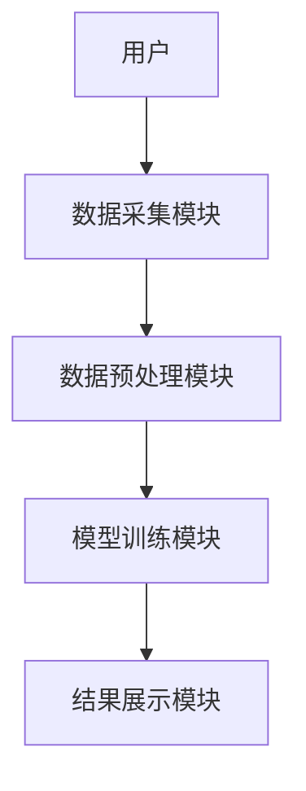
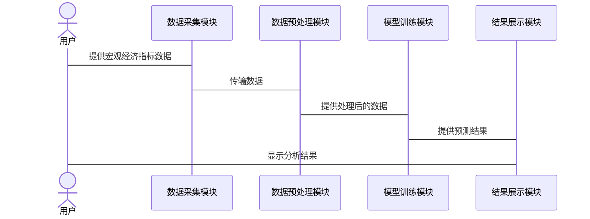

                 


# 智能体系统提升价值投资的宏观经济指标领先性分析

## 关键词：
- 智能体系统
- 宏观经济指标
- 价值投资
- 领先性分析
- 机器学习
- 系统架构设计

## 摘要：
本文探讨了智能体系统在价值投资中的应用，特别是在宏观经济指标的领先性分析方面。通过结合智能体系统的感知、决策和行动能力，本文提出了一种基于机器学习和深度学习的宏观经济指标预测方法，旨在帮助投资者提前识别经济趋势，优化投资决策。文章详细分析了宏观经济指标的领先性定义、分析方法以及智能体系统的核心算法，最后通过实际案例展示了系统的实现与应用。

---

## 第1章: 宏观经济指标与智能体系统的背景介绍

### 1.1 宏观经济指标的定义与重要性
#### 1.1.1 宏观经济指标的定义
宏观经济指标是衡量一个国家或地区经济状况的重要工具，主要包括国内生产总值（GDP）、消费者价格指数（CPI）、失业率、工业生产指数（IP）等。这些指标反映了经济的整体表现和趋势。

#### 1.1.2 宏观经济指标在价值投资中的作用
在价值投资中，宏观经济指标是投资者评估经济环境和企业盈利能力的重要依据。例如，GDP增长可以反映整体经济活力，而CPI则影响企业的成本和利润。

#### 1.1.3 宏观经济指标的分类与特征
宏观经济指标可以分为总量指标（如GDP）、结构指标（如产业构成）和价格指标（如CPI）。这些指标具有时序性、相关性和预测性，为经济分析提供了丰富的数据支持。

### 1.2 智能体系统的定义与特点
#### 1.2.1 智能体系统的定义
智能体系统是一种能够感知环境、做出决策并采取行动的自动化系统。它通过传感器获取数据，利用算法进行分析，并通过执行器实现目标。

#### 1.2.2 智能体系统的体系结构
智能体系统通常包括感知层、决策层和执行层。感知层负责数据采集，决策层进行分析和决策，执行层负责输出结果。

#### 1.2.3 智能体系统与传统经济分析的区别
传统经济分析依赖人工数据处理和模型构建，而智能体系统通过自动化数据处理和机器学习算法，能够更快地捕捉经济趋势。

### 1.3 智能体系统在价值投资中的应用前景
#### 1.3.1 智能体系统在金融领域的潜力
智能体系统可以通过高频交易和实时数据分析，帮助投资者快速响应市场变化。

#### 1.3.2 智能体系统在宏观经济分析中的优势
智能体系统能够处理海量数据，发现传统方法难以察觉的经济关联。

#### 1.3.3 智能体系统在价值投资中的创新点
通过智能体系统，投资者可以实现宏观经济指标的实时监控和预测，从而优化投资组合。

### 1.4 本章小结
本章介绍了宏观经济指标的定义、分类及其在价值投资中的作用，并详细阐述了智能体系统的定义、体系结构及其在宏观经济分析中的优势。

---

## 第2章: 宏观经济指标的领先性分析

### 2.1 宏观经济指标的领先性定义
#### 2.1.1 领先性分析的定义
领先性分析是指通过某一指标的变化预测其他指标的变化趋势。例如，工业生产指数可能领先于GDP的增长。

#### 2.1.2 领先性分析的分类
领先性分析可以分为绝对领先和相对领先。绝对领先是指某一指标的变化直接引发另一指标的变化，而相对领先则是指某一指标的变化与其他指标的变化存在一定的时差。

#### 2.1.3 领先性分析的重要性
通过领先性分析，投资者可以提前预判经济趋势，优化投资策略。

### 2.2 宏观经济指标的领先性分析方法
#### 2.2.1 时间序列分析法
时间序列分析法通过历史数据预测未来趋势，常用的方法包括ARIMA和GARCH模型。

#### 2.2.2 回归分析法
回归分析法通过建立变量之间的关系模型，预测目标变量的变化。

#### 2.2.3 聚类分析法
聚类分析法通过将相似的经济指标分组，识别潜在的经济关联。

### 2.3 宏观经济指标的领先性分析案例
#### 2.3.1 案例一：GDP与就业率的领先性分析
通过分析历史数据，发现就业率的变化可以预测GDP的增长趋势。

#### 2.3.2 案例二：CPI与利率的领先性分析
CPI的变化可以预测利率的调整方向。

### 2.4 本章小结
本章详细介绍了宏观经济指标的领先性定义、分析方法及其在实际中的应用案例。

---

## 第3章: 智能体系统的基本原理

### 3.1 智能体系统的体系结构
#### 3.1.1 智能体的组成要素
智能体系统主要包括感知层、决策层和执行层。

#### 3.1.2 智能体的感知与决策机制
感知层通过传感器获取数据，决策层利用算法进行分析，最终生成决策指令。

#### 3.1.3 智能体的行动与反馈机制
智能体通过执行层采取行动，并根据反馈调整决策。

### 3.2 智能体系统的算法原理
#### 3.2.1 机器学习算法在智能体系统中的应用
常用的机器学习算法包括支持向量机（SVM）和随机森林（Random Forest）。

#### 3.2.2 深度学习算法在智能体系统中的应用
深度学习算法如神经网络（ANN）和长短期记忆网络（LSTM）在智能体系统中也有广泛应用。

#### 3.2.3 强化学习算法在智能体系统中的应用
强化学习通过奖励机制优化智能体的决策过程。

### 3.3 智能体系统的优缺点
#### 3.3.1 智能体系统的优点
智能体系统具有高效性、准确性和实时性。

#### 3.3.2 智能体系统的缺点
智能体系统的复杂性和维护成本较高。

#### 3.3.3 智能体系统的改进方向
通过优化算法和增加数据多样性，可以进一步提升智能体系统的性能。

### 3.4 本章小结
本章详细介绍了智能体系统的体系结构、算法原理及其优缺点。

---

## 第4章: 宏观经济指标的领先性分析与智能体系统的关系

### 4.1 宏观经济指标的领先性分析对智能体系统的影响
#### 4.1.1 领先性分析如何影响智能体系统的决策
领先性分析可以帮助智能体系统更准确地预测经济趋势。

#### 4.1.2 领先性分析如何优化智能体系统的预测能力
通过领先性分析，智能体系统可以更快地捕捉经济变化。

#### 4.1.3 领先性分析如何提升智能体系统的鲁棒性
领先性分析可以减少智能体系统的预测误差。

### 4.2 智能体系统对宏观经济指标的领先性分析的推动作用
#### 4.2.1 智能体系统如何提升领先性分析的效率
智能体系统可以通过自动化数据处理提高分析效率。

#### 4.2.2 智能体系统如何优化领先性分析的准确性
通过机器学习算法，智能体系统可以提升分析的准确性。

#### 4.2.3 智能体系统如何扩展领先性分析的应用场景
智能体系统可以应用于更多复杂的经济指标分析。

### 4.3 本章小结
本章分析了宏观经济指标的领先性分析对智能体系统的影响，以及智能体系统对领先性分析的推动作用。

---

## 第5章: 智能体系统在宏观经济指标领先性分析中的实现

### 5.1 系统功能设计
#### 5.1.1 数据采集模块
数据采集模块负责收集宏观经济指标数据。

#### 5.1.2 数据预处理模块
数据预处理模块对数据进行清洗和标准化处理。

#### 5.1.3 模型训练模块
模型训练模块利用机器学习算法建立预测模型。

#### 5.1.4 结果展示模块
结果展示模块将分析结果以可视化形式呈现。

### 5.2 系统架构设计
#### 5.2.1 系统架构图


#### 5.2.2 系统接口设计
系统接口包括数据输入接口和结果输出接口。

#### 5.2.3 系统交互流程


### 5.3 本章小结
本章详细描述了智能体系统在宏观经济指标领先性分析中的实现过程，包括系统功能设计和架构设计。

---

## 第6章: 智能体系统的项目实战

### 6.1 项目环境配置
#### 6.1.1 系统环境
建议使用Python 3.8及以上版本，安装必要的库如NumPy、Pandas、Scikit-learn和TensorFlow。

### 6.2 系统核心实现
#### 6.2.1 数据采集与预处理
```python
import pandas as pd
import numpy as np

# 数据采集
data = pd.read_csv('macroeconomic.csv')

# 数据预处理
data = data.dropna()
data = (data - data.mean()) / data.std()
```

#### 6.2.2 模型训练与预测
```python
from sklearn.ensemble import RandomForestRegressor

# 训练模型
model = RandomForestRegressor(n_estimators=100)
model.fit(X_train, y_train)

# 预测结果
y_pred = model.predict(X_test)
```

#### 6.2.3 结果展示
```python
import matplotlib.pyplot as plt

plt.plot(y_true, label='实际值')
plt.plot(y_pred, label='预测值')
plt.legend()
plt.show()
```

### 6.3 本章小结
本章通过具体的代码实现，展示了智能体系统在宏观经济指标领先性分析中的应用。

---

## 第7章: 最佳实践与总结

### 7.1 最佳实践 tips
- 数据预处理是关键，需注意数据的完整性和准确性。
- 选择合适的算法可以提高预测的准确性。
- 结果展示需清晰直观，便于用户理解和决策。

### 7.2 小结
本文通过智能体系统的视角，详细探讨了宏观经济指标的领先性分析，并展示了智能体系统在价值投资中的应用潜力。

### 7.3 注意事项
- 数据隐私和安全需严格保护。
- 模型的可解释性需重点关注。

### 7.4 拓展阅读
建议进一步研究强化学习在宏观经济分析中的应用。

---

## 作者：AI天才研究院/AI Genius Institute & 禅与计算机程序设计艺术 /Zen And The Art of Computer Programming

---

以上是《智能体系统提升价值投资的宏观经济指标领先性分析》的文章大纲和部分内容。

