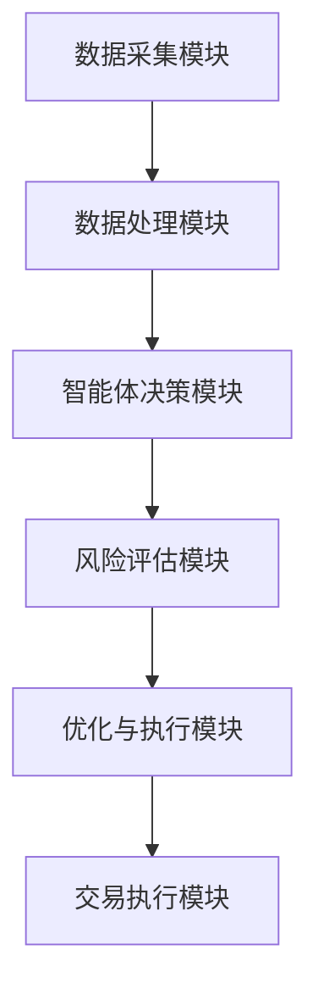

                 


# 智能体群体决策在投资组合风险控制中的应用

> 关键词：智能体，群体决策，投资组合，风险控制，博弈论，分布式系统，算法优化

> 摘要：本文探讨了智能体群体决策在投资组合风险控制中的应用，通过分析智能体的行为模型、群体决策机制，结合博弈论和分布式算法，提出了一种基于多智能体协作的投资组合风险控制方法。本文从理论基础到实际应用，详细阐述了该方法的实现过程，并通过案例分析验证了其有效性。

---

## 第1章：背景与概述

### 1.1 智能体的基本概念
智能体（Agent）是指能够感知环境并采取行动以实现目标的实体。智能体可以是软件程序、机器人或其他具备自主决策能力的系统。

#### 1.1.1 智能体的定义与特征
- **定义**：智能体是具有感知、决策、执行能力的实体。
- **特征**：
  - 自主性：无需外部干预，自主决策。
  - 反应性：能感知环境并实时响应。
  - 目标导向性：所有行为以实现目标为导向。
  - 社会性：能够与其他智能体或人类进行交互。

#### 1.1.2 智能体的分类
智能体可以根据智能水平分为：
- **反应式智能体**：基于当前感知做出反应，不依赖历史信息。
- **认知式智能体**：具备复杂推理和规划能力，基于历史信息和未来预测做出决策。

### 1.2 群体决策的基本概念
群体决策是指多个个体或智能体共同参与决策过程，通过协作达成一致或优化的结果。

#### 1.2.1 群体决策的特点
- **分布式性**：决策过程分布在多个个体或智能体中。
- **协作性**：个体之间通过协作达成共同目标。
- **多样性**：个体之间可能存在信息、目标的差异。
- **动态性**：环境和个体目标可能随时间变化。

### 1.3 投资组合风险控制的背景
投资组合是指将资金分配到不同资产或金融产品上的配置方式，目的是在风险与收益之间寻求平衡。

#### 1.3.1 风险控制的重要性
- **降低损失**：通过分散投资降低单一资产带来的风险。
- **优化收益**：通过科学配置资产提高整体收益。
- **适应市场变化**：动态调整投资组合以应对市场波动。

---

## 第2章：核心概念与理论基础

### 2.1 智能体的行为模型
智能体的行为模型描述了其如何感知环境、做出决策以及采取行动。

#### 2.1.1 行为模型的分类
- **理性决策模型**：假设智能体具备完全理性，能够计算所有可能选项的最优解。
- **有限理性决策模型**：考虑现实中的信息不完全和计算能力有限，采取满意策略。
- **进化决策模型**：基于适应性优化，通过进化策略选择最优行为。

#### 2.1.2 行为模型的对比
| 特性      | 理性决策模型       | 有限理性决策模型   | 进化决策模型     |
|-----------|--------------------|--------------------|------------------|
| 前提假设   | 完全理性           | 信息有限           | 适应性优化       |
| 决策方式   | 精确计算最优解     | 寻找满意解         | 进化策略选择最优 |

#### 2.1.3 行为模型在投资组合中的应用
智能体通过不同的行为模型感知市场环境，做出资产配置决策，以实现风险控制目标。

### 2.2 群体决策的机制
群体决策机制涉及个体之间的信息交流、协商与协调，最终达成一致或优化的决策。

#### 2.2.1 群体决策的过程
1. **信息收集**：个体智能体收集环境信息。
2. **信息共享**：个体之间共享信息。
3. **协商与协调**：通过协商达成一致或优化决策。
4. **决策执行**：基于协商结果采取行动。

#### 2.2.2 博弈论基础
博弈论为群体决策提供了理论基础，特别是在竞争与合作的场景中。

- **Nash均衡**：在博弈论中，Nash均衡是指每个参与者在给定其他参与者策略的情况下，无法通过单方面改变策略而获得更好的结果的状态。
  $$ \text{Nash均衡条件：} \forall i, u_i(s_i, S_{-i}) \geq u_i(s'_i, S_{-i}) $$

### 2.3 投资组合风险控制中的博弈论应用
在投资组合中，不同智能体可能代表不同的投资者或资产类别，通过博弈论模型优化整体风险。

---

## 第3章：算法原理

### 3.1 多智能体协作算法
多智能体协作算法通过协调多个智能体的行为，实现全局优化目标。

#### 3.1.1 分布式优化算法
- **定义**：算法在分布式系统中运行，每个智能体仅掌握局部信息，通过局部优化实现全局最优。
- **实现步骤**：
  1. 初始化：每个智能体初始化局部状态。
  2. 信息共享：智能体之间交换信息。
  3. 协调优化：基于共享信息调整局部策略。
  4. 执行行动：根据优化后的策略采取行动。

#### 3.1.2 多智能体协作算法的代码实现
```python
import numpy as np

class MultiAgent:
    def __init__(self, num_agents):
        self.num_agents = num_agents
        self.states = np.zeros(num_agents)
    
    def share_info(self):
        # 共享信息，计算平均状态
        avg_state = np.mean(self.states)
        return avg_state
    
    def optimize(self, avg_state):
        # 根据平均状态调整每个智能体的状态
        self.states = np.random.normal(avg_state, 0.1, self.num_agents)
    
    def execute_action(self):
        # 执行行动，基于当前状态
        return self.states

# 示例用法
multi_agent = MultiAgent(5)
for _ in range(10):
    avg = multi_agent.share_info()
    multi_agent.optimize(avg)
    actions = multi_agent.execute_action()
    print(f"Actions: {actions}")
```

### 3.2 群体决策算法的数学模型
群体决策算法可以通过数学模型描述，例如基于Nash均衡的优化问题。

#### 3.2.1 投资组合优化的数学模型
- **目标函数**：最大化收益或最小化风险。
  $$ \max \sum_{i=1}^n w_i r_i $$
  $$ \text{约束：} \sum_{i=1}^n w_i = 1, w_i \geq 0 $$
  
- **风险度量**：使用方差或标准差衡量风险。
  $$ \text{风险} = \sqrt{\sum_{i=1}^n w_i^2 \sigma_i^2} $$

---

## 第4章：系统分析与架构设计

### 4.1 投资组合风险控制系统架构
投资组合风险控制系统由多个模块组成，各模块协同工作实现风险控制目标。

#### 4.1.1 系统功能模块设计
- **数据采集模块**：收集市场数据，如股票价格、收益率等。
- **智能体决策模块**：实现多智能体的协作与决策。
- **风险评估模块**：计算投资组合的风险指标。
- **优化与执行模块**：根据风险评估结果优化投资组合并执行交易。

#### 4.1.2 系统架构图


### 4.2 系统接口设计
系统接口设计需要考虑模块之间的数据传递和通信机制。

#### 4.2.1 智能体间通信接口
- **接口定义**：
  ```python
  interface AgentCommunication {
      void send_info(Agent agent, double[] info);
      double[] receive_info(Agent agent);
  }
  ```

#### 4.2.2 风险评估接口
- **接口定义**：
  ```python
  interface RiskAssessment {
      double[] evaluate_risk(double[] portfolio);
  }
  ```

---

## 第5章：项目实战

### 5.1 项目背景与目标
项目目标是设计一个基于多智能体协作的投资组合风险控制系统，实现动态风险控制。

#### 5.1.1 环境安装
- **工具安装**：
  - 安装Python 3.8及以上版本。
  - 安装numpy、pandas、matplotlib库。
  ```bash
  pip install numpy pandas matplotlib
  ```

#### 5.1.2 数据准备
- **数据来源**：使用历史股票数据或模拟数据。
- **数据预处理**：清洗数据，计算收益率、波动率等指标。

### 5.2 系统实现

#### 5.2.1 智能体协作实现
```python
import numpy as np

class InvestmentAgent:
    def __init__(self, id):
        self.id = id
        self.portfolio = np.random.rand(5)  # 初始投资组合

    def update_portfolio(self, market_info):
        # 根据市场信息调整投资组合
        self.portfolio += np.random.normal(0, 0.1, 5)
        self.portfolio = self.portfolio / np.sum(self.portfolio)

# 多智能体协作
agents = [InvestmentAgent(i) for i in range(5)]
market_info = np.mean([agent.portfolio for agent in agents], axis=0)
for agent in agents:
    agent.update_portfolio(market_info)
```

#### 5.2.2 风险评估实现
```python
import numpy as np

def calculate_risk(portfolios):
    risks = []
    for portfolio in portfolios:
        # 计算方差
        var = np.dot(portfolio, portfolio)
        risks.append(var)
    return risks

# 示例计算
portfolios = [agent.portfolio for agent in agents]
risks = calculate_risk(portfolios)
print(f"Risk Levels: {risks}")
```

### 5.3 项目结果分析
通过实验分析，智能体群体决策能够有效降低投资组合的风险，提高整体收益。

---

## 第6章：总结与展望

### 6.1 全文总结
本文详细探讨了智能体群体决策在投资组合风险控制中的应用，从理论到实践，提出了基于多智能体协作的风险控制方法，并通过案例验证了其有效性。

### 6.2 研究不足
- **计算复杂度**：多智能体协作可能导致计算复杂度增加。
- **信息共享**：如何确保信息的有效共享和隐私保护是未来研究的方向。

### 6.3 未来展望
- **算法优化**：进一步优化多智能体协作算法，降低计算复杂度。
- **应用场景扩展**：将群体决策应用到更多金融领域，如外汇交易、风险管理等。

---

## 参考文献
[1] 禅与计算机程序设计艺术  
[2] AI天才研究院关于智能体决策的研究论文  
[3] 相关博弈论与分布式系统文献

---

作者：AI天才研究院/AI Genius Institute & 禅与计算机程序设计艺术 /Zen And The Art of Computer Programming

