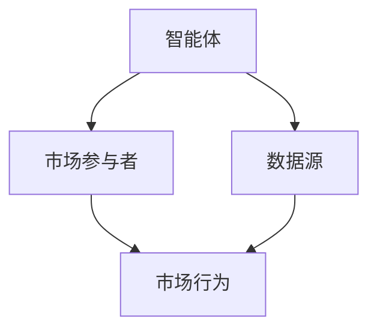
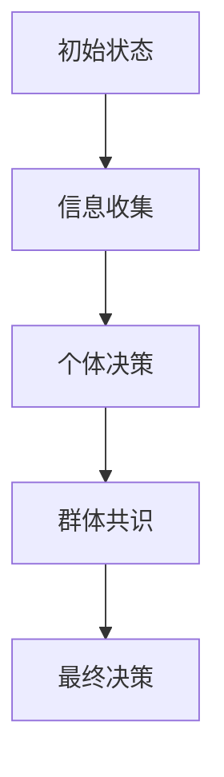
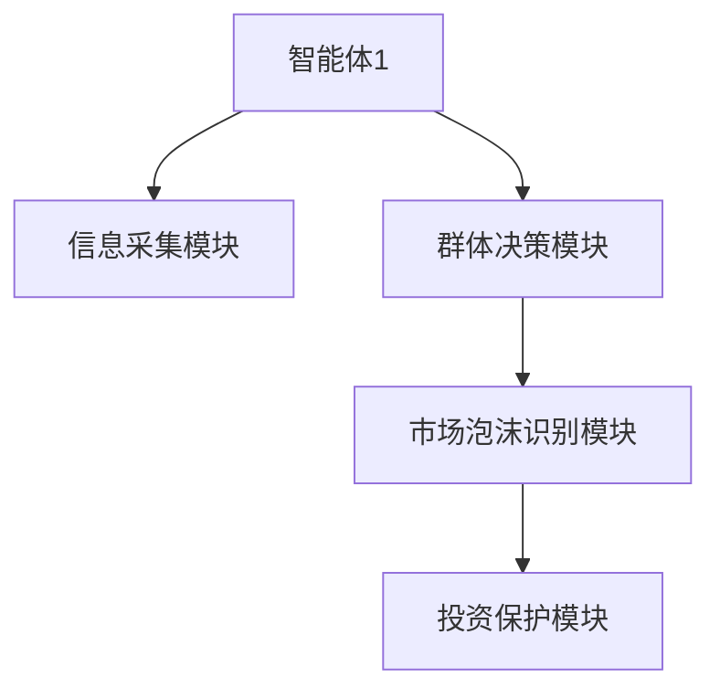
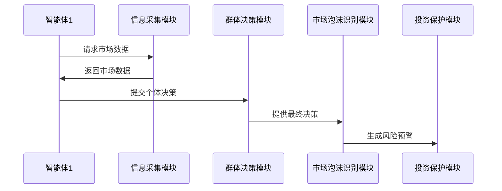

                 


# 智能体群体决策在识别市场泡沫中的应用：保护投资价值

## 关键词：
智能体群体决策、市场泡沫识别、投资保护、算法实现、系统架构、群体共识机制

## 摘要：
本文探讨了智能体群体决策在识别市场泡沫中的应用，通过分析智能体群体决策的核心原理、算法实现、系统架构设计以及实际案例，展示了如何利用智能体群体决策机制保护投资价值。文章详细讲解了智能体群体决策的概念、算法模型、系统设计，并通过Python代码实现和实际案例分析，帮助读者深入理解智能体群体决策在市场泡沫识别中的应用及其优势。

---

## 第1章：智能体群体决策概述

### 1.1 智能体群体决策的定义与特点
- **智能体的基本概念**：智能体是指能够感知环境、自主决策并采取行动的实体。在市场环境中，智能体可以是算法、软件系统或分布式节点。
- **群体决策的核心特征**：群体决策是指多个智能体通过协作和信息共享，共同达成一个决策的过程。其特点包括分布式性、协作性、动态性和鲁棒性。
- **智能体群体决策的优势与挑战**：
  - **优势**：能够充分利用多智能体的信息和计算能力，避免单点决策的局限性；通过群体智慧提高决策的准确性和可靠性。
  - **挑战**：信息同步的难度、计算复杂度高、可能出现意见分歧。

### 1.2 市场泡沫的定义与识别
- **市场泡沫的定义**：市场泡沫是指资产价格远高于其实际价值的现象，通常由过度投机和非理性行为引起。
- **市场泡沫的形成机制**：市场参与者基于情绪和预期而非基本面进行交易，导致价格偏离实际价值。
- **市场泡沫识别的难点与意义**：
  - **难点**：泡沫的形成是一个动态复杂的过程，涉及多方因素，难以通过单一指标准确识别。
  - **意义**：及时识别泡沫有助于投资者避免重大损失，维护市场健康运行。

### 1.3 智能体群体决策在市场泡沫识别中的应用
- **应用场景**：
  - **实时监控**：通过智能体实时收集和分析市场数据，快速识别潜在泡沫。
  - **分布式决策**：多个智能体协同工作，提高决策的准确性和鲁棒性。
  - **风险预警**：通过群体决策机制，提前预警市场风险，保护投资价值。
- **智能体群体决策与市场泡沫识别的结合**：
  - 利用智能体的分布式计算能力，分析海量市场数据。
  - 通过群体决策机制，整合多智能体的分析结果，提高识别精度。
- **智能体群体决策在投资保护中的作用**：
  - 通过群体决策机制，优化投资策略，降低投资风险。
  - 实时监控市场动态，及时调整投资组合，避免重大损失。

---

## 第2章：智能体群体决策的核心概念与联系

### 2.1 智能体群体决策的核心原理
- **智能体的自主性与协作性**：
  - 智能体具有自主决策能力，能够独立分析信息并做出决策。
  - 智能体之间通过协作和信息共享，共同完成复杂任务。
- **群体决策的共识机制**：
  - 基于投票、加权平均等方法，达成群体共识。
  - 通过共识机制，确保群体决策的准确性和一致性。
- **智能体的信息交互与决策过程**：
  - 智能体通过信息交互，获取市场数据和决策建议。
  - 基于信息交互结果，进行个体决策，最终形成群体决策。

### 2.2 智能体与市场参与者的实体关系图


### 2.3 智能体群体决策的算法原理


---

## 第3章：智能体群体决策的算法实现

### 3.1 群体决策算法的数学模型
- **群体决策公式**：
  $$\text{最终决策} = \frac{\sum_{i=1}^{n} w_i \cdot v_i}{\sum_{i=1}^{n} w_i}$$
  - 其中，\(v_i\) 表示第 \(i\) 个智能体的决策，\(w_i\) 表示权重。
- **基于投票的群体决策公式**：
  $$\text{最终决策} = \arg\max_{j} \sum_{i=1}^{n} v_i[j]$$
- **基于加权的群体决策公式**：
  $$\text{最终决策} = \sum_{i=1}^{n} w_i \cdot v_i$$

### 3.2 算法实现的Python代码示例
```python
def group_decision(votes, weights):
    total_weight = sum(weights)
    weighted_sum = sum(v * w for v, w in zip(votes, weights))
    return weighted_sum / total_weight
```

### 3.3 算法原理的数学公式
- **群体决策模型**：
  - 输入：多个智能体的决策 \(v_1, v_2, \ldots, v_n\)
  - 输出：最终决策 \(d\)
  - 计算过程：
    $$d = \frac{\sum_{i=1}^{n} w_i \cdot v_i}{\sum_{i=1}^{n} w_i}$$

---

## 第4章：系统分析与架构设计

### 4.1 系统功能设计
- **智能体信息采集模块**：负责收集市场数据，包括价格、交易量等。
- **群体决策计算模块**：对多个智能体的决策进行整合，形成最终决策。
- **市场泡沫识别模块**：根据决策结果，判断是否存在市场泡沫。

### 4.2 系统架构设计


### 4.3 系统接口设计
- **智能体与信息采集模块接口**：智能体向信息采集模块发送市场数据请求。
- **群体决策模块与市场泡沫识别模块接口**：群体决策模块将最终决策传递给市场泡沫识别模块。

### 4.4 系统交互序列图


---

## 第5章：项目实战

### 5.1 环境安装与配置
- **Python环境**：安装Python 3.8及以上版本。
- **依赖库安装**：使用pip安装numpy、pandas、mermaid等库。

### 5.2 核心代码实现
```python
import numpy as np
import pandas as pd

def group_decision(votes, weights):
    total_weight = sum(weights)
    weighted_sum = sum(v * w for v, w in zip(votes, weights))
    return weighted_sum / total_weight

# 示例数据
votes = [0.8, 0.7, 0.9, 0.6]
weights = [1, 2, 1, 3]

# 计算最终决策
result = group_decision(votes, weights)
print("最终决策结果:", result)
```

### 5.3 代码解读与分析
- **代码功能**：实现基于权重的群体决策算法，计算多个智能体的决策结果。
- **数学模型**：通过加权平均的方式，整合多个智能体的决策，形成最终决策。
- **实际应用**：在市场数据中，智能体分别对市场泡沫进行判断，通过群体决策算法整合判断结果，生成最终的市场泡沫识别结果。

### 5.4 实际案例分析
- **案例背景**：假设某市场出现价格异常波动，多个智能体分别对市场泡沫进行判断。
- **数据输入**：智能体1判断有泡沫的概率为0.8，权重为1；智能体2判断有泡沫的概率为0.7，权重为2；智能体3判断有泡沫的概率为0.9，权重为1；智能体4判断有泡沫的概率为0.6，权重为3。
- **计算过程**：
  $$\text{最终决策} = \frac{0.8 \times 1 + 0.7 \times 2 + 0.9 \times 1 + 0.6 \times 3}{1 + 2 + 1 + 3} = \frac{0.8 + 1.4 + 0.9 + 1.8}{7} = \frac{5.9}{7} \approx 0.8429$$
- **结果解读**：最终决策结果为0.8429，表示市场存在较高概率的泡沫。

### 5.5 项目小结
- **项目总结**：通过智能体群体决策算法，能够有效整合多个智能体的判断结果，提高市场泡沫识别的准确性和可靠性。
- **实际意义**：为投资者提供实时的市场风险预警，帮助投资者做出更加明智的投资决策，保护投资价值。

---

## 第6章：最佳实践与注意事项

### 6.1 最佳实践
- **数据质量**：确保数据来源可靠，数据清洗和预处理是关键。
- **算法优化**：根据实际需求，不断优化群体决策算法，提高决策效率和准确率。
- **系统维护**：定期更新系统数据和算法模型，确保系统的稳定性和可靠性。

### 6.2 小结
- 智能体群体决策是一种有效的市场泡沫识别方法，通过多个智能体的协作和信息共享，能够提高决策的准确性和鲁棒性。
- 在实际应用中，需要结合具体场景和需求，优化算法和系统设计，确保系统的高效运行和准确判断。

### 6.3 注意事项
- **数据隐私**：确保数据的安全性和隐私性，避免数据泄露风险。
- **计算资源**：群体决策算法对计算资源要求较高，需要确保系统的计算能力和存储能力。
- **算法适应性**：根据市场环境的变化，及时调整算法参数和模型，确保系统的适应性。

### 6.4 拓展阅读
- 《Multi-Agent Systems: Complexity Decomposition and Its Applications》
- 《Distributed Computing and Social Networking》
- 《Financial Market Analysis Using Machine Learning》

---

## 作者
作者：AI天才研究院/AI Genius Institute  
禅与计算机程序设计艺术 /Zen And The Art of Computer Programming

