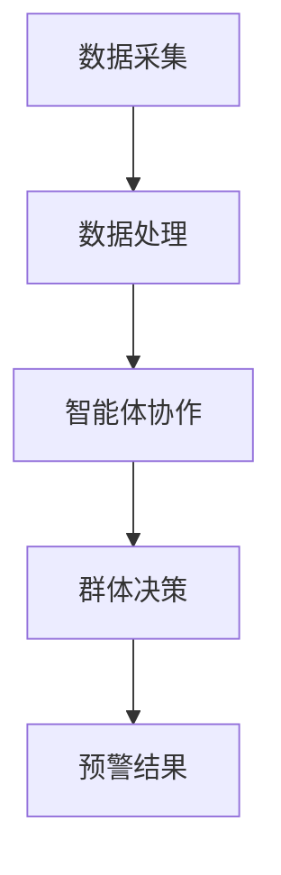

                 


# 智能体群体决策在识别系统性风险中的应用：提前预警

## 关键词：智能体群体决策、系统性风险识别、群体智能、风险预警、决策模型、系统性风险

## 摘要：  
智能体群体决策是一种基于多智能体协作的决策方法，通过个体智能体的交互与协作，形成群体决策结果。本文将探讨智能体群体决策在识别系统性风险中的应用，分析其核心原理、算法模型以及系统架构，结合实际案例，展示如何利用智能体群体决策提前预警系统性风险。通过本文的分析，读者将深入了解智能体群体决策在系统性风险识别中的独特优势和实际应用价值。

---

## 第一章: 智能体群体决策的背景与概念

### 1.1 系统性风险的基本概念  
#### 1.1.1 系统性风险的定义与特征  
系统性风险是指在整个系统或系统中的多个组成部分之间相互作用所引发的、可能影响整个系统稳定性的风险。其主要特征包括：  
1. **广泛性**：影响范围广，可能波及整个系统或多个子系统。  
2. **复杂性**：风险的形成和传播机制复杂，涉及多个因素的交互作用。  
3. **不可预测性**：由于系统复杂性，系统性风险往往难以提前预测。  

#### 1.1.2 系统性风险的来源与影响  
系统性风险的来源可以是内部因素（如系统设计缺陷）或外部因素（如外部冲击）。其影响通常表现为：  
1. 系统稳定性下降。  
2. 系统功能受损或失效。  
3. 系统恢复成本增加。  

#### 1.1.3 系统性风险识别的挑战  
系统性风险识别的难点在于：  
1. 风险的隐蔽性：风险可能在早期阶段不易被发现。  
2. 风险的复杂性：涉及多个变量和非线性关系。  
3. 数据的不完全性：难以获取足够的数据支持风险识别。  

### 1.2 智能体群体决策的定义与特点  
#### 1.2.1 智能体的基本概念  
智能体（Agent）是指具有感知环境、自主决策和行动能力的实体。智能体可以是软件程序、机器人或其他具有智能行为的实体。  

#### 1.2.2 群体决策的机制与优势  
群体决策是指多个智能体通过协作和交互，共同完成决策任务的过程。其优势包括：  
1. **多样性**：个体决策的多样性可以降低决策偏差。  
2. **鲁棒性**：群体决策的结果通常比个体决策更为稳健。  
3. **适应性**：群体决策能够快速响应环境变化。  

#### 1.2.3 智能体群体决策与传统决策方法的对比  
与传统决策方法相比，智能体群体决策具有以下特点：  
1. **分布性**：决策过程分散在多个智能体中。  
2. **协作性**：智能体之间通过协作完成决策任务。  
3. **动态性**：决策过程能够动态调整以应对环境变化。  

### 1.3 智能体群体决策在系统性风险识别中的应用前景  
#### 1.3.1 系统性风险识别的复杂性  
系统性风险识别需要考虑多个变量和非线性关系，传统方法往往难以应对。  

#### 1.3.2 智能体群体决策的优势  
智能体群体决策通过分布式协作和多样性决策，能够有效识别系统性风险。  

#### 1.3.3 应用场景与潜在价值  
智能体群体决策在金融、能源、交通等领域具有广泛的应用潜力。  

---

## 第二章: 系统性风险识别的核心概念  

### 2.1 系统性风险识别的关键要素  
#### 2.1.1 风险主体  
系统性风险的主体包括系统中的各个组成部分，如金融机构、企业、个人等。  

#### 2.1.2 风险传播机制  
风险可能通过直接或间接的方式在系统中传播，例如通过金融市场中的连锁反应。  

#### 2.1.3 风险触发条件  
系统性风险的触发条件可能包括市场崩盘、金融危机、自然灾害等。  

### 2.2 群体决策模型在风险识别中的作用  
#### 2.2.1 基于智能体的群体决策模型  
智能体群体决策模型通过模拟个体行为和交互，构建系统性风险的传播机制。  

#### 2.2.2 群体决策模型的构建逻辑  
1. 定义智能体的属性和行为规则。  
2. 设定个体智能体之间的交互方式。  
3. 通过群体决策算法生成系统性风险的预警结果。  

#### 2.2.3 模型的输入与输出  
输入：个体智能体的行为数据、系统参数。  
输出：系统性风险的预警信号、风险影响范围。  

### 2.3 系统性风险识别的边界与外延  
#### 2.3.1 系统性风险的边界条件  
系统性风险识别的边界需要明确系统的范围和个体智能体的职责。  

#### 2.3.2 群体决策模型的应用范围  
群体决策模型适用于复杂系统的风险识别和预警。  

#### 2.3.3 模型的局限性与改进方向  
模型的局限性包括数据不足、模型复杂性高等，未来可以通过引入更复杂的行为模型和大数据分析技术进行改进。  

---

## 第三章: 智能体群体决策的核心原理  

### 3.1 智能体的基本原理  
#### 3.1.1 智能体的定义与分类  
智能体可以分为简单反应型智能体、基于模型的反应型智能体、目标驱动型智能体等。  

#### 3.1.2 智能体的行为机制  
智能体通过感知环境、制定决策和执行行动来实现目标。  

#### 3.1.3 智能体的协作方式  
智能体之间的协作可以通过直接通信、共享信息或协调行为来实现。  

### 3.2 群体决策的原理与方法  
#### 3.2.1 群体决策的基本原理  
群体决策通过个体决策的汇总和优化，生成群体决策结果。  

#### 3.2.2 常见的群体决策方法  
1. **投票法**：通过多数投票决定最终决策。  
2. **加权法**：根据个体的权重进行加权平均。  
3. **协商法**：通过个体之间的协商达成一致决策。  

#### 3.2.3 群体决策的优化策略  
1. **多样性优化**：通过引入多样化的决策模型降低偏差。  
2. **鲁棒性优化**：通过设计鲁棒的决策算法提高决策的稳定性。  

### 3.3 智能体群体决策与系统性风险识别的结合  
#### 3.3.1 群体决策在风险识别中的应用逻辑  
通过智能体的协作和群体决策，识别系统性风险的潜在传播路径和影响范围。  

#### 3.3.2 群体决策模型的构建与优化  
1. 设计智能体的行为规则。  
2. 优化群体决策算法。  
3. 验证模型的准确性和效率。  

#### 3.3.3 模型的验证与评估  
通过实验和实际案例验证模型的有效性和准确性。  

---

## 第四章: 智能体群体决策模型的算法原理  

### 4.1 群体决策算法概述  
#### 4.1.1 基于投票的群体决策算法  
1. 每个智能体独立做出决策。  
2. 通过投票机制汇总个体决策，生成群体决策结果。  

#### 4.1.2 基于加权的群体决策算法  
1. 为每个智能体分配权重。  
2. 根据权重对个体决策进行加权汇总，生成群体决策结果。  

#### 4.1.3 基于协商的群体决策算法  
1. 智能体通过协商达成一致决策。  
2. 协商过程可能涉及信息交换和决策调整。  

### 4.2 智能体协作算法  
#### 4.2.1 智能体协作的基本原理  
智能体通过通信和协作完成共同目标。  

#### 4.2.2 协作算法的实现步骤  
1. 初始化智能体的属性和行为规则。  
2. 个体智能体独立做出决策。  
3. 智能体之间通过通信协商，调整个体决策。  
4. 生成最终的群体决策结果。  

---

## 第五章: 系统分析与架构设计  

### 5.1 系统性风险识别的系统架构  
#### 5.1.1 系统功能设计  
1. 数据采集与处理：收集个体智能体的行为数据。  
2. 智能体协作：个体智能体之间的协作与通信。  
3. 群体决策：生成系统性风险的预警结果。  

#### 5.1.2 系统架构图  
使用 Mermaid 绘制系统架构图：  



#### 5.1.3 系统接口设计  
1. 智能体之间的通信接口。  
2. 数据采集与处理接口。  
3. 群体决策结果输出接口。  

---

## 第六章: 项目实战与案例分析  

### 6.1 环境安装与配置  
1. 安装 Python 和相关库（如 NumPy、Matplotlib）。  
2. 配置开发环境（如 Jupyter Notebook）。  

### 6.2 核心代码实现  
#### 6.2.1 智能体类的实现  
```python
class Agent:
    def __init__(self, id, behavior_rule):
        self.id = id
        self.behavior_rule = behavior_rule

    def make_decision(self, input_data):
        return self.behavior_rule(input_data)
```

#### 6.2.2 群体决策算法的实现  
```python
def group_decision(agents, input_data):
    decisions = [agent.make_decision(input_data) for agent in agents]
    return max(decisions, key=decisions.count)
```

#### 6.2.3 系统性风险识别的实现  
```python
def systemic_risk_identification(agents, input_data):
    decision = group_decision(agents, input_data)
    if decision == '系统性风险':
        return True
    else:
        return False
```

### 6.3 实际案例分析  
#### 6.3.1 案例背景  
假设我们有一个由多个金融机构组成的金融系统，每个金融机构的行为可能引发系统性风险。  

#### 6.3.2 系统实现与分析  
通过上述代码实现智能体群体决策模型，模拟金融机构的行为和决策过程，识别系统性风险。  

---

## 第七章: 总结与展望  

### 7.1 总结  
智能体群体决策是一种有效的系统性风险识别方法，通过个体智能体的协作与群体决策，能够提前预警系统性风险。  

### 7.2 未来研究方向  
1. **算法优化**：进一步优化群体决策算法，提高决策的准确性和效率。  
2. **复杂系统建模**：研究更复杂的系统模型，模拟实际场景中的系统性风险。  
3. **数据融合**：结合大数据技术，提高风险识别的准确性和实时性。  

---

## 作者：AI天才研究院/AI Genius Institute & 禅与计算机程序设计艺术 /Zen And The Art of Computer Programming

