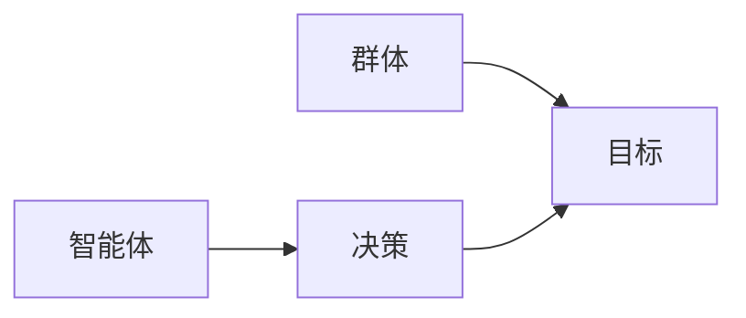
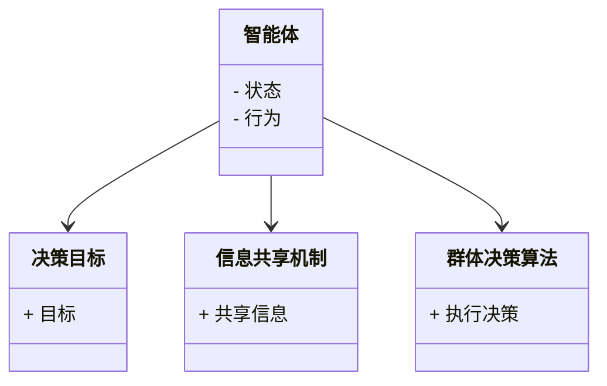
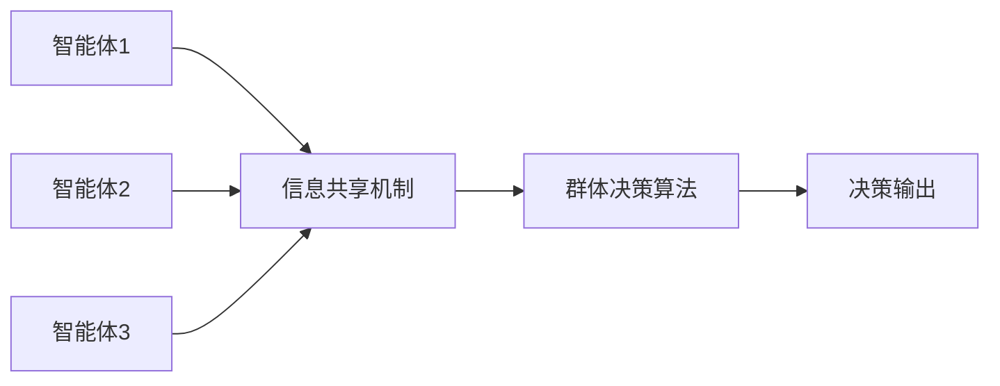

                 


# 智能体群体决策在识别长期价值创造者中的应用

> 关键词：智能体，群体决策，长期价值创造者，算法原理，系统架构，项目实战

> 摘要：本文探讨了智能体群体决策在识别长期价值创造者中的应用，从理论到实践，详细分析了智能体的定义与属性、群体决策的机制与流程、算法原理与数学模型、系统架构设计与实现、项目实战与案例分析。通过详细的步骤分析和丰富的图示，本文为读者提供了一个全面理解智能体群体决策在识别长期价值创造者中的应用框架。

---

## 第1章: 背景介绍

### 1.1 智能体群体决策的基本概念

#### 1.1.1 智能体的定义与特征
智能体（Agent）是指具有感知环境、做出决策、执行动作能力的实体。智能体可以是软件程序、机器人或其他具备智能特性的系统。智能体的核心特征包括：
1. **自主性**：能够在没有外部干预的情况下独立运作。
2. **反应性**：能够根据环境的变化调整行为。
3. **目标导向性**：具有明确的目标，并为实现目标而行动。
4. **学习能力**：能够通过经验改进自身的决策能力。

#### 1.1.2 群体决策的定义与特点
群体决策是指多个智能体协同工作，共同完成决策任务的过程。群体决策的特点包括：
1. **分布式决策**：决策过程分散在多个智能体中，而非集中在一个实体中。
2. **协同性**：智能体之间通过信息共享和协作，共同达成决策目标。
3. **多样性**：不同智能体可能具有不同的知识、能力和目标，从而提供多样化的决策视角。

#### 1.1.3 长期价值创造者的定义与识别
长期价值创造者是指那些能够在较长的时间跨度内为组织或系统创造持续价值的个体或系统。识别长期价值创造者的核心在于发现那些能够通过智能体群体决策提供稳定、可持续价值的实体。

---

### 1.2 问题背景与问题描述

#### 1.2.1 传统决策方法的局限性
传统的决策方法通常依赖于单个决策者或集中式决策系统，这在面对复杂、动态的环境时显得力不从心。集中式决策系统的局限性包括：
1. **单点故障风险**：如果单个决策中心出现问题，整个系统可能瘫痪。
2. **决策效率低下**：在面对复杂问题时，集中式决策可能效率低下。
3. **缺乏灵活性**：难以快速适应环境的变化。

#### 1.2.2 群体决策在现代商业中的重要性
随着人工智能和分布式系统的发展，群体决策在现代商业中的重要性日益凸显。群体决策能够通过多个智能体的协同工作，提高决策的准确性和鲁棒性。例如，在金融投资、供应链管理和市场营销等领域，群体决策能够帮助组织更好地应对复杂挑战。

#### 1.2.3 长期价值创造者的识别挑战
识别长期价值创造者的核心挑战在于如何在动态变化的环境中，准确识别那些能够持续创造价值的个体或系统。传统的基于单一指标的评价方法难以捕捉长期价值创造者的复杂特征。

---

### 1.3 问题解决与边界

#### 1.3.1 智能体群体决策的优势
智能体群体决策的优势在于其分布式、协同性和适应性。通过多个智能体的协同工作，群体决策系统能够在复杂环境中快速响应，并通过信息共享和学习优化决策质量。

#### 1.3.2 边界与适用场景
智能体群体决策的适用场景包括：
1. **分布式系统**：如分布式计算、云计算环境。
2. **动态环境**：如金融市场、实时数据分析。
3. **多目标优化**：如供应链管理、资源分配。

#### 1.3.3 概念结构与核心要素
智能体群体决策的概念结构包括以下几个核心要素：
1. **智能体**：具备感知、决策和行动能力的实体。
2. **决策目标**：群体决策的最终目标。
3. **信息共享机制**：智能体之间共享信息的机制。
4. **协同决策算法**：实现群体决策的算法或模型。

---

## 第2章: 核心概念与联系

### 2.1 智能体的定义与属性

#### 2.1.1 智能体的定义
智能体是指能够在环境中感知、决策和行动的实体。智能体可以是软件程序、机器人或其他具备智能特性的系统。

#### 2.1.2 智能体的属性对比
| 属性 | 描述 |
|------|------|
| 自主性 | 能够独立运作 |
| 反应性 | 能够根据环境变化调整行为 |
| 目标导向性 | 具有明确的目标 |
| 学习能力 | 能够通过经验改进决策能力 |

---

### 2.2 群体决策机制

#### 2.2.1 群体决策的流程
群体决策的过程包括以下几个步骤：
1. **信息收集**：智能体感知环境并收集相关信息。
2. **信息共享**：智能体之间共享收集到的信息。
3. **决策制定**：基于共享信息，智能体协同制定决策。
4. **决策执行**：将决策转化为具体行动。

#### 2.2.2 群体决策的算法选择
在群体决策中，常见的算法包括：
1. **一致性算法**：如 Paxos 和 Raft，用于确保分布式系统中的一致性。
2. **共识算法**：如 Byzantine Fault Tolerance（BFT），用于在存在恶意节点的环境中达成共识。
3. **投票机制**：通过投票方式实现决策的民主化。

---

### 2.3 实体关系图



---

## 第3章: 算法原理讲解

### 3.1 算法概述

#### 3.1.1 群体决策算法的选择
在智能体群体决策中，选择合适的算法至关重要。常见的算法包括：
1. **K近邻算法（KNN）**：用于分类和回归任务。
2. **贝叶斯网络**：用于概率推理和决策。
3. **支持向量机（SVM）**：用于分类和回归任务。

---

### 3.2 算法流程图


---

### 3.3 代码实现

#### 3.3.1 环境安装
```bash
pip install numpy
pip install scikit-learn
```

#### 3.3.2 核心代码
```python
from sklearn import datasets
from sklearn.neighbors import KNeighborsClassifier

# 加载数据集
iris = datasets.load_iris()
X = iris.data
y = iris.target

# 创建KNN模型
knn = KNeighborsClassifier(n_neighbors=3)

# 训练模型
knn.fit(X, y)

# 预测
print(knn.predict(X))
```

---

### 3.4 数学模型与公式

#### 3.4.1 KNN算法的数学模型
KNN算法的核心思想是基于距离度量，找到与目标样本最接近的K个样本，并根据这些样本的类别进行预测。距离度量常用的有欧氏距离、曼哈顿距离等。

欧氏距离公式：
$$d(x, y) = \sqrt{\sum_{i=1}^{n}(x_i - y_i)^2}$$

曼哈顿距离公式：
$$d(x, y) = \sum_{i=1}^{n}|x_i - y_i|$$

---

## 第4章: 系统分析与架构设计

### 4.1 问题场景介绍

#### 4.1.1 系统需求
1. **多智能体协同**：实现多个智能体的协同决策。
2. **动态环境适应**：能够快速适应环境变化。
3. **高效信息共享**：实现智能体之间的高效信息共享。

#### 4.1.2 项目目标
1. **实现智能体群体决策系统**。
2. **验证算法的可行性与有效性。

---

### 4.2 系统功能设计

#### 4.2.1 领域模型


---

### 4.3 系统架构设计



---

## 第5章: 项目实战

### 5.1 环境安装

```bash
pip install numpy
pip install scikit-learn
```

---

### 5.2 核心代码实现

#### 5.2.1 数据加载与预处理
```python
from sklearn import datasets
from sklearn.neighbors import KNeighborsClassifier

# 加载数据集
iris = datasets.load_iris()
X = iris.data
y = iris.target

# 数据预处理
from sklearn.model_selection import train_test_split

X_train, X_test, y_train, y_test = train_test_split(X, y, test_size=0.3)
```

#### 5.2.2 模型训练与预测
```python
# 创建KNN模型
knn = KNeighborsClassifier(n_neighbors=3)

# 训练模型
knn.fit(X_train, y_train)

# 预测
y_pred = knn.predict(X_test)
print("预测结果:", y_pred)
print("真实结果:", y_test)
```

---

### 5.3 案例分析

#### 5.3.1 案例背景
假设我们有一个智能体群体，每个智能体负责监控一个传感器节点的实时数据。通过群体决策算法，智能体能够协同工作，识别传感器节点的异常情况。

#### 5.3.2 实施步骤
1. **数据收集**：从传感器节点收集实时数据。
2. **信息共享**：智能体之间共享数据。
3. **异常检测**：基于共享数据，智能体协同检测异常。
4. **决策输出**：输出异常检测结果。

---

## 第6章: 最佳实践与小结

### 6.1 总结与回顾

#### 6.1.1 关键点总结
1. 智能体群体决策的核心在于智能体的协同与共享。
2. 算法选择与实现是系统设计的关键。

#### 6.1.2 注意事项
1. 确保智能体之间的信息共享机制高效可靠。
2. 在动态环境中，需要定期更新决策模型。

#### 6.1.3 未来展望
1. 研究更高效的群体决策算法。
2. 探索智能体群体决策在更多领域的应用。

---

## 第7章: 拓展阅读

### 7.1 推荐书籍

1. **《群体智能》**：深入探讨群体智能的理论与应用。
2. **《分布式系统》**：了解分布式系统的设计与实现。

### 7.2 推荐论文

1. **“Consensus in the Presence of Byzantine Faults”**：介绍拜占庭容错算法。
2. **“K-Nearest Neighbor: A Survey”**：系统回顾KNN算法的研究进展。

---

## 作者

作者：AI天才研究院/AI Genius Institute & 禅与计算机程序设计艺术 /Zen And The Art of Computer Programming

