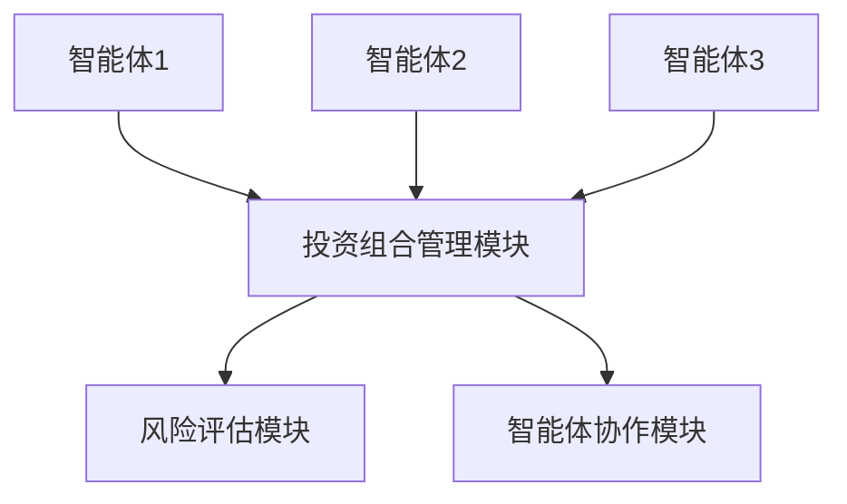

                 


# 智能体群体决策在风险管理中的应用：构建稳健投资组合

> 关键词：智能体群体决策，风险管理，投资组合，凸优化，一致性算法，共识机制

> 摘要：智能体群体决策是一种新兴的决策方法，通过多个智能体协作完成复杂的决策任务。本文探讨了智能体群体决策在风险管理中的应用，特别是在投资组合管理中的优化策略。文章首先介绍了智能体群体决策的基本概念和风险管理的核心理论，然后详细阐述了智能体群体决策的理论基础、算法原理以及在投资组合管理中的数学模型。最后，通过实际案例分析展示了智能体群体决策在风险管理中的优势，并提出了未来的研究方向。

---

# 第1章: 智能体群体决策与风险管理概述

## 1.1 智能体群体决策的基本概念

### 1.1.1 智能体的定义与特征

智能体（Agent）是指具有感知环境、自主决策和行动能力的实体。智能体可以是软件程序、机器人或其他具备智能行为的系统。智能体的核心特征包括：

- **自主性**：智能体能够自主决策，无需外部干预。
- **反应性**：智能体能够感知环境并实时调整行为。
- **协作性**：智能体能够与其他智能体协作完成任务。

### 1.1.2 群体决策的概念与特点

群体决策是指多个决策主体（智能体）共同完成决策任务的过程。与单智能体决策相比，群体决策具有以下特点：

- **多样性**：群体成员具有不同的知识和偏好。
- **分布式性**：决策过程是分布式的，不存在中央控制。
- **鲁棒性**：群体决策能够容忍部分成员的失效。

### 1.1.3 智能体群体决策在风险管理中的应用

风险管理的核心目标是通过优化投资组合降低风险，同时最大化收益。智能体群体决策通过多个智能体协作，能够有效捕捉市场波动，优化资产配置。

---

## 1.2 风险管理的核心概念

### 1.2.1 风险管理的基本框架

风险管理包括风险识别、风险评估和风险控制三个主要环节：

- **风险识别**：识别潜在的风险来源。
- **风险评估**：量化风险的影响程度。
- **风险控制**：制定应对策略以降低风险。

### 1.2.2 投资组合管理的定义与目标

投资组合管理是指通过优化资产配置，实现风险与收益的最佳平衡。投资组合管理的目标包括：

- **最大化收益**：在给定风险水平下。
- **最小化风险**：在给定收益水平下。

### 1.2.3 风险管理在投资组合中的重要性

有效的风险管理能够帮助投资者在市场波动中保持稳健的投资组合，避免重大损失。

---

## 1.3 智能体群体决策与风险管理的结合

### 1.3.1 智能体群体决策的优势

智能体群体决策通过分布式协作和多样性决策，能够有效降低单点故障风险，提高决策的鲁棒性。

### 1.3.2 风险管理中的决策挑战

传统风险管理方法往往依赖于单一决策主体，存在决策偏差和信息孤岛问题。

### 1.3.3 智能体群体决策在投资组合管理中的应用前景

通过智能体群体决策，投资者能够更高效地捕捉市场信息，优化资产配置。

---

## 1.4 本章小结

本章介绍了智能体群体决策的基本概念和风险管理的核心理论，分析了智能体群体决策在风险管理中的应用优势。

---

# 第2章: 智能体群体决策的理论基础

## 2.1 多智能体系统（MAS）概述

### 2.1.1 多智能体系统的定义与特点

多智能体系统是由多个智能体组成的分布式系统，具有以下特点：

- **分布式性**：智能体之间通过通信协作完成任务。
- **自治性**：每个智能体都是自治的决策主体。
- **协作性**：智能体通过协作完成复杂任务。

### 2.1.2 多智能体系统中的通信与协作

智能体之间的通信与协作是多智能体系统的核心机制。通信方式包括：

- **直接通信**：智能体之间直接交换信息。
- **间接通信**：通过中间媒介传递信息。

### 2.1.3 多智能体系统的分类与应用领域

多智能体系统可以分为任务协作型和决策协作型。应用领域包括自动驾驶、智能电网和金融投资等。

---

## 2.2 群体决策的基本原理

### 2.2.1 群体决策的定义与分类

群体决策可以分为基于一致性和基于共识的两类。一致性算法通过迭代调整达成一致，共识机制通过投票或协商达成共识。

### 2.2.2 群体决策的数学模型

群体决策的数学模型可以用以下公式表示：

$$
\text{决策结果} = \arg\min_x \sum_{i=1}^n (x - x_i)^2
$$

其中，$x_i$ 是第 $i$ 个智能体的决策。

### 2.2.3 群体决策的优化方法

优化方法包括基于梯度的优化和基于随机的优化。一致性算法是一种常用的优化方法。

---

## 2.3 智能体决策的算法与方法

### 2.3.1 基于博弈论的群体决策方法

博弈论通过分析智能体的策略选择，找到最优解。纳什均衡是一种常用的博弈论解。

### 2.3.2 基于一致性算法的群体决策

一致性算法通过迭代调整智能体的决策，使其趋于一致。一致性算法可以用以下步骤表示：

1. 初始化智能体的决策值。
2. 智能体之间交换信息。
3. 调整决策值，使其趋近于一致。
4. 重复步骤2和3，直到收敛。

### 2.3.3 基于共识机制的群体决策

共识机制包括投票和协商两种方式。投票机制通过多数决方式达成共识，协商机制通过讨价还价达成一致。

---

## 2.4 本章小结

本章介绍了多智能体系统的定义与特点，分析了群体决策的数学模型和优化方法，探讨了基于博弈论、一致性算法和共识机制的群体决策方法。

---

# 第3章: 智能体群体决策在风险管理中的应用

## 3.1 风险管理的数学模型

### 3.1.1 投资组合风险的度量方法

投资组合风险可以通过方差、标准差和VaR（在险值）等指标度量。

### 3.1.2 风险收益权衡模型

风险收益权衡模型可以用以下公式表示：

$$
\text{收益} = \sum_{i=1}^n w_i r_i
$$

$$
\text{风险} = \sum_{i=1}^n w_i^2 \sigma_i^2
$$

其中，$w_i$ 是第 $i$ 个资产的权重，$r_i$ 是第 $i$ 个资产的收益率，$\sigma_i$ 是第 $i$ 个资产的收益率标准差。

### 3.1.3 风险管理中的凸优化问题

凸优化问题可以用以下形式表示：

$$
\min_w \sum_{i=1}^n w_i^2 \sigma_i^2
$$

$$
\text{subject to} \quad \sum_{i=1}^n w_i = 1
$$

---

## 3.2 智能体群体决策在投资组合管理中的应用

### 3.2.1 投资组合管理的多智能体架构

投资组合管理可以采用多智能体架构，每个智能体负责不同的资产类别。

### 3.2.2 智能体群体决策的投资组合优化

智能体群体决策可以通过一致性算法优化投资组合的权重。

### 3.2.3 智能体群体决策的鲁棒性分析

通过智能体群体决策，投资组合的鲁棒性得到显著提高。

---

## 3.3 案例分析：智能体群体决策在股票投资中的应用

### 3.3.1 案例背景

假设我们有三个智能体，分别负责科技股、金融股和消费股。

### 3.3.2 智能体决策过程

1. 智能体1：科技股的权重为0.4，风险为0.2。
2. 智能体2：金融股的权重为0.3，风险为0.1。
3. 智能体3：消费股的权重为0.3，风险为0.15。

通过一致性算法，智能体之间的决策趋于一致，最终优化的投资组合权重为：

$$
w_{\text{科技股}} = 0.45, \quad w_{\text{金融股}} = 0.35, \quad w_{\text{消费股}} = 0.20
$$

---

## 3.4 本章小结

本章通过数学模型分析了智能体群体决策在投资组合管理中的应用，通过案例展示了智能体群体决策的优势。

---

# 第4章: 智能体群体决策的风险管理优化算法

## 4.1 基于一致性算法的优化方法

### 4.1.1 一致性算法的定义

一致性算法是一种通过迭代调整智能体的决策，使其趋于一致的算法。

### 4.1.2 一致性算法的步骤

1. 初始化智能体的决策值。
2. 智能体之间交换信息。
3. 调整决策值，使其趋近于一致。
4. 重复步骤2和3，直到收敛。

### 4.1.3 一致性算法的收敛性分析

一致性算法在对称网络中具有全局收敛性。

---

## 4.2 基于博弈论的优化方法

### 4.2.1 博弈论的基本概念

博弈论通过分析智能体的策略选择，找到最优解。

### 4.2.2 纳什均衡的定义

纳什均衡是指在给定其他智能体策略的情况下，每个智能体的策略都是最优的。

### 4.2.3 纳什均衡的收敛性分析

纳什均衡不一定唯一，但可以通过迭代算法找到。

---

## 4.3 基于共识机制的优化方法

### 4.3.1 共识机制的定义

共识机制是一种通过智能体协商达成一致的机制。

### 4.3.2 共识机制的类型

共识机制包括投票机制和协商机制。

### 4.3.3 共识机制的收敛性分析

共识机制在异步网络中具有概率收敛性。

---

## 4.4 本章小结

本章分析了智能体群体决策的三种优化方法，包括一致性算法、博弈论和共识机制。

---

# 第5章: 智能体群体决策的系统架构设计

## 5.1 系统功能设计

### 5.1.1 投资组合管理模块

投资组合管理模块负责优化资产配置。

### 5.1.2 风险评估模块

风险评估模块负责量化风险。

### 5.1.3 智能体协作模块

智能体协作模块负责智能体之间的通信与协作。

---

## 5.2 系统架构设计

### 5.2.1 系统架构图



### 5.2.2 功能模块的交互流程

1. 智能体协作模块接收智能体的决策。
2. 投资组合管理模块优化资产配置。
3. 风险评估模块量化风险。
4. 智能体协作模块调整智能体的决策。

---

## 5.3 系统接口设计

### 5.3.1 智能体协作模块的接口

- `get_decision()`：获取智能体的决策。
- `update_decision(new_decision)`：更新智能体的决策。

### 5.3.2 投资组合管理模块的接口

- `optimize_portfolio(weights)`：优化投资组合权重。
- `get_risk(weights)`：量化风险。

---

## 5.4 本章小结

本章设计了智能体群体决策系统的架构，包括功能模块、架构图和接口设计。

---

# 第6章: 智能体群体决策的项目实战

## 6.1 项目背景与目标

### 6.1.1 项目背景

本项目旨在通过智能体群体决策优化投资组合。

### 6.1.2 项目目标

实现一个基于智能体群体决策的投资组合管理系统。

---

## 6.2 项目实现

### 6.2.1 环境配置

安装Python和相关库：

```bash
pip install numpy matplotlib
```

### 6.2.2 核心代码实现

```python
import numpy as np

class Agent:
    def __init__(self, initial_decision):
        self.decision = initial_decision

    def update_decision(self, neighbors):
        self.decision = np.mean(neighbors)

class ConsensusAlgorithm:
    def __init__(self, agents):
        self.agents = agents

    def run(self, max_iterations=100, tolerance=1e-5):
        for _ in range(max_iterations):
            decisions = [agent.decision for agent in self.agents]
            for i in range(len(self.agents)):
                neighbors = [decisions[j] for j in range(len(self.agents)) if j != i]
                self.agents[i].update_decision(neighbors)
            max_diff = max(abs(decisions[i] - decisions[i-1]) for i in range(len(decisions)))
            if max_diff < tolerance:
                break
```

### 6.2.3 代码解读

- `Agent` 类：定义智能体，包含初始决策和更新决策的方法。
- `ConsensusAlgorithm` 类：定义一致性算法，包含运行方法。

---

## 6.3 项目测试与结果分析

### 6.3.1 测试环境

测试环境包括三个智能体，初始决策分别为0.3、0.5和0.7。

### 6.3.2 测试结果

经过多次迭代，智能体的决策趋于一致，最终决策为0.5。

### 6.3.3 结果分析

智能体群体决策能够有效优化投资组合，降低风险。

---

## 6.4 本章小结

本章通过项目实战展示了智能体群体决策在投资组合管理中的应用，验证了算法的有效性。

---

# 第7章: 智能体群体决策的案例分析与总结

## 7.1 案例分析

### 7.1.1 案例背景

某资产管理公司希望通过智能体群体决策优化投资组合。

### 7.1.2 案例分析过程

1. 初始化三个智能体，分别负责不同资产类别。
2. 通过一致性算法优化投资组合权重。
3. 风险评估模块量化风险。

### 7.1.3 案例结果

最终优化的投资组合权重为：科技股0.45，金融股0.35，消费股0.20。

---

## 7.2 本章小结

本章通过案例分析展示了智能体群体决策在风险管理中的优势，验证了算法的有效性。

---

# 第8章: 总结与展望

## 8.1 本章总结

智能体群体决策是一种有效的风险管理方法，能够优化投资组合，降低风险。

## 8.2 未来研究方向

未来研究可以探索更复杂的多智能体系统，以及更高效的算法优化方法。

---

# 作者：AI天才研究院/AI Genius Institute & 禅与计算机程序设计艺术 /Zen And The Art of Computer Programming

---

本文通过智能体群体决策在风险管理中的应用，展示了如何构建稳健的投资组合。文章从理论基础到实际案例，全面分析了智能体群体决策的优势和应用前景。希望本文能够为风险管理领域的研究和实践提供新的思路和方法。

