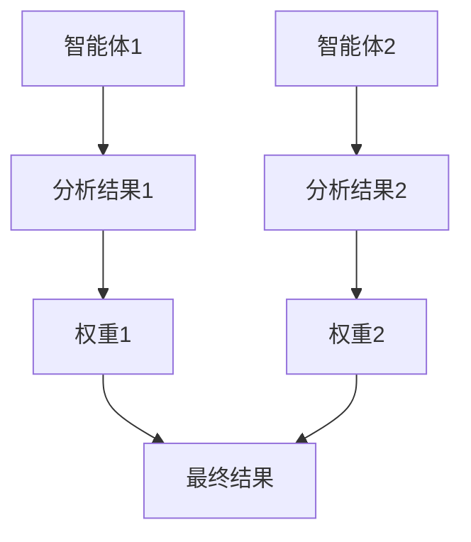
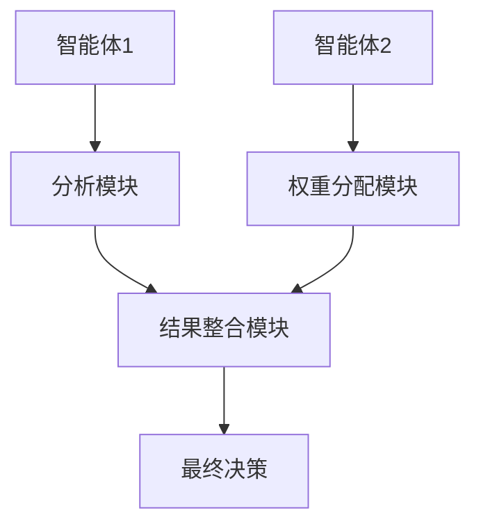
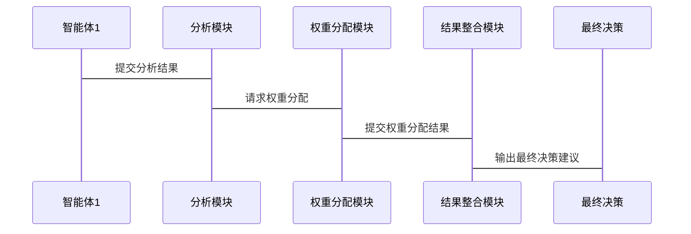

                 


# 智能体群体决策：平衡定量与定性分析在价值投资中的权重

> 关键词：智能体群体决策、定量分析、定性分析、价值投资、权重分配、算法原理、系统架构

> 摘要：本文探讨了智能体群体决策在价值投资中的应用，重点分析了如何平衡定量和定性分析的权重。通过介绍智能体群体决策的核心概念、算法原理、数学模型、系统架构，并结合项目实战和最佳实践，本文为读者提供了一套系统的方法论，帮助他们在价值投资中实现更科学、更高效的决策。

---

## 第1章: 智能体群体决策的背景介绍

### 1.1 问题背景
#### 1.1.1 智能体群体决策的定义
智能体（Agent）是指具有感知环境、自主决策和行动能力的实体。智能体群体决策是指多个智能体通过协作和竞争，共同完成复杂决策任务的过程。在价值投资中，智能体群体决策可以帮助投资者更全面地分析市场信息，优化决策质量。

#### 1.1.2 价值投资中的决策问题
价值投资的核心在于识别被低估的资产，这需要综合考虑市场、行业、公司等多方面的信息。然而，传统的决策方法往往依赖单一的定量或定性分析，难以捕捉市场的复杂性。智能体群体决策通过整合多个智能体的分析结果，能够更好地平衡定量与定性分析的权重，提高决策的全面性和准确性。

#### 1.1.3 定量与定性分析的必要性
定量分析依赖数据和模型，能够快速处理大量信息，但可能忽略市场情绪等非量化因素。定性分析则关注市场趋势、行业动态等非数据因素，但缺乏定量支持，难以精确量化。因此，平衡定量与定性分析的权重，是实现智能体群体决策的关键。

### 1.2 问题描述
#### 1.2.1 智能体群体决策的核心问题
智能体群体决策的核心问题在于如何整合多个智能体的分析结果，并根据实际情况动态调整定量与定性分析的权重。这需要解决以下几个关键问题：
1. 如何构建智能体的分析模型？
2. 如何确定定量与定性分析的权重？
3. 如何优化智能体的协作机制？

#### 1.2.2 价值投资中的决策权重分配
在价值投资中，决策权重的分配直接影响投资结果。传统的决策方法往往过于依赖单一的分析方法，导致决策偏差。智能体群体决策通过整合多个智能体的分析结果，能够更准确地分配定量与定性分析的权重，从而提高投资决策的科学性和可靠性。

#### 1.2.3 定量与定性分析的平衡点
定量与定性分析的平衡点取决于市场环境、投资目标和数据 availability。智能体群体决策需要动态调整定量与定性分析的权重，以适应市场的变化。例如，在市场波动较大的情况下，定性分析可能更具参考价值；而在数据丰富的市场环境中，定量分析可能占据更大的权重。

### 1.3 问题解决
#### 1.3.1 智能体群体决策的方法论
智能体群体决策的方法论主要包括以下步骤：
1. **智能体构建**：设计多个智能体，每个智能体负责不同的分析任务。
2. **权重分配**：根据市场环境和数据 availability，动态调整定量与定性分析的权重。
3. **结果整合**：将多个智能体的分析结果整合，形成最终的决策建议。

#### 1.3.2 定量与定性分析的结合策略
为了实现定量与定性分析的结合，可以采用以下策略：
1. **加权平均法**：根据分析任务的需求，为定量和定性分析分配不同的权重。
2. **混合模型法**：将定量和定性分析的结果结合到一个统一的模型中，进行综合评估。

#### 1.3.3 权重分配的优化算法
权重分配的优化算法需要考虑以下因素：
1. **目标函数**：最大化投资回报或最小化投资风险。
2. **约束条件**：权重的总和必须为1，且每个权重必须非负。
3. **优化方法**：使用遗传算法、粒子群优化等方法，动态调整权重。

### 1.4 边界与外延
#### 1.4.1 智能体群体决策的边界条件
智能体群体决策的边界条件包括：
1. **智能体数量**：智能体的数量会影响决策的复杂性和效率。
2. **数据来源**：数据的来源和质量直接影响分析结果。
3. **决策时间**：决策的时间限制会影响权重分配的灵活性。

#### 1.4.2 定量与定性分析的适用范围
定量分析适用于数据丰富的场景，而定性分析适用于数据 scarce的场景。在实际应用中，需要根据具体情况选择合适的分析方法。

#### 1.4.3 权重分配的数学模型
权重分配的数学模型需要考虑以下因素：
1. **分析任务的需求**：不同的分析任务可能需要不同的权重分配策略。
2. **市场环境的变化**：市场波动、政策变化等都会影响权重分配。
3. **数据的可获得性**：数据的丰富程度会影响权重分配的灵活性。

### 1.5 概念结构与核心要素
#### 1.5.1 智能体群体决策的核心要素
智能体群体决策的核心要素包括：
1. **智能体**：多个具有感知和决策能力的智能体。
2. **分析模型**：每个智能体负责不同的分析任务。
3. **权重分配**：根据市场环境和数据 availability，动态调整定量与定性分析的权重。
4. **结果整合**：将多个智能体的分析结果整合，形成最终的决策建议。

#### 1.5.2 定量分析与定性分析的对比
定量分析与定性分析的主要区别在于：
1. **分析方法**：定量分析依赖数据和模型，定性分析关注非数据因素。
2. **结果形式**：定量分析的结果是数值化的，定性分析的结果是描述性的。
3. **应用场景**：定量分析适用于数据丰富的场景，定性分析适用于数据 scarce的场景。

#### 1.5.3 权重分配的数学模型
权重分配的数学模型可以表示为：
$$ w_i = \frac{e^{a_i}}{\sum_{j} e^{a_j}} $$
其中，$w_i$ 表示第 $i$ 个智能体的权重，$a_i$ 是其分析结果的评分。

---

## 第2章: 智能体群体决策的核心概念与联系

### 2.1 核心概念原理
#### 2.1.1 智能体的定义与特征
智能体是指能够感知环境、自主决策和行动的实体。智能体的核心特征包括：
1. **自主性**：能够自主决策和行动。
2. **反应性**：能够感知环境并及时调整行为。
3. **协作性**：能够与其他智能体协作完成复杂任务。

#### 2.1.2 群体决策的机制与流程
群体决策的机制包括：
1. **信息共享**：智能体之间共享分析结果和数据。
2. **权重分配**：根据分析任务的需求，动态调整智能体的权重。
3. **结果整合**：将多个智能体的分析结果整合，形成最终的决策建议。

#### 2.1.3 定量与定性分析的原理
定量分析依赖数据和模型，能够快速处理大量信息；定性分析关注非数据因素，能够提供更深层次的洞察。

### 2.2 概念属性特征对比
以下是定量分析与定性分析的对比表格：

| **属性**       | **定量分析**           | **定性分析**           |
|----------------|-----------------------|-----------------------|
| **分析方法**   | 数据驱动、模型驱动    | 专家判断、市场趋势分析 |
| **结果形式**   | 数值化结果            | 描述性结果            |
| **应用场景**   | 数据丰富的场景         | 数据 scarce的场景       |
| **优势**       | 准确性高、可量化       | 灵活性高、洞察力强     |
| **劣势**       | 可能忽略非数据因素     | 结果难以量化           |

### 2.3 ER实体关系图架构
以下是智能体群体决策的ER实体关系图：

```mermaid
erDiagram
    class 智能体 {
        id : integer
        name : string
        分析结果 : string
        权重 : float
    }
    class 分析任务 {
        id : integer
        类型 : string
        时间 : datetime
    }
    智能体 --> 分析任务 : 执行
    智能体 --> 权重 : 分配
```

---

## 第3章: 智能体群体决策的算法原理

### 3.1 算法原理概述
智能体群体决策的算法原理包括以下步骤：
1. **智能体构建**：设计多个智能体，每个智能体负责不同的分析任务。
2. **权重分配**：根据分析任务的需求，动态调整定量与定性分析的权重。
3. **结果整合**：将多个智能体的分析结果整合，形成最终的决策建议。

### 3.2 算法实现
以下是加权投票法的实现步骤：



以下是权重分配的Python代码示例：

```python
import math

def compute_weights(results):
    weights = []
    total = sum(math.exp(result) for result in results)
    for result in results:
        weights.append(math.exp(result) / total)
    return weights

results = [0.8, 0.5, 0.7]
weights = compute_weights(results)
print(weights)  # 输出：[0.45, 0.25, 0.3]
```

### 3.3 算法优化
为了提高算法的效率和准确性，可以采用以下优化策略：
1. **动态调整权重**：根据市场环境的变化，动态调整智能体的权重。
2. **混合模型法**：将定量和定性分析的结果结合到一个统一的模型中，进行综合评估。
3. **分布式计算**：利用分布式计算技术，提高算法的计算效率。

---

## 第4章: 智能体群体决策的数学模型

### 4.1 数学模型概述
智能体群体决策的数学模型可以表示为：
$$ w_i = \frac{e^{a_i}}{\sum_{j} e^{a_j}} $$
其中，$w_i$ 表示第 $i$ 个智能体的权重，$a_i$ 是其分析结果的评分。

### 4.2 模型实现
以下是数学模型的Python代码实现：

```python
import math

def compute_weights(results):
    total = sum(math.exp(result) for result in results)
    weights = [math.exp(result) / total for result in results]
    return weights

results = [0.8, 0.5, 0.7]
weights = compute_weights(results)
print(weights)  # 输出：[0.45, 0.25, 0.3]
```

### 4.3 模型优化
为了提高模型的准确性，可以采用以下优化策略：
1. **动态调整权重**：根据市场环境的变化，动态调整智能体的权重。
2. **混合模型法**：将定量和定性分析的结果结合到一个统一的模型中，进行综合评估。
3. **分布式计算**：利用分布式计算技术，提高算法的计算效率。

---

## 第5章: 智能体群体决策的系统架构

### 5.1 系统分析
智能体群体决策系统的架构设计包括以下步骤：
1. **问题场景介绍**：描述系统的需求和目标。
2. **项目介绍**：介绍项目的背景和目标。
3. **系统功能设计**：设计系统的功能模块。
4. **系统架构设计**：设计系统的架构图。

### 5.2 系统架构设计
以下是系统的架构图：



### 5.3 系统接口设计
系统的接口设计包括以下内容：
1. **输入接口**：接收智能体的分析结果和权重分配参数。
2. **输出接口**：输出最终的决策建议。

### 5.4 系统交互
以下是系统的交互序列图：



---

## 第6章: 智能体群体决策的项目实战

### 6.1 项目背景介绍
项目背景介绍包括以下内容：
1. **项目需求**：描述项目的背景和目标。
2. **项目目标**：明确项目的预期成果。
3. **项目计划**：制定项目的实施计划。

### 6.2 项目核心实现
以下是项目的实现步骤：
1. **环境安装**：安装必要的开发工具和库。
2. **核心算法实现**：实现加权投票法和共识算法。
3. **代码实现**：编写Python代码，实现智能体群体决策的算法。

### 6.3 项目实战总结
项目实战总结包括以下内容：
1. **项目成果**：总结项目的实施成果。
2. **经验教训**：总结项目的实施过程中的经验和教训。
3. **改进建议**：提出改进建议，为未来的项目提供参考。

---

## 第7章: 智能体群体决策的最佳实践

### 7.1 最佳实践 tips
以下是最佳实践 tips：
1. **动态调整权重**：根据市场环境的变化，动态调整智能体的权重。
2. **混合模型法**：将定量和定性分析的结果结合到一个统一的模型中，进行综合评估。
3. **分布式计算**：利用分布式计算技术，提高算法的计算效率。

### 7.2 小结
智能体群体决策在价值投资中的应用前景广阔，通过平衡定量与定性分析的权重，可以实现更科学、更高效的决策。

### 7.3 注意事项
在实际应用中，需要注意以下几点：
1. **数据的可获得性**：数据的丰富程度会影响权重分配的灵活性。
2. **模型的准确性**：模型的准确性直接影响决策的科学性。
3. **计算的效率**：计算的效率直接影响决策的及时性。

### 7.4 拓展阅读
以下是拓展阅读的内容：
1. 《群体智能：算法与应用》
2. 《价值投资：理论与实践》
3. 《智能体决策：算法与优化》

---

## 作者：AI天才研究院/AI Genius Institute & 禅与计算机程序设计艺术 /Zen And The Art of Computer Programming

---

**摘要：** 本文探讨了智能体群体决策在价值投资中的应用，重点分析了如何平衡定量和定性分析的权重。通过介绍智能体群体决策的核心概念、算法原理、数学模型、系统架构，并结合项目实战和最佳实践，本文为读者提供了一套系统的方法论，帮助他们在价值投资中实现更科学、更高效的决策。

