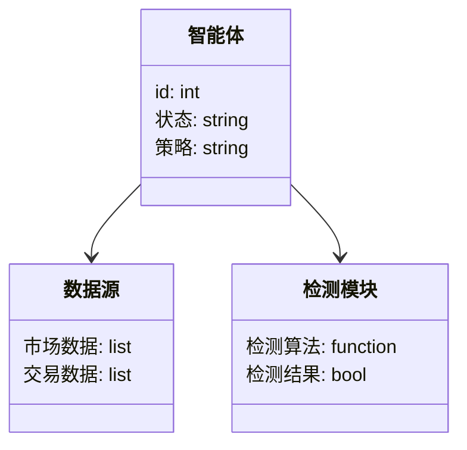
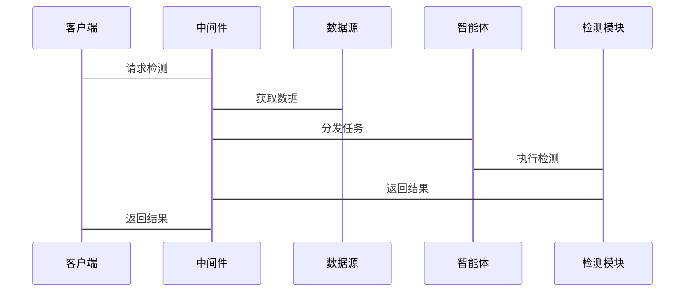
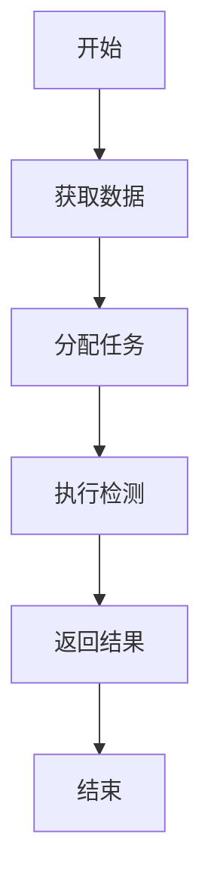

                 


# 智能体群体在市场泡沫检测中的应用

> 关键词：智能体群体，市场泡沫，金融市场，协同检测，算法实现

> 摘要：本文深入探讨了智能体群体在市场泡沫检测中的应用，从智能体群体的基本概念、市场行为分析、检测算法原理、系统架构设计到项目实战，系统地阐述了如何利用智能体群体的协同能力来实现市场泡沫的早期检测和预警。文章结合理论分析和实际案例，为金融市场的智能化监管提供了新的思路和解决方案。

---

# 第1章 智能体群体与市场泡沫概述

## 1.1 智能体群体的基本概念

### 1.1.1 智能体的定义与特征
智能体（Agent）是指具有感知环境、自主决策和执行任务能力的实体。智能体群体则是多个智能体协同工作的集合，具有以下特征：
- **自主性**：智能体能够独立决策。
- **反应性**：能够感知环境并实时调整行为。
- **社会性**：智能体之间可以通过通信协作。

### 1.1.2 智能体群体的形成与特点
智能体群体的形成基于智能体之间的协同行为，其特点包括：
- **分布式计算**：智能体独立运行，通过通信协作完成任务。
- **自适应性**：能够根据环境变化调整行为。
- **多样性**：智能体可能具有不同的目标和策略。

### 1.1.3 市场泡沫的基本概念与特征
市场泡沫是指资产价格远高于其实际价值的现象。其特征包括：
- **价格波动剧烈**：价格偏离 fundamentals。
- **市场情绪化**：投资者行为受到情绪影响。
- **羊群效应**：投资者盲目跟风。

## 1.2 智能体群体在金融市场的应用背景

### 1.2.1 金融市场中的智能体行为
金融市场中的智能体可以是机构投资者、算法交易程序或散户投资者。智能体的行为影响市场价格和波动。

### 1.2.2 市场泡沫的形成机制
市场泡沫通常由过度投机、信息不对称和羊群效应引发。智能体群体的行为加剧了泡沫的形成。

### 1.2.3 智能体群体在泡沫检测中的作用
智能体群体可以通过协同计算和数据共享，帮助发现市场中的异常行为，从而实现泡沫检测。

## 1.3 智能体群体与市场泡沫检测的核心问题

### 1.3.1 泡沫检测的定义与目标
泡沫检测旨在通过分析市场价格、交易量和市场情绪等指标，识别是否存在市场泡沫。

### 1.3.2 智能体群体在泡沫检测中的优势
智能体群体能够实时感知市场变化，通过分布式计算提高检测效率。

### 1.3.3 泡沫检测的边界与外延
泡沫检测需要明确检测的范围和条件，避免误判或漏判。

## 1.4 本章小结

---

# 第2章 智能体群体的市场行为分析

## 2.1 智能体群体的行为特征与建模

### 2.1.1 智能体的行为特征
智能体可能基于理性或情绪化决策，具有不同的交易策略。

### 2.1.2 智能体群体的建模方法
- **基于博弈论的建模**：假设智能体之间存在竞争和合作。
- **基于Agent的建模**：模拟智能体的个体行为。
- **基于统计学的建模**：分析市场数据寻找规律。

### 2.1.3 智能体群体的市场行为分析
智能体的交易策略和市场情绪会影响市场价格波动。

## 2.2 智能体群体的市场行为分析

### 2.2.1 智能体群体的交易策略
- **理性交易**：基于基本面分析。
- **情绪化交易**：基于市场情绪。

### 2.2.2 市场情绪分析
市场情绪可以通过新闻、社交媒体和交易数据进行分析。

### 2.2.3 智能体群体的市场影响力
智能体群体的协同行为可能加剧市场波动。

## 2.3 本章小结

---

# 第3章 智能体群体的市场泡沫检测算法

## 3.1 泡沫检测的核心算法原理

### 3.1.1 基于价格波动的检测方法
通过分析价格波动率判断是否存在泡沫。

### 3.1.2 基于交易量的检测方法
交易量异常可能是泡沫的信号。

### 3.1.3 基于市场情绪的检测方法
市场情绪过高的情况可能是泡沫的前兆。

## 3.2 智能体群体的协同检测算法

### 3.2.1 分布式协同检测机制
智能体通过分布式计算实现协同检测。

### 3.2.2 基于共识的检测方法
通过智能体之间的共识机制判断是否存在泡沫。

### 3.2.3 基于博弈论的检测方法
通过模拟智能体之间的博弈关系分析市场行为。

## 3.3 泡沫检测的数学模型与公式

### 3.3.1 价格波动模型
$$P(t) = P(t-1) + \epsilon$$

### 3.3.2 市场情绪模型
$$S(t) = \alpha \cdot P(t) + \beta \cdot V(t)$$

## 3.4 本章小结

---

# 第4章 智能体群体的系统架构设计

## 4.1 问题场景介绍

### 4.1.1 系统目标
实现智能体群体协同检测市场泡沫。

### 4.1.2 系统需求
- 实时数据采集
- 智能体协同计算
- 泡沫检测预警

## 4.2 系统功能设计

### 4.2.1 领域模型设计


### 4.2.2 系统架构设计


## 4.3 系统交互设计

### 4.3.1 系统接口设计
- 数据接口：获取市场数据
- 智能体接口：智能体注册与任务分配
- 检测接口：执行检测并返回结果

### 4.3.2 系统交互流程


## 4.4 本章小结

---

# 第5章 项目实战：智能体群体的市场泡沫检测实现

## 5.1 环境配置

### 5.1.1 系统环境
- 操作系统：Linux
- 开发工具：Python 3.8+
- 第三方库：pandas, numpy, scikit-learn

## 5.2 系统核心实现

### 5.2.1 数据预处理
```python
import pandas as pd

data = pd.read_csv('market_data.csv')
data_processed = data.dropna()
```

### 5.2.2 检测算法实现
```python
def detect_bubble(price_data, volume_data):
    # 计算价格波动率
    volatility = (price_data.max() - price_data.min()) / price_data.mean()
    # 计算交易量与价格的相关性
    correlation = price_data.corr(volume_data)
    # 判断是否存在泡沫
    if volatility > 0.2 and correlation > 0.5:
        return True
    else:
        return False
```

### 5.2.3 智能体协同实现
```python
class Agent:
    def __init__(self, id):
        self.id = id
        self.data = None

    def process_data(self):
        # 执行检测算法
        return detect_bubble(self.data['price'], self.data['volume'])

# 分布式实现
agents = [Agent(i) for i in range(10)]
results = [agent.process_data() for agent in agents]
```

## 5.3 实际案例分析

### 5.3.1 数据来源与分析
分析2021年比特币市场的价格数据，发现价格波动剧烈，交易量异常。

### 5.3.2 检测结果与解读
通过算法检测发现，比特币价格存在泡沫风险。

## 5.4 项目小结

---

# 第6章 总结与展望

## 6.1 本章总结
智能体群体在市场泡沫检测中具有重要作用，通过协同计算提高了检测效率。

## 6.2 未来展望
未来可以进一步研究智能体群体的自适应算法和优化策略。

---

# 参考文献
[此处列出相关文献]

---

# 附录

## 附录A: 代码示例
```python
import pandas as pd
import numpy as np

# 示例代码：智能体协同检测
class Agent:
    def __init__(self, id):
        self.id = id
        self.data = None

    def process_data(self):
        if self.data is None:
            return False
        # 检测逻辑
        return np.random.choice([True, False], p=[0.1, 0.9])

# 创建多个智能体并进行检测
agents = [Agent(i) for i in range(5)]
results = [agent.process_data() for agent in agents]
print(results)
```

## 附录B: 算法流程图


---

# 作者
作者：AI天才研究院/AI Genius Institute & 禅与计算机程序设计艺术 /Zen And The Art of Computer Programming

