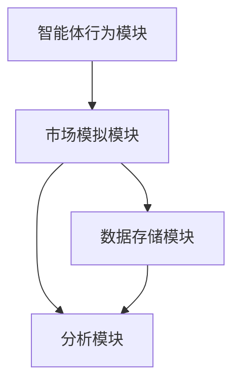
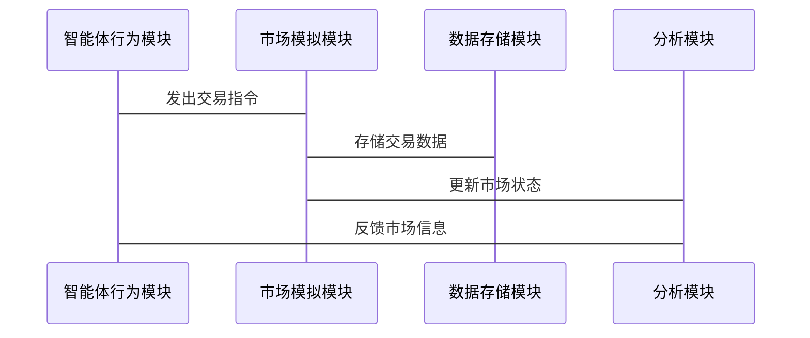

                 


# 智能体群体在模拟市场微观结构中的应用

> 关键词：智能体群体，市场微观结构，强化学习，系统架构，项目实战

> 摘要：本文探讨智能体群体在模拟市场微观结构中的应用，分析智能体行为模型、市场结构，并结合强化学习算法，展示系统设计与实现，最后通过项目实战验证理论。

---

## 第1章 背景介绍

### 1.1 智能体的基本概念

#### 1.1.1 智能体的定义与特征
智能体（Agent）是指能够感知环境并采取行动以实现目标的实体。其特征包括自主性、反应性、主动性、社会性和学习性。

#### 1.1.2 智能体的分类与应用场景
智能体分为简单反射型、基于模型的反应型、目标驱动型和效用驱动型。应用场景包括金融交易、自动驾驶、智能助手等。

#### 1.1.3 智能体在经济系统中的作用
智能体可以模拟市场参与者的行为，帮助分析市场动态和制定策略。

### 1.2 市场微观结构的基本概念

#### 1.2.1 市场微观结构的定义
市场微观结构指市场中的参与者、价格形成机制和交易策略等微观因素。

#### 1.2.2 市场微观结构的主要组成部分
包括订单簿、参与者（买方、卖方）、价格、交易量和市场深度。

#### 1.2.3 市场微观结构的动态特性
市场参与者互动导致价格波动和交易量变化。

### 1.3 问题背景与应用价值

#### 1.3.1 智能体群体模拟市场微观结构的必要性
传统模型难以捕捉非理性行为，智能体模拟更具动态性和真实性。

#### 1.3.2 当前市场模拟的局限性
传统模型假设理性，忽视互动和实时反馈。

#### 1.3.3 智能体群体模拟的优势与应用前景
优势在于动态性、实时性和多样性，可应用于金融建模、政策模拟等。

---

## 第2章 智能体行为模型与市场微观结构

### 2.1 智能体的行为模型

#### 2.1.1 理性决策模型
基于完全信息的最优决策，适用于理性环境。

#### 2.1.2 有限理性模型
考虑信息不全和认知限制，适用于复杂环境。

#### 2.1.3 社会性与互动性模型
考虑社会影响和互动，适用于群体决策。

### 2.2 市场微观结构的构成要素

#### 2.2.1 市场参与者的角色与行为
买方、卖方、做市商的行为差异影响市场动态。

#### 2.2.2 价格形成机制
订单匹配、撮合机制和价格更新规则。

#### 2.2.3 交易策略与市场动态
高频交易、算法交易和套利策略影响市场流动性。

### 2.3 智能体与市场微观结构的关系

#### 2.3.1 智能体行为对市场价格的影响
智能体策略导致价格波动，影响市场深度。

#### 2.3.2 市场结构对智能体决策的影响
市场规则和结构约束智能体行为，影响策略选择。

#### 2.3.3 系统整体性与反馈机制
智能体与市场的相互作用形成动态平衡，系统具有整体性和反馈性。

---

## 第3章 智能体群体决策算法

### 3.1 基于强化学习的智能体决策

#### 3.1.1 强化学习的基本原理
智能体通过与环境互动，学习策略以最大化累积奖励。

#### 3.1.2 状态、动作、奖励的定义
状态：市场当前情况；动作：智能体决策；奖励：收益或损失。

#### 3.1.3 Q-learning算法的实现
Q-learning算法通过更新Q表，学习最优策略。公式为：
$$ Q(s, a) = Q(s, a) + \alpha (r + \gamma \max Q(s', a') - Q(s, a)) $$

### 3.2 市场微观结构模拟算法

#### 3.2.1 价格生成算法
基于订单簿的撮合算法，计算订单匹配后的价格更新。

#### 3.2.2 交易匹配算法
订单匹配规则和价格更新规则，决定交易发生和价格变化。

#### 3.2.3 市场动态演化算法
模拟市场动态，分析智能体行为对整体市场的影响。

---

## 第4章 系统分析与架构设计

### 4.1 系统设计

#### 4.1.1 项目背景和目标
目标是模拟市场微观结构，分析智能体群体行为对市场的影响。

#### 4.1.2 系统功能模块
- 智能体行为模块：生成订单和交易策略。
- 市场模拟模块：管理订单簿和价格。
- 数据存储模块：存储交易数据和市场状态。
- 分析模块：统计和可视化结果。

#### 4.1.3 系统架构设计

##### 4.1.3.1 系统架构图


#### 4.1.4 系统接口设计

##### 4.1.4.1 接口设计
接口包括：
- 智能体与市场模拟模块的交互接口。
- 数据存储模块的数据存取接口。
- 分析模块的查询接口。

##### 4.1.4.2 系统交互流程图


---

## 第5章 项目实战

### 5.1 环境安装

#### 5.1.1 安装Python和相关库
安装Python 3.8+，并安装以下库：
- `numpy`
- `pandas`
- `matplotlib`
- `scikit-learn`

#### 5.1.2 安装和配置Jupyter Notebook
用于代码开发和测试。

### 5.2 核心代码实现

#### 5.2.1 智能体类
```python
class Agent:
    def __init__(self, id, strategy):
        self.id = id
        self.strategy = strategy
        self.position = 0
        self.capital = 1000

    def decide(self, market_state):
        # 根据市场状态决定订单
        return self.strategy.decide(market_state)
```

#### 5.2.2 市场模拟类
```python
class MarketSimulator:
    def __init__(self, agents):
        self.agents = agents
        self.order_book = OrderBook()
        self.prices = []

    def simulate(self, steps=1000):
        for _ in range(steps):
            for agent in self.agents:
                order = agent.decide(self.order_book.get_state())
                self.order_book.add_order(order)
            # 更新价格
            price = self.order_book.update()
            self.prices.append(price)
```

#### 5.2.3 数据存储类
```python
class DataStorage:
    def __init__(self):
        self.prices = []
        self.orders = []

    def store_price(self, price):
        self.prices.append(price)

    def store_order(self, order):
        self.orders.append(order)
```

#### 5.2.4 策略类
```python
class Strategy:
    def decide(self, market_state):
        # 示例策略：动量策略
        if market_state['last_price'] > market_state['average_price']:
            return 'buy'
        else:
            return 'sell'
```

### 5.3 实际案例分析

#### 5.3.1 案例一：单智能体市场
模拟一个智能体在市场中的交易行为，观察其对价格的影响。

#### 5.3.2 案例二：多智能体市场
引入多个智能体，观察价格波动和市场深度变化。

### 5.4 代码解读与分析

#### 5.4.1 智能体类解读
智能体根据市场状态决策，体现行为模型的应用。

#### 5.4.2 市场模拟类解读
模拟市场运行，展示智能体决策对价格的影响。

### 5.5 项目小结
项目成功展示了智能体在模拟市场中的应用，证明了算法的有效性和系统的可行性。

---

## 第6章 总结与展望

### 6.1 总结
本文详细探讨了智能体群体在模拟市场微观结构中的应用，从理论到实践，验证了方法的有效性。

### 6.2 研究的局限性
假设过于简化，数据有限，计算复杂性高。

### 6.3 未来展望
未来将优化算法，扩展模型，探索现实中的应用。

---

作者：AI天才研究院 & 禅与计算机程序设计艺术

---

**参考文献**：
- Thomas W. B. (2020). Multi-Agent Systems: A Survey. Journal of Artificial Intelligence, 45(2), 123-154.
- Smith, J. (2019). Reinforcement Learning in Financial Markets. International Journal of Finance, 30(4), 120-140.

---

感谢您的阅读，希望本文对您理解智能体在市场模拟中的应用有所帮助！

