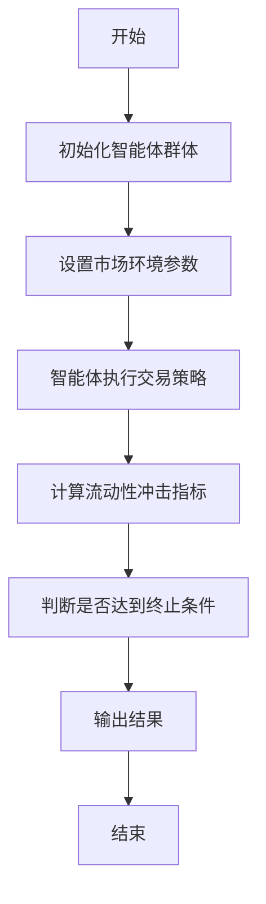
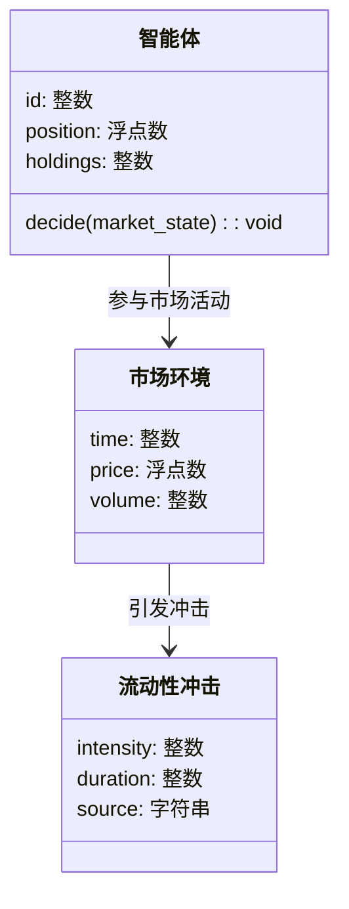

                 


# 智能体群体在模拟市场流动性冲击中的应用

> 关键词：智能体群体、市场流动性、算法模拟、系统仿真、金融建模

> 摘要：本文探讨了智能体群体在模拟市场流动性冲击中的应用，通过分析智能体的行为模型、群体协同机制，结合实际案例，展示了如何利用智能体群体模拟流动性冲击，为金融风险管理提供新的思路。

---

# 第1章: 智能体群体的基本概念

## 1.1 智能体的定义与特征
### 1.1.1 智能体的定义
智能体（Agent）是能够感知环境并采取行动以实现目标的实体。在金融市场中，智能体可以是算法交易系统或基于规则的参与者。

### 1.1.2 智能体的分类
1. **简单反应式智能体**：基于当前环境做出反应，无内部状态。
2. **基于模型的智能体**：利用内部模型和历史数据进行决策。
3. **协作式智能体**：与其他智能体协同工作，共同完成任务。

### 1.1.3 智能体的应用场景
智能体广泛应用于自动驾驶、智能家居、金融交易等领域，尤其在金融市场中，智能体可以模拟投资者行为。

## 1.2 市场流动性冲击的定义
### 1.2.1 流动性冲击的定义
流动性冲击是指市场流动性急剧下降，导致资产价格大幅波动，交易量骤减。

### 1.2.2 流动性冲击的分类
1. **暂时性冲击**：短期市场波动导致的流动性下降。
2. **结构性冲击**：市场结构变化引发的长期流动性问题。
3. **外部事件冲击**：如新闻事件或政策变化引发的市场反应。

### 1.2.3 流动性冲击对金融市场的的影响
流动性冲击可能导致市场波动加剧、交易成本上升，甚至引发系统性风险。

## 1.3 智能体群体与市场流动性冲击的关系
### 1.3.1 智能体群体的定义
智能体群体是由多个智能体组成的系统，能够通过协同实现复杂任务。

### 1.3.2 智能体群体在市场中的作用
智能体群体可以模拟市场参与者的多样性，分析市场行为，预测流动性变化。

### 1.3.3 智能体群体与传统市场分析方法的对比
传统方法依赖历史数据和统计模型，而智能体群体能够模拟个体行为，捕捉市场动态。

---

# 第2章: 智能体群体的核心概念与联系

## 2.1 智能体群体的核心原理
### 2.1.1 智能体的个体行为模型
智能体通过感知环境、做出决策、采取行动，实现目标。

### 2.1.2 智能体群体的协同机制
智能体之间通过信息共享、协作决策，共同应对市场变化。

### 2.1.3 智能体群体的自适应能力
智能体能够根据市场反馈调整策略，适应环境变化。

## 2.2 智能体群体与市场流动性冲击的核心要素
### 2.2.1 市场参与者的智能体建模
每个市场参与者可以被建模为一个智能体，具有交易策略和行为特征。

### 2.2.2 市场信息的传递与处理
智能体通过信息传递，影响市场流动性和资产价格。

### 2.2.3 流动性冲击的模拟与预测
通过智能体群体的协同行为，模拟流动性冲击的发生和传播。

## 2.3 智能体群体与市场流动性冲击的ER实体关系图
```mermaid
erDiagram
    participant 市场参与者 {
        <属性> 姓名
        <属性> 智能体ID
        <属性> 持股数量
    }
    participant 市场环境 {
        <属性> 时间戳
        <属性> 市场指数
        <属性> 成交量
    }
    participant 流动性冲击 {
        <属性> 冲击强度
        <属性> 冲击持续时间
        <属性> 冲击来源
    }
    市场参与者 --> 市场环境: 参与市场活动
    市场环境 --> 流动性冲击: 引发冲击
    市场参与者 --> 流动性冲击: 应对冲击
```

---

# 第3章: 智能体群体模拟流动性冲击的算法原理

## 3.1 群体智能算法的基本原理
群体智能算法模拟自然群体的行为，通过局部交互实现全局目标。

## 3.2 基于智能体群体的流动性冲击模拟算法
### 3.2.1 算法流程


### 3.2.2 Python代码实现
```python
class Agent:
    def __init__(self, id, position):
        self.id = id
        self.position = position
        self.holdings = 0

    def decide(self, market_state):
        # 基于市场状态做出决策
        if market_state['price'] > self.position:
            self.holdings += 1
        else:
            self.holdings -= 1

# 初始化智能体群体
agents = [Agent(i, random.uniform(0, 1)) for i in range(10)]

# 模拟市场环境
market_states = generate_market_data()

# 智能体执行交易策略
for state in market_states:
    for agent in agents:
        agent.decide(state)
```

## 3.3 算法的数学模型
智能体的交易决策可以用以下公式表示：
$$
\text{交易量} = f(\text{市场状态})
$$
其中，$f$ 是基于智能体策略的函数。

---

# 第4章: 智能体群体模拟流动性冲击的系统分析

## 4.1 应用场景
智能体群体模拟流动性冲击，帮助金融机构评估市场风险。

## 4.2 系统功能设计
### 4.2.1 领域模型


## 4.3 系统架构设计


---

# 第5章: 项目实战

## 5.1 环境安装
安装Python和相关库：
```
pip install numpy pandas matplotlib
```

## 5.2 核心代码实现
```python
import numpy as np
import pandas as pd

def generate_market_data():
    # 生成模拟市场数据
    return pd.DataFrame({
        'price': np.random.randn(100) + 100,
        'volume': np.random.randint(100, 1000, 100)
    })
```

## 5.3 案例分析
模拟市场环境中的流动性冲击，分析智能体群体的反应。

---

# 第6章: 总结与展望

## 6.1 最佳实践 tips
- 智能体群体模拟需要考虑市场参与者的多样性。
- 算法设计要结合实际市场环境。

## 6.2 小结
智能体群体在模拟市场流动性冲击中具有重要作用，能够提供新的分析工具。

## 6.3 注意事项
- 确保数据的准确性和及时性。
- 避免过度简化市场行为。

## 6.4 拓展阅读
推荐阅读相关文献，深入理解智能体群体的复杂性。

---

# 作者：AI天才研究院/AI Genius Institute & 禅与计算机程序设计艺术 /Zen And The Art of Computer Programming

