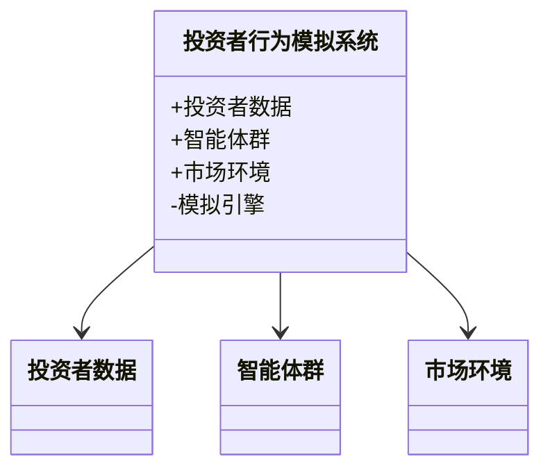
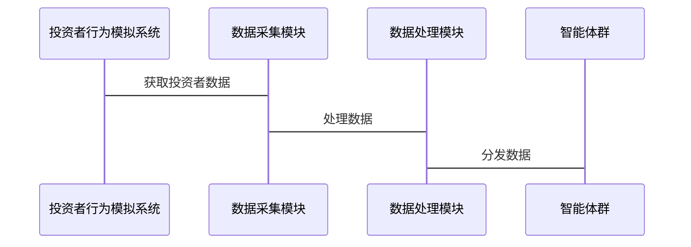

                 


# 智能体群体在模拟投资者行为中的应用

> **关键词**：智能体，投资者行为，群体智能，金融市场，模拟建模

> **摘要**：本文探讨智能体群体在模拟投资者行为中的应用，分析其在金融市场的潜力。通过建模投资者决策、设计智能体算法、构建系统架构，结合项目案例，展示其实际应用和优化策略。

---

## 第1章：智能体群体与投资者行为的背景

### 1.1 智能体的基本概念

#### 1.1.1 智能体的定义与特征
智能体（Agent）是能够感知环境并采取行动以实现目标的实体。其核心特征包括自主性、反应性、主动性、社会性。

#### 1.1.2 智能体与传统算法的区别
智能体能够适应环境变化，具备学习和决策能力，而传统算法依赖固定规则。

#### 1.1.3 智能体在金融领域的应用前景
智能体可模拟投资者行为，优化交易策略，提升市场分析能力。

### 1.2 投资者行为分析的基本概念

#### 1.2.1 投资者行为的定义与分类
投资者行为指投资者在金融市场中的决策和交易活动，可分为主动型、被动型和混合型。

#### 1.2.2 投资者决策的特征与影响因素
投资者决策受情绪、信息、市场环境等因素影响，具有复杂性和多样性。

#### 1.2.3 投资者行为模拟的挑战与意义
模拟投资者行为有助于理解市场动态，优化投资策略，但面临数据获取和模型复杂性等挑战。

---

## 第2章：智能体群体模拟投资者行为的核心概念

### 2.1 智能体群体的基本原理

#### 2.1.1 智能体的协作机制
智能体通过通信和协调实现协作，完成复杂任务。

#### 2.1.2 智能体群体的组织结构
包括层次结构和网状结构，适应不同场景。

#### 2.1.3 智能体群体的决策过程
基于个体和群体决策，动态调整策略。

### 2.2 投资者行为模拟的关键要素

#### 2.2.1 投资者情绪的建模
情绪影响投资决策，需通过模型量化。

#### 2.2.2 投资者策略的多样性
不同投资者策略导致市场多样性。

#### 2.2.3 投资者行为的动态变化
市场环境变化驱动投资者行为调整。

---

## 第3章：智能体群体与投资者行为的关联性分析

### 3.1 智能体群体模拟投资者行为的可行性

#### 3.1.1 智能体群体的适应性优势
具备快速适应和自我优化能力。

#### 3.1.2 投资者行为的复杂性与智能体的多样性
多样化的智能体能够模拟复杂投资者行为。

#### 3.1.3 智能体模拟的理论基础
基于行为主义和认知科学理论。

### 3.2 智能体群体模拟投资者行为的实现路径

#### 3.2.1 智能体的设计与实现
包括感知、决策、行动模块。

#### 3.2.2 投资者行为数据的采集与处理
使用大数据技术处理投资者数据。

#### 3.2.3 智能体群体与投资者行为的映射关系
建立行为模型和映射机制。

---

## 第4章：智能体行为的建模与分析

### 4.1 智能体行为建模的基本方法

#### 4.1.1 基于强化学习的建模
使用Q-learning算法，通过奖励机制优化策略。

#### 4.1.2 基于演化算法的建模
模拟自然选择过程，优化智能体行为。

#### 4.1.3 基于贝叶斯网络的建模
利用概率推理分析投资者行为。

### 4.2 智能体行为的数学模型

#### 4.2.1 强化学习模型
$$ R = r_1 + r_2 + \dots + r_n $$
其中，$R$ 是总奖励，$r_i$ 是每一步的奖励。

#### 4.2.2 演化算法模型
$$ fitness = f(f_1, f_2, \dots, f_n) $$
其中，$f_i$ 是适应度函数的参数。

---

## 第5章：智能体群体模拟投资者行为的系统设计

### 5.1 系统功能设计

#### 5.1.1 领域模型


#### 5.1.2 系统架构设计


#### 5.1.3 系统接口设计


---

## 第6章：智能体群体模拟投资者行为的项目实战

### 6.1 项目背景与目标

#### 6.1.1 项目背景
模拟股票市场中的投资者行为，优化交易策略。

#### 6.1.2 项目目标
实现智能体群体模拟，分析市场行为。

### 6.2 核心代码实现

#### 6.2.1 环境配置
安装必要的库：
```bash
pip install numpy matplotlib
```

#### 6.2.2 核心代码
```python
import numpy as np

class InvestorAgent:
    def __init__(self, id):
        self.id = id
        self.wallet = 10000  # 初始资金

    def decide(self, market_data):
        # 基于市场数据做出决策
        if market_data['price'] > market_data['ma20']:
            return 'buy'
        else:
            return 'sell'

# 初始化智能体群体
agents = [InvestorAgent(i) for i in range(100)]

# 模拟市场数据
market_data = {
    'price': np.random.randn(100).mean() * 100,
    'ma20': 100
}

# 分配数据并执行决策
for agent in agents:
    decision = agent.decide(market_data)
    print(f"Agent {agent.id} decides to {decision}")
```

---

## 第7章：智能体群体模拟投资者行为的案例分析

### 7.1 案例背景与分析

#### 7.1.1 案例背景
模拟股票市场的价格波动，分析智能体群体的交易行为。

#### 7.1.2 案例分析
通过数据可视化展示智能体的交易行为和市场影响。

### 7.2 智能体群体优化策略

#### 7.2.1 基于强化学习的优化
通过不断试错优化交易策略。

#### 7.2.2 基于演化算法的优化
模拟自然选择，保留优秀策略。

---

## 第8章：总结与展望

### 8.1 全文总结

智能体群体在模拟投资者行为中具备独特优势，能够模拟复杂市场行为，提供新的研究视角。

### 8.2 未来展望

未来将结合大数据和分布式计算，提升模拟精度和效率，拓展应用领域。

### 8.3 最佳实践 Tips

- 合理设计智能体行为模型，确保贴近实际。
- 定期更新模型参数，适应市场变化。
- 结合多种算法，提升模拟效果。

---

## 作者：AI天才研究院 & 禅与计算机程序设计艺术

