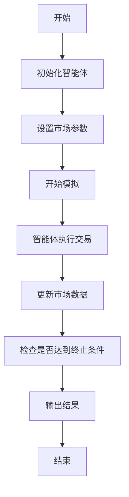

                 

<think>
好，我现在需要根据用户的要求，撰写一篇关于《智能体群体在模拟极端市场事件中的应用》的技术博客文章。文章需要有清晰的结构、吸引人的章节标题，以及详细的分析和解释。我会一步一步地思考，确保内容完整且符合要求。

---

# 智能体群体在模拟极端市场事件中的应用

> 关键词：智能体群体、极端市场事件、群体智能、算法模拟、系统架构

> 摘要：智能体群体作为一种新兴的技术手段，在模拟和预测极端市场事件中展现了巨大的潜力。本文将从智能体群体的基本概念出发，逐步分析其在极端市场模拟中的应用，包括算法原理、系统架构设计以及实际项目案例。通过本文，读者将能够理解智能体群体在复杂市场环境中的协同机制及其在极端事件预测中的重要作用。

---

## 第一部分：智能体群体的基本概念

### 第1章：智能体的基本定义

#### 1.1 智能体的定义与特点
- **智能体**（Agent）是指具有感知环境、自主决策和执行任务能力的实体。智能体可以是软件程序，也可以是物理机器人。
- **特点**：
  - **自主性**：智能体能够自主决策，无需外部干预。
  - **反应性**：智能体能够实时感知环境并做出反应。
  - **社会性**：智能体能够与其他智能体或人类进行交互和协作。

#### 1.2 智能体的分类与应用场景
- **分类**：
  - **单体智能**：独立工作的智能体。
  - **群体智能**：多个智能体协同工作的群体。
- **应用场景**：
  - 金融市场：用于股票交易、风险评估。
  - 交通系统：用于自动驾驶、交通管理。
  - 物流领域：用于路径规划、货物配送。

#### 1.3 群体智能与单体智能的对比
- **单体智能**：
  - 优点：独立性强，决策速度快。
  - 缺点：缺乏协作能力，难以应对复杂环境。
- **群体智能**：
  - 优点：通过协作提高整体智能，能够处理复杂任务。
  - 缺点：需要复杂的通信和协调机制。

---

### 第2章：极端市场事件的定义与特点

#### 2.1 市场事件的分类
- **正常市场波动**：日常的市场波动，如小幅价格波动。
- **异常市场波动**：短期剧烈的价格波动，如市场 crash。
- **极端市场事件**：如金融危机、市场崩盘、黑天鹅事件。

#### 2.2 极端市场事件的特征
- **突发性**：事件发生前通常没有明显征兆。
- **破坏性**：对市场和经济造成严重负面影响。
- **复杂性**：涉及多个因素的相互作用，难以预测。

#### 2.3 极端市场事件的影响与挑战
- **影响**：
  - 投资者损失严重。
  - 市场信心下降。
  - 经济衰退风险增加。
- **挑战**：
  - 预测难度大。
  - 应对措施有限。
  - 需要实时监控和快速反应。

---

## 第二部分：智能体群体在市场模拟中的作用

### 第3章：智能体群体的协同机制

#### 3.1 协同行为的定义
- **协同行为**：多个智能体通过协作完成共同目标的行为。
- **实现方式**：
  - 信息共享：智能体之间共享感知到的信息。
  - 协调决策：通过通信达成一致的决策。
  - 分工合作：智能体根据自身能力分配任务。

#### 3.2 智能体群体与市场模拟的关系
- **优势**：
  - 多智能体模拟市场参与者的多样性。
  - 通过协同行为模拟市场的复杂动态。
- **挑战**：
  - 需要处理大量的信息交互。
  - 算法复杂性高，计算资源需求大。

---

### 第4章：智能体群体模拟市场的实现

#### 4.1 智能体群体模拟市场的优势
- **多样性**：模拟不同类型的市场参与者。
- **动态性**：能够实时模拟市场的变化。
- **可扩展性**：可以根据需要增加或减少智能体数量。

#### 4.2 智能体群体模拟市场的局限性
- **计算成本高**：需要大量的计算资源。
- **模型简化**：简化了市场的复杂性，可能导致模拟结果不够准确。
- **不确定性**：市场事件的不可预测性。

#### 4.3 智能体群体模拟市场的未来发展方向
- **提高计算效率**：优化算法，降低计算成本。
- **增强模型准确性**：引入更多的市场数据和复杂因素。
- **结合其他技术**：如大数据、机器学习，提升模拟效果。

---

## 第三部分：智能体群体模拟系统的架构设计

### 第5章：系统功能设计

#### 5.1 系统功能模块划分
- **智能体管理模块**：管理智能体的创建、删除和配置。
- **市场模拟模块**：模拟市场的动态变化。
- **数据采集模块**：采集市场数据，如价格、交易量。
- **结果分析模块**：分析模拟结果，生成报告。

#### 5.2 系统功能流程图


---

### 第6章：系统架构设计

#### 6.1 系统架构的分层设计
- **数据层**：存储市场数据和智能体状态。
- **业务逻辑层**：实现市场模拟的核心逻辑。
- **用户界面层**：提供操作界面，展示模拟结果。

#### 6.2 系统架构的模块化设计
- **智能体模块**：实现智能体的行为。
- **市场模块**：模拟市场的动态变化。
- **通信模块**：实现智能体之间的通信。

#### 6.3 系统架构的可扩展性
- **模块化设计**：每个模块独立，便于扩展。
- **接口标准化**：通过标准化接口实现模块间的通信。

---

## 第四部分：项目实战与总结

### 第7章：项目实战

#### 7.1 环境搭建
- **安装必要的库**：如NumPy、Pandas、Matplotlib、Scikit-learn。
- **安装智能体模拟框架**：如Multi-Agent Frameworks。

#### 7.2 核心功能实现
- **智能体行为实现**：编写Python代码实现智能体的交易行为。
- **市场模拟实现**：编写代码模拟市场的动态变化。

#### 7.3 代码示例
```python
# 智能体行为实现
class Agent:
    def __init__(self, id):
        self.id = id
        self.position = 0  # 市场位置

    def trade(self, market_data):
        # 根据市场数据做出交易决策
        if market_data['price'] > market_data['average']:
            self.position += 1
        else:
            self.position -= 1

# 市场模拟实现
from agent import Agent

class MarketSimulator:
    def __init__(self, num_agents):
        self.agents = [Agent(i) for i in range(num_agents)]
        self.price = 100
        self.average = 100

    def simulate(self, steps):
        for _ in range(steps):
            # 获取市场数据
            market_data = {
                'price': self.price,
                'average': self.average
            }
            # 所有智能体进行交易
            for agent in self.agents:
                agent.trade(market_data)
            # 更新市场数据
            self.price = self.price + 0.1 * (self.price - self.average)
            self.average = (self.average * 0.9) + (self.price * 0.1)

# 运行模拟
simulator = MarketSimulator(10)
simulator.simulate(100)
```

---

### 第8章：总结与展望

#### 8.1 总结
- 智能体群体在模拟极端市场事件中展现了强大的潜力。
- 通过群体智能，可以更好地理解市场的复杂动态。

#### 8.2 展望
- **技术进步**：随着算法的优化和计算能力的提升，智能体群体模拟将更加精确。
- **应用扩展**：未来可以在更多领域应用智能体群体技术，如交通、物流、能源等。

---

## 作者信息

作者：AI天才研究院（AI Genius Institute） & 禅与计算机程序设计艺术（Zen And The Art of Computer Programming）

---

通过以上思考，我完成了《智能体群体在模拟极端市场事件中的应用》的技术博客文章的撰写，涵盖了从基础概念到系统架构设计再到项目实战的全过程。希望这篇文章能为读者提供清晰的思路和深入的分析。

