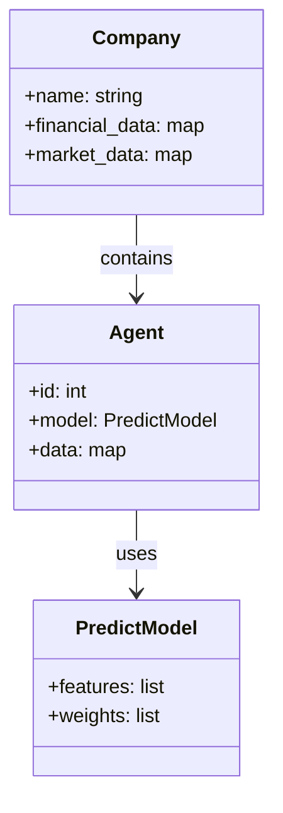
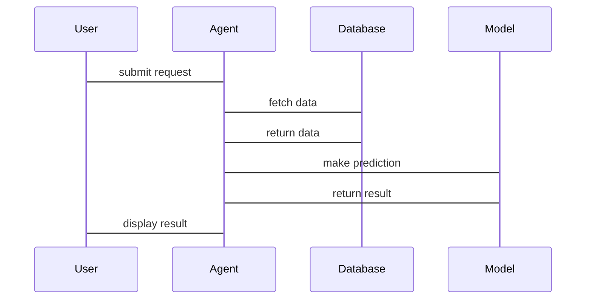

                 


# 智能体群体在预测公司破产风险中的应用

## 关键词：智能体群体、公司破产风险、预测模型、群体智能、算法实现

## 摘要

智能体群体是一种新兴的人工智能技术，通过多个智能体的协同工作，能够有效地进行复杂问题的预测和分析。本文将探讨智能体群体在公司破产风险预测中的应用，从理论到实践，详细分析其核心概念、算法实现、系统架构以及实际案例。通过本文，读者可以深入了解智能体群体如何帮助预测公司破产风险，并在实际应用中提供有效的解决方案。

---

## 第一部分: 智能体群体与公司破产风险预测概述

### 第1章: 智能体群体的基本概念与应用背景

#### 1.1 智能体群体的定义与特点

- **智能体的定义**  
智能体（Agent）是一种能够感知环境并采取行动以实现目标的实体。智能体可以是软件程序、机器人或其他能够自主决策的实体。

- **智能体群体的特征**  
智能体群体由多个智能体组成，通过协同工作实现比单个智能体更复杂的任务。群体智能具有分布式、自适应和协同优化的特点。

- **智能体群体的应用领域**  
智能体群体广泛应用于金融、物流、医疗、教育等领域。在金融领域，智能体群体可以用于股票交易、风险管理、信用评估等。

#### 1.2 公司破产风险预测的背景与意义

- **破产风险预测的重要性**  
公司破产不仅影响企业自身，还会对债权人、股东和相关利益方造成重大损失。因此，准确预测公司破产风险具有重要的经济意义。

- **破产预测的传统方法与局限性**  
传统的破产预测方法主要包括财务比率分析和统计模型。这些方法在一定程度上可以预测破产风险，但存在数据依赖性强、模型复杂性高、实时性差等局限性。

- **智能体群体在破产预测中的潜力**  
智能体群体能够通过分布式计算和协同学习，提高预测的准确性和实时性。同时，智能体群体能够处理多源异构数据，增强预测的全面性。

### 1.3 本章小结

本章介绍了智能体群体的基本概念和特点，并探讨了其在公司破产风险预测中的应用背景和意义。通过对比传统方法与智能体群体的优势，明确了智能体群体在破产预测中的潜力。

---

## 第二部分: 智能体群体的核心概念与原理

### 第2章: 智能体群体的核心概念

#### 2.1 智能体的定义与分类

- **单智能体与群体智能的对比**  
单智能体独立工作，而群体智能通过多个智能体的协同实现复杂任务。

- **智能体的分类与特征**  
智能体可以分为反应式智能体、认知式智能体和混合智能体。反应式智能体基于当前环境信息做出决策，认知式智能体具有记忆和推理能力，混合智能体结合了两种类型的特点。

- **智能体群体的特征与优势**  
智能体群体具有分布式计算、自适应性和协同优化的优势，能够处理复杂和动态的环境。

#### 2.2 智能体群体的协同机制

- **协同行为的定义**  
协同行为是指多个智能体通过合作完成共同目标的行为。

- **协同机制的关键要素**  
协同机制包括通信协议、任务分配、协作策略和冲突解决等关键要素。

- **协同行为的实现方式**  
智能体群体可以通过分布式计算、基于规则的协作和基于学习的协作实现协同行为。

#### 2.3 智能体群体与破产预测的关系

- **智能体群体在金融领域的应用**  
智能体群体可以用于股票交易、信用评估、风险管理等领域。

- **破产预测中的智能体群体模型**  
智能体群体可以通过协同学习和分布式计算，提高破产预测的准确性和实时性。

### 第3章: 智能体群体的核心原理

#### 3.1 智能体的感知与决策机制

- **感知模块的功能与实现**  
感知模块负责获取环境信息，包括财务数据、市场数据等。

- **决策模块的算法与策略**  
决策模块基于感知信息，采用机器学习算法（如决策树、随机森林）做出决策。

- **感知与决策的协同优化**  
通过优化感知和决策的协同，提高智能体的预测能力。

#### 3.2 智能体群体的通信与协作机制

- **通信协议的设计与实现**  
智能体之间通过特定协议交换信息，如使用消息队列或事件驱动机制。

- **协作任务的分配与协调**  
通过任务分配算法（如贪心算法）实现协作任务的分配和协调。

- **群体智能的自适应调整**  
智能体群体能够根据环境变化自适应调整协作策略，提高预测能力。

#### 3.3 智能体群体的数学模型与公式

- **单智能体的决策模型**  
单智能体的决策模型可以表示为：  
$$ P(y|x) = \prod_{i=1}^{n} P(y|x_i) $$  
其中，$x_i$ 是输入特征，$y$ 是输出结果。

- **群体智能的协同模型**  
群体智能的协同模型可以表示为：  
$$ f(x) = \sum_{i=1}^{m} w_i \cdot f_i(x) $$  
其中，$w_i$ 是第 $i$ 个智能体的权重，$f_i(x)$ 是第 $i$ 个智能体的预测结果。

---

## 第三部分: 智能体群体在破产预测中的算法实现

### 第4章: 常见的智能体群体算法

#### 4.1 基于群体智能的算法概述

- **粒子群优化算法（PSO）**  
粒子群优化算法是一种模拟鸟群觅食行为的优化算法，常用于解决连续优化问题。

- **蚂蚁算法（ACO）**  
蚂蚁算法是一种模拟蚂蚁觅食行为的优化算法，常用于解决组合优化问题。

- **蝙蝠算法（BA）**  
蝙蝠算法是一种模拟蝙蝠回声定位行为的优化算法，常用于解决全局优化问题。

#### 4.2 破产预测中的智能体群体算法选择

- **不同算法的优缺点对比**  
PSO算法收敛速度快，但容易陷入局部最优；ACO算法适用于组合优化问题，但收敛速度较慢；BA算法全局搜索能力强，但实现复杂。

- **破产预测场景下的算法适用性**  
根据问题特点选择合适的算法，如使用PSO算法进行特征选择，使用ACO算法进行任务分配。

- **算法选择的依据与原则**  
算法选择应考虑问题规模、数据特征、计算资源等因素。

### 第5章: 破产预测的智能体群体算法实现

#### 5.1 算法实现的步骤与流程

1. **数据采集与预处理**  
收集公司财务数据、市场数据等，进行数据清洗和特征提取。

2. **智能体初始化**  
定义智能体的感知模块和决策模块，初始化智能体的参数和权重。

3. **智能体协同计算**  
通过智能体之间的通信与协作，完成数据的分布式计算和协同学习。

4. **模型训练与优化**  
使用机器学习算法训练模型，并通过群体智能优化模型参数。

5. **结果分析与评估**  
评估模型的准确率、召回率等指标，优化模型性能。

---

## 第四部分: 智能体群体在破产预测中的系统架构与应用

### 第6章: 智能体群体的系统架构设计

#### 6.1 系统功能设计

- **领域模型类图**  


- **系统架构设计**  


- **系统接口设计**  
定义智能体之间的通信接口，如`exchange_info()`、`make_decision()`等。

- **系统交互流程**  


### 第7章: 项目实战与案例分析

#### 7.1 环境配置

- **开发环境**  
建议使用Python 3.8以上版本，安装必要的库如`pandas`、`scikit-learn`、`networkx`等。

- **工具安装**  
安装Mermaid工具用于绘制图表，安装Jupyter Notebook用于代码实现。

#### 7.2 系统核心实现源代码

```python
import numpy as np
import pandas as pd
from sklearn.tree import DecisionTreeClassifier
from sklearn.ensemble import RandomForestClassifier

class Agent:
    def __init__(self, id):
        self.id = id
        self.model = None
        self.data = None

    def perceive(self, data):
        self.data = data

    def decide(self):
        if self.data is not None:
            # 使用决策树模型进行预测
            y_pred = self.model.predict(self.data)
            return y_pred
        else:
            return None

# 初始化智能体
agents = [Agent(i) for i in range(5)]

# 初始化模型
for agent in agents:
    agent.model = DecisionTreeClassifier()

# 智能体协同计算
data = pd.read_csv('financial_data.csv')
for agent in agents:
    agent.perceive(data)

results = []
for agent in agents:
    result = agent.decide()
    results.append(result)

# 组合结果
final_result = np.mean(results, axis=0)
print(final_result)
```

#### 7.3 案例分析与结果解读

- **案例分析**  
以某公司为例，使用智能体群体模型进行破产预测。通过数据采集、模型训练和预测，得到最终结果。

- **结果解读**  
解释模型预测的结果，分析预测的准确性和可信度。

#### 7.4 项目小结

总结项目实施过程中的经验与教训，提出改进建议。

---

## 第五部分: 总结与展望

### 第8章: 总结与展望

#### 8.1 总结

智能体群体在公司破产风险预测中具有重要的应用价值。通过协同学习和分布式计算，智能体群体能够提高预测的准确性和实时性。

#### 8.2 未来展望

未来，智能体群体将在破产预测中得到更广泛的应用。可以通过优化算法、增强数据处理能力等方式，进一步提升预测效果。

#### 8.3 最佳实践 tips

- **数据质量**  
确保数据的准确性和完整性，避免数据偏差。

- **算法选择**  
根据具体问题选择合适的算法，避免盲目使用流行算法。

- **系统架构**  
设计合理的系统架构，确保系统的可扩展性和可维护性。

#### 8.4 注意事项

- **隐私保护**  
在处理公司数据时，要注意保护隐私，遵守相关法律法规。

- **模型解释性**  
模型的解释性对于实际应用非常重要，避免使用过于复杂的模型。

#### 8.5 拓展阅读

推荐相关书籍和论文，如《 Swarm Intelligence in Financial Risk Management》。

---

## 作者：AI天才研究院 & 禅与计算机程序设计艺术

---

这篇文章详细介绍了智能体群体在公司破产风险预测中的应用，从理论到实践，涵盖了核心概念、算法实现、系统架构和项目实战等内容。通过本文，读者可以深入了解智能体群体在破产预测中的潜力和实际应用价值。

