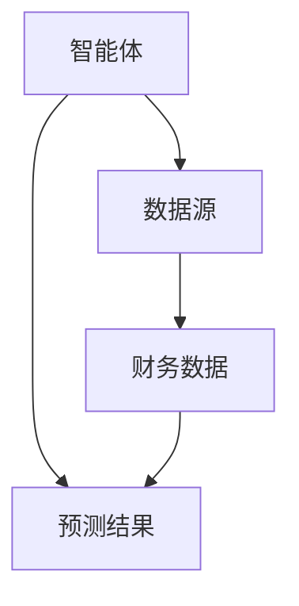

                 

# 智能体群体在预测公司财务困境中的应用

## 关键词：智能体群体，财务困境预测，群体智能，预测模型，算法原理，系统架构

## 摘要：  
随着企业面临越来越复杂的财务挑战，传统的财务困境预测方法逐渐显现出其局限性。智能体群体作为一种新兴的人工智能技术，通过多个智能体的协同工作，能够更高效、更准确地预测公司财务困境。本文将详细探讨智能体群体的基本概念、算法原理、系统架构设计以及实际应用，结合具体案例分析，为读者提供深入的技术解析和实践指导。

---

# 第一部分：智能体群体的基本概念

## 第1章：智能体的基本定义

### 1.1 智能体的定义与特点
- **智能体的定义**：智能体（Agent）是指能够感知环境、做出决策并采取行动的实体，具备自主性、反应性、目标导向性和社会性等特征。
- **智能体与传统预测模型的对比**：传统模型通常基于规则或统计方法，而智能体具备更强的自主学习和适应能力。
- **智能体在预测中的优势**：智能体能够处理复杂数据，发现非线性关系，并通过分布式计算提高预测准确性。

### 1.2 智能体群体的概念
- **智能体群体的定义**：由多个智能体组成的集合，通过协同工作完成复杂任务。
- **智能体群体与个体智能体的对比**：个体智能体独立运作，而群体智能体通过通信和协作提升整体性能。
- **智能体群体在预测中的应用潜力**：通过分布式计算和多目标优化，智能体群体能够更高效地处理大规模数据。

## 第2章：财务困境预测的背景与挑战

### 2.1 财务困境预测的基本概念
- **财务困境的定义**：企业因财务状况恶化而面临破产或重组的风险。
- **财务困境预测的意义**：帮助企业及时采取措施，降低风险，保护利益相关者。

### 2.2 财务困境预测中的传统方法
- **财务比率分析法**：通过分析企业的财务比率（如流动比率、速动比率）预测财务困境。
- **专家系统法**：依赖专家经验，基于规则进行预测。
- **机器学习方法**：使用监督学习算法（如支持向量机、随机森林）进行预测。

### 2.3 智能体群体在财务困境预测中的优势
- **高维数据处理能力**：智能体群体能够处理多维度、复杂的数据。
- **分布式计算的优势**：通过分布式计算提高处理效率。
- **多目标优化能力**：智能体群体能够同时优化多个目标，如准确性和计算效率。

## 第3章：智能体群体的核心概念与联系

### 3.1 智能体群体的核心原理
- **个体智能体的行为规则**：每个智能体基于局部信息做出决策。
- **群体智能体的协同机制**：通过通信和协作实现全局优化。
- **智能体群体的自适应能力**：能够根据环境变化调整行为策略。

### 3.2 智能体群体与财务数据的关系
- **财务数据的特征分析**：包括财务比率、市场数据、企业行为等多维度信息。
- **智能体对财务数据的处理方式**：通过分布式计算和协同学习处理数据。
- **数据驱动的智能体行为**：智能体基于数据特征调整预测策略。

### 3.3 智能体群体的ER实体关系图

---

# 第二部分：智能体群体预测算法原理

## 第4章：智能体群体预测算法原理

### 4.1 群体智能算法概述
- **粒子群优化算法（PSO）**：通过模拟鸟群觅食行为，寻找最优解。
- **遗传算法（GA）**：基于生物进化原理，通过选择、交叉和变异操作优化解。

### 4.2 集成学习方法
- **集成学习的基本原理**：通过组合多个弱学习器，提升整体性能。
- **Bagging和Boosting方法**：Bagging通过随机采样生成多个基模型，Boosting通过加权更新数据提高准确率。

### 4.3 算法实现与优化
- **算法实现流程**：数据预处理、模型训练、结果评估。
- **算法优化策略**：参数调整、并行计算、分布式训练。

---

# 第三部分：数学模型与系统架构

## 第5章：数学模型与算法实现

### 5.1 预测模型的建立
- **个体模型构建**：每个智能体基于局部数据建立预测模型。
- **群体模型构建**：通过智能体协同优化全局模型。

### 5.2 模型的性能评估
- **评估指标**：准确率、召回率、F1分数。
- **模型优化**：基于评估结果调整模型参数。

## 第6章：系统架构设计

### 6.1 系统功能设计
- **模块划分**：数据采集模块、智能体模块、预测模块、结果展示模块。
- **系统架构图**：展示各模块之间的关系和数据流。

### 6.2 系统交互设计
- **数据流图**：展示数据在系统中的流动过程。
- **序列图**：展示智能体之间的协作过程。

---

# 第四部分：项目实战与案例分析

## 第7章：项目实战

### 7.1 环境安装与配置
- **工具安装**：安装Python、机器学习库（如scikit-learn、TensorFlow）、分布式计算框架（如Dask）。
- **数据准备**：收集企业财务数据，清洗和预处理。

### 7.2 系统核心代码实现
- **智能体类的实现**：定义智能体的行为和通信方式。
- **预测模型的实现**：基于智能体协同优化的预测算法。

### 7.3 案例分析与结果解读
- **案例分析**：选择典型企业，分析其财务状况。
- **结果解读**：解释智能体群体预测的结果，并对比传统方法。

---

# 第五部分：总结与展望

## 第8章：总结与展望

### 8.1 全文总结
- 回顾全文，总结智能体群体在财务困境预测中的应用及其优势。

### 8.2 最佳实践 tips
- **数据质量的重要性**：确保数据的准确性和完整性。
- **模型调优的技巧**：合理选择参数和优化策略。

### 8.3 未来的研究方向
- **智能体群体的优化**：探索更高效的协同机制和算法。
- **应用场景的扩展**：将智能体群体应用于更多领域，如金融风险预测、市场趋势分析。

### 8.4 小结
智能体群体在财务困境预测中的应用展现出巨大的潜力，未来的研究和实践将进一步推动其发展。

---

**作者：AI天才研究院/AI Genius Institute & 禅与计算机程序设计艺术 /Zen And The Art of Computer Programming**

---

通过以上目录结构，我们可以看到文章从理论到实践，从概念到算法，从系统设计到项目实战，全面、系统地探讨了智能体群体在预测公司财务困境中的应用。每一部分都紧密联系，逻辑清晰，内容详实，为读者提供了深入的技术解析和实践指导。

