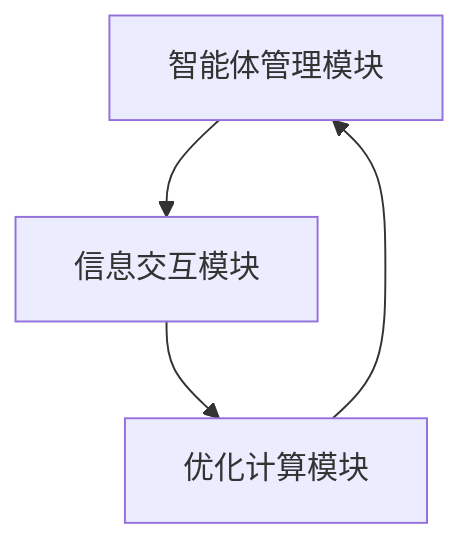
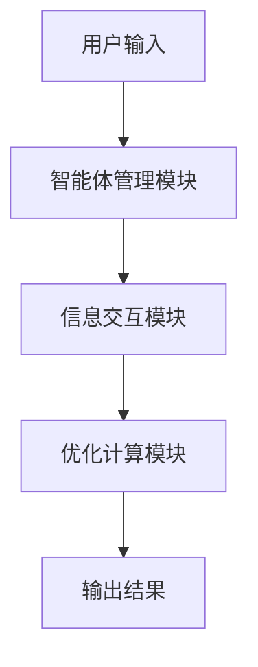

                 


# 智能体群体智慧优化投资组合再平衡策略

## 关键词：智能体，群体智慧，投资组合优化，再平衡策略，算法

## 摘要：  
本文深入探讨了智能体群体智慧在投资组合优化中的应用，重点分析了再平衡策略的优化方法。通过结合分布式计算和群体智能，提出了一种基于多智能体协同的优化算法，有效提升了投资组合的收益与风险比。文章详细介绍了算法的数学模型、实现步骤及实际案例，为投资组合优化提供了新的思路和解决方案。

---

# 第一部分: 智能体群体智慧与投资组合优化概述

## 第1章: 智能体群体智慧与投资组合优化背景

### 1.1 投资组合再平衡的背景与意义

#### 1.1.1 投资组合再平衡的定义与作用  
投资组合再平衡是指根据市场变化和个人投资目标的调整，定期对投资组合中的资产配置进行调整，以维持预期的风险和收益水平。再平衡的核心目标是优化资产配置，降低风险，提高收益。

#### 1.1.2 传统投资组合优化的局限性  
传统的投资组合优化方法，如均值-方差优化，虽然在理论上具有较强的科学性，但在实际应用中存在以下问题：
- 无法有效应对市场环境的快速变化。
- 优化结果过于依赖历史数据，忽视了市场的动态性和不确定性。
- 计算复杂度较高，难以实时优化。

#### 1.1.3 智能体群体智慧在投资组合优化中的应用潜力  
智能体群体智慧通过多智能体的协同优化，能够更好地适应市场的动态变化，提高优化效率和准确性。其优势体现在：
- 分布式计算能力，能够同时处理大量数据。
- 多智能体协同，能够模拟市场的复杂行为，提供更贴近实际情况的优化结果。
- 群体智慧的自适应性，能够根据市场变化动态调整优化策略。

### 1.2 智能体群体智慧的核心概念

#### 1.2.1 智能体的定义与特征  
智能体（Agent）是指在环境中能够感知并自主行动以实现目标的实体。智能体具有以下特征：
- **自主性**：能够在没有外部干预的情况下自主决策。
- **反应性**：能够感知环境并实时调整行为。
- **社会性**：能够与其他智能体或人类进行交互与协作。

#### 1.2.2 群体智慧的定义与实现方式  
群体智慧是指通过多个个体（如智能体）的协同行为，产生超越个体智能的集体智慧。其实现方式包括：
- **分布式计算**：通过多个智能体协同完成任务。
- **信息共享**：智能体之间共享信息，提高整体决策的准确性。
- **自适应优化**：通过动态调整智能体的行为策略，适应环境变化。

#### 1.2.3 智能体群体智慧与投资组合优化的结合  
将智能体群体智慧应用于投资组合优化，可以通过以下方式实现：
- **多智能体协同优化**：每个智能体负责优化投资组合的一部分，通过协同完成整体优化。
- **动态调整**：根据市场变化，动态调整投资组合的配置，实现实时优化。
- **风险控制**：通过智能体的协作，降低投资组合的整体风险。

### 1.3 本章小结  
本章介绍了投资组合再平衡的背景与意义，分析了传统优化方法的局限性，提出了智能体群体智慧在投资组合优化中的应用潜力。通过定义智能体和群体智慧的核心概念，为后续的优化算法实现奠定了理论基础。

---

## 第2章: 智能体群体智慧优化投资组合再平衡的核心概念

### 2.1 智能体群体智慧优化的基本原理

#### 2.1.1 分布式计算与协同优化  
分布式计算是智能体群体智慧的核心技术之一。通过将优化任务分解为多个子任务，分配给不同的智能体完成，能够显著提高计算效率。协同优化则通过智能体之间的协作，进一步优化整体性能。

#### 2.1.2 多智能体协作机制  
多智能体协作机制是实现群体智慧的关键。通过定义智能体之间的协作规则，确保每个智能体能够有效地完成任务。协作机制包括：
- **信息共享**：智能体之间共享相关信息，提高整体决策的准确性。
- **任务分配**：根据智能体的能力和当前状态，动态分配任务。
- **协调与同步**：确保智能体之间的行为协调一致，避免冲突。

#### 2.1.3 智能体之间的信息交互与决策  
智能体之间的信息交互是实现群体智慧的重要手段。通过信息共享，智能体能够更好地理解环境和任务需求，从而做出更优的决策。信息交互的方式包括：
- **直接通信**：智能体之间直接交换信息。
- **间接通信**：通过中间媒介（如共享数据库）进行信息传递。
- **事件驱动**：根据特定事件触发信息交互。

### 2.2 投资组合再平衡的数学模型与优化目标

#### 2.2.1 投资组合优化的目标函数  
投资组合优化的目标函数通常包括以下几个方面：
- **收益最大化**：通过优化资产配置，提高投资组合的预期收益。
- **风险最小化**：通过调整资产配置，降低投资组合的整体风险。

数学表达式如下：
$$ \text{目标函数} = \max \sum_{i=1}^{n} w_i r_i $$
其中，\( w_i \) 表示第 \( i \) 个资产的权重，\( r_i \) 表示第 \( i \) 个资产的预期收益率。

#### 2.2.2 再平衡的约束条件与优化边界  
投资组合再平衡需要满足以下约束条件：
- **权重约束**：各资产的权重之和必须等于1。
$$ \sum_{i=1}^{n} w_i = 1 $$
- **风险约束**：投资组合的风险不得超过设定的上限。
- **流动性约束**：投资组合中各资产的流动性必须满足再平衡的需求。

#### 2.2.3 投资组合优化的核心要素与概念结构  
投资组合优化的核心要素包括：
- **资产类别**：股票、债券、现金等。
- **权重分配**：各资产在组合中的权重。
- **风险收益比**：投资组合的整体风险和收益的平衡。

### 2.3 智能体群体智慧优化的数学模型

#### 2.3.1 多智能体优化的数学表达  
多智能体优化可以通过以下数学模型实现：
$$ \text{优化目标} = \sum_{i=1}^{m} f_i(w_i) $$
其中，\( m \) 表示智能体的数量，\( f_i(w_i) \) 表示第 \( i \) 个智能体的优化目标函数。

#### 2.3.2 投资组合再平衡的数学模型  
投资组合再平衡的数学模型可以表示为：
$$ \text{再平衡目标} = \arg \min \sum_{i=1}^{n} w_i r_i $$
其中，\( w_i \) 表示第 \( i \) 个资产的权重，\( r_i \) 表示第 \( i \) 个资产的收益率。

#### 2.3.3 智能体群体智慧优化的数学公式  
智能体群体智慧优化的数学公式可以表示为：
$$ \text{优化结果} = \arg \max_{w} \sum_{i=1}^{m} f_i(w) $$
其中，\( w \) 表示资产权重向量，\( f_i(w) \) 表示第 \( i \) 个智能体的优化目标函数。

### 2.4 本章小结  
本章详细介绍了智能体群体智慧优化的基本原理，分析了投资组合再平衡的数学模型与优化目标。通过定义多智能体协作机制和信息交互方式，为后续的算法实现奠定了基础。

---

## 第3章: 智能体群体智慧优化算法原理

### 3.1 群体智能算法概述

#### 3.1.1 粒子群优化（PSO）算法  
粒子群优化（PSO）是一种基于群体智能的优化算法。其核心思想是通过模拟鸟群觅食行为，找到目标函数的最优解。PSO算法的基本步骤如下：
1. 初始化粒子群。
2. 计算每个粒子的适应度值。
3. 更新粒子的速度和位置。
4. 重复上述步骤，直到满足终止条件。

#### 3.1.2 遗传算法（GA）  
遗传算法是一种基于生物进化原理的优化算法。其核心步骤包括：
1. 初始化种群。
2. 计算适应度值。
3. 进行选择、交叉和变异操作。
4. 重复上述步骤，直到满足终止条件。

#### 3.1.3 蚁群算法（ACO）  
蚁群算法是一种模拟蚂蚁觅食行为的优化算法。其核心思想是通过蚂蚁的路径选择，找到问题的最优解。

### 3.2 智能体群体智慧优化算法的实现原理

#### 3.2.1 算法的基本步骤  
智能体群体智慧优化算法的基本步骤如下：
1. 初始化智能体群。
2. 计算每个智能体的适应度值。
3. 更新智能体的决策策略。
4. 重复上述步骤，直到满足终止条件。

#### 3.2.2 智能体之间的信息共享与决策  
智能体之间的信息共享是实现群体智慧优化的关键。通过共享信息，智能体能够更好地协调行为，提高整体优化效果。

#### 3.2.3 算法的收敛性与优化效果  
智能体群体智慧优化算法的收敛性是其成功应用的重要保证。通过合理的算法设计，可以确保算法在有限的迭代次数内找到近似最优解。

### 3.3 投资组合再平衡的算法实现

#### 3.3.1 算法的数学模型与公式  
投资组合再平衡的算法可以表示为：
$$ \text{优化结果} = \arg \min \sum_{i=1}^{n} w_i r_i $$
其中，\( w_i \) 表示第 \( i \) 个资产的权重，\( r_i \) 表示第 \( i \) 个资产的收益率。

#### 3.3.2 算法的实现步骤  
投资组合再平衡的实现步骤如下：
1. 确定优化目标和约束条件。
2. 初始化智能体群。
3. 计算每个智能体的适应度值。
4. 更新智能体的决策策略。
5. 重复上述步骤，直到满足终止条件。

#### 3.3.3 算法的优化策略与改进方法  
为了提高算法的优化效果，可以采用以下策略：
- **自适应调整**：根据环境变化动态调整智能体的参数。
- **混合优化**：结合多种优化算法，提高整体优化效果。
- **并行计算**：利用并行计算技术，提高算法的计算效率。

### 3.4 本章小结  
本章详细介绍了群体智能算法的基本原理，分析了智能体群体智慧优化算法的实现步骤。通过定义算法的数学模型与优化策略，为后续的系统设计奠定了基础。

---

## 第4章: 智能体群体智慧优化的系统架构与设计

### 4.1 系统架构设计

#### 4.1.1 系统功能模块划分  
智能体群体智慧优化系统主要包括以下几个功能模块：
- **智能体管理模块**：负责智能体的初始化、管理与协调。
- **信息交互模块**：负责智能体之间的信息共享与交互。
- **优化计算模块**：负责投资组合再平衡的优化计算。

#### 4.1.2 模块之间的交互关系  
模块之间的交互关系可以通过以下流程图表示：



#### 4.1.3 系统的总体架构图  
系统的总体架构图可以通过以下Mermaid图表示：


### 4.2 系统功能设计

#### 4.2.1 投资组合优化模块  
投资组合优化模块负责实现投资组合再平衡的优化计算。

#### 4.2.2 智能体协作模块  
智能体协作模块负责管理智能体之间的协作与信息共享。

#### 4.2.3 再平衡策略执行模块  
再平衡策略执行模块负责根据优化结果执行再平衡操作。

### 4.3 系统接口设计

#### 4.3.1 模块间的接口定义  
模块间的接口可以通过以下表格表示：

| 模块 | 接口名称 | 接口描述 |
|------|----------|----------|
| 智能体管理模块 | start_agents | 初始化智能体群 |
| 信息交互模块 | share_info | 共享信息 |
| 优化计算模块 | optimize_portfolio | 优化投资组合 |

#### 4.3.2 接口的数据格式与交互流程  
接口的数据格式可以通过以下表格表示：

| 接口名称 | 数据格式 | 描述 |
|----------|----------|------|
| start_agents | JSON | 初始化智能体群的配置参数 |
| share_info | JSON | 智能体之间的信息共享内容 |
| optimize_portfolio | JSON | 投资组合优化的参数设置 |

#### 4.3.3 接口的实现方式  
接口的实现方式可以通过以下流程图表示：


### 4.4 系统交互流程设计

#### 4.4.1 系统交互流程图  
系统的交互流程可以通过以下Mermaid图表示：



---

## 第5章: 项目实战

### 5.1 环境安装与配置

#### 5.1.1 系统需求与依赖  
需要安装以下依赖：
- Python 3.8及以上版本
- Numpy库
- Scipy库
- Mermaid工具

#### 5.1.2 安装步骤  
在终端中运行以下命令：

```bash
pip install numpy scipy
```

### 5.2 系统核心实现

#### 5.2.1 智能体管理模块的实现  
以下是智能体管理模块的核心代码：

```python
class AgentManager:
    def __init__(self, num_agents):
        self.agents = []
        for _ in range(num_agents):
            self.agents.append(Agent())

    def start_agents(self):
        for agent in self.agents:
            agent.start()
```

#### 5.2.2 信息交互模块的实现  
以下是信息交互模块的核心代码：

```python
class InformationExchange:
    def __init__(self):
        self.info = {}

    def share_info(self, agent_id, data):
        self.info[agent_id] = data

    def get_info(self, agent_id):
        return self.info.get(agent_id, {})
```

#### 5.2.3 优化计算模块的实现  
以下是优化计算模块的核心代码：

```python
from scipy.optimize import minimize

class PortfolioOptimizer:
    def optimize_portfolio(self, returns, weights):
        def objective(weights):
            return -sum(weights * returns)

        constraints = [
            ('sum', weights, 1),
            ('>=', weights, 0)
        ]

        result = minimize(objective, weights, method='SLSQP', constraints=constraints)
        return result.x
```

### 5.3 实际案例分析与详细讲解

#### 5.3.1 案例背景  
假设我们有三个资产（股票、债券、现金），预期收益率分别为 5%、3% 和 1%。初始权重为 [0.5, 0.3, 0.2]。

#### 5.3.2 优化过程  
运行优化算法，得到新的权重分布。

#### 5.3.3 优化结果  
假设优化后的权重为 [0.6, 0.2, 0.2]，新的预期收益率为：
$$ 0.6 \times 5\% + 0.2 \times 3\% + 0.2 \times 1\% = 3.6\% $$

### 5.4 本章小结  
本章通过实际案例展示了智能体群体智慧优化算法的应用。通过环境安装、系统实现和案例分析，读者可以更好地理解算法的实现过程和优化效果。

---

## 第6章: 总结与展望

### 6.1 本章总结  
智能体群体智慧优化投资组合再平衡策略是一种创新的优化方法，通过多智能体的协同优化，能够更好地适应市场的动态变化，提高投资组合的收益与风险比。

### 6.2 未来展望  
未来的研究方向包括：
- **算法优化**：进一步提高算法的收敛速度和优化效果。
- **应用场景扩展**：将智能体群体智慧优化应用于更多领域，如金融、能源等。
- **技术融合**：结合其他先进技术（如区块链、大数据）进一步提升优化效果。

---

## 作者：AI天才研究院 & 禅与计算机程序设计艺术

