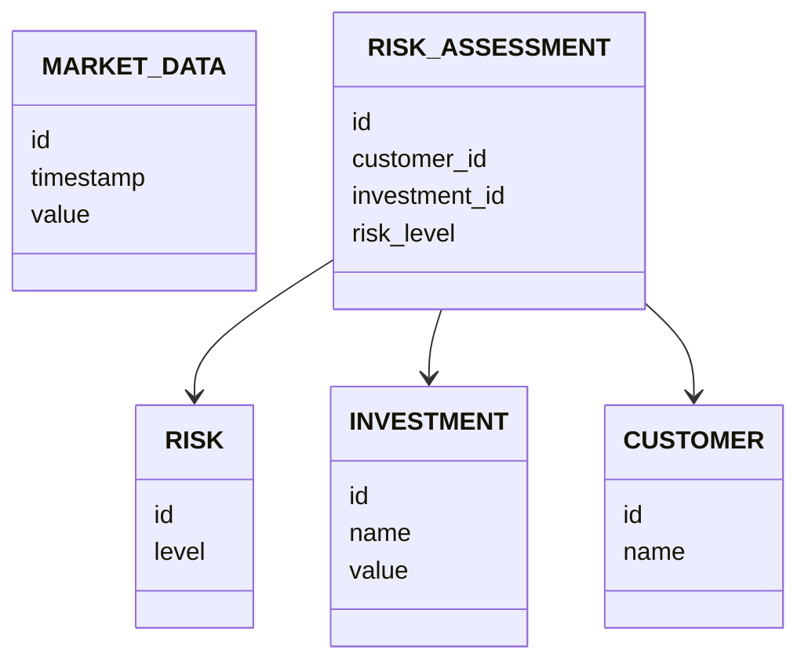
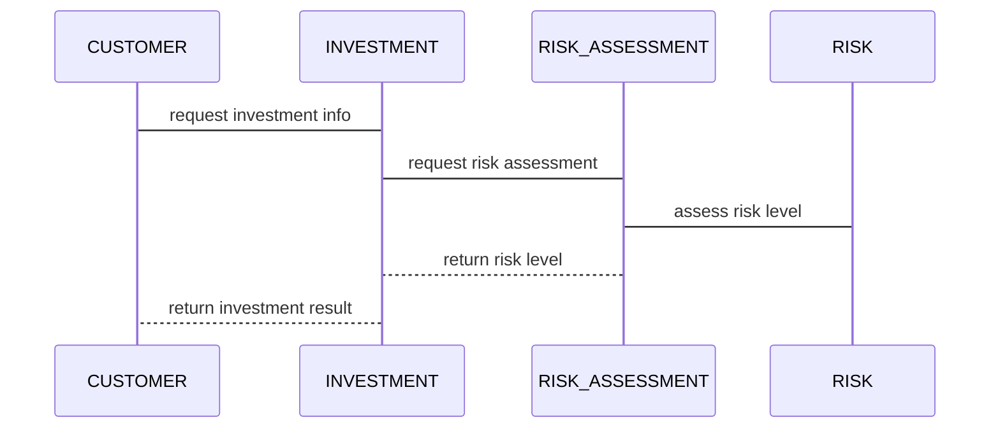

                 


# 智能体群体智慧在识别价值陷阱中的应用：避免投资误区

> 关键词：智能体群体智慧，价值陷阱，投资误区，算法原理，系统架构设计

> 摘要：本文详细探讨了智能体群体智慧在识别价值陷阱中的应用，通过分析传统投资方法的局限性，提出了一种基于智能体的群体智慧算法，结合数学模型和系统架构设计，提供了一种避免投资误区的新思路。文章从理论到实践，详细讲解了算法原理、系统设计、项目实现及案例分析，为投资者提供了科学的决策支持工具。

---

## 第一章：智能体群体智慧概述

### 1.1 智能体的基本概念
智能体（Agent）是指在环境中能够感知并自主行动以实现目标的实体。智能体可以是软件程序、机器人或其他具备自主决策能力的系统。群体智能则指多个智能体协同工作，通过分布式计算和信息共享实现更复杂的任务。

#### 1.1.1 智能体的定义与特征
智能体具备以下特征：
- **自主性**：能够自主决策。
- **反应性**：能感知环境变化并做出反应。
- **社交性**：能够与其他智能体或人类交互协作。
- **学习能力**：通过经验改进决策能力。

#### 1.1.2 群体智能的形成机制
群体智能通过以下机制实现：
1. **分布式计算**：任务分解为多个子任务，由不同智能体协作完成。
2. **信息共享**：智能体之间通过通信共享信息，提升整体决策能力。
3. **自适应性**：系统能够根据环境变化动态调整策略。

#### 1.1.3 智能体与传统AI的区别
智能体与传统AI的区别主要在于：
- **自主性**：智能体具备自主决策能力，而传统AI依赖预设规则。
- **协作性**：智能体能够协作完成任务，而传统AI通常独立运行。
- **适应性**：智能体能够自适应环境变化，而传统AI在固定规则下运行。

### 1.2 价值陷阱的定义与特征
价值陷阱是指某些表面上看似具有投资价值，实则存在潜在风险或陷阱的资产或项目。投资者若未能识别这些陷阱，可能导致重大损失。

#### 1.2.1 价值陷阱的定义
价值陷阱通常指那些看似有吸引力，但实际存在无法察觉的问题或风险的资产。例如，某些公司可能看似财务状况良好，但实际上存在隐藏的债务或管理问题。

#### 1.2.2 价值陷阱的常见类型
- **财务造假**：公司通过造假财务报表误导投资者。
- **行业周期**：某些行业在特定周期内表现不佳，但投资者未能识别周期变化。
- **竞争优势丧失**：公司失去竞争优势，但仍维持较高估值。

#### 1.2.3 价值陷阱的识别难点
- **信息不对称**：投资者难以获取充分信息。
- **短期波动**：短期表现可能掩盖长期风险。
- **情绪影响**：投资者情绪波动可能导致误判。

### 1.3 智能体群体智慧在投资中的应用
智能体群体智慧在投资中的应用主要体现在以下几个方面：
- **信息处理**：智能体能够高效处理大量信息，识别潜在风险。
- **决策支持**：通过群体决策模型，提供更准确的投资建议。
- **风险管理**：智能体能够实时监控市场变化，及时预警风险。

#### 1.3.1 投资中的群体智慧优势
群体智慧能够通过分布式计算和信息共享，显著提升决策的准确性和可靠性。

#### 1.3.2 智能体群体智慧与价值陷阱识别
通过智能体群体智慧，投资者能够更快速、更准确地识别价值陷阱，避免投资误区。

#### 1.3.3 投资误区的避免策略
- **数据驱动决策**：依赖数据分析而非直觉。
- **多维度评估**：从多个维度评估投资项目，避免单一维度误判。
- **动态调整策略**：根据市场变化及时调整投资策略。

---

## 第二章：价值陷阱识别的核心概念

### 2.1 价值陷阱识别的背景与问题描述
价值陷阱识别是投资决策中的重要环节，传统方法存在诸多局限性。

#### 2.1.1 投资中的常见误区
- **过度自信**：投资者过于自信，忽视潜在风险。
- **从众心理**：盲目跟随市场趋势，忽视个体分析。
- **短期思维**：关注短期收益，忽视长期风险。

#### 2.1.2 价值陷阱的典型场景
- **虚假增长**：公司通过虚假增长数据误导投资者。
- **管理层欺诈**：公司管理层存在欺诈行为。
- **行业风险**：行业政策变化导致投资失败。

#### 2.1.3 群体智慧在识别中的作用
群体智慧能够通过多维度分析和信息共享，显著提升识别价值陷阱的能力。

### 2.2 智能体群体智慧的核心要素
智能体群体智慧的核心要素包括感知、决策、协作和学习能力。

#### 2.2.1 智能体的感知与决策
智能体能够通过传感器或数据源感知环境，并基于感知信息做出决策。

#### 2.2.2 群体行为的协调机制
群体智能通过协调机制确保各智能体协同工作，避免冲突和低效。

#### 2.2.3 价值陷阱识别的算法模型
通过算法模型，智能体能够识别潜在风险，避免投资误区。

### 2.3 智能体与价值陷阱的关系分析
智能体通过感知、协作和学习能力，帮助投资者识别价值陷阱，避免投资误区。

#### 2.3.1 智能体在价值陷阱中的角色
智能体能够通过数据分析和信息共享，帮助投资者识别潜在风险。

#### 2.3.2 群体智慧对价值陷阱识别的影响
群体智慧能够显著提升识别能力，减少误判风险。

#### 2.3.3 智能体群体智慧的边界与外延
智能体群体智慧的应用范围广泛，但其边界在于信息处理能力和环境复杂性。

---

## 第三章：智能体群体智慧的算法原理

### 3.1 群体智能算法概述
群体智能算法是一种基于分布式计算的算法，通过多个智能体协作完成任务。

#### 3.1.1 群体智能算法的基本原理
群体智能算法通过以下步骤实现：
1. **初始化**：设置智能体数量和初始状态。
2. **感知**：智能体感知环境信息。
3. **协作**：智能体之间共享信息，协同完成任务。
4. **决策**：基于共享信息做出决策。
5. **执行**：根据决策执行行动。
6. **反馈**：根据执行结果调整策略。

#### 3.1.2 群体智能算法的分类
- **基于规则的算法**：通过预设规则实现协作。
- **基于学习的算法**：通过机器学习提升协作能力。
- **基于优化的算法**：通过优化算法实现协作。

#### 3.1.3 群体智能算法的优缺点
优点：
- **分布式计算**：能够处理大规模数据。
- **鲁棒性**：部分智能体失效不影响整体性能。
缺点：
- **计算复杂度高**：需要大量计算资源。
- **通信开销大**：智能体之间需要频繁通信。

### 3.2 基于智能体的群体智慧算法
基于智能体的群体智慧算法通过智能体协作实现价值陷阱识别。

#### 3.2.1 分布式计算与智能体协作
分布式计算通过将任务分解为多个子任务，由不同智能体协作完成。

#### 3.2.2 群体决策模型的构建
群体决策模型通过多个智能体的决策结果，得出最终决策。

#### 3.2.3 群体智慧算法的实现步骤
1. **初始化**：设置智能体数量和初始状态。
2. **感知**：智能体感知环境信息。
3. **协作**：智能体之间共享信息，协同完成任务。
4. **决策**：基于共享信息做出决策。
5. **执行**：根据决策执行行动。
6. **反馈**：根据执行结果调整策略。

### 3.3 算法原理的数学模型与公式
算法原理可以通过数学模型和公式进行描述。

#### 3.3.1 群体决策模型的数学表达
$$ P(i) = \frac{w_i}{\sum_{j} w_j} $$
其中，\( w_i \) 表示第 \( i \) 个智能体的权重，\( P(i) \) 表示第 \( i \) 个智能体的决策概率。

#### 3.3.2 智能体协作的数学模型
$$ C = \sum_{i=1}^{n} \frac{w_i}{\sum_{j} w_j} \cdot x_i $$
其中，\( n \) 表示智能体数量，\( w_i \) 表示第 \( i \) 个智能体的权重，\( x_i \) 表示第 \( i \) 个智能体的决策结果，\( C \) 表示最终决策结果。

---

## 第四章：价值陷阱识别的系统分析与架构设计

### 4.1 价值陷阱识别系统的背景与目标
价值陷阱识别系统的目的是通过智能体群体智慧，帮助投资者识别潜在风险，避免投资误区。

#### 4.1.1 问题场景介绍
投资者在选择投资项目时，常常面临信息不对称和复杂市场环境的挑战，容易陷入价值陷阱。

#### 4.1.2 项目介绍
本项目旨在开发一个基于智能体群体智慧的价值陷阱识别系统，帮助投资者做出科学决策。

### 4.2 系统功能设计
系统功能设计包括数据采集、智能体协作、决策支持和结果反馈。

#### 4.2.1 系统功能模块
- **数据采集模块**：采集市场数据和公司信息。
- **智能体协作模块**：实现智能体之间的协作和信息共享。
- **决策支持模块**：基于群体决策模型，提供投资建议。
- **结果反馈模块**：根据投资结果调整决策策略。

#### 4.2.2 系统功能设计的ER实体关系图
```mermaid
erDiagram
    customer[CUSTOMER] {
        +id : integer
        +name : string
    }
    investment[INVESTMENT] {
        +id : integer
        +name : string
        +value : float
    }
    risk[RISK] {
        +id : integer
        +level : integer
    }
    market_data[MARKET_DATA] {
        +id : integer
        +timestamp : datetime
        +value : float
    }
    risk_assessment[RISK_ASSESSMENT] {
        +id : integer
        +customer_id : integer
        +investment_id : integer
        +risk_level : integer
    }
    risk_assessment --> risk : risk
    risk_assessment --> investment : investment
    risk_assessment --> customer : customer
```

#### 4.2.3 系统功能设计的领域模型


### 4.3 系统架构设计
系统架构设计包括前端、后端和数据库。

#### 4.3.1 系统架构设计的Mermaid图


#### 4.3.2 系统架构设计的详细描述
- **前端**：负责用户交互，展示投资信息和风险评估结果。
- **后端**：负责业务逻辑处理，包括智能体协作和决策支持。
- **数据库**：存储市场数据、投资信息和风险评估结果。

### 4.4 系统接口设计
系统接口设计包括数据接口、智能体协作接口和决策支持接口。

#### 4.4.1 系统接口设计的Mermaid图


#### 4.4.2 系统接口设计的详细描述
- **数据接口**：负责数据采集和存储。
- **智能体协作接口**：负责智能体之间的协作和信息共享。
- **决策支持接口**：负责基于群体决策模型，提供投资建议。

---

## 第五章：价值陷阱识别的项目实战

### 5.1 环境安装与配置
项目实战需要以下环境和工具：
- **编程语言**：Python 3.8+
- **框架**：Django或Flask
- **数据库**：MySQL或PostgreSQL
- **开发工具**：PyCharm或VS Code
- **其他工具**：Jupyter Notebook、Git

#### 5.1.1 安装Python环境
使用Anaconda或虚拟环境安装Python 3.8+。

#### 5.1.2 安装开发框架
安装Django或Flask框架：
```bash
pip install django
```

#### 5.1.3 安装数据库驱动
安装MySQL或PostgreSQL驱动：
```bash
pip install pymysql
```

### 5.2 系统核心实现
系统核心实现包括数据采集、智能体协作和决策支持。

#### 5.2.1 数据采集模块
数据采集模块负责采集市场数据和公司信息。

##### 5.2.1.1 数据采集代码
```python
import requests
import json

def get_market_data():
    response = requests.get('https://api.marketdata.com')
    return json.loads(response.text)

market_data = get_market_data()
```

#### 5.2.2 智能体协作模块
智能体协作模块实现智能体之间的协作和信息共享。

##### 5.2.2.1 智能体协作代码
```python
class Agent:
    def __init__(self, id):
        self.id = id
        self.data = {}

    def receive_data(self, data):
        self.data = data

    def send_data(self):
        return self.data

# 初始化智能体
agents = [Agent(i) for i in range(5)]

# 智能体协作
for agent in agents:
    data = agent.send_data()
    for other in agents:
        if other.id != agent.id:
            other.receive_data(data)
```

#### 5.2.3 决策支持模块
决策支持模块基于群体决策模型，提供投资建议。

##### 5.2.3.1 决策支持代码
```python
def group_decision(agents):
    total = sum(agent.data['weight'] for agent in agents)
    decision = {}
    for agent in agents:
        weight = agent.data['weight']
        decision[agent.id] = (weight / total) * agent.data['value']
    return sum(decision.values())

result = group_decision(agents)
```

### 5.3 项目实战案例分析
通过具体案例分析，验证系统在识别价值陷阱中的应用效果。

#### 5.3.1 案例分析
案例分析包括数据采集、智能体协作和决策支持的全过程。

#### 5.3.2 案例分析的详细步骤
1. **数据采集**：采集市场数据和公司信息。
2. **智能体协作**：实现智能体之间的协作和信息共享。
3. **决策支持**：基于群体决策模型，提供投资建议。
4. **结果反馈**：根据投资结果调整决策策略。

#### 5.3.3 案例分析的结果与解读
通过案例分析，验证系统在识别价值陷阱中的应用效果，提升投资决策的准确性。

### 5.4 项目总结
项目总结包括系统性能、优势与不足。

#### 5.4.1 项目性能评估
评估系统在识别价值陷阱中的准确性和效率。

#### 5.4.2 项目优势
- **高效性**：通过分布式计算提升处理效率。
- **准确性**：通过群体决策模型提高决策准确性。
- **灵活性**：系统能够根据环境变化动态调整策略。

#### 5.4.3 项目不足
- **计算资源消耗大**：需要大量计算资源。
- **通信开销大**：智能体之间需要频繁通信。

---

## 第六章：系统优化与未来展望

### 6.1 系统优化方案
系统优化方案包括算法优化、系统架构优化和性能优化。

#### 6.1.1 算法优化
通过改进算法，降低计算复杂度和通信开销。

#### 6.1.2 系统架构优化
通过优化系统架构，提升系统性能和扩展性。

#### 6.1.3 性能优化
通过优化系统性能，提升处理速度和响应时间。

### 6.2 未来展望
未来展望包括智能体群体智慧在投资中的广泛应用和技术创新。

#### 6.2.1 智能体群体智慧的未来发展
随着人工智能和分布式计算技术的不断发展，智能体群体智慧在投资中的应用将更加广泛。

#### 6.2.2 投资领域的新趋势
投资领域将更加依赖数据驱动决策和人工智能技术，智能体群体智慧将成为投资决策的重要工具。

---

## 附录：工具与资源

### 附录A：智能体群体智慧的相关工具
- **编程语言**：Python、Java、C++
- **框架**：Django、Flask、Spring
- **数据库**：MySQL、PostgreSQL、MongoDB
- **开发工具**：PyCharm、VS Code、IntelliJ IDEA
- **可视化工具**：Matplotlib、Seaborn、Tableau

### 附录B：价值陷阱识别的数学公式
- **群体决策模型**：$$ P(i) = \frac{w_i}{\sum_{j} w_j} $$
- **智能体协作模型**：$$ C = \sum_{i=1}^{n} \frac{w_i}{\sum_{j} w_j} \cdot x_i $$

### 附录C：相关论文与书籍
- **推荐书籍**：《群体智能》、《分布式系统》
- **推荐论文**：《基于智能体的群体智慧算法研究》、《投资决策中的群体智能应用》

---

## 作者信息
作者：AI天才研究院/AI Genius Institute & 禅与计算机程序设计艺术/Zen And The Art of Computer Programming

---

通过以上结构和内容，您可以撰写一篇详细的、逻辑清晰的技术博客文章。希望这篇文章能够帮助您更好地理解和应用智能体群体智慧在识别价值陷阱中的应用，避免投资误区。

