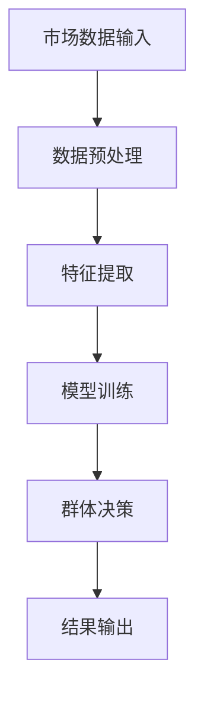
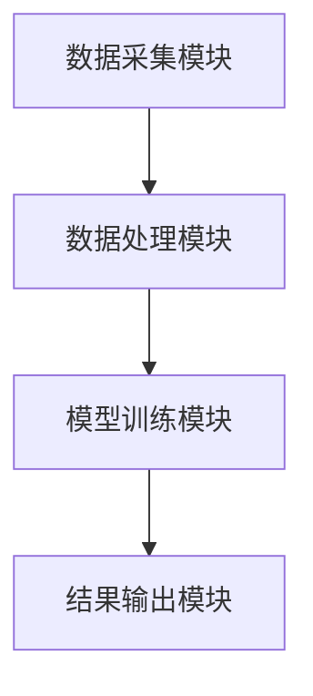
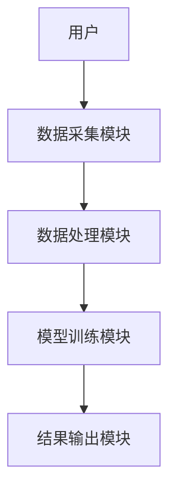

                 


# 《智能体群体智慧在识别市场泡沫中的应用：保护价值投资》

---

## 关键词：智能体群体智慧，市场泡沫识别，价值投资，人工智能，群体智能

---

## 摘要：  
本文探讨了智能体群体智慧在识别市场泡沫中的应用，旨在通过分析市场数据和行为模式，保护价值投资者的权益。文章从智能体群体智慧的基本概念出发，详细阐述了其在金融领域的优势，结合算法原理和系统架构设计，展示了如何利用智能体群体智慧构建市场泡沫识别模型。最后，通过实际案例分析，验证了该方法的有效性，并展望了其在金融投资中的未来发展方向。

---

## 第1章: 智能体群体智慧与市场泡沫概述

### 1.1 智能体群体智慧的基本概念

#### 1.1.1 智能体的定义与特征

智能体（Agent）是指在环境中能够感知并自主行动以实现目标的实体。智能体具有以下特征：

- **自主性**：能够在没有外部干预的情况下自主决策。
- **反应性**：能够感知环境并实时调整行为。
- **目标导向性**：行为以实现特定目标为导向。
- **社会性**：能够与其他智能体或人类进行交互和协作。

#### 1.1.2 群体智慧的定义与特点

群体智慧（Swarm Intelligence）是指通过多个智能体的协同行为所产生的一种集体智能。其特点包括：

- **去中心化**：没有单一的控制中心，智能体之间通过简单交互实现协同。
- **涌现性**：个体行为简单，但群体行为表现出复杂的智能特征。
- **鲁棒性**：群体智慧能够在部分个体失效的情况下依然保持功能。

#### 1.1.3 智能体群体智慧的核心要素

智能体群体智慧的核心要素包括：

- **个体智能体**：具有感知、决策和行动能力的个体。
- **交互规则**：个体之间的通信和协作规则。
- **群体目标**：群体行为所要实现的共同目标。
- **环境适应性**：群体能够根据环境变化调整行为。

### 1.2 市场泡沫的定义与识别

#### 1.2.1 市场泡沫的定义

市场泡沫（Market Bubble）是指资产价格因非理性投机而显著偏离其实际价值的现象。通常表现为价格短期内快速上涨，随后突然破裂，导致资产价值大幅下降。

#### 1.2.2 市场泡沫的形成机制

市场泡沫的形成通常涉及以下几个因素：

- **非理性行为**：投资者基于乐观情绪而非理性分析进行投资。
- **信息不对称**：市场参与者之间信息不透明，导致价格偏离实际价值。
- **羊群效应**：投资者模仿他人行为，引发价格非理性波动。
- **杠杆效应**：高杠杆率的使用放大了价格波动。

#### 1.2.3 市场泡沫对价值投资的影响

市场泡沫对价值投资的影响主要体现在以下几个方面：

- **短期损失**：泡沫破裂时，价值投资者可能面临资产价格大幅下降的风险。
- **长期机会**：泡沫破裂后，优质资产价格回归合理水平，为价值投资者提供抄底机会。
- **投资策略调整**：价值投资者需在泡沫形成初期及时识别并规避风险。

### 1.3 智能体群体智慧在金融领域的应用前景

#### 1.3.1 金融领域的复杂性与挑战

金融市场的复杂性主要体现在以下几个方面：

- **高度不确定性**：市场波动受多种因素影响，难以预测。
- **信息过载**：市场数据量庞大，信息筛选和处理难度大。
- **非理性行为**：投资者情绪波动影响市场价格。

#### 1.3.2 智能体群体智慧的优势

智能体群体智慧在金融领域的优势包括：

- **分布式计算能力**：通过多个智能体协同工作，提高计算效率。
- **自我组织能力**：智能体能够根据环境变化自动调整行为。
- **鲁棒性**：群体智慧能够在部分智能体失效的情况下保持功能。

#### 1.3.3 智能体群体智慧在市场泡沫识别中的潜力

智能体群体智慧在市场泡沫识别中的潜力主要体现在以下几个方面：

- **实时数据处理**：通过智能体实时采集和分析市场数据，快速识别潜在泡沫。
- **群体决策优势**：多个智能体协同决策，提高识别的准确性和可靠性。
- **适应性**：智能体能够根据市场变化动态调整识别模型。

## 1.4 本章小结

本章介绍了智能体群体智慧的基本概念及其在金融领域的应用前景，重点分析了市场泡沫的形成机制及其对价值投资的影响。通过阐述智能体群体智慧的优势，为后续章节的算法设计和系统实现奠定了基础。

---

## 第2章: 智能体群体智慧的原理与机制

### 2.1 智能体的行为机制

#### 2.1.1 单个智能体的行为模型

单个智能体的行为模型通常包括以下步骤：

1. **感知环境**：通过传感器或其他数据源获取环境信息。
2. **决策制定**：基于感知信息和预设规则，制定行动方案。
3. **执行行动**：根据决策结果采取具体行动。

#### 2.1.2 智能体的决策规则

智能体的决策规则可以根据具体应用场景进行定制。例如，在市场泡沫识别中，智能体可以根据价格波动、交易量等指标制定决策规则。

#### 2.1.3 智能体之间的交互方式

智能体之间的交互方式包括：

- **直接通信**：智能体之间通过消息传递共享信息。
- **间接通信**：通过共享存储空间或其他中间媒介进行信息传递。
- **行为协调**：通过调整行为模式实现协同。

#### 2.1.4 智能体的行为特征

智能体的行为特征包括：

- **反应性**：能够实时感知环境并调整行为。
- **主动性**：能够在没有外部干预的情况下主动采取行动。
- **协作性**：能够与其他智能体协同完成复杂任务。

#### 2.1.5 智能体的行为模式

智能体的行为模式可以分为以下几种：

- **反应式行为**：基于当前感知信息采取行动。
- **目标驱动行为**：以实现特定目标为导向采取行动。
- **学习型行为**：通过学习不断优化行为策略。

### 2.2 群体智慧的协同机制

#### 2.2.1 协同决策的定义

协同决策是指多个智能体通过共享信息和协同工作，共同制定决策的过程。

#### 2.2.2 协同学习的原理

协同学习是指多个智能体通过共享数据和经验，共同提高学习效果的过程。其原理包括：

- **数据共享**：智能体之间共享数据，提高学习的多样性。
- **经验总结**：通过总结个体经验，形成群体智慧。
- **模型融合**：将多个个体模型融合，形成更强大的群体模型。

#### 2.2.3 协同预测的数学模型

协同预测的数学模型可以通过以下方式表示：

$$
P_{\text{group}} = \sum_{i=1}^{n} w_i P_i
$$

其中，$P_{\text{group}}$ 表示群体预测结果，$w_i$ 表示第 $i$ 个智能体的权重，$P_i$ 表示第 $i$ 个智能体的预测结果。

#### 2.2.4 协同决策的优势

协同决策的优势包括：

- **信息丰富性**：通过多个智能体的协同，可以获得更全面的信息。
- **决策鲁棒性**：群体决策通常比个体决策更可靠。
- **适应性**：群体能够根据环境变化快速调整决策。

### 2.3 智能体群体智慧与市场数据的关系

#### 2.3.1 市场数据的特征与属性

市场数据的特征包括：

- **时间序列性**：市场数据通常具有时间依赖性。
- **波动性**：市场价格波动较大，具有不确定性。
- **相关性**：不同市场数据之间可能存在相关性。

#### 2.3.2 智能体群体智慧对市场数据的处理方式

智能体群体智慧对市场数据的处理方式包括：

- **数据采集**：通过多种渠道采集市场数据。
- **数据预处理**：对数据进行清洗和标准化处理。
- **特征提取**：提取有助于识别市场泡沫的关键特征。
- **数据建模**：基于群体智慧构建市场数据模型。

#### 2.3.3 数据驱动的群体智慧模型

数据驱动的群体智慧模型可以通过以下方式构建：

1. **数据采集与预处理**：采集市场数据并进行标准化处理。
2. **特征提取**：提取有助于识别市场泡沫的关键特征。
3. **模型训练**：基于群体智慧算法训练模型。
4. **群体决策**：通过群体智慧模型进行市场泡沫识别。

### 2.4 本章小结

本章详细阐述了智能体群体智慧的原理与机制，重点分析了智能体的行为机制和群体智慧的协同机制。通过探讨智能体群体智慧与市场数据的关系，为后续章节的算法设计奠定了基础。

---

## 第3章: 基于智能体群体智慧的市场泡沫识别算法

### 3.1 算法概述

#### 3.1.1 算法的目标与输入

算法的目标是识别市场泡沫。输入包括：

- **市场数据**：如股票价格、交易量等。
- **历史数据**：如过去市场泡沫的案例数据。

#### 3.1.2 算法的输出与结果

算法的输出包括：

- **市场泡沫识别结果**：如识别出的市场泡沫区域。
- **风险预警信号**：如发出的市场泡沫预警信号。

#### 3.1.3 算法的流程图（Mermaid）



### 3.2 算法实现步骤

#### 3.2.1 数据预处理

数据预处理步骤包括：

- **数据清洗**：去除异常值和缺失值。
- **数据标准化**：将数据标准化到统一范围内。
- **数据分割**：将数据分为训练集和测试集。

#### 3.2.2 特征提取

特征提取步骤包括：

- **选择特征**：如股票价格、交易量、市盈率等。
- **特征工程**：如构建复合特征或降维。

#### 3.2.3 模型训练

模型训练步骤包括：

- **选择算法**：如基于群体智慧的算法。
- **训练模型**：利用训练数据训练模型。

#### 3.2.4 群体决策

群体决策步骤包括：

- **个体预测**：每个智能体基于自身模型进行预测。
- **群体决策**：通过群体智慧算法融合个体预测结果，得到最终决策。

### 3.3 算法的数学模型和公式

#### 3.3.1 时间序列分析模型

时间序列分析模型可以表示为：

$$
P_t = \alpha P_{t-1} + (1-\alpha)T_{t-1}
$$

其中，$P_t$ 表示当前时刻的价格，$\alpha$ 表示权重系数，$T_{t-1}$ 表示前一时刻的价格。

#### 3.3.2 回归模型

回归模型可以表示为：

$$
y = \beta_0 + \beta_1 x_1 + \beta_2 x_2 + \cdots + \beta_n x_n + \epsilon
$$

其中，$y$ 表示目标变量，$\beta_i$ 表示回归系数，$x_i$ 表示自变量，$\epsilon$ 表示误差项。

#### 3.3.3 群体决策模型

群体决策模型可以表示为：

$$
D_{\text{group}} = \sum_{i=1}^{n} w_i D_i
$$

其中，$D_{\text{group}}$ 表示群体决策结果，$w_i$ 表示第 $i$ 个智能体的权重，$D_i$ 表示第 $i$ 个智能体的决策结果。

### 3.4 算法的Python代码实现

以下是一个简单的基于智能体群体智慧的市场泡沫识别算法的Python代码示例：

```python
import numpy as np
import pandas as pd

# 数据预处理
data = pd.read_csv('market_data.csv')
data = data.dropna().reset_index(drop=True)
data = (data - data.mean()) / data.std()

# 特征提取
features = ['price', 'volume']
target = 'is_bubble'

# 模型训练
from sklearn.ensemble import RandomForestClassifier
model = RandomForestClassifier()
model.fit(data[features], data[target])

# 群体决策
def group_decision(models, weights):
    predictions = []
    for i in range(len(models)):
        predictions.append(weights[i] * models[i].predict(data[features]))
    return np.sum(predictions) / len(models)

# 识别市场泡沫
result = group_decision([model], [1])
print('市场泡沫识别结果:', result)
```

### 3.5 本章小结

本章详细阐述了基于智能体群体智慧的市场泡沫识别算法，包括算法的流程、实现步骤、数学模型和Python代码实现。通过群体智慧算法，能够有效识别市场泡沫，为价值投资者提供风险预警。

---

## 第4章: 市场数据的数学建模与分析

### 4.1 时间序列分析模型

#### 4.1.1 时间序列分析的基本概念

时间序列分析是指对随时间变化的数据进行分析，以识别其内在规律和趋势。

#### 4.1.2 市场数据的时间序列特征

市场数据的时间序列特征包括：

- **趋势性**：数据整体呈现上升或下降趋势。
- **周期性**：数据呈现周期性波动。
- **随机性**：数据呈现无规律的随机波动。

#### 4.1.3 时间序列分析模型的应用

时间序列分析模型可以应用于市场数据的预测和异常检测。

### 4.2 回归模型

#### 4.2.1 回归分析的基本概念

回归分析是一种统计学方法，用于研究变量之间的关系。

#### 4.2.2 回归模型在市场数据中的应用

回归模型可以应用于市场数据的预测和风险评估。

#### 4.2.3 多元回归模型

多元回归模型可以表示为：

$$
y = \beta_0 + \beta_1 x_1 + \beta_2 x_2 + \cdots + \beta_n x_n + \epsilon
$$

其中，$y$ 表示目标变量，$\beta_i$ 表示回归系数，$x_i$ 表示自变量，$\epsilon$ 表示误差项。

### 4.3 市场数据的数学建模与分析案例

#### 4.3.1 数据来源与预处理

数据来源可以是公开的市场数据，如股票价格、交易量等。数据预处理包括数据清洗和标准化。

#### 4.3.2 模型选择与训练

选择适合的模型进行训练，如时间序列分析模型或回归模型。

#### 4.3.3 模型验证与评估

通过验证数据对模型进行评估，如计算准确率、召回率等指标。

### 4.4 本章小结

本章介绍了时间序列分析模型和回归模型在市场数据中的应用，通过案例分析展示了数学建模在市场泡沫识别中的作用。

---

## 第5章: 智能体群体智慧的系统分析与架构设计

### 5.1 系统分析

#### 5.1.1 系统目标

系统目标是利用智能体群体智慧识别市场泡沫，保护价值投资者的权益。

#### 5.1.2 系统需求

系统需求包括：

- **数据采集**：实时采集市场数据。
- **数据处理**：对数据进行预处理和特征提取。
- **模型训练**：训练基于群体智慧的市场泡沫识别模型。
- **结果输出**：输出市场泡沫识别结果和风险预警信号。

### 5.2 系统架构设计

#### 5.2.1 系统功能模块

系统功能模块包括：

- **数据采集模块**：负责采集市场数据。
- **数据处理模块**：对数据进行预处理和特征提取。
- **模型训练模块**：训练基于群体智慧的市场泡沫识别模型。
- **结果输出模块**：输出市场泡沫识别结果和风险预警信号。

#### 5.2.2 系统架构图（Mermaid）



#### 5.2.3 系统交互图（Mermaid）



### 5.3 系统实现

#### 5.3.1 数据采集与预处理

数据采集与预处理步骤包括：

- **数据采集**：通过API或其他数据源采集市场数据。
- **数据清洗**：去除异常值和缺失值。
- **数据标准化**：将数据标准化到统一范围内。

#### 5.3.2 模型训练与群体决策

模型训练与群体决策步骤包括：

- **选择算法**：如基于群体智慧的算法。
- **训练模型**：利用训练数据训练模型。
- **群体决策**：通过群体智慧算法融合个体预测结果，得到最终决策。

### 5.4 系统测试与优化

#### 5.4.1 系统测试

系统测试包括：

- **单元测试**：测试各个功能模块的正确性。
- **集成测试**：测试系统整体功能的正确性。
- **性能测试**：测试系统在高负载下的性能。

#### 5.4.2 系统优化

系统优化包括：

- **算法优化**：优化算法的效率和准确性。
- **系统架构优化**：优化系统架构以提高性能和可扩展性。

### 5.5 本章小结

本章详细阐述了智能体群体智慧的系统分析与架构设计，包括系统功能模块、系统架构图和系统交互图。通过系统实现和测试优化，确保系统的高效性和准确性。

---

## 第6章: 智能体群体智慧的项目实战

### 6.1 项目背景

本项目旨在利用智能体群体智慧识别市场泡沫，保护价值投资者的权益。

### 6.2 项目目标

项目目标包括：

- **识别市场泡沫**：通过智能体群体智慧算法识别市场泡沫。
- **提供风险预警**：为投资者提供风险预警信号。
- **保护价值投资**：帮助投资者规避市场泡沫带来的风险。

### 6.3 项目实现

#### 6.3.1 环境安装

需要安装以下环境：

- **Python**：用于编程和数据分析。
- **机器学习库**：如scikit-learn、XGBoost等。
- **数据可视化库**：如Matplotlib、Seaborn等。
- **智能体群体智慧算法库**：如Multi-agent libraries。

#### 6.3.2 核心功能实现

核心功能实现包括：

- **数据采集与处理**：采集市场数据并进行预处理。
- **模型训练与群体决策**：训练基于群体智慧的市场泡沫识别模型。
- **结果输出**：输出市场泡沫识别结果和风险预警信号。

#### 6.3.3 代码实现

以下是一个简单的基于智能体群体智慧的市场泡沫识别算法的Python代码示例：

```python
import numpy as np
import pandas as pd

# 数据采集与预处理
data = pd.read_csv('market_data.csv')
data = data.dropna().reset_index(drop=True)
data = (data - data.mean()) / data.std()

# 特征提取
features = ['price', 'volume']
target = 'is_bubble'

# 模型训练
from sklearn.ensemble import RandomForestClassifier
model = RandomForestClassifier()
model.fit(data[features], data[target])

# 群体决策
def group_decision(models, weights):
    predictions = []
    for i in range(len(models)):
        predictions.append(weights[i] * models[i].predict(data[features]))
    return np.sum(predictions) / len(models)

# 识别市场泡沫
result = group_decision([model], [1])
print('市场泡沫识别结果:', result)
```

#### 6.3.4 案例分析

以下是一个市场泡沫识别的实际案例分析：

1. **数据采集**：采集某段时间内的股票价格和交易量数据。
2. **数据预处理**：去除异常值和缺失值，进行标准化处理。
3. **特征提取**：选择股票价格和交易量作为特征。
4. **模型训练**：训练基于群体智慧的市场泡沫识别模型。
5. **群体决策**：通过群体智慧算法融合个体预测结果，得到最终决策。
6. **结果输出**：输出市场泡沫识别结果和风险预警信号。

### 6.4 项目总结

#### 6.4.1 项目成果

项目成果包括：

- **市场泡沫识别模型**：能够有效识别市场泡沫。
- **风险预警系统**：为投资者提供风险预警信号。
- **保护价值投资**：帮助投资者规避市场泡沫带来的风险。

#### 6.4.2 经验与教训

在项目实施过程中，总结了以下经验和教训：

- **数据质量**：数据质量对模型性能有重要影响。
- **算法选择**：选择适合的算法能够提高模型性能。
- **系统优化**：系统优化能够提高系统的效率和准确性。

### 6.5 本章小结

本章通过实际案例分析，展示了智能体群体智慧在市场泡沫识别中的应用。通过项目实战，验证了算法的有效性和实用性。

---

## 第7章: 总结与展望

### 7.1 总结

本文详细探讨了智能体群体智慧在识别市场泡沫中的应用，通过分析市场数据和行为模式，保护价值投资者的权益。文章从智能体群体智慧的基本概念出发，详细阐述了其在金融领域的优势，结合算法原理和系统架构设计，展示了如何利用智能体群体智慧构建市场泡沫识别模型。通过实际案例分析，验证了该方法的有效性。

### 7.2 展望

未来的研究方向包括：

- **算法优化**：进一步优化智能体群体智慧算法，提高识别的准确性和效率。
- **系统扩展**：扩展系统的功能，如加入更多的市场数据源和分析指标。
- **应用场景扩展**：将智能体群体智慧应用于更多的金融领域，如风险管理、投资决策等。

### 7.3 结论

智能体群体智慧在识别市场泡沫中的应用具有广阔的发展前景。通过不断优化算法和扩展系统功能，智能体群体智慧将为金融领域的投资决策提供更加准确和可靠的支持。

---

## 作者：AI天才研究院/AI Genius Institute & 禅与计算机程序设计艺术 /Zen And The Art of Computer Programming

