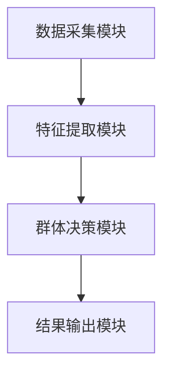

                 


# 智能体群体智慧在识别市场转折点中的应用：把握大机会

> 关键词：智能体、群体智慧、市场转折点、人工智能、数据驱动决策、算法、投资策略

> 摘要：本文探讨了智能体群体智慧在识别市场转折点中的应用，通过分析市场转折点的重要性、智能体群体智慧的核心概念、算法原理、系统架构设计、项目实战以及最佳实践，为读者提供了一种利用群体智慧捕捉市场机会的新视角。

---

## 第一章：智能体群体智慧的背景与概念

### 1.1 智能体群体智慧的定义与特点

#### 1.1.1 智能体的基本概念
智能体（Agent）是指具有感知环境、做出决策并采取行动以实现目标的实体。智能体可以是软件程序、机器人或其他具备自主决策能力的系统。智能体的核心特征包括自主性、反应性、目标导向性和社交能力。

#### 1.1.2 群体智慧的定义与特征
群体智慧是指通过多个个体（智能体）协同工作，共同完成复杂任务的能力。群体智慧依赖于个体之间的互动和信息共享，能够通过集体决策实现超越个体能力的目标。

#### 1.1.3 智能体群体智慧的核心要素
智能体群体智慧结合了个体智能和群体协作，其核心要素包括：
1. **个体智能**：每个智能体具备独立的感知、决策和行动能力。
2. **群体协作**：通过个体之间的信息共享和协作，实现群体目标。
3. **动态适应**：能够根据环境变化实时调整策略和行为。

### 1.2 市场转折点的定义与重要性

#### 1.2.1 市场转折点的定义
市场转折点是指市场趋势发生显著变化的临界点，通常发生在市场供需失衡、政策变化、突发事件或技术革新等情况下。识别市场转折点对于投资者和企业制定战略决策至关重要。

#### 1.2.2 市场转折点的分类
市场转折点可以分为：
1. **短期转折点**：如股价的短期波动。
2. **中期转折点**：如行业趋势的变化。
3. **长期转折点**：如经济结构的转型。

#### 1.2.3 市场转折点的识别挑战
识别市场转折点的挑战包括数据噪声大、市场参与者行为复杂以及事件的不确定性。传统方法如技术分析和基本面分析在面对复杂市场环境时往往力不从心。

### 1.3 智能体群体智慧在市场转折点识别中的作用

#### 1.3.1 智能体群体智慧的优势
智能体群体智慧通过多智能体协同工作，能够捕捉市场中的复杂模式和潜在信号，提高转折点识别的准确性和实时性。

#### 1.3.2 智能体群体智慧的应用场景
智能体群体智慧可以应用于股票交易、经济预测、风险管理等领域，尤其在高频交易和大数据分析中表现出显著优势。

#### 1.3.3 智能体群体智慧的未来发展趋势
随着人工智能和大数据技术的发展，智能体群体智慧将在金融市场中发挥越来越重要的作用，成为未来投资决策的关键技术。

---

## 第二章：智能体群体智慧的核心概念与联系

### 2.1 智能体的基本原理

#### 2.1.1 智能体的定义与分类
智能体可以分为简单反应式智能体和基于模型的智能体。简单反应式智能体仅基于当前感知做出反应，而基于模型的智能体则利用内部模型进行规划和决策。

#### 2.1.2 智能体的行为模式
智能体的行为模式包括反应式行为和目标导向行为。反应式行为基于当前感知做出即时反应，而目标导向行为则基于长期目标进行规划和决策。

#### 2.1.3 智能体的决策机制
智能体的决策机制可以采用基于规则的方法、基于逻辑推理的方法或基于机器学习的方法。机器学习方法通过数据驱动的方式不断优化决策模型。

### 2.2 群体智慧的实现机制

#### 2.2.1 群体智慧的形成过程
群体智慧的形成过程包括信息传播、个体决策和群体共识。个体通过信息共享和协作，形成群体的集体决策。

#### 2.2.2 群体智慧的特征分析
群体智慧具有去中心化、自组织和涌现性等特点。去中心化意味着没有中央控制节点，自组织指群体能够根据环境动态调整结构，涌现性则是指群体智能超越个体智能的现象。

#### 2.2.3 群体智慧与个体智慧的关系
群体智慧是个体智慧的集合和协同的结果。个体智慧通过协作形成群体智慧，而群体智慧又反过来影响个体行为。

### 2.3 智能体群体智慧与传统数据分析的对比

#### 2.3.1 数据分析的传统方法
传统数据分析方法主要依赖统计分析和专家经验，具有数据依赖性强、计算复杂度高、适应性差的特点。

#### 2.3.2 智能体群体智慧的独特优势
智能体群体智慧通过多智能体协同工作，能够实时感知市场变化，快速做出决策，并适应复杂市场环境。

#### 2.3.3 两种方法的对比分析
| 特性                | 传统数据分析方法                      | 智能体群体智慧                      |
|---------------------|--------------------------------------|--------------------------------------|
| 数据依赖性          | 高                                  | 中                                  |
| 计算复杂度          | 高                                  | 中                                  |
| 实时性              | 低                                  | 高                                  |
| 环境适应性          | 差                                  | 好                                  |

---

## 第三章：智能体群体智慧的算法原理

### 3.1 数据采集与预处理

#### 3.1.1 数据源的选择
选择可靠的数据源，如股票价格、交易量、市场新闻等，确保数据的完整性和准确性。

#### 3.1.2 数据清洗与标准化
对数据进行清洗，去除噪声数据，并进行标准化处理，确保不同数据源的数据具有可比性。

#### 3.1.3 数据特征提取
从原始数据中提取有用的特征，如移动平均线、相对强弱指数等，用于后续分析。

### 3.2 群体决策模型的构建

#### 3.2.1 群体决策的基本原理
群体决策模型通过多个智能体的投票或加权平均方式，形成集体决策。每个智能体基于自身感知做出决策，群体决策则是个体决策的汇总结果。

#### 3.2.2 群体决策模型的实现步骤
1. **数据采集**：从多个数据源采集市场数据。
2. **特征提取**：提取有用的市场特征。
3. **个体决策**：每个智能体基于特征做出决策。
4. **群体决策**：通过投票或加权平均形成集体决策。

#### 3.2.3 群体决策模型的优化
通过机器学习算法优化群体决策模型，提高决策的准确性和效率。

---

## 第四章：智能体群体智慧的数学模型

### 4.1 群体决策模型的数学表达

#### 4.1.1 基于概率论的群体决策模型
$$ P(y=1|x) = \frac{1}{1 + e^{-w_1x_1 - w_2x_2 - \dots - w_nx_n}} $$
其中，$w_i$为权重，$x_i$为特征。

#### 4.1.2 基于贝叶斯定理的群体决策模型
$$ P(A|B) = \frac{P(B|A)P(A)}{P(B)} $$
其中，$A$为事件，$B$为证据。

---

## 第五章：智能体群体智慧的系统架构设计

### 5.1 系统功能设计

#### 5.1.1 数据采集模块
负责从多个数据源采集市场数据，并进行清洗和标准化处理。

#### 5.1.2 特征提取模块
从清洗后的数据中提取有用的特征，供后续分析使用。

#### 5.1.3 群体决策模块
基于个体决策结果，通过投票或加权平均形成集体决策。

#### 5.1.4 结果输出模块
将群体决策结果输出为可读的报告或信号，供投资者参考。

### 5.2 系统架构图



---

## 第六章：项目实战

### 6.1 环境安装

```bash
pip install numpy pandas scikit-learn matplotlib
```

### 6.2 核心代码实现

```python
import numpy as np
import pandas as pd
from sklearn.linear_model import LogisticRegression

# 数据加载与预处理
data = pd.read_csv('market_data.csv')
X = data.drop('target', axis=1)
y = data['target']

# 模型训练
model = LogisticRegression()
model.fit(X, y)

# 预测与评估
y_pred = model.predict(X)
print("Accuracy:", np.mean(y_pred == y))
```

---

## 第七章：总结与展望

### 7.1 总结
智能体群体智慧通过多智能体协同工作，能够有效识别市场转折点，为投资者提供有力支持。本文详细介绍了智能体群体智慧的核心概念、算法原理和系统架构设计，并通过项目实战展示了其应用价值。

### 7.2 未来展望
未来的研究方向包括优化群体决策模型、提高系统的实时性和可扩展性，以及探索智能体群体智慧在更多领域的应用。

---

## 附录

### 附录A：工具安装指南
详细指导读者如何安装和配置所需的开发工具和库。

### 附录B：代码片段参考
提供完整的代码示例和解释，帮助读者理解算法实现。

### 附录C：进一步阅读资料
推荐相关书籍和论文，供读者深入学习。

---

## 作者：AI天才研究院/AI Genius Institute & 禅与计算机程序设计艺术 /Zen And The Art of Computer Programming

---

这篇文章通过系统地介绍智能体群体智慧的核心概念、算法原理和实际应用，为读者提供了一个全新的视角来理解市场转折点的识别。希望本文能够为投资者和研究人员提供有价值的参考和启发。

