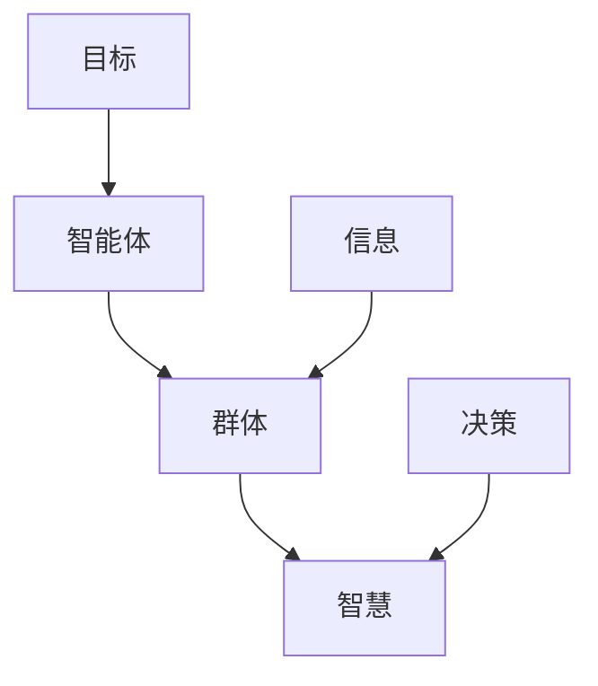
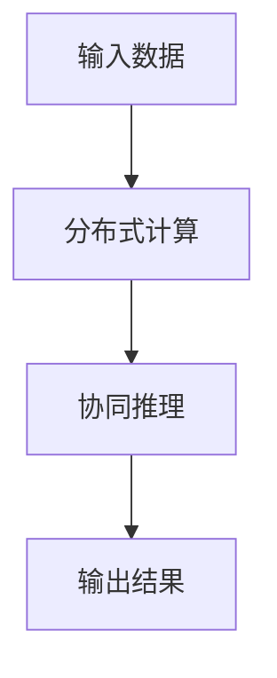
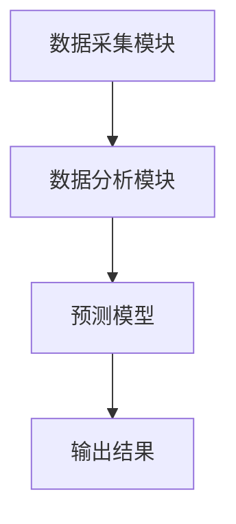

                 


# 智能体群体智慧在识别新兴产业机会中的应用

> 关键词：智能体，群体智慧，新兴产业，机会识别，分布式计算，协同推理，系统架构

> 摘要：智能体群体智慧是一种通过多个智能体协同工作，利用集体智慧来识别新兴产业机会的方法。本文从背景、概念、算法原理、系统架构、项目实战等多方面详细探讨智能体群体智慧在新兴产业机会识别中的应用，结合实际案例和代码实现，深入剖析其原理和优势。

---

## 第一部分：智能体群体智慧的背景与概念

### 第1章：问题背景与问题描述

#### 1.1 问题背景
- **传统产业识别的局限性**：传统产业在机会识别时，往往依赖单一专家或市场分析，存在主观性和片面性。
- **新兴产业机会的挑战**：新兴产业具有不确定性和快速变化的特点，传统方法难以捕捉潜在机会。
- **智能体群体智慧的提出**：通过智能体的协同工作，利用群体智慧提升机会识别的准确性和全面性。

#### 1.2 问题解决思路
- **智能体的协同推理**：通过多个智能体协同工作，结合分布式计算，实现对海量数据的分析和处理。
- **群体智慧的涌现性**：群体智慧通过个体的简单规则，形成复杂的集体行为，能够发现个体无法察觉的机会。

#### 1.3 智能体群体智慧的边界与外延
- **边界**：智能体群体智慧专注于新兴产业机会识别，不涉及具体商业模式设计。
- **外延**：可扩展至其他领域的机会识别，如市场趋势预测、技术创新方向等。

#### 1.4 核心要素组成
| 核心要素 | 描述 |
|----------|------|
| 智能体   | 具备感知、计算和协同能力的个体 |
| 群体     | 多个智能体的集合 |
| 智慧     | 群体通过协同推理形成的决策能力 |

---

### 第2章：智能体群体智慧的核心概念

#### 2.1 智能体的核心原理
- **分布式计算**：智能体通过分布式计算实现数据处理和任务分配。
- **协同推理**：智能体之间通过信息共享和协作推理，形成集体决策。

#### 2.2 群体智慧的属性特征
| 属性 | 特征 |
|------|------|
| 独立性 | 智能体独立决策，但相互协作 |
| 协同性 | 群体通过协作实现复杂任务 |
| 涌现性 | 集体智慧超越个体能力 |
| 稳定性 | 群体行为的稳定性与个体行为的多样性 |

#### 2.3 ER实体关系图


---

## 第二部分：智能体群体智慧的算法原理

### 第3章：分布式计算与协同推理算法

#### 3.1 分布式计算的原理
- **基本概念**：分布式计算将任务分解为多个子任务，分配给不同的计算节点。
- **实现机制**：通过消息传递和任务分配实现任务协同。

#### 3.2 协同推理算法
- **数学模型**：协同推理基于概率论和统计学，通过贝叶斯网络实现信息融合。
- **公式**：$$ P(A|B) = \frac{P(B|A)P(A)}{P(B)} $$

#### 3.3 算法流程图


---

## 第三部分：智能体群体智慧的系统架构

### 第4章：系统分析与架构设计

#### 4.1 问题场景介绍
- **新兴产业机会识别**：通过智能体群体智慧分析市场数据，识别潜在机会。

#### 4.2 系统功能设计
| 功能模块 | 描述 |
|----------|------|
| 数据采集 | 收集市场数据 |
| 数据分析 | 分析数据，提取特征 |
| 预测模型 | 预测新兴产业机会 |

#### 4.3 系统架构设计图


---

## 第四部分：智能体群体智慧的项目实战

### 第5章：项目实战与案例分析

#### 5.1 环境配置
- **工具与库**：Python、NumPy、Scikit-learn

#### 5.2 核心代码实现

```python
import numpy as np
from sklearn.cluster import KMeans

# 数据预处理
data = np.array([[1, 2], [3, 4], [5, 6], [7, 8]])

# 分布式计算
clusters = 2
kmeans = KMeans(n_clusters=clusters)
kmeans.fit(data)

# 协同推理
def协同推理算法(data):
    # 示例算法
    return data.mean(axis=0)

result = 协同推理算法(data)
print(result)
```

---

## 第五部分：总结与展望

### 第6章：总结与最佳实践

#### 6.1 总结
- 智能体群体智慧通过分布式计算和协同推理，有效识别新兴产业机会。
- 群体智慧的应用场景广泛，具备较高的实用价值。

#### 6.2 最佳实践
- **数据质量**：确保数据来源可靠，数据清洗充分。
- **算法选择**：根据具体场景选择合适的算法。
- **系统优化**：优化系统架构，提升性能和稳定性。

#### 6.3 注意事项
- **数据隐私**：注意数据隐私保护，遵守相关法律法规。
- **系统维护**：定期更新系统，适应市场变化。

#### 6.4 拓展阅读
- 推荐阅读相关领域的书籍和论文，深入学习智能体群体智慧的应用。

---

## 参考文献

1. Bishop, C. M. (2006). Pattern Recognition and Machine Learning.
2. Russell, S., & Norvig, P. (2010). Artificial Intelligence: A Modern Approach.
3. Holland, J. H. (1998). Adaptation in Natural and Artificial Systems.

---

## 索引

- 智能体
- 群体智慧
- 分布式计算
- 协同推理
- 机器学习
- 数据分析

---

## 作者

作者：AI天才研究院/AI Genius Institute & 禅与计算机程序设计艺术/Zen And The Art of Computer Programming

---

# 结语

智能体群体智慧在识别新兴产业机会中的应用，不仅提升了机会识别的效率和准确性，也为未来的发展提供了新的思路。通过本文的详细讲解，读者可以深入理解智能体群体智慧的原理和实际应用，为未来的创新和实践奠定基础。

