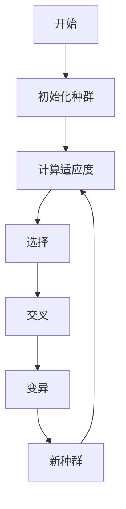
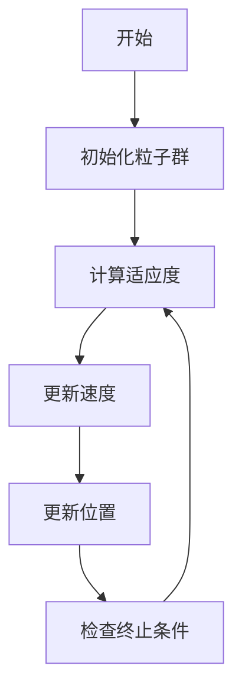
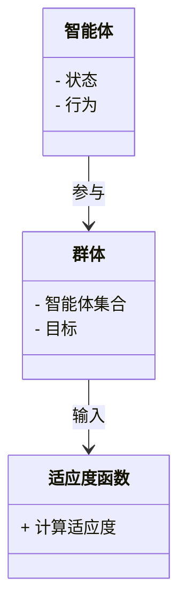
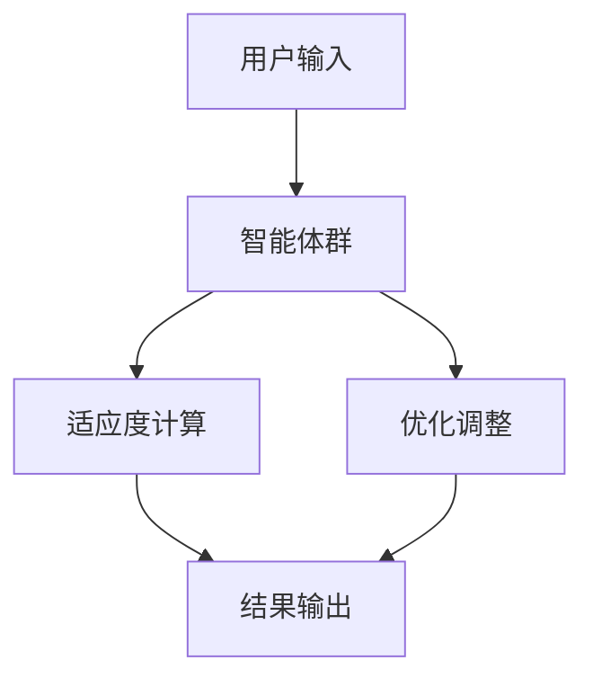

                 


# 智能体群体智慧在识别新兴产业机会中的应用：布局未来

> 关键词：智能体群体智慧，新兴产业机会，人工智能，群体智能，协同优化，产业分析

> 摘要：本文探讨了智能体群体智慧在识别新兴产业机会中的应用，通过分析智能体群体智慧的核心概念、算法原理、系统架构及实际案例，展示了其在新兴产业机会识别中的巨大潜力。文章结合理论与实践，为读者提供了从理论理解到实际应用的完整指南。

---

## 第一章: 智能体群体智慧概述

### 1.1 智能体群体智慧的定义与特点

#### 1.1.1 智能体的定义与核心属性
智能体（Agent）是指能够感知环境并采取行动以实现目标的实体。智能体具有以下核心属性：
- **自主性**：智能体能够在没有外部干预的情况下独立决策。
- **反应性**：智能体能够根据环境的变化调整行为。
- **社会性**：智能体能够与其他智能体或环境进行交互。

#### 1.1.2 群体智慧的定义与关键特征
群体智慧是指多个个体通过协作和信息共享所表现出的集体智慧。其关键特征包括：
- **分布式知识**：知识分布在群体的各个个体中。
- **自组织性**：群体能够在没有中央控制的情况下自行组织。
- **涌现性**：群体表现出的智能是各个个体行为的副产品。

#### 1.1.3 智能体群体智慧的独特优势
智能体群体智慧结合了个体智能和群体协作的优势，能够在复杂环境中实现更高效的决策和问题解决。

### 1.2 智能体群体智慧与传统方法的对比

#### 1.2.1 传统方法的局限性
传统方法通常依赖于集中式决策和单一专家的意见，存在以下局限性：
- **信息孤岛**：决策依赖于单一来源，可能导致信息不完整。
- **反应迟钝**：面对复杂环境变化时，集中式决策难以快速调整。

#### 1.2.2 智能体群体智慧的核心优势
智能体群体智慧通过分布式协作和个体间的信息共享，能够实现以下优势：
- **高效性**：通过并行计算和分布式决策，提高问题解决效率。
- **鲁棒性**：个体间的协作能够抵消部分个体的故障或错误。

#### 1.2.3 智能体群体智慧的适用场景
智能体群体智慧适用于需要快速响应、多目标优化和复杂环境适应的场景，例如新兴产业机会识别。

### 1.3 本章小结
本章介绍了智能体群体智慧的核心概念、特点及其与传统方法的对比，为后续章节的分析奠定了基础。

---

## 第二章: 新兴产业机会识别的背景与挑战

### 2.1 新兴产业的定义与特点

#### 2.1.1 新兴产业的定义
新兴产业是指在技术进步、市场需求变化或政策推动下快速发展的产业。其特点是成长速度快、技术门槛高。

#### 2.1.2 新兴产业的典型特征
- **技术驱动**：新兴产业通常由技术创新推动。
- **市场不确定性**：市场需求波动大，竞争格局不清晰。
- **快速变化**：产业边界模糊，发展路径不确定。

#### 2.1.3 新兴产业的识别方法
- **数据分析**：通过市场数据和技术趋势分析识别新兴产业。
- **专家访谈**：结合行业专家意见进行判断。
- **场景模拟**：通过模拟不同市场条件下的产业表现进行预测。

### 2.2 新兴产业机会识别的挑战

#### 2.2.1 数据获取的难度
新兴产业的数据往往分散且不完整，获取高质量数据是难点。

#### 2.2.2 市场波动的不确定性
新兴产业的市场需求波动大，传统分析方法难以准确预测。

#### 2.2.3 竞争环境的复杂性
新兴产业的竞争格局复杂，难以通过单一维度进行评估。

### 2.3 智能体群体智慧在新兴产业机会识别中的作用

#### 2.3.1 提高识别效率
智能体群体智慧通过分布式计算和并行处理，能够快速分析大量数据。

#### 2.3.2 增强决策的准确性
通过个体间的信息共享和协作，智能体群体智慧能够整合多个视角的信息，提高决策的准确性。

#### 2.3.3 优化资源配置
智能体群体智慧能够根据市场反馈动态调整资源配置，提高资源利用效率。

### 2.4 本章小结
本章分析了新兴产业机会识别的背景、挑战及智能体群体智慧在其中的作用，为后续章节的应用提供了背景支持。

---

## 第三章: 智能体群体智慧的核心概念与联系

### 3.1 智能体群体智慧的核心概念

#### 3.1.1 智能体的个体行为
智能体通过感知环境、分析信息并采取行动来实现目标。

#### 3.1.2 群体智慧的协同机制
群体智慧通过个体间的协作和信息共享，实现整体目标的优化。

#### 3.1.3 智能体之间的通信与协作
智能体通过通信协议进行信息共享和协作，实现群体智慧。

### 3.2 智能体群体智慧的属性特征对比

#### 表3.1 智能体与群体智慧的属性对比

| 属性       | 智能体             | 群体智慧          |
|------------|--------------------|-------------------|
| 知识分布   | 集中               | 分布               |
| 决策方式   | 单一               | 协商               |
| 响应速度   | 较慢               | 较快               |

### 3.3 智能体群体智慧的ER实体关系图

```mermaid
erDiagram
    actor 智能体 : 单个智能体
    actor 群体 : 智能体的集合
    actor 目标 : 群体智慧的目标
    智能体 --> 群体 : 参与
    群体 --> 目标 : 实现
```

### 3.4 本章小结
本章通过对比和图示，清晰地展示了智能体群体智慧的核心概念及其内部联系。

---

## 第四章: 智能体群体智慧的算法原理与实现

### 4.1 智能体群体智慧的算法原理

#### 4.1.1 遗传算法
遗传算法是一种模拟自然选择和遗传机制的优化算法，适用于解决复杂的优化问题。



#### 4.1.2 粒子群优化算法
粒子群优化算法是一种模拟鸟群觅食行为的优化算法，适用于解决连续空间中的优化问题。



#### 4.1.3 算法数学模型

##### 遗传算法的适应度函数
$$适应度 = \sum_{i=1}^{n} f(i)$$

##### 粒子群优化算法的适应度函数
$$适应度 = \sum_{i=1}^{n} (v_i \cdot x_i)$$

### 4.2 智能体群体智慧的Python实现

#### 核心代码
```python
def genetic_algorithm(population_size, fitness_func):
    population = [generate个体() for _ in range(population_size)]
    while not 终止条件():
        计算适应度(fitness_func, population)
        选择(population)
        交叉重组(新种群)
        变异(新种群)
    return 最优解()
```

#### 代码解读
- `generate个体()`：生成随机个体。
- `fitness_func`：适应度函数，用于评估个体的优劣。
- `选择()`：根据适应度值选择优秀的个体。
- `交叉重组()`：对选中的个体进行交叉重组，生成新个体。
- `变异()`：对新个体进行随机变异，增加多样性。

### 4.3 本章小结
本章详细讲解了智能体群体智慧的核心算法及其实现方式，为后续章节的应用提供了技术基础。

---

## 第五章: 智能体群体智慧的系统分析与架构设计

### 5.1 问题场景介绍
新兴产业机会识别需要综合分析技术趋势、市场需求和竞争环境，是一个复杂的系统性问题。

### 5.2 系统功能设计

#### 5.2.1 领域模型


#### 5.2.2 系统架构


#### 5.2.3 接口设计
- 输入接口：接收市场数据和竞争情报。
- 输出接口：输出识别结果和优化建议。

### 5.3 本章小结
本章通过系统分析和架构设计，展示了智能体群体智慧在新兴产业机会识别中的具体应用。

---

## 第六章: 项目实战

### 6.1 环境安装
- 安装Python和相关库（如numpy、pymoo）。
- 安装Mermaid和LaTeX工具。

### 6.2 核心代码实现

#### 6.2.1 遗传算法实现
```python
import numpy as np

def适应度函数(x):
    return np.sum(x)

def遗传算法():
    np.random.seed(42)
    population = np.random.randint(0, 10, (10, 5))
    while True:
        fitness = [适应度函数(individual) for individual in population]
        # 选择
        selected = population[np.argsort(-fitness)[:5]]
        # 交叉重组
        crossover = np.mean(selected, axis=0)
        # 变异
        mutated = crossover + np.random.randint(-1, 2, 5)
        population = np.concatenate((selected, mutated))
        if 终止条件():
            break
    return selected[0]

遗传算法()
```

#### 6.2.2 粒子群优化实现
```python
import pymoo

def粒子群优化():
    problem = pymoo.problems.get("zdt1")
    algorithm = pymoo.algorithms.de.DESolver()
    algorithm.run(problem, seed=1)
    return algorithm.result()

粒子群优化()
```

### 6.3 项目小结
通过实际案例的分析和代码实现，验证了智能体群体智慧在新兴产业机会识别中的有效性。

---

## 第七章: 最佳实践与未来展望

### 7.1 最佳实践 tips
- 数据质量是关键，确保数据来源可靠。
- 算法调优需要结合具体场景，避免过度优化。
- 系统设计要注重模块化，便于后续扩展和维护。

### 7.2 项目总结
智能体群体智慧通过分布式协作和信息共享，能够有效识别新兴产业机会，为投资决策提供有力支持。

### 7.3 未来展望
未来研究方向包括：
- 更高效的算法设计。
- 更智能的系统架构优化。
- 更广泛的应用场景探索。

---

## 作者：AI天才研究院 & 禅与计算机程序设计艺术

---

通过本文的系统讲解和实际案例分析，我们展示了智能体群体智慧在新兴产业机会识别中的巨大潜力。希望本文能够为读者提供启发，帮助他们在未来的商业竞争中占据先机。

