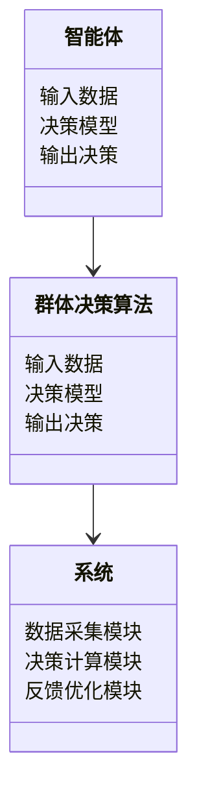
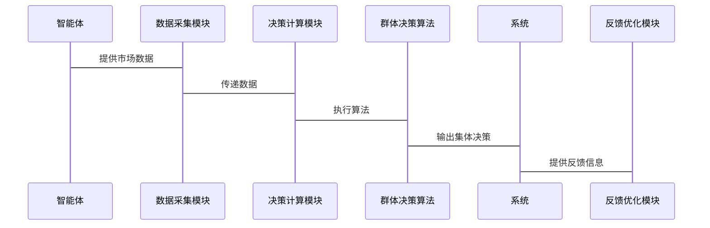

                 


# 智能体群体智慧：克服个体投资者的认知偏差

> 关键词：智能体群体智慧，认知偏差，个体决策，群体决策，投资决策，人工智能

> 摘要：本文探讨智能体群体智慧在投资决策中的应用，重点分析如何通过群体智慧克服个体投资者的认知偏差，详细介绍相关算法原理、系统架构设计和实际案例。

---

## 第一部分：智能体群体智慧的背景与概念

### 第1章：智能体群体智慧的定义与核心概念

#### 1.1 什么是智能体群体智慧
- **智能体的定义**：智能体是能够感知环境、做出决策并采取行动的实体。
- **群体智慧的定义**：群体智慧是指多个个体通过互动产生的集体智慧，超越个体的智慧。
- **智能体群体智慧的核心特征**：分布式、自适应、涌现性。

#### 1.2 个体投资者的认知偏差
- **认知偏差的定义**：认知偏差是人们在信息处理过程中产生的系统性错误判断。
- **常见认知偏差**：过度自信、确认偏差、锚定效应。
- **认知偏差对投资决策的影响**：导致非理性决策，影响投资收益。

#### 1.3 智能体群体智慧的优势
- **群体决策的优势**：通过多个体的互动，减少个体偏差，提高决策准确性。
- **智能体群体智慧的应用场景**：股票交易、风险管理、组合优化。

---

### 第2章：智能体群体智慧的核心原理

#### 2.1 智能体的决策机制
- **信息处理流程**：感知、分析、决策、行动。
- **决策模型**：基于概率的决策树，考虑多因素影响。
- **自适应学习**：通过反馈优化决策模型。

#### 2.2 群体智慧的形成机制
- **共识算法**：通过投票或协商达成一致意见。
- **信息融合算法**：整合个体信息，形成集体决策。
- **涌现性**：群体智慧的产生是通过个体互动自然涌现的。

#### 2.3 智能体群体智慧的数学模型
- **概率模型**：使用贝叶斯定理进行群体决策。
- **图论模型**：通过网络结构分析个体间的关系。
- **博弈论模型**：分析群体决策中的策略选择。

---

### 第3章：认知偏差与群体智慧的关系

#### 3.1 认知偏差的分类与影响
- **过度自信效应**：高估自己判断的准确性。
- **沉没成本谬误**：继续投入失败项目以避免损失。
- **从众心理**：盲目跟随群体决策，忽略个体判断。

#### 3.2 群体智慧如何克服认知偏差
- **通过群体决策减少个体偏差**：利用多数投票法或加权平均法。
- **利用多样性减少偏差**：多样性个体的决策可以相互补充，降低整体偏差。
- **动态调整决策模型**：根据反馈不断优化决策策略。

---

## 第二部分：智能体群体智慧的算法与模型

### 第4章：群体决策算法

#### 4.1 共识算法
- **共识算法的定义**：通过分布式系统中达成一致的算法。
- **常见共识算法**：一致性 hashing、Raft、Paxos。
- **共识算法在群体决策中的应用**：用于多智能体系统中的决策达成。

#### 4.2 信息融合算法
- **信息融合的定义**：将多个来源的信息整合为一个一致的决策。
- **加权平均法**：根据个体的可靠程度赋予不同的权重。
- **多数投票法**：通过多数个体的决策来形成集体决策。

#### 4.3 群体决策的数学模型
- **概率模型**：使用概率论分析群体决策的正确性。
- **图论模型**：通过网络结构分析群体决策的传播路径。
- **博弈论模型**：分析个体在群体决策中的策略选择。

---

### 第5章：智能体的自适应学习机制

#### 5.1 自适应学习的定义
- 自适应学习：智能体根据环境反馈不断优化自身的决策模型。

#### 5.2 常见的自适应学习算法
- **强化学习**：通过奖励机制优化决策策略。
- **遗传算法**：通过模拟自然选择优化决策模型。
- **神经网络**：通过训练神经网络提高决策准确性。

#### 5.3 自适应学习在群体决策中的应用
- **动态调整个体权重**：根据个体的历史表现调整其在群体决策中的权重。
- **实时更新决策模型**：根据市场变化实时优化决策策略。

---

## 第三部分：智能体群体智慧的系统架构设计

### 第6章：系统功能设计

#### 6.1 系统功能模块
- **数据采集模块**：收集市场数据和个体决策数据。
- **决策计算模块**：执行群体决策算法，生成集体决策。
- **反馈优化模块**：根据结果反馈优化决策模型。

#### 6.2 系统功能流程
- **数据采集**：收集个体投资者的决策数据和市场信息。
- **群体决策**：通过算法生成集体决策。
- **反馈优化**：根据实际结果优化算法参数。

#### 6.3 系统功能的mermaid类图


---

### 第7章：系统架构设计

#### 7.1 系统架构的定义
- 系统架构：系统的整体结构和组成部分的组织方式。

#### 7.2 系统架构的mermaid架构图
```mermaid
container 系统架构 {
    数据采集模块
    决策计算模块
    反馈优化模块
}
```

#### 7.3 系统接口设计
- **输入接口**：接收市场数据和个体决策数据。
- **输出接口**：输出集体决策和反馈信息。

#### 7.4 系统交互的mermaid序列图


---

## 第四部分：智能体群体智慧的项目实战

### 第8章：环境安装与配置

#### 8.1 环境要求
- 操作系统：Linux/Windows/MacOS
- 开发工具：Python、Jupyter Notebook
- 依赖库：NumPy、Matplotlib、Scikit-learn

#### 8.2 安装步骤
1. 安装Python：`python --version`
2. 安装NumPy：`pip install numpy`
3. 安装Matplotlib：`pip install matplotlib`
4. 安装Scikit-learn：`pip install scikit-learn`

---

### 第9章：核心代码实现

#### 9.1 群体决策算法的Python实现
```python
import numpy as np
from sklearn.metrics import accuracy_score

# 假设每个智能体的决策是一个二进制数组
def majority_vote(votes):
    # 统计每个选项的票数
    vote_counts = np.bincount(votes)
    # 找到票数最多的选项
    max_vote = np.max(vote_counts)
    # 找到所有得票最多的选项
    winners = np.where(vote_counts == max_vote)[0]
    return winners

# 示例数据：多个智能体的投票结果
votes = np.array([1, 0, 1, 0, 1, 0, 1, 0, 1, 0])
# 多数投票法决策
decision = majority_vote(votes)
print("群体决策结果：", decision)
```

#### 9.2 基于概率的群体决策模型
```python
import numpy as np

def probability_consensus(votes, threshold=0.6):
    # 统计每个选项的票数
    vote_counts = np.bincount(votes)
    # 计算每个选项的得票率
    vote_prob = vote_counts / np.sum(vote_counts)
    # 找到得票率超过阈值的选项
    consensus = np.where(vote_prob > threshold)[0]
    return consensus

# 示例数据：多个智能体的投票结果
votes = np.array([1, 0, 1, 0, 1, 0, 1, 0, 1, 0])
# 基于概率的群体决策
decision = probability_consensus(votes)
print("群体决策结果：", decision)
```

---

### 第10章：测试与优化

#### 10.1 测试环境搭建
- **测试数据准备**：收集真实的投资数据，包括市场走势和个体投资者的决策。
- **测试用例设计**：设计不同场景的测试用例，验证算法的正确性。

#### 10.2 算法优化
- **参数调整**：根据测试结果调整算法的参数，如投票阈值。
- **性能优化**：优化算法的计算效率，减少处理时间。

---

## 第五部分：案例分析与总结

### 第11章：案例分析

#### 11.1 项目背景
- **项目目标**：通过智能体群体智慧优化股票交易决策。
- **项目实施**：设计并实现一个基于群体智慧的股票交易系统。

#### 11.2 实际案例分析
- **数据来源**：使用 historical stock data 进行测试。
- **算法实现**：实现多数投票法和概率共识法。
- **结果分析**：比较群体决策与个体决策的准确性和收益。

---

### 第12章：总结与展望

#### 12.1 全文总结
- **智能体群体智慧的核心优势**：通过群体决策减少个体偏差，提高决策准确性。
- **算法与系统设计的关键点**：群体决策算法的设计和自适应学习机制的实现。

#### 12.2 未来展望
- **技术发展**：进一步优化算法，提高决策效率。
- **应用场景**：扩展到更多领域，如金融、医疗等。

---

## 附录

### 附录A：常用算法的Python实现
- 多数投票法
- 概率共识法
- 强化学习算法

### 附录B：系统架构设计的详细文档
- 系统模块划分
- 系统交互流程
- 系统接口设计

---

## 参考文献

1. Russell, S., & Norvig, P. (2010). Artificial Intelligence: A Modern Approach.
2. Thompson, B., & ... (2015). Swarm Intelligence.

---

作者：AI天才研究院/AI Genius Institute & 禅与计算机程序设计艺术 /Zen And The Art of Computer Programming

