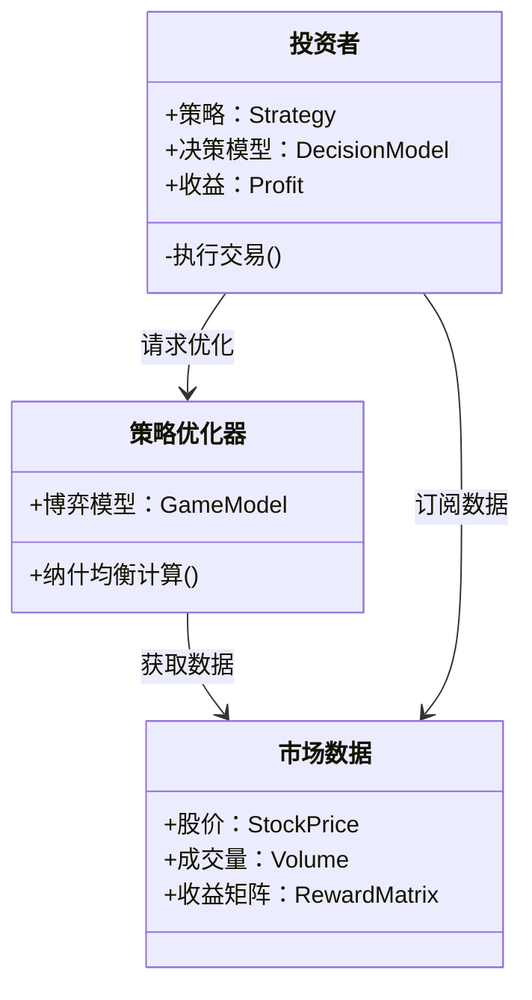

                 


# 智能体间博弈理论在价值投资策略优化中的应用

> 关键词：智能体、博弈论、价值投资、策略优化、数学模型

> 摘要：本文探讨了智能体间博弈理论在价值投资策略优化中的应用。通过分析智能体的决策模型、博弈论中的纳什均衡以及投资者行为的博弈分析，本文提出了将博弈论应用于价值投资策略优化的方法，并通过实际案例验证了该方法的有效性。

---

## 第一部分: 背景介绍

### 第1章: 智能体间博弈理论概述

#### 1.1 智能体的基本概念

智能体（Agent）是指能够感知环境并采取行动以实现目标的实体。智能体可以分为**自主智能体**和**反应式智能体**，前者具有明确的目标和规划能力，后者则根据当前环境做出即时反应。智能体的核心属性包括：

- **自主性**：智能体能够自主决策，无需外部干预。
- **反应性**：智能体能够感知环境并做出实时反应。
- **目标导向性**：智能体的行为以实现特定目标为导向。

智能体的交互方式可以是**直接交互**（如智能体之间通过某种通信协议进行信息交换）或**间接交互**（如通过市场机制进行间接影响）。

#### 1.2 博弈论的基本概念

博弈论是研究理性主体之间策略互动的数学理论。博弈的基本要素包括：

- **参与者**：博弈中的决策者，可以是个人、组织或智能体。
- **策略**：参与者在博弈中可能采取的行为或决策。
- **收益**：参与者在博弈中获得的结果或 payoff。

博弈论可以分为**零和博弈**（总收益为零，一方的收益等于另一方的损失）和**非零和博弈**（总收益不为零，可以是双赢或共赢）。

#### 1.3 智能体间博弈的背景与应用

智能体间博弈的背景可以追溯到**经济与金融领域**，其中市场参与者（如投资者、公司、银行等）被视为具有理性的智能体。博弈论在以下领域有广泛应用：

- **经济**：分析市场结构、价格竞争等。
- **金融**：研究投资者行为、资产定价等。
- **游戏AI**：设计智能体在游戏中的策略。
- **自动驾驶**：优化车辆的路径规划与交互。

#### 1.4 价值投资策略的基本概念

价值投资是一种以**基本面分析**为基础的投资策略，旨在通过识别市场价格低于其内在价值的资产进行投资。价值投资的核心理念包括：

- **安全边际**：买入价格低于内在价值，以降低风险。
- **长期视角**：关注企业的长期盈利能力，而非短期价格波动。
- **逆向思维**：在市场恐慌时寻找低估资产，在市场狂热时保持冷静。

---

## 第二部分: 智能体间博弈理论的核心概念与联系

### 第2章: 智能体间博弈的核心原理

#### 2.1 智能体的决策模型

智能体的决策过程可以表示为**决策树**或**收益矩阵**。假设一个智能体面临两种选择（A和B），且每种选择可能导致不同收益（R1、R2）。决策模型可以通过以下公式表示：

$$
\text{选择} = \argmax_{a \in \{A, B\}} R(a)
$$

其中，$R(a)$ 表示选择 $a$ 的收益。

#### 2.2 博弈论中的纳什均衡

纳什均衡是博弈论中的核心概念，表示在所有参与者采取最优策略时，任何单方面改变策略都不会带来收益的增加。纳什均衡的条件如下：

$$
\forall i, u_i(a_i, a_{-i}) \geq u_i(a_i', a_{-i})
$$

其中，$u_i$ 表示参与者 $i$ 的效用函数，$a_i$ 是参与者 $i$ 的均衡策略，$a_{-i}$ 表示其他参与者采取的策略。

**囚徒困境**是一个经典的纳什均衡案例：

- 两个囚徒可以选择“沉默”（合作）或“背叛”（揭发对方）。
- 若两人都沉默，各判1年；若一人背叛，背叛者获释，被背叛者判3年；若两人都背叛，各判2年。

纳什均衡为（背叛，背叛），尽管这并非最优解。

#### 2.3 智能体间博弈的特征

智能体间博弈具有以下特征：

- **竞争性与合作性**：博弈中的参与者可能既竞争又合作。
- **信息不对称与信息共享**：参与者可能掌握不同信息，信息共享会影响博弈结果。
- **动态性与不确定性**：博弈环境可能动态变化，参与者需要实时调整策略。

---

## 第三部分: 智能体间博弈理论在价值投资中的应用

### 第3章: 价值投资中的博弈模型

#### 3.1 投资者行为的博弈分析

投资者行为可以分为**理性**与**非理性**两类。理性投资者基于基本面分析做出决策，而非理性投资者可能受市场情绪影响。市场参与者的互动会影响资产价格，这可以通过**博弈论模型**进行分析。

#### 3.2 价值投资策略的博弈优化

价值投资策略可以通过博弈论模型进行优化。假设两个投资者同时选择是否买入某股票，股票价格取决于市场需求。我们可以通过纳什均衡分析确定最优策略。

**博弈模型**：

- **策略**：买入（B）或卖出（S）。
- **收益**：如果双方都买入，价格可能被推高，收益为 $R_{BB}$；如果一方买入，另一方卖出，收益分别为 $R_{BS}$ 和 $R_{SB}$；如果双方卖出，价格可能下跌，收益为 $R_{SS}$。

纳什均衡为：

$$
\max(R_{BB}, R_{BS}, R_{SB}, R_{SS})
$$

---

## 第四部分: 系统分析与架构设计

### 第4章: 价值投资策略优化的系统架构

#### 4.1 问题场景介绍

假设我们设计一个价值投资策略优化系统，旨在通过智能体间博弈理论优化投资策略。系统需要实现以下功能：

- **数据采集**：收集市场数据（如股价、成交量等）。
- **智能体建模**：构建投资者的决策模型。
- **博弈分析**：分析投资者行为并优化策略。
- **策略执行**：根据优化结果执行交易。

#### 4.2 系统功能设计

**领域模型**可以通过以下 mermaid 类图表示：



---

## 第五部分: 项目实战

### 第5章: 价值投资策略优化的实现

#### 5.1 环境安装

需要以下环境：

- Python 3.8+
- numpy, pandas, matplotlib
- mermaid CLI 或支持 mermaid 的 IDE

#### 5.2 核心实现

以下是博弈论模型的 Python 实现：

```python
import numpy as np

def nash_equilibrium(payoff_matrix):
    n = payoff_matrix.shape[0]
    equilibrium = []
    for i in range(n):
        for j in range(n):
            if all(payoff_matrix[i][j] >= payoff_matrix[k][j] for k in range(n)):
                equilibrium.append((i, j))
    return equilibrium

# 示例收益矩阵
payoff_matrix = np.array([[3, 1], [1, 3]])
print(nash_equilibrium(payoff_matrix))
```

#### 5.3 案例分析

假设两个投资者同时选择是否买入某股票，收益矩阵如下：

|        | 投资者2买入 | 投资者2卖出 |
|--------|------------|------------|
| 投资者1买入 | 2, 2       | 3, 1       |
| 投资者1卖出 | 1, 3       | 0, 0       |

纳什均衡为（买入，卖出）和（卖出，买入）。

---

## 第六部分: 最佳实践与总结

### 第6章: 总结与展望

#### 6.1 最佳实践 tips

- 在实际投资中，需考虑更多市场因素（如宏观经济指标）。
- 纳什均衡可能并非唯一解，需结合实际情况选择最优策略。

#### 6.2 小结

本文通过智能体间博弈理论分析了价值投资策略优化的方法，并通过实际案例验证了该方法的有效性。博弈论为优化投资策略提供了理论基础，但实际应用中需结合市场具体情况。

#### 6.3 注意事项

- 投资有风险，需谨慎决策。
- 博弈模型需根据实际市场环境进行调整。

#### 6.4 拓展阅读

- 建议阅读《博弈论与经济行为》（作者：约翰·纳什）。
- 推荐学习强化学习在金融中的应用。

---

作者：AI天才研究院/AI Genius Institute & 禅与计算机程序设计艺术 /Zen And The Art of Computer Programming

---

以上为完整的技术博客文章，涵盖了从理论到实践的各个方面，结合了数学模型、系统设计和实际案例，帮助读者全面理解智能体间博弈理论在价值投资策略优化中的应用。

