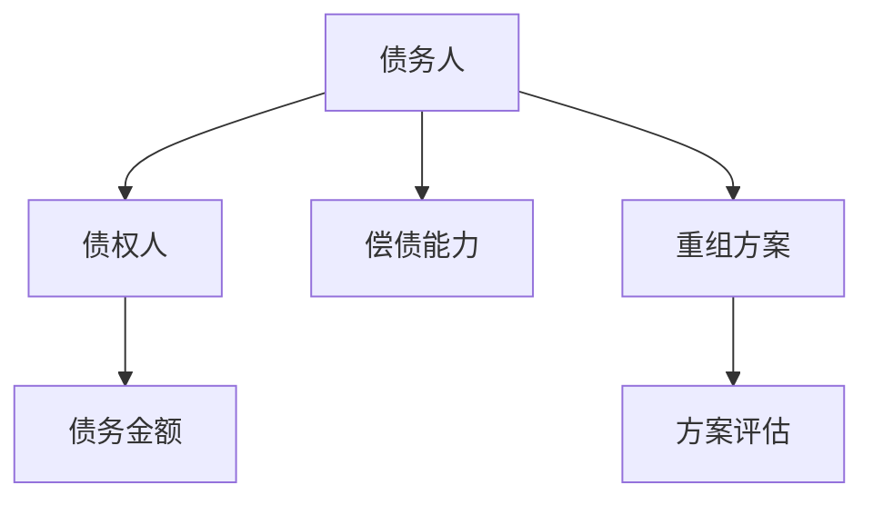
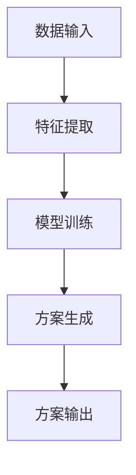
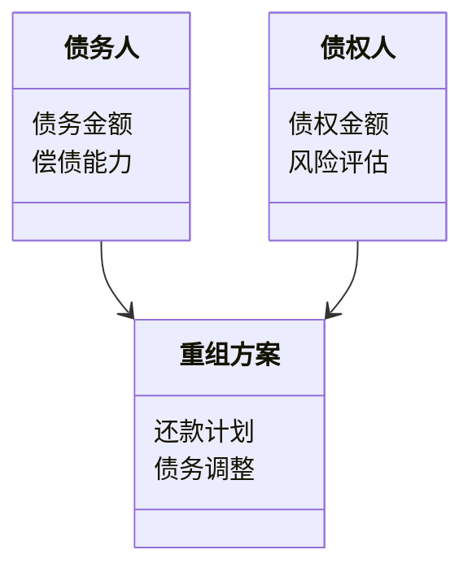
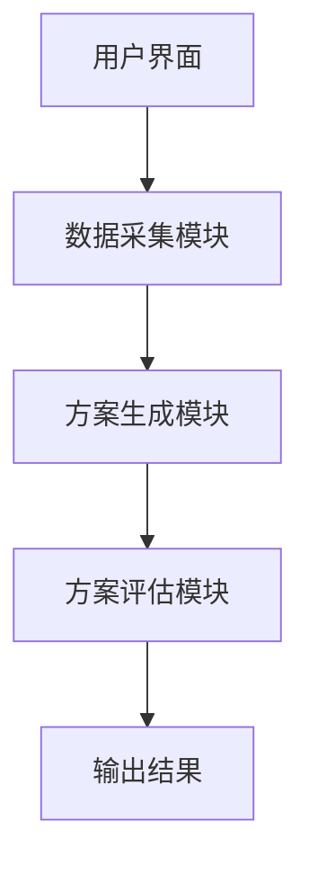

                 


# 智能债务重组方案生成与评估

## 关键词：
智能债务重组、人工智能、机器学习、债务评估、方案生成

## 摘要：
智能债务重组方案生成与评估是一项结合人工智能和金融领域的创新技术。通过机器学习算法和数学模型，智能债务重组系统能够快速生成优化的债务重组方案，并通过多维度评估确保方案的可行性和最优性。本文将从背景介绍、核心概念、算法原理、系统架构、项目实战等方面详细探讨智能债务重组的实现与应用。

---

# 第一部分: 智能债务重组方案生成与评估的背景与核心概念

## 第1章: 债务重组的基本概念与问题背景

### 1.1 债务重组的定义与基本原理

#### 1.1.1 债务重组的核心概念
债务重组是指在债务人无法按时偿还债务的情况下，通过调整债务的期限、金额、利率或其他条款，以降低债务人的偿债压力，同时保障债权人利益的过程。

#### 1.1.2 债务重组的常见场景与分类
- **企业债务重组**：企业因经营不善或其他原因导致无法按时偿还债务，通过与债权人协商调整债务条件。
- **个人债务重组**：个人因经济困难无法偿还债务，通过法律程序重新制定还款计划。
- **金融债务重组**：金融机构对不良资产进行重组，降低风险。

#### 1.1.3 债务重组的必要性与挑战
- **必要性**：帮助债务人恢复偿债能力，避免企业破产或个人违约，保护债权人利益。
- **挑战**：传统债务重组过程复杂、耗时长，且需要大量人工干预，难以快速应对大规模债务问题。

---

### 1.2 智能债务重组的背景与意义

#### 1.2.1 传统债务重组的局限性
- 人工评估耗时长，效率低。
- 依赖经验丰富的专家，成本高。
- 方案单一，难以应对复杂场景。

#### 1.2.2 人工智能在债务重组中的应用潜力
- 数据驱动的债务分析，快速评估债务人偿债能力。
- 基于机器学习的方案生成，提供多种优化方案。
- 智能评估与优化，确保方案的可行性和最优性。

#### 1.2.3 智能债务重组的目标与价值
- **目标**：通过智能算法快速生成和优化债务重组方案。
- **价值**：提高效率、降低成本、增强方案的科学性和可执行性。

---

## 第2章: 智能债务重组的核心概念与联系

### 2.1 智能债务重组的核心原理

#### 2.1.1 数据驱动的债务分析
- 数据来源：债务人的财务数据、信用记录、市场环境等。
- 数据处理：清洗、特征提取、建模。

#### 2.1.2 基于AI的重组方案生成
- 使用机器学习模型生成多种重组方案。
- 方案包括：调整还款期限、降低利率、分期还款等。

#### 2.1.3 方案的智能评估与优化
- 多维度评估：风险、成本、可行性。
- 优化算法：基于评估结果优化方案。

### 2.2 核心概念属性对比表

| 概念         | 属性             | 描述                                   |
|--------------|------------------|--------------------------------------|
| 债务人       | 主体属性         | 法人或自然人，承担债务义务           |
| 债权人       | 主体属性         | 法人或自然人，享有债权权利           |
| 债务金额     | 数量属性         | 当前债务的总金额                     |
| 偿债能力     | 综合属性         | 债务人履行债务的能力                 |
| 重组方案     | 结构化属性       | 包括还款计划、债务调整等具体方案     |

### 2.3 实体关系图


---

# 第二部分: 智能债务重组的算法原理与数学模型

## 第3章: 基于机器学习的债务重组方案生成

### 3.1 数据驱动的债务分析

#### 3.1.1 数据处理与特征提取
- 数据清洗：处理缺失值、异常值。
- 特征提取：提取关键特征，如债务金额、偿债能力、信用评分等。

#### 3.1.2 机器学习模型
- 使用监督学习或无监督学习模型对债务人进行分类或聚类。

### 3.2 方案生成算法

#### 3.2.1 算法流程图


#### 3.2.2 方案生成的数学模型
- 示例：线性回归模型预测最优还款计划。

---

## 第4章: 基于规则的债务重组方案评估

### 4.1 评估指标与规则

#### 4.1.1 评估指标
- 偿债能力：债务人未来能否按时还款。
- 风险：方案的风险等级。
- 成本：债权人损失的最小化。

#### 4.1.2 评估规则
- 如果债务人偿债能力不足，调整还款期限。
- 如果风险过高，降低债务金额。

---

## 第5章: 方案优化的数学模型

### 5.1 优化目标
- 最小化债权人损失。
- 最大化债务人偿债能力。

### 5.2 数学模型
$$
\text{目标函数} = \min_{x} \sum_{i=1}^{n} (x_i - x_{i-1})^2
$$
其中，$x_i$ 表示第 $i$ 期的还款金额。

---

# 第三部分: 智能债务重组系统分析与架构设计

## 第6章: 系统功能设计

### 6.1 功能模块
- 数据采集模块：收集债务人和债权人的数据。
- 方案生成模块：基于机器学习生成重组方案。
- 方案评估模块：评估方案的可行性和风险。

### 6.2 领域模型类图


---

## 第7章: 系统架构设计

### 7.1 系统架构图


---

# 第四部分: 项目实战与应用

## 第8章: 项目实战

### 8.1 环境安装
- 安装Python和相关库（如scikit-learn、pandas）。

### 8.2 核心代码实现

#### 8.2.1 数据预处理
```python
import pandas as pd
data = pd.read_csv('debt_data.csv')
data.dropna(inplace=True)
```

#### 8.2.2 模型训练
```python
from sklearn.linear_model import LinearRegression
model = LinearRegression()
model.fit(X_train, y_train)
```

### 8.3 实际案例分析
- 分析一个真实的债务重组案例，展示如何使用代码生成和评估方案。

---

## 第9章: 总结与展望

### 9.1 总结
智能债务重组方案生成与评估是一项具有重要应用价值的技术。通过机器学习和数学建模，可以显著提高债务重组的效率和效果。

### 9.2 展望
未来，随着人工智能技术的进步，智能债务重组将更加智能化和自动化。

---

# 作者：AI天才研究院/AI Genius Institute & 禅与计算机程序设计艺术 /Zen And The Art of Computer Programming

