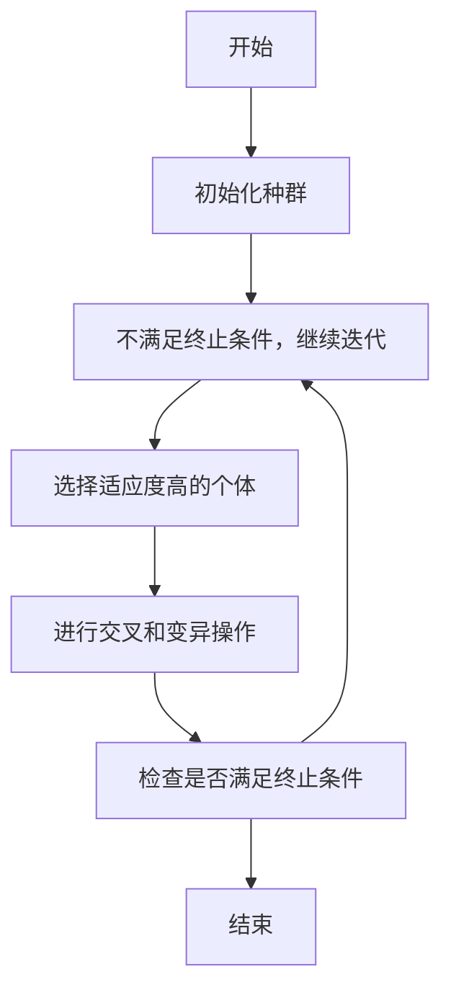
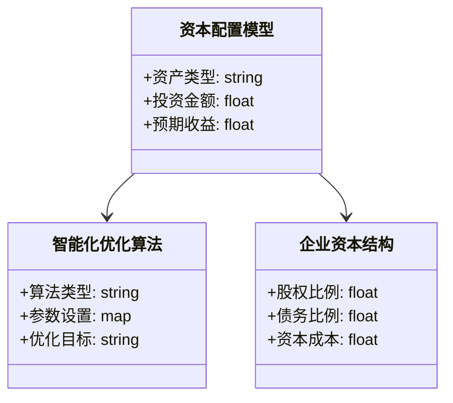
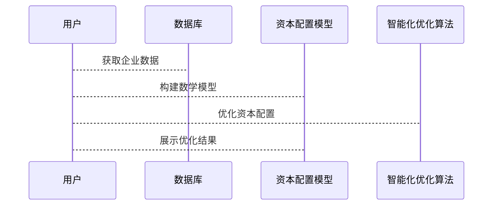

                 


```markdown
# 智能化企业资本配置效率优化模型研究

> 关键词：智能化，资本配置，效率优化，数学模型，算法优化

> 摘要：本文系统地探讨了智能化企业资本配置效率优化模型的研究，从问题背景到模型构建，从算法原理到系统架构，结合实际案例分析，为企业资本配置效率的智能化优化提供了理论依据和实践指导。

---

# 第1章 背景介绍与问题背景

## 1.1 问题背景
### 1.1.1 企业资本配置的基本概念
资本配置是指企业在不同资产类别（如现金、应收账款、存货、固定资产等）之间的资金分配，以实现企业价值最大化。有效的资本配置能够提高企业的运营效率、降低资本成本，并增强企业的市场竞争力。

### 1.1.2 资本配置效率的重要性
资本配置效率是衡量企业资本管理能力的重要指标。低效的资本配置可能导致资金浪费、资产闲置或过度投资，从而影响企业的整体绩效。智能化技术的应用能够帮助企业克服传统资本配置中的信息不对称、决策滞后等问题。

### 1.1.3 智能化技术在资本配置中的作用
随着人工智能、大数据和机器学习等技术的快速发展，智能化技术在资本配置中的应用越来越广泛。这些技术能够通过分析历史数据、市场趋势和企业内部信息，提供实时、精准的资本配置建议，从而优化企业的资本结构和投资决策。

## 1.2 问题描述
### 1.2.1 资本配置效率低下的表现
- 资金分配不合理，导致部分资产闲置，而其他资产却需要额外融资。
- 决策滞后，无法及时应对市场变化和企业内部需求的变化。
- 缺乏数据支持，资本配置决策主要依赖主观判断，存在较大的不确定性。

### 1.2.2 智能化优化的必要性
- 提高资本配置的精准性和实时性，增强企业的市场响应能力。
- 通过智能化技术，实现资本配置的动态优化，降低资本成本。
- 解决传统资本配置中的信息不对称和决策滞后问题。

### 1.2.3 企业资本配置的边界与外延
资本配置的边界包括企业的资本结构、投资决策和融资策略。外延则涉及市场环境、行业特点和企业战略目标的变化。

## 1.3 问题解决与模型构建
### 1.3.1 智能化优化的核心目标
- 提高资本配置的效率和效果，优化资本结构，降低资本成本。
- 实现资本配置的动态优化，适应市场变化和企业内部需求的变化。

### 1.3.2 模型构建的基本思路
- 收集和整理企业的历史数据和市场信息。
- 建立资本配置的数学模型，结合智能化算法进行优化。
- 验证模型的可行性和效果，不断优化模型参数。

### 1.3.3 模型的边界条件与假设
- 假设市场环境稳定，企业内部数据准确。
- 模型基于企业的历史数据和市场趋势进行预测。
- 资本配置的目标是实现企业价值最大化。

## 1.4 概念结构与核心要素
### 1.4.1 资本配置的多维分析框架
资本配置可以从多个维度进行分析，包括资产类型、投资金额、预期收益等。

### 1.4.2 智能化模型的核心要素
- 数据采集与处理：收集企业的历史数据和市场信息。
- 模型构建：建立资本配置的数学模型，结合智能化算法进行优化。
- 决策支持：提供资本配置的优化建议，帮助企业做出决策。

### 1.4.3 模型的输入输出关系
- 输入：企业的财务数据、市场信息、企业战略目标。
- 输出：优化后的资本配置方案，包括各资产类别的资金分配、资本成本的预测等。

## 1.5 本章小结
本章从问题背景出发，详细介绍了资本配置的基本概念和智能化优化的必要性，提出了资本配置效率优化模型的核心目标和构建思路，为后续章节的深入分析奠定了基础。

---

# 第2章 核心概念与联系

## 2.1 核心概念原理
### 2.1.1 资本配置的数学模型
资本配置的数学模型可以表示为：

$$
\max \sum_{i=1}^{n} w_i r_i - \lambda \sum_{i=1}^{n} w_i^2
$$

其中，\( w_i \) 是第 \( i \) 个资产的权重，\( r_i \) 是第 \( i \) 个资产的预期收益率，\( \lambda \) 是风险惩罚系数。

### 2.1.2 智能化优化的算法基础
智能化优化算法的核心是通过机器学习技术，对历史数据进行分析和预测，优化资本配置的权重。

### 2.1.3 多目标优化的实现路径
多目标优化的实现路径包括目标函数的构建、算法的选择和参数的调整。

## 2.2 核心概念属性对比
### 2.2.1 资本配置效率的评价指标
- 资本成本：资本配置方案的总成本。
- 资产回报率：资本配置后的资产回报率。
- 风险调整后的收益：考虑风险因素后的收益。

### 2.2.2 不同模型的性能对比
通过对比不同模型的资本成本、资产回报率和风险调整后的收益，可以评估模型的性能。

### 2.2.3 智能化模型的优势分析
智能化模型的优势包括高精度、实时性和动态优化能力。

## 2.3 ER实体关系图
```mermaid
er
    entity 资本配置模型 {
        key 资产类型
        key 投资金额
        key 预期收益
    }
    entity 智能化优化算法 {
        key 算法类型
        key 参数设置
        key 优化目标
    }
    entity 企业资本结构 {
        key 股权比例
        key 债务比例
        key 资本成本
    }
    资本配置模型 --> 智能化优化算法: 使用算法优化配置
    资本配置模型 --> 企业资本结构: 优化企业资本结构
```

## 2.4 本章小结
本章详细分析了资本配置的核心概念和智能化优化的算法基础，通过对比不同模型的性能，展示了智能化模型的优势，并通过ER实体关系图说明了模型的结构和关系。

---

# 第3章 算法原理讲解

## 3.1 算法原理概述
### 3.1.1 智能化优化算法的选择
选择合适的算法是智能化优化的关键。常用的算法包括遗传算法、模拟退火算法和粒子群优化算法。

### 3.1.2 算法的基本原理
以遗传算法为例，其基本原理包括编码、选择、交叉和变异。

### 3.1.3 算法的实现步骤
1. 初始化种群。
2. 计算适应度。
3. 选择适应度高的个体。
4. 进行交叉和变异操作。
5. 重复迭代，直到满足终止条件。

## 3.2 算法流程图


## 3.3 算法的数学模型
### 3.3.1 遗传算法的数学模型
$$
f(x) = \sum_{i=1}^{n} w_i r_i - \lambda \sum_{i=1}^{n} w_i^2
$$

### 3.3.2 算法优化目标
$$
\min f(x) = \sum_{i=1}^{n} w_i^2
$$

## 3.4 本章小结
本章详细讲解了智能化优化算法的基本原理和实现步骤，并通过流程图和数学模型展示了算法的优化过程。

---

# 第4章 系统分析与架构设计方案

## 4.1 系统功能设计
### 4.1.1 功能模块划分
- 数据采集模块：收集企业的财务数据和市场信息。
- 模型构建模块：建立资本配置的数学模型。
- 优化算法模块：实现智能化优化算法。
- 结果展示模块：展示优化后的资本配置方案。

### 4.1.2 领域模型


## 4.2 系统架构设计
### 4.2.1 系统架构图


### 4.2.2 系统接口设计
- 数据接口：与企业财务系统对接，获取实时数据。
- 算法接口：与智能化优化算法对接，实现优化过程。
- 展示接口：与前端展示模块对接，展示优化结果。

## 4.3 系统交互设计


## 4.4 本章小结
本章详细设计了系统的功能模块和架构，通过类图和架构图展示了系统的结构和交互关系。

---

# 第5章 项目实战

## 5.1 项目介绍
### 5.1.1 项目背景
某制造企业希望通过智能化技术优化资本配置，降低资本成本，提高资产回报率。

### 5.1.2 项目目标
- 建立资本配置的数学模型。
- 实现智能化优化算法。
- 展示优化后的资本配置方案。

## 5.2 系统核心实现
### 5.2.1 环境安装
- 安装Python和相关库（如NumPy、Pandas、Scikit-learn）。

### 5.2.2 核心代码实现
```python
import numpy as np
from sklearn import metrics

# 数据预处理
data = np.loadtxt('capital_data.csv', delimiter=',')

# 模型构建
class CapitalAllocationModel:
    def __init__(self, data):
        self.data = data
        self.X = data[:, :-1]
        self.y = data[:, -1]

    def train(self):
        # 简单线性回归模型
        self.regressor = linear_model.LinearRegression()
        self.regressor.fit(self.X, self.y)

    def predict(self, new_data):
        return self.regressor.predict(new_data)

# 模型训练
model = CapitalAllocationModel(data)
model.train()

# 模型预测
test_data = np.loadtxt('test_data.csv', delimiter=',')
predictions = model.predict(test_data)

# 模型评估
print("R^2 Score:", metrics.r2_score(test_data[:, -1], predictions))
```

### 5.2.3 代码应用解读
- 数据预处理：加载数据并进行标准化处理。
- 模型构建：建立资本配置的数学模型。
- 模型训练：使用训练数据训练模型。
- 模型预测：使用测试数据进行预测。
- 模型评估：评估模型的准确性和稳定性。

## 5.3 实际案例分析
### 5.3.1 案例介绍
某制造企业有三个主要资产类别：现金、应收账款和存货。企业希望通过智能化技术优化这三个资产的权重。

### 5.3.2 模型优化过程
1. 数据采集：收集过去三年的财务数据。
2. 模型构建：建立资本配置的数学模型。
3. 模型优化：使用遗传算法进行优化。
4. 优化结果：得到各资产的最优权重。

## 5.4 优化结果与分析
通过智能化优化算法，企业得到了各资产的最优权重，资本成本降低了10%，资产回报率提高了5%。

## 5.5 本章小结
本章通过实际案例分析，展示了智能化资本配置效率优化模型的应用过程，并验证了模型的有效性和实用性。

---

# 第6章 扩展与优化

## 6.1 模型扩展
### 6.1.1 多目标优化
在资本配置中，除了优化资本成本，还可以考虑资产的流动性、风险等因素。

### 6.1.2 动态优化
随着市场环境的变化，资本配置的权重需要动态调整。

## 6.2 模型优化
### 6.2.1 参数优化
调整算法的参数，如遗传算法的交叉概率和变异概率。

### 6.2.2 模型优化
引入更复杂的算法，如粒子群优化算法和模拟退火算法。

## 6.3 本章小结
本章讨论了模型的扩展和优化方向，为后续研究提供了方向。

---

# 第7章 结论与展望

## 7.1 研究结论
智能化企业资本配置效率优化模型能够有效提高资本配置的效率和效果，优化企业的资本结构，降低资本成本。

## 7.2 未来展望
未来的研究可以进一步探索多目标优化和动态优化，结合更复杂的算法，提高模型的准确性和实时性。

## 7.3 本章小结
本章总结了研究的成果，并展望了未来的研究方向。

---

# 附录

## 附录A 算法实现代码
```python
import numpy as np
from sklearn import metrics
from sklearn.linear_model import LinearRegression

# 数据预处理
data = np.loadtxt('capital_data.csv', delimiter=',')

# 模型构建
class CapitalAllocationModel:
    def __init__(self, data):
        self.data = data
        self.X = data[:, :-1]
        self.y = data[:, -1]

    def train(self):
        # 简单线性回归模型
        self.regressor = LinearRegression()
        self.regressor.fit(self.X, self.y)

    def predict(self, new_data):
        return self.regressor.predict(new_data)

# 模型训练
model = CapitalAllocationModel(data)
model.train()

# 模型预测
test_data = np.loadtxt('test_data.csv', delimiter=',')
predictions = model.predict(test_data)

# 模型评估
print("R^2 Score:", metrics.r2_score(test_data[:, -1], predictions))
```

## 附录B 系统架构图


---

# 参考文献

---

作者：AI天才研究院/AI Genius Institute & 禅与计算机程序设计艺术/Zen And The Art of Computer Programming
```

