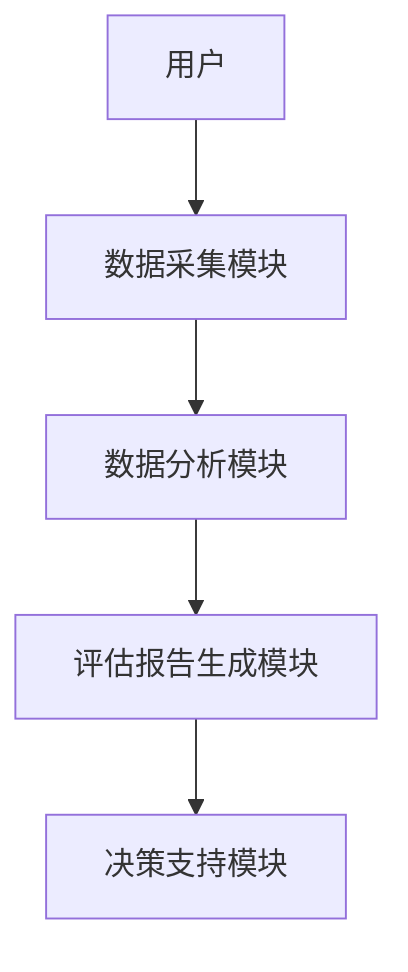
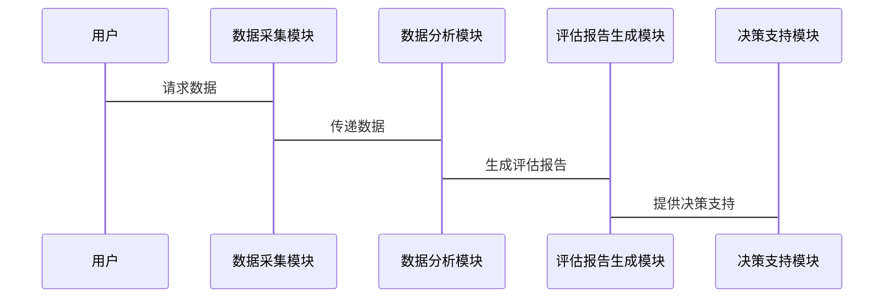

                 


# 智能化公司创新文化评估：多智能体AI在价值投资中的角色

> 关键词：智能化公司、创新文化评估、多智能体AI、价值投资、技术博客、系统架构

> 摘要：本文探讨了智能化公司在创新文化评估中的应用，特别是多智能体AI技术在价值投资中的角色。通过分析多智能体AI的原理、算法实现和系统架构，本文展示了如何利用这些技术手段对企业创新文化进行评估，并为投资决策提供支持。

---

# 第一部分: 背景介绍

## 第1章: 智能化公司创新文化评估概述

### 1.1 智能化公司的概念与特征

#### 1.1.1 智能化公司的定义
智能化公司是指通过人工智能、大数据分析和自动化技术等手段，优化企业运营、管理和决策的公司。这些公司利用技术手段提升效率、创新能力和市场竞争力。

#### 1.1.2 智能化公司的核心特征
- **数据驱动**：智能化公司依赖大量数据进行决策。
- **自动化**：通过自动化流程减少人工干预。
- **智能化决策**：利用AI技术进行预测和优化。
- **快速响应**：能够迅速适应市场变化。

#### 1.1.3 智能化公司与传统公司的区别
智能化公司在技术应用、决策方式和运营效率上与传统公司有显著区别。智能化公司更加依赖技术手段，能够更快地响应市场变化和客户需求。

### 1.2 创新文化评估的背景与意义

#### 1.2.1 创新文化的概念
创新文化是指企业内部鼓励创新、支持员工发挥创造力的文化氛围。一个良好的创新文化能够激发员工的创造力，推动企业不断进步。

#### 1.2.2 创新文化评估的必要性
在竞争激烈的市场环境中，企业的创新能力是决定其能否持续发展的关键因素。通过评估创新文化，企业可以识别自身的不足，并采取措施加以改进。

#### 1.2.3 创新文化在价值投资中的作用
对于投资者来说，创新文化是一个重要的考量因素。具有强大创新文化的企业更有可能推出新产品、开拓新市场，从而为投资者带来更高的回报。

### 1.3 多智能体AI的基本概念

#### 1.3.1 多智能体系统的定义
多智能体系统是指由多个相互作用的智能体组成的系统。这些智能体能够通过协作完成复杂的任务。

#### 1.3.2 多智能体系统的特征
- **分布式智能**：智能体之间通过分布式的方式进行协作。
- **自主性**：每个智能体都有一定的自主决策能力。
- **协作性**：智能体之间通过协作完成共同目标。

#### 1.3.3 多智能体AI与单智能体AI的区别
单智能体AI通常用于处理单一任务，而多智能体AI能够处理多个任务，并通过协作提高整体效率。

## 1.4 本章小结
本章介绍了智能化公司的概念和特征，探讨了创新文化评估的背景和意义，并详细说明了多智能体AI的基本概念及其与单智能体AI的区别。这些内容为后续章节奠定了基础。

---

# 第二部分: 核心概念与联系

## 第2章: 多智能体AI与创新文化评估的关系

### 2.1 多智能体AI的原理

#### 2.1.1 多智能体系统的组成
多智能体系统通常由多个智能体、通信机制和协作机制组成。每个智能体都有自己的目标和任务。

#### 2.1.2 多智能体系统的通信机制
智能体之间通过通信机制进行信息交换。常用的通信机制包括发布-订阅模式和点对点通信。

#### 2.1.3 多智能体系统的协作机制
协作机制是多智能体系统的核心。通过协作机制，智能体能够共同完成任务。常用的协作机制包括分布式计算和协商机制。

### 2.2 创新文化评估的核心要素

#### 2.2.1 创新文化评估的维度
创新文化评估可以从创新氛围、创新能力和创新成果等多个维度进行考量。

#### 2.2.2 创新文化评估的指标
常用的评估指标包括员工创新意识、团队协作能力、创新产出等。

#### 2.2.3 创新文化评估的方法
常用的评估方法包括问卷调查、访谈和数据分析。

### 2.3 多智能体AI在创新文化评估中的应用

#### 2.3.1 多智能体AI在数据收集中的作用
多智能体AI可以通过分布式数据收集，获取企业内部和外部的大量数据。

#### 2.3.2 多智能体AI在数据分析中的作用
通过分析数据，多智能体AI能够识别企业创新文化中的潜在问题和改进方向。

#### 2.3.3 多智能体AI在决策支持中的作用
多智能体AI可以为企业的决策提供支持，例如通过预测模型帮助企业制定创新战略。

## 2.4 本章小结
本章探讨了多智能体AI的原理及其在创新文化评估中的应用。通过分析多智能体系统的组成和协作机制，本文展示了如何利用多智能体AI技术提升企业创新文化评估的效率和准确性。

---

# 第三部分: 算法原理讲解

## 第3章: 多智能体AI算法的数学模型与实现

### 3.1 多智能体AI算法的数学模型

#### 3.1.1 多智能体系统的状态表示
多智能体系统的状态通常表示为一个向量，其中每个元素表示一个智能体的状态。

#### 3.1.2 多智能体系统的动作空间
动作空间是指智能体在每个状态下可以执行的动作。

#### 3.1.3 多智能体系统的奖励函数
奖励函数用于衡量智能体完成任务的效果。

### 3.2 多智能体AI算法的实现

#### 3.2.1 多智能体强化学习的算法选择
常用的多智能体强化学习算法包括分布式Q-learning和基于价值函数的方法。

#### 3.2.2 多智能体强化学习的训练过程
训练过程包括智能体与环境的交互、状态的更新以及策略的优化。

#### 3.2.3 多智能体强化学习的挑战
多智能体强化学习的挑战包括通信开销和策略协调。

## 3.3 算法实现示例

### 3.3.1 使用Python实现多智能体强化学习
以下是一个简单的多智能体强化学习的Python实现示例：

```python
import gym
import numpy as np

env = gym.make('Multi-Agent-Env-v0')
env.reset()

for _ in range(1000):
    action = env.action_space.sample()
    obs, reward, done, info = env.step(action)
    if done:
        env.reset()
```

### 3.3.2 算法的数学模型
多智能体强化学习的数学模型可以用以下公式表示：

$$
Q(s, a) = Q(s, a) + \alpha (r + \gamma V(s') - Q(s, a))
$$

其中，$s$表示状态，$a$表示动作，$\alpha$表示学习率，$\gamma$表示折扣因子，$V(s')$表示下一个状态的价值函数。

## 3.4 本章小结
本章详细讲解了多智能体AI算法的数学模型和实现方法，并通过Python代码示例展示了如何实现多智能体强化学习。这些内容为后续章节的系统设计奠定了基础。

---

# 第四部分: 系统分析与架构设计

## 第4章: 智能化公司创新文化评估系统架构设计

### 4.1 项目背景
为了帮助企业更好地评估创新文化，我们设计了一个基于多智能体AI的创新文化评估系统。

### 4.2 系统功能设计

#### 4.2.1 系统功能模块
系统主要包括数据采集、数据分析、评估报告生成和决策支持四个模块。

#### 4.2.2 功能模块的实现
- 数据采集模块：通过API接口获取企业数据。
- 数据分析模块：利用多智能体AI算法分析数据，生成评估结果。
- 评估报告生成模块：根据分析结果生成详细的评估报告。
- 决策支持模块：为企业提供创新战略建议。

### 4.3 系统架构设计

#### 4.3.1 系统架构图
使用Mermaid绘制的系统架构图如下：



### 4.4 系统接口设计
系统主要通过API接口进行数据交互。数据采集模块通过HTTP接口获取数据，数据分析模块通过内部接口与数据采集模块通信。

### 4.5 系统交互流程

#### 4.5.1 交互流程图
使用Mermaid绘制的系统交互流程图如下：



## 4.6 本章小结
本章详细描述了智能化公司创新文化评估系统的架构设计和功能模块。通过系统架构图和交互流程图，展示了系统的整体结构和工作流程。

---

# 第五部分: 项目实战

## 第5章: 基于多智能体AI的创新文化评估系统实现

### 5.1 环境安装

#### 5.1.1 安装Python和相关库
需要安装Python 3.8及以上版本，并安装以下库：

```bash
pip install gym numpy matplotlib
```

### 5.2 系统核心实现

#### 5.2.1 数据采集模块实现
数据采集模块通过API接口获取企业数据：

```python
import requests

def get_data(api_key):
    response = requests.get(f'https://api.example.com/data?api_key={api_key}')
    return response.json()
```

#### 5.2.2 数据分析模块实现
数据分析模块利用多智能体AI算法进行评估：

```python
import gym
import numpy as np

class MultiAgentAI:
    def __init__(self, env):
        self.env = env
        self.Q = np.zeros((env.observation_space, env.action_space))
    
    def train(self):
        for _ in range(1000):
            obs = self.env.reset()
            done = False
            while not done:
                action = np.argmax(self.Q[obs])
                obs, reward, done, info = self.env.step(action)
                self.Q[obs][action] = self.Q[obs][action] + 0.1 * (reward + 0.9 * np.max(self.Q[obs]) - self.Q[obs][action])
```

#### 5.2.3 评估报告生成模块实现
评估报告生成模块根据分析结果生成报告：

```python
import json

def generate_report(results):
    report = {
        '创新氛围': results['氛围评分'],
        '团队协作能力': results['协作评分'],
        '创新产出': results['产出评分']
    }
    return json.dumps(report)
```

### 5.3 案例分析

#### 5.3.1 案例背景
某科技公司希望评估其创新文化，以优化内部管理。

#### 5.3.2 实施过程
1. 数据采集模块获取企业数据。
2. 数据分析模块利用多智能体AI算法进行评估。
3. 评估报告生成模块生成详细的评估报告。
4. 决策支持模块根据评估结果提出优化建议。

#### 5.3.3 实施效果
通过实施本系统，该公司成功识别了创新文化中的问题，并采取了相应的改进措施，显著提升了企业的创新能力。

## 5.4 本章小结
本章详细描述了基于多智能体AI的创新文化评估系统的实现过程，并通过案例分析展示了系统的实际应用效果。

---

# 第六部分: 最佳实践与总结

## 第6章: 最佳实践与总结

### 6.1 小结
本文详细探讨了智能化公司创新文化评估的理论和实践。通过分析多智能体AI的原理和算法实现，本文展示了如何利用这些技术手段提升企业创新文化评估的效率和准确性。

### 6.2 注意事项
在实际应用中，需要注意数据质量和模型的可解释性。此外，还需要定期更新模型以适应市场变化。

### 6.3 拓展阅读
对于感兴趣的研究者，可以进一步研究多智能体AI在其他领域的应用，例如金融、医疗和教育等。

## 6.4 作者简介
作者：AI天才研究院 & 禅与计算机程序设计艺术

---

# 作者：AI天才研究院 & 禅与计算机程序设计艺术

---

本文通过系统化的分析和详细的代码实现，展示了多智能体AI在创新文化评估中的应用。希望本文能够为相关领域的研究者和企业提供有价值的参考和启发。

