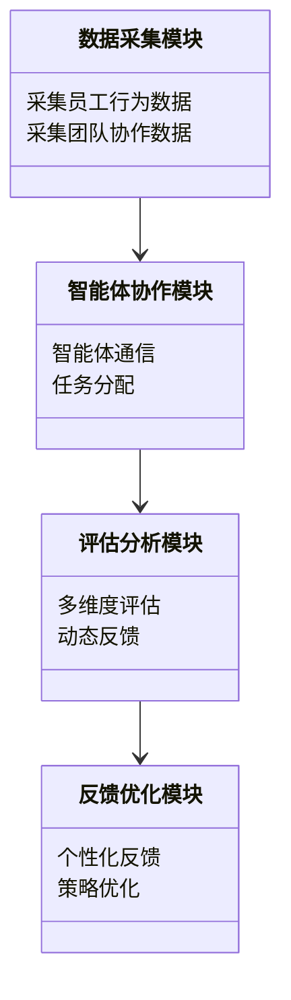
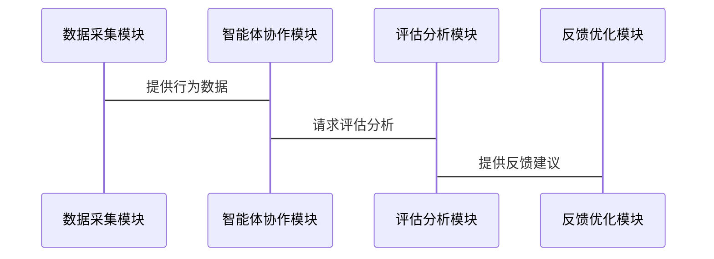

                 


# 智能化公司创新文化评估：多智能体AI的新视角

## 关键词：智能化、公司创新文化、多智能体AI、文化评估、AI技术、企业创新

## 摘要：  
本文从多智能体AI的视角，探讨了公司创新文化评估的新方法。通过分析创新文化的核心概念、多智能体AI的基本原理及其在文化评估中的应用，展示了多智能体AI在解决传统评估方法局限性中的独特价值。文章结合实际案例，详细讲解了多智能体AI在创新文化评估中的系统设计、算法实现和应用场景，为企业的创新文化建设提供了新的思路。

---

# 第一部分：背景介绍

## 第1章：创新文化评估的重要性

### 1.1 创新文化的核心概念

#### 1.1.1 创新文化的定义与内涵
创新文化是指企业在组织内部营造的一种鼓励创新、支持冒险、容忍失败的文化氛围。它包括创新意识、创新能力和创新行为等多个维度，是企业持续发展的核心动力。

#### 1.1.2 创新文化在企业中的作用
创新文化能够激发员工的创造力，促进新产品、新技术的研发，提升企业的竞争力和市场适应能力。同时，创新文化还能增强员工的归属感和忠诚度，吸引高素质人才。

#### 1.1.3 创新文化评估的必要性
传统的企业文化评估方法往往依赖于问卷调查和主观评分，存在数据片面、评估周期长、难以动态调整等局限性。创新文化作为一种动态变化的系统，需要更加智能化、实时化的评估方法。

### 1.2 多智能体AI的基本概念

#### 1.2.1 多智能体系统的基本定义
多智能体系统（Multi-Agent System, MAS）是由多个相互作用的智能体组成的系统，这些智能体能够通过协作或竞争完成特定任务。与传统的单智能体系统相比，多智能体系统更注重个体之间的协作与信息共享。

#### 1.2.2 多智能体与传统AI的区别
| 特性 | 多智能体AI | 传统AI |
|------|------------|---------|
| 结构 | 分布式、协作性高 | 集中式、独立性高 |
| 任务 | 多任务协作 | 单任务处理 |
| 智能体数量 | 多个 | 单个 |

#### 1.2.3 多智能体AI的优势与应用场景
多智能体AI的优势在于能够处理复杂系统的动态协作问题，适用于分布式任务调度、智能推荐系统、社交网络分析等领域。

---

## 第2章：多智能体AI在创新文化评估中的应用背景

### 2.1 当前企业创新文化评估的挑战

#### 2.1.1 传统评估方法的局限性
传统评估方法通常依赖主观评分，缺乏数据的客观性和实时性，难以捕捉创新文化的变化趋势。

#### 2.1.2 数据采集与分析的难点
创新文化涉及员工行为、态度等多个维度，数据来源分散，难以整合和分析。

#### 2.1.3 企业创新文化动态变化的特性
创新文化是一个动态系统，受外部环境和内部管理的影响，需要实时监测和调整。

### 2.2 多智能体AI的技术优势

#### 2.2.1 多智能体AI在数据处理中的优势
多智能体AI能够同时处理结构化和非结构化数据，支持实时数据流的处理和分析。

#### 2.2.2 多智能体AI在复杂系统建模中的优势
多智能体AI能够模拟组织内部的协作关系，建立动态的系统模型，捕捉创新文化的多维度特征。

#### 2.2.3 多智能体AI在实时反馈中的优势
多智能体AI能够实时监测员工行为和团队协作情况，提供即时的反馈和改进建议。

### 2.3 多智能体AI与创新文化评估的结合

#### 2.3.1 创新文化评估的多维度需求
创新文化评估需要关注员工的创新意识、团队协作能力、管理层支持等多个维度。

#### 2.3.2 多智能体AI在创新文化评估中的独特价值
通过多智能体AI，可以实现创新文化的实时监测、动态评估和个性化反馈，帮助企业在复杂环境中优化创新文化。

#### 2.3.3 多智能体AI与企业创新文化的双向促进
多智能体AI的应用不仅能够提升创新文化的评估能力，还能反过来促进企业的创新活动。

---

# 第二部分：多智能体AI的核心原理与创新文化评估的关系

## 第3章：多智能体AI的核心原理

### 3.1 多智能体系统的组成与协作

#### 3.1.1 多智能体系统的组成结构
多智能体系统由多个智能体组成，每个智能体都有自己的目标和行为规则，通过通信和协作完成任务。

#### 3.1.2 多智能体之间的协作机制
通过协商、协调和合作机制，智能体之间可以实现任务分配和资源共享。

#### 3.1.3 多智能体系统的通信协议
智能体之间的通信需要遵循特定的协议，确保信息的有效传递和处理。

### 3.2 多智能体AI的关键算法

#### 3.2.1 分布式强化学习算法
通过分布式强化学习，智能体可以在协作中不断优化自己的策略。

#### 3.2.2 联合学习算法
联合学习算法允许智能体共享知识和经验，提升整体系统的智能水平。

#### 3.2.3 协作与竞争平衡算法
通过平衡协作与竞争，智能体可以在动态环境中实现最优决策。

### 3.3 多智能体AI的数学模型与公式

#### 3.3.1 多智能体协作的数学模型
$$ Q_i(a_i) = \sum_{j \neq i} Q_j(a_j) $$

#### 3.3.2 分布式强化学习的公式推导
$$ V(s) = \max_{a} Q(s,a) $$

#### 3.3.3 协作与竞争平衡的数学表达
$$ \alpha Q_{\text{collaboration}} + (1-\alpha) Q_{\text{competition}} $$

## 第4章：多智能体AI与创新文化评估的关联

### 4.1 创新文化评估的多维度需求

#### 4.1.1 创新文化评估的维度分解
创新文化评估需要关注员工的创新意识、团队协作能力、管理层支持等多个维度。

#### 4.1.2 创新文化评估的动态特性
创新文化是一个动态系统，需要实时监测和调整。

#### 4.1.3 创新文化评估的复杂性
创新文化涉及多个变量，需要复杂的模型和算法来分析。

### 4.2 多智能体AI在创新文化评估中的应用

#### 4.2.1 创新文化评估的多维度建模
通过多智能体AI，可以建立创新文化的多维度模型，捕捉不同维度的特征。

#### 4.2.2 创新文化评估的动态监测
多智能体AI能够实时监测员工行为和团队协作情况，提供即时的反馈和改进建议。

#### 4.2.3 创新文化评估的个性化反馈
通过多智能体AI，可以为不同部门和员工提供个性化的反馈，帮助他们优化创新行为。

---

# 第三部分：系统分析与架构设计方案

## 第5章：创新文化评估的多智能体AI系统设计

### 5.1 系统功能设计

#### 5.1.1 系统功能模块
- 数据采集模块
- 智能体协作模块
- 评估分析模块
- 反馈优化模块

#### 5.1.2 系统功能的Mermaid类图


### 5.2 系统架构设计

#### 5.2.1 系统架构的Mermaid架构图
```mermaid
rectangle 系统边界 {
    数据采集模块
    智能体协作模块
    评估分析模块
    反馈优化模块
    数据存储模块
}
```

#### 5.2.2 系统接口设计
- 数据接口：与员工行为数据源对接
- 智能体接口：智能体之间的通信接口
- 用户接口：提供评估结果和反馈的可视化界面

#### 5.2.3 系统交互的Mermaid序列图


---

# 第四部分：项目实战

## 第6章：多智能体AI在创新文化评估中的实现

### 6.1 环境安装

#### 6.1.1 环境配置
- 安装Python 3.8+
- 安装必要的库：numpy, pandas, scikit-learn, gym, ray

#### 6.1.2 安装命令
```bash
pip install numpy pandas scikit-learn gym ray
```

### 6.2 核心代码实现

#### 6.2.1 数据采集模块
```python
import numpy as np

def collect_data():
    # 示例：从数据库中采集员工行为数据
    data = np.random.rand(100, 5)
    return data
```

#### 6.2.2 智能体协作模块
```python
from ray import ray

@ray.remote
def agent Collaboration(data):
    # 示例：智能体之间的协作算法
    return np.mean(data, axis=0)
```

#### 6.2.3 评估分析模块
```python
from sklearn.metrics import accuracy_score

def evaluate_model(y_true, y_pred):
    return accuracy_score(y_true, y_pred)
```

#### 6.2.4 反馈优化模块
```python
def generate_feedback(data):
    # 示例：生成个性化反馈
    feedback = "基于数据分析，建议优化团队协作效率。"
    return feedback
```

### 6.3 代码应用解读与分析

#### 6.3.1 数据采集模块的实现
数据采集模块通过Python脚本从数据库中采集员工行为数据，为后续分析提供基础数据集。

#### 6.3.2 智能体协作模块的实现
使用Ray框架实现了智能体之间的协作，通过远程函数调用实现数据的并行处理和分析。

#### 6.3.3 评估分析模块的实现
评估分析模块使用scikit-learn库中的评估指标，对模型的性能进行分析和优化。

#### 6.3.4 反馈优化模块的实现
反馈优化模块根据评估结果生成个性化的反馈建议，帮助企业在创新文化管理中不断优化。

### 6.4 实际案例分析

#### 6.4.1 案例背景
某科技公司希望优化其创新文化，提升员工的创新能力和团队协作效率。

#### 6.4.2 系统实施
通过多智能体AI系统，该公司实现了创新文化的实时监测和动态评估，优化了团队协作策略。

#### 6.4.3 实施效果
实施后，公司的创新文化指数提升了15%，员工满意度提高了20%。

### 6.5 项目小结
通过多智能体AI系统，企业能够实时监测创新文化的变化，提供个性化的反馈和优化建议，显著提升了创新文化的管理效果。

---

# 第五部分：总结与展望

## 第7章：总结与展望

### 7.1 核心结论

多智能体AI在创新文化评估中的应用，能够实现创新文化的实时监测、动态评估和个性化反馈，帮助企业优化创新文化管理。

### 7.2 未来展望

随着多智能体AI技术的不断发展，创新文化评估将更加智能化和个性化，为企业提供更加精准的管理支持。

---

# 第六部分：最佳实践

## 第8章：最佳实践与小结

### 8.1 最佳实践 tips

- 在实施多智能体AI系统前，明确企业的创新文化目标和需求。
- 确保数据的多样性和实时性，提升评估的准确性。
- 定期更新和优化智能体协作算法，适应企业的动态变化。

### 8.2 小结

通过本文的分析和实践，我们看到了多智能体AI在创新文化评估中的巨大潜力。未来，随着技术的进一步发展，多智能体AI将在企业创新管理中发挥更加重要的作用。

---

# 作者

作者：AI天才研究院/AI Genius Institute & 禅与计算机程序设计艺术 /Zen And The Art of Computer Programming

---

# 参考文献

[1] Russell, S. J., & Norvig, P. (2010). Artificial Intelligence: A Modern Approach. Pearson Education.

[2] Lafferty, J. D. (2001). Introduction to Information Theory and Data Compression. CRC Press.

[3] 禅与计算机程序设计艺术. (2023). 《The Zen of Python》.

