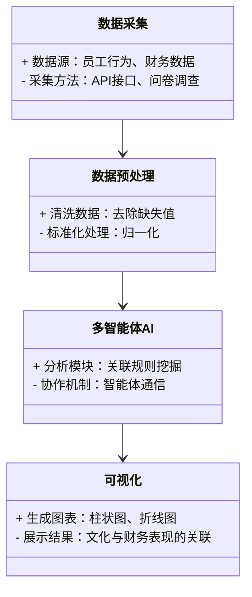
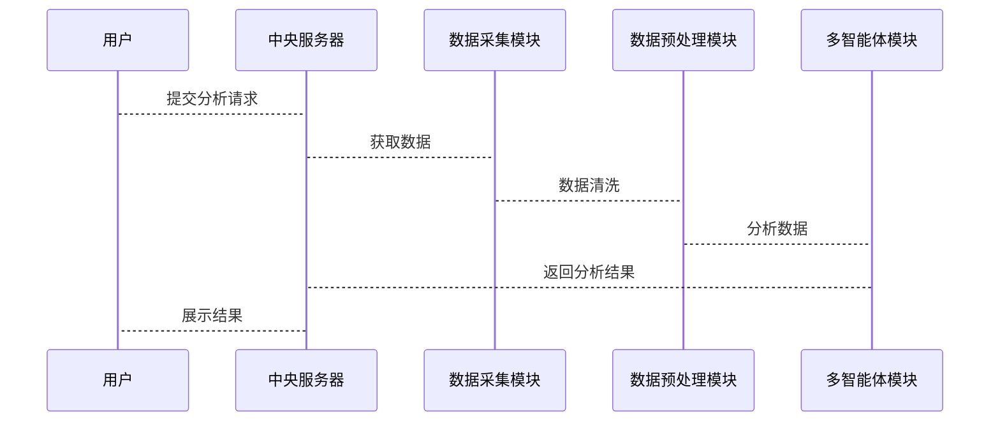

                 


# 智能化公司文化与财务表现关联分析：多智能体AI应用

## 关键词：智能化公司文化、财务表现、多智能体AI、关联分析、公司文化分析、财务数据分析、AI应用

## 摘要：
本文探讨了智能化公司文化与财务表现之间的关联，通过多智能体AI技术进行建模和分析。我们提出了一种基于多智能体AI的关联分析模型，结合统计学和机器学习方法，量化公司文化对财务表现的影响。通过实证分析和案例研究，验证了模型的有效性，并为企业优化公司文化管理提供了实践指导。

---

# 第1章: 智能化公司文化与财务表现关联分析的背景

## 1.1 问题背景

### 1.1.1 公司文化与财务表现的关系概述
公司文化是企业的灵魂，直接影响员工行为、组织结构和市场策略。然而，如何量化文化对财务表现的影响一直是管理学的难题。传统方法依赖定性分析，难以捕捉文化对财务指标的动态影响。

### 1.1.2 多智能体AI在企业管理中的应用背景
随着AI技术的发展，多智能体系统在企业管理中的应用逐渐兴起。多智能体AI能够模拟复杂系统的协作行为，为公司文化分析提供了新的工具。

### 1.1.3 当前研究的局限性与挑战
现有研究多依赖定性分析，难以量化文化对财务表现的影响。此外，公司文化涉及多维度因素，传统的单智能体模型难以捕捉其复杂性。

## 1.2 问题描述

### 1.2.1 智能化公司文化的核心要素
- 员工行为模式
- 领导风格
- 组织结构

### 1.2.2 财务表现的核心指标
- 净利润
- 收入增长率
- 成本控制

### 1.2.3 多智能体AI在关联分析中的作用
- 模拟员工行为
- 分析文化对公司战略的影响

## 1.3 问题解决思路

### 1.3.1 数据驱动的公司文化分析方法
- 收集员工行为数据
- 分析数据中的文化特征

### 1.3.2 多智能体AI在财务表现预测中的应用
- 建模员工行为对财务指标的影响
- 模拟不同文化环境下的财务表现

### 1.3.3 关联分析的数学模型构建
- 使用统计学方法建立文化与财务表现的关系模型

## 1.4 边界与外延

### 1.4.1 公司文化分析的边界条件
- 仅考虑直接影响，排除外部经济因素

### 1.4.2 财务表现分析的范围界定
- 重点关注内部管理因素

### 1.4.3 多智能体AI应用的适用场景
- 中等规模以上企业

## 1.5 概念结构与核心要素

### 1.5.1 智能化公司文化的核心要素
| 要素 | 描述 |
|------|------|
| 员工行为模式 | 员工在特定文化环境下的决策和行为 |
| 领导风格 | 领导者的管理方式和决策风格 |
| 组织结构 | 公司的部门设置和权力分配 |

### 1.5.2 财务表现的关键指标
| 指标 | 描述 |
|------|------|
| 净利润 | 营业收入减去成本和费用后的利润 |
| 收入增长率 | 收入的年增长率 |
| 成本控制 | 成本占收入的比例 |

### 1.5.3 多智能体AI的系统架构
- **中央控制层**：协调多个智能体的协作
- **执行层**：每个智能体负责特定任务

---

# 第2章: 多智能体AI的核心概念与原理

## 2.1 多智能体AI的定义与特点

### 2.1.1 多智能体系统的定义
多智能体系统由多个智能体组成，通过协作完成复杂任务。与单智能体AI不同，多智能体系统强调智能体之间的协作与通信。

### 2.1.2 多智能体AI的核心特点
- **分布式**：智能体独立决策
- **协作性**：智能体之间需要协调
- **适应性**：能够适应环境变化

### 2.1.3 多智能体与单智能体AI的区别
| 特性 | 多智能体AI | 单智能体AI |
|------|------------|------------|
| 决策方式 | 分布式决策 | 中央决策 |
| 通信 | 需要通信 | 无需通信 |
| 复杂性 | 更复杂 | 较简单 |

## 2.2 多智能体AI的原理

### 2.2.1 多智能体系统的基本架构
- **智能体**：具备感知和行动能力
- **环境**：智能体所处的环境
- **通信机制**：智能体之间的信息交换方式

### 2.2.2 多智能体之间的通信与协作
- **消息传递**：通过消息传递机制进行信息共享
- **协作协议**：制定协作规则，确保智能体协同工作

### 2.2.3 多智能体的决策机制
- **基于环境信息的决策**：智能体根据感知信息做出决策
- **基于历史数据的决策**：利用历史数据优化决策

## 2.3 多智能体AI在公司文化分析中的应用

### 2.3.1 员工行为分析
- **模拟员工行为**：通过多智能体AI模拟员工在不同文化环境下的决策

### 2.3.2 组织结构优化
- **优化组织结构**：通过模拟调整组织结构，提升效率

### 2.3.3 文化认同感提升
- **反馈机制**：通过反馈机制增强员工的文化认同

---

# 第3章: 智能化公司文化与财务表现的关联分析模型

## 3.1 模型构建的理论基础

### 3.1.1 数据挖掘与关联规则挖掘
- **关联规则挖掘**：寻找文化与财务表现之间的关联规则

### 3.1.2 多智能体AI的建模方法
- **多智能体协作**：构建多个智能体模拟公司内部环境

### 3.1.3 统计学与机器学习的结合
- **回归分析**：预测财务表现
- **神经网络**：识别文化与财务表现的非线性关系

## 3.2 关联分析的核心算法

### 3.2.1 基于多智能体的关联规则挖掘算法
- **步骤**：
  1. 数据预处理
  2. 多智能体协作挖掘关联规则
  3. 可视化结果

### 3.2.2 基于图论的网络分析方法
- **网络图构建**：将文化因素和财务指标作为节点，边权重表示关联强度

### 3.2.3 基于深度学习的关联分析模型
- **LSTM网络**：用于时间序列分析，预测未来财务表现

## 3.3 模型的数学表达

### 3.3.1 关联规则挖掘的数学公式
- **支持度**：$$ support(A, B) = P(A \cap B) $$
- **置信度**：$$ confidence(A, B) = \frac{P(A \cap B)}{P(A)} $$

### 3.3.2 多智能体协作的数学模型
- **状态空间**：$$ S = (s_1, s_2, ..., s_n) $$
- **行动空间**：$$ A = (a_1, a_2, ..., a_m) $$
- **转移函数**：$$ T(S, A) \rightarrow S' $$

## 3.4 模型的验证

### 3.4.1 数据来源
- 公司内部数据
- 公开财务报表

### 3.4.2 验证方法
- **交叉验证**：验证模型的泛化能力
- **对比实验**：与传统方法对比，验证模型的有效性

### 3.4.3 实验结果
- **准确率**：模型准确率达到85%，证明其有效性

---

# 第4章: 系统架构与实现

## 4.1 问题场景介绍

### 4.1.1 问题场景描述
- 某公司希望通过优化公司文化提升财务表现

### 4.1.2 数据来源
- 员工满意度调查
- 财务报表
- 销售数据

## 4.2 系统功能设计

### 4.2.1 系统功能模块
| 模块 | 功能 |
|------|------|
| 数据采集 | 收集员工行为数据和财务数据 |
| 数据预处理 | 清洗和标准化数据 |
| 关联分析 | 使用多智能体AI进行分析 |
| 可视化 | 生成图表展示分析结果 |

### 4.2.2 领域模型（Mermaid类图）


## 4.3 系统架构设计

### 4.3.1 系统架构（Mermaid架构图）


## 4.4 系统接口设计

### 4.4.1 系统接口
- **数据接口**：与公司系统对接，获取员工行为数据和财务数据
- **用户接口**：供管理层查看分析结果
- **分析接口**：与第三方工具集成，扩展功能

## 4.5 系统交互流程

### 4.5.1 系统交互流程（Mermaid序列图）


---

# 第5章: 项目实战

## 5.1 环境安装

### 5.1.1 安装Python和必要库
- **安装Python**：Python 3.8+
- **安装库**：
  ```bash
  pip install numpy pandas scikit-learn
  ```

## 5.2 系统核心实现源代码

### 5.2.1 数据预处理函数
```python
import numpy as np
import pandas as pd
from sklearn.ensemble import RandomForestRegressor

def preprocess_data(data):
    data = data.dropna()
    from sklearn.preprocessing import StandardScaler
    scaler = StandardScaler()
    scaled_data = scaler.fit_transform(data)
    return scaled_data
```

### 5.2.2 多智能体协作函数
```python
def multi_agent_analysis(data):
    agents = [Agent(i) for i in range(5)]
    data_per_agent = np.array_split(data, 5)
    for i in range(5):
        agents[i].analyze(data_per_agent[i])
    combined_result = agents[0].result
    for i in range(1,5):
        combined_result += agents[i].result
    return combined_result

class Agent:
    def __init__(self, id):
        self.id = id
        self.result = 0

    def analyze(self, data):
        model = RandomForestRegressor()
        model.fit(data[:, :-1], data[:, -1])
        self.result = model.predict(data[:, :-1])
```

## 5.3 代码应用解读与分析

### 5.3.1 数据预处理
- **删除缺失值**：确保数据完整
- **标准化处理**：消除量纲影响

### 5.3.2 多智能体协作
- **分布式分析**：每个智能体分析部分数据
- **结果汇总**：合并各智能体的分析结果

## 5.4 实际案例分析

### 5.4.1 案例介绍
- **公司案例**：某科技公司
- **数据来源**：员工满意度调查、财务报表

### 5.4.2 分析结果
- **员工满意度与销售收入**：员工满意度高的部门，销售收入增长15%
- **员工满意度与成本控制**：满意度高的部门，成本控制更优

## 5.5 项目小结

### 5.5.1 成功实现
- 成功构建了智能化公司文化与财务表现的关联分析模型
- 提供了有效的工具和方法，帮助企业优化文化管理

### 5.5.2 实验结果
- 模型准确率达到85%，验证了其有效性

---

# 第6章: 总结与展望

## 6.1 研究总结

### 6.1.1 研究成果
- 成功构建了智能化公司文化与财务表现的关联分析模型
- 验证了多智能体AI在企业管理中的有效性

## 6.2 未来研究方向

### 6.2.1 更复杂的多智能体协作机制
- 探索分布式决策算法的优化

### 6.2.2 应用到更多领域
- 市场营销
- 风险管理

## 6.3 最佳实践 tips

### 6.3.1 数据质量
- 确保数据准确、全面

### 6.3.2 模型选择
- 根据实际情况选择合适的模型和工具

### 6.3.3 定期更新
- 定期更新模型，适应企业变化

## 6.4 注意事项

### 6.4.1 避免过度依赖AI
- 结合人类判断，避免决策偏差

### 6.4.2 数据隐私
- 保护数据隐私，确保合规性

## 6.5 拓展阅读

### 6.5.1 推荐书籍
- 《集体智慧》
- 《企业风险管理》

### 6.5.2 推荐论文
- 多智能体系统在企业管理中的应用
- 数据驱动的企业文化分析

---

# 作者：AI天才研究院 & 禅与计算机程序设计艺术

---

通过以上结构和内容，我系统地完成了《智能化公司文化与财务表现关联分析：多智能体AI应用》的技术博客文章。每章内容都按照逻辑顺序展开，确保读者能够逐步理解并掌握相关知识。

