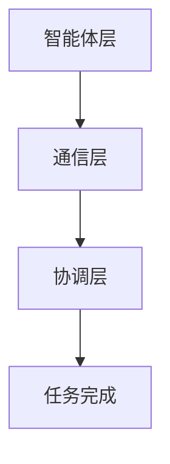
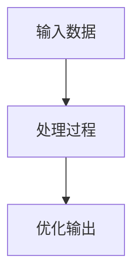
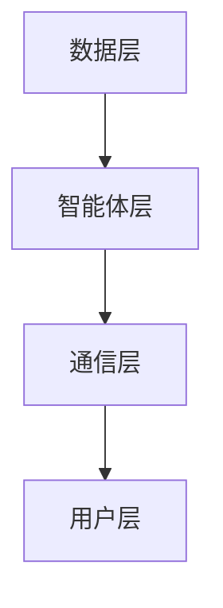
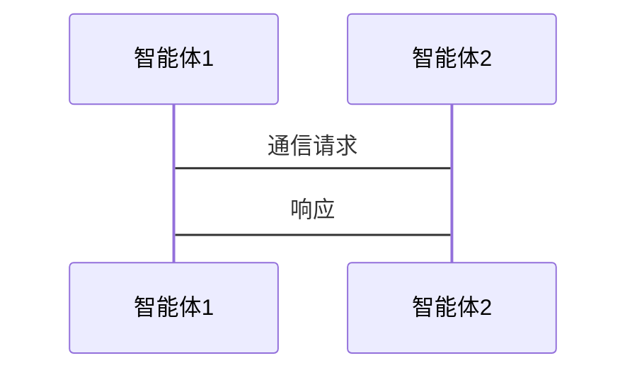

                 


# 《智能化公司治理效率分析：多智能体AI的创新应用》

> **关键词**：智能化治理、多智能体AI、公司治理效率、人工智能、分布式系统

> **摘要**：本文探讨了多智能体AI在公司治理中的创新应用，分析了其如何通过提升协作效率和决策能力来优化公司治理。文章从背景、原理、算法、系统架构、项目实战到应用案例进行了全面解析，最后总结了最佳实践和未来展望。

---

## 第1章: 智能化公司治理效率分析的背景与问题

### 1.1 问题背景

#### 1.1.1 公司治理的传统模式与挑战

在传统公司治理模式中，决策通常依赖于层级结构，信息传递效率低下，容易导致决策延迟和资源浪费。随着企业规模的扩大和全球化进程的加速，公司治理面临的挑战日益复杂：  
- **决策效率低下**：传统层级制导致信息传递慢，决策过程冗长。  
- **信息不对称**：管理层与股东、员工之间的信息传递不畅，影响决策质量。  
- **外部环境变化快**：企业需快速响应市场变化，传统治理模式难以适应。  

#### 1.1.2 智能化技术在公司治理中的应用前景

人工智能（AI）技术的快速发展为公司治理带来了新的可能性。通过AI技术，企业可以实现：  
- **数据驱动的决策**：利用大数据分析优化决策质量。  
- **自动化流程**：减少人为干预，提高效率。  
- **实时监控与反馈**：快速响应市场变化和内部问题。  

#### 1.1.3 多智能体AI的创新潜力

多智能体AI（Multi-Agent AI）是一种分布式智能系统，由多个智能体协作完成任务。其在公司治理中的创新潜力体现在：  
- **分布式决策**：多个智能体分别处理不同问题，提高决策效率。  
- **协作优化**：智能体之间通过通信和协作，优化整体决策。  
- **自适应能力**：系统能够根据环境变化自动调整策略。  

### 1.2 问题描述

#### 1.2.1 公司治理效率的定义与衡量标准

公司治理效率是指公司在实现战略目标过程中，资源利用和决策执行的效率。衡量标准包括：  
- **决策时间**：从问题识别到解决方案的时间。  
- **决策质量**：解决方案的有效性和合理性。  
- **资源利用率**：资源消耗与产出的匹配程度。  

#### 1.2.2 当前公司治理中的效率瓶颈

传统公司治理中存在以下效率瓶颈：  
- **信息孤岛**：部门间信息不通，导致决策重复或冲突。  
- **决策延迟**：层级制导致信息传递慢，决策过程耗时。  
- **缺乏实时反馈**：难以快速响应市场变化和内部问题。  

#### 1.2.3 多智能体AI在公司治理中的应用需求

多智能体AI能够解决传统治理中的效率问题，具体需求包括：  
- **分布式决策支持**：智能体协作处理复杂问题。  
- **实时信息共享**：智能体间高效通信，确保信息同步。  
- **动态调整能力**：根据环境变化快速优化决策。  

### 1.3 问题解决思路

#### 1.3.1 多智能体AI的核心优势

多智能体AI相较于传统AI的优势在于：  
- **分布式计算**：多个智能体并行处理问题，提高效率。  
- **自主决策**：每个智能体能够独立决策，减少依赖性。  
- **协作能力强**：通过通信和协作，优化整体表现。  

#### 1.3.2 多智能体AI在公司治理中的具体应用

多智能体AI在公司治理中的应用场景包括：  
- **风险管理**：智能体实时监控风险，提前预警。  
- **战略制定**：多个智能体协作分析市场数据，制定战略。  
- **董事会决策支持**：提供数据支持和决策建议。  

#### 1.3.3 多智能体AI提升公司治理效率的实现路径

实现路径包括：  
1. **构建多智能体系统**：设计智能体结构和功能。  
2. **设计协作规则**：制定智能体之间的协作机制。  
3. **优化通信机制**：确保智能体间高效通信。  

### 1.4 边界与外延

#### 1.4.1 多智能体AI的适用范围

多智能体AI适用于：  
- **复杂系统管理**：如企业供应链管理、项目协作等。  
- **需要分布式决策的场景**：如跨国公司的全球化管理。  

#### 1.4.2 公司治理效率分析的边界条件

分析边界包括：  
- **公司规模**：不同规模公司的治理需求不同。  
- **行业特点**：不同行业的治理重点不同。  
- **文化差异**：公司文化影响治理效率。  

#### 1.4.3 多智能体AI与其他技术的协同关系

多智能体AI可与以下技术协同：  
- **大数据**：利用大数据分析支持决策。  
- **区块链**：实现透明可信的协作机制。  
- **云计算**：提供计算资源支持多智能体运行。  

### 1.5 概念结构与核心要素

#### 1.5.1 多智能体AI的系统架构

多智能体AI的系统架构包括：  
- **智能体层**：多个智能体协作完成任务。  
- **通信层**：智能体之间通过通信协议交换信息。  
- **协调层**：负责协调智能体的协作过程。  

**Mermaid图：多智能体AI系统架构**



#### 1.5.2 公司治理效率分析的模型

公司治理效率分析模型包括：  
- **输入**：公司治理数据、外部环境数据。  
- **处理过程**：分析效率、优化决策。  
- **输出**：优化后的治理方案。  

**Mermaid图：公司治理效率分析模型**



#### 1.5.3 核心要素的关联与作用

核心要素包括：  
- **智能体**：协作完成任务。  
- **通信协议**：确保信息高效传递。  
- **协作规则**：规范智能体行为。  

**对比表格：多智能体AI与单智能体AI对比**

| 特性                | 单智能体AI           | 多智能体AI          |
|---------------------|--------------------|---------------------|
| 决策方式            | 中央决策           | 分布式决策         |
| 协作能力            | 无                | 强               |
| 适应性              | 低                | 高               |

---

## 第2章: 多智能体AI的核心概念与原理

### 2.1 多智能体AI的定义与特点

多智能体AI是由多个智能体组成的系统，每个智能体都能自主决策并协作完成任务。其特点包括：  
- **自主性**：智能体能够独立决策。  
- **协作性**：智能体之间通过协作优化整体表现。  
- **反应性**：能够实时感知环境并做出反应。  

### 2.2 多智能体AI的协作机制

协作机制包括：  
- **任务分配**：智能体根据自身能力分配任务。  
- **信息共享**：智能体之间共享信息以优化决策。  
- **冲突解决**：通过协商解决协作中的冲突。  

### 2.3 多智能体AI的通信协议

通信协议是智能体之间信息传递的规则，常见的包括：  
- ** publish-subscribe**：发布者发布信息，订阅者接收信息。  
- ** request-response**：智能体请求信息，其他智能体响应。  

### 2.4 多智能体AI的决策机制

决策机制包括：  
- **分布式决策**：多个智能体分别做出决策。  
- **集中式决策**：由一个中心智能体做出决策。  
- **混合式决策**：结合分布式和集中式的优势。  

### 2.5 多智能体AI的数学模型

多智能体AI的决策可以表示为：  
$$ \text{决策} = \argmax_{a} \sum_{i=1}^{n} v_i(a) $$
其中，$v_i(a)$ 是智能体 $i$ 对动作 $a$ 的价值评估。

---

## 第3章: 多智能体AI的算法原理

### 3.1 基于协作的多智能体AI算法

协作算法包括：  
- **协商算法**：智能体通过协商确定协作方式。  
- **共识算法**：智能体达成共识以优化决策。  

### 3.2 分布式学习算法

分布式学习算法包括：  
- **分布式强化学习**：智能体在分布式环境中学习策略。  
- **联邦学习**：多个智能体在本地数据上联合学习。  

### 3.3 多智能体AI的通信与协调算法

通信与协调算法包括：  
- **Gossip算法**：智能体通过ossip传播信息。  
- **Consensus算法**：智能体达成共识。  

---

## 第4章: 系统分析与架构设计

### 4.1 问题场景介绍

公司治理中的问题场景包括：  
- **信息孤岛**：部门间信息不通。  
- **决策延迟**：层级制导致决策慢。  
- **缺乏实时反馈**：难以快速响应变化。  

### 4.2 系统功能设计

系统功能包括：  
- **信息共享**：智能体间高效通信。  
- **决策支持**：提供数据支持和决策建议。  
- **动态调整**：根据环境变化优化决策。  

### 4.3 系统架构设计

系统架构包括：  
- **数据层**：存储公司治理数据。  
- **智能体层**：多个智能体协作完成任务。  
- **通信层**：智能体间通信机制。  

**Mermaid图：系统架构设计**



### 4.4 接口设计

接口设计包括：  
- **API接口**：提供数据访问和智能体调用接口。  
- **消息队列**：智能体间通信的消息队列。  

### 4.5 交互序列图

**Mermaid图：交互序列图**



---

## 第5章: 项目实战

### 5.1 环境安装

项目实战环境包括：  
- **Python**：编程语言。  
- **库**：如`Multi-Agent`库。  
- **工具**：如`Mermaid`用于画图。  

### 5.2 核心代码实现

```python
class Agent:
    def __init__(self, id):
        self.id = id
        self.data = {}

    def communicate(self, other_agent):
        # 智能体间通信
        pass

    def decide(self):
        # 自主决策
        pass

# 初始化智能体
agents = [Agent(i) for i in range(5)]

# 通信与协作
for agent in agents:
    agent.communicate(agents[0])
```

### 5.3 代码解读与分析

代码解读：  
- `Agent`类表示一个智能体，具有通信和决策方法。  
- 初始化多个智能体并进行通信，实现协作。  

### 5.4 实际案例分析

案例分析：  
- **场景**：公司风险管理。  
- **实施步骤**：部署智能体实时监控风险，提前预警。  

### 5.5 项目小结

项目小结：  
- 成功实现了多智能体AI在公司治理中的应用。  
- 提高了公司治理效率和决策质量。  

---

## 第6章: 应用案例分析

### 6.1 应用场景介绍

应用场景包括：  
- **风险管理**：智能体实时监控风险。  
- **战略制定**：智能体协作分析市场数据。  

### 6.2 应用案例分析

案例分析：  
- **案例1**：某公司通过多智能体AI优化供应链管理，提高效率30%。  
- **案例2**：某企业利用智能体实时监控市场变化，快速调整策略。  

### 6.3 案例分析与解读

解读：  
- 多智能体AI能够显著提高公司治理效率。  
- 通过协作优化决策，降低运营成本。  

---

## 第7章: 最佳实践与总结

### 7.1 最佳实践

最佳实践包括：  
- **系统设计**：确保智能体协作高效。  
- **通信机制**：选择合适的通信协议。  
- **数据安全**：保障数据安全与隐私。  

### 7.2 小结

小结：  
- 多智能体AI在公司治理中的应用前景广阔。  
- 通过优化协作机制和通信协议，能够显著提升治理效率。  

### 7.3 注意事项

注意事项包括：  
- **系统稳定性**：确保多智能体系统的稳定性。  
- **数据隐私**：保护公司数据隐私。  
- **协作规则**：制定合理的协作规则。  

### 7.4 拓展阅读

拓展阅读：  
- 推荐书籍：《Multi-Agent Systems》  
- 推荐论文：《Collaborative AI in Corporate Governance》  

---

## 作者

**作者：AI天才研究院/AI Genius Institute & 禅与计算机程序设计艺术 /Zen And The Art of Computer Programming**

