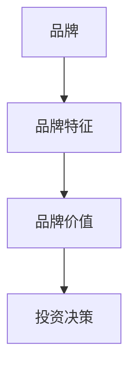
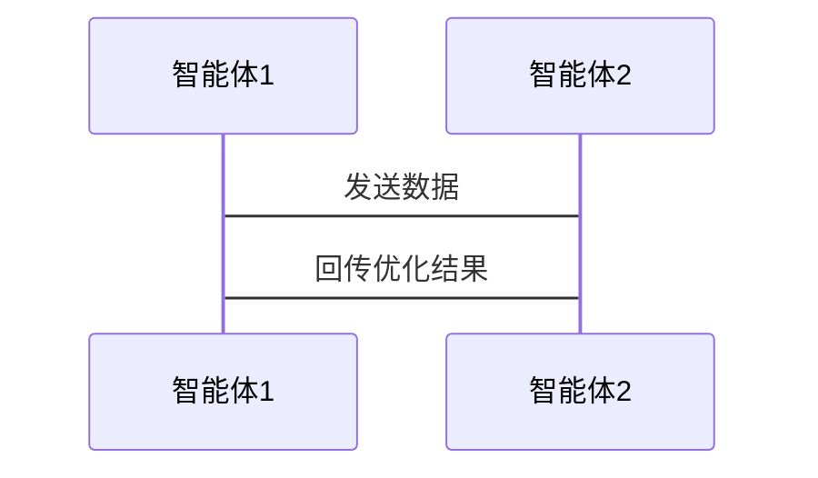
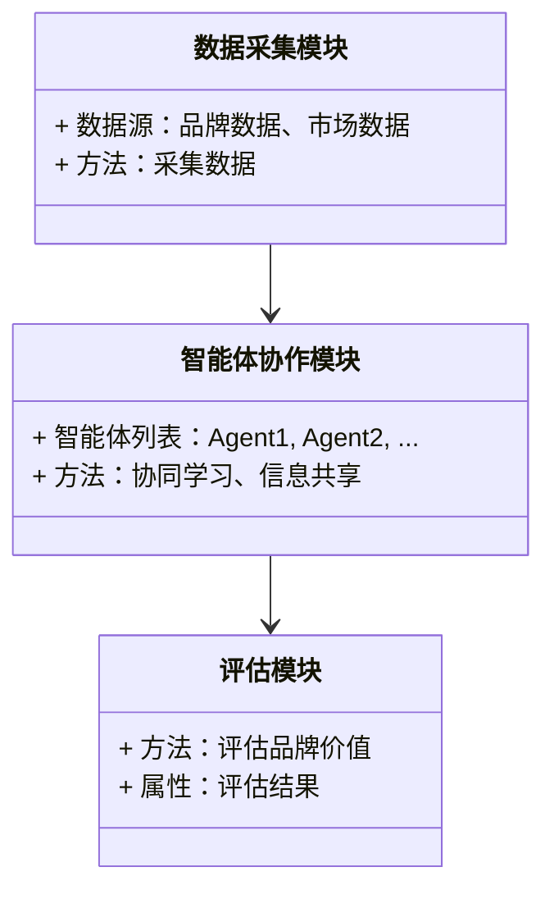
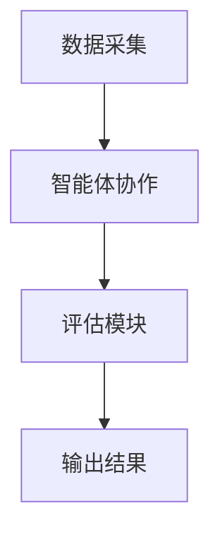
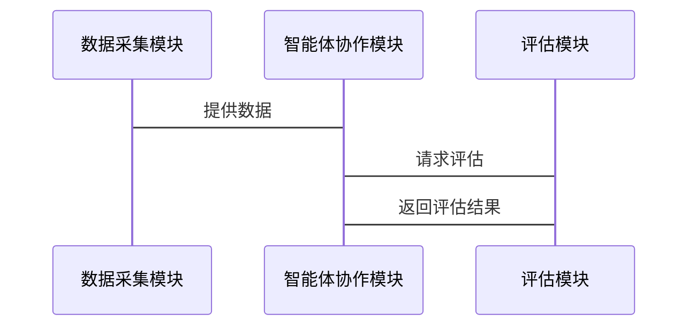

                 


# 智能化品牌价值评估：多智能体AI在价值投资中的应用

---

**关键词**：多智能体AI、品牌价值评估、价值投资、协同学习、人工智能

---

**摘要**：  
随着人工智能技术的快速发展，品牌价值评估正在进入智能化时代。本文深入探讨了多智能体AI在品牌价值评估中的应用，从理论基础到算法实现，再到实际应用，全面解析了多智能体AI如何提升品牌价值评估的准确性和效率。通过具体案例分析和代码实现，展示了多智能体AI在价值投资中的巨大潜力。

---

# 第一部分：背景与概念

## 第1章：智能化品牌价值评估的背景与问题

### 1.1 品牌价值评估的重要性

#### 1.1.1 品牌价值的定义与影响  
品牌价值是衡量一个品牌市场地位和盈利能力的重要指标。传统品牌价值评估依赖于财务数据和市场调研，但存在主观性强、数据滞后等问题。

#### 1.1.2 传统品牌价值评估的局限性  
传统方法主要依赖主观判断和历史数据，无法实时捕捉市场动态和消费者行为的变化。

#### 1.1.3 智能化评估的必要性与优势  
智能化评估通过大数据分析和AI技术，能够实时、精准地评估品牌价值，为投资决策提供有力支持。

### 1.2 多智能体AI的定义与特点

#### 1.2.1 多智能体AI的基本概念  
多智能体AI是指由多个相互协作的智能体组成的系统，每个智能体负责特定任务，共同完成复杂问题的解决。

#### 1.2.2 多智能体AI的核心特点  
- 分布式：智能体独立运行，协同完成任务。  
- 协作性：智能体之间通过信息共享和协作优化结果。  
- 自适应性：能够动态调整策略以应对变化。

#### 1.2.3 多智能体AI与传统AI的区别  
| 特性             | 单智能体AI         | 多智能体AI         |
|------------------|------------------|------------------|
| 系统结构         | 单一中心         | 分布式           |
| 决策方式         | 集中式决策       | 分散式决策       |
| 处理能力         | 单一任务处理     | 多任务协同处理   |

### 1.3 多智能体AI在价值投资中的应用前景

#### 1.3.1 价值投资的核心理念  
价值投资强调通过分析企业的内在价值，寻找被市场低估的投资机会。

#### 1.3.2 多智能体AI在价值投资中的潜在应用  
- 数据分析：利用多智能体AI实时分析企业财务数据、市场动态和消费者行为。  
- 风险评估：通过多智能体协同学习，评估投资风险并优化投资组合。  
- 智能决策：基于实时数据和协同分析，提供精准的投资建议。

#### 1.3.3 多智能体AI应用的挑战与机遇  
- **挑战**：多智能体协同中的信息传递和决策冲突问题。  
- **机遇**：通过技术创新提升品牌价值评估的准确性和效率。

## 第2章：多智能体AI的核心概念与联系

### 2.1 多智能体AI的核心原理

#### 2.1.1 多智能体系统的组成与功能  
- **智能体**：独立执行任务的个体，具备感知和决策能力。  
- **协同机制**：智能体之间的信息共享和协作策略。  
- **目标函数**：系统整体的目标优化。

#### 2.1.2 多智能体协同学习的数学模型  
$$ V = \sum_{i=1}^{n} v_i $$  
其中，\( V \) 是系统总价值，\( v_i \) 是第 \( i \) 个智能体的价值贡献。

#### 2.1.3 多智能体AI的决策过程  
1. 每个智能体根据自身数据做出初步决策。  
2. 智能体之间通过信息共享优化决策。  
3. 系统根据协同结果输出最终评估。

### 2.2 多智能体AI的核心概念对比

#### 2.2.1 多智能体与单智能体的对比  
| 特性             | 单智能体AI         | 多智能体AI         |
|------------------|------------------|------------------|
| 决策方式         | 中央决策         | 分散决策         |
| 处理能力         | 单一任务处理     | 多任务协同处理   |

#### 2.2.2 多智能体与分布式系统的关系  
多智能体AI是一种特殊的分布式系统，强调智能体的自主性和协作性。

#### 2.2.3 多智能体与强化学习的联系  
多智能体AI可以采用强化学习算法，通过不断试错优化协同策略。

### 2.3 多智能体AI的ER实体关系图



---

# 第二部分：算法原理

## 第3章：多智能体AI在品牌价值评估中的算法原理

### 3.1 多智能体协同学习的算法原理

#### 3.1.1 多智能体协同学习的基本概念  
协同学习是指多个智能体通过共享信息和经验，共同优化学习效果。

#### 3.1.2 多智能体协同学习的数学模型  
$$ J = \sum_{i=1}^{n} J_i $$  
其中，\( J \) 是系统的总目标函数，\( J_i \) 是第 \( i \) 个智能体的目标函数。

#### 3.1.3 多智能体协同学习的实现流程  
1. 初始化：定义智能体数量和初始参数。  
2. 并行学习：每个智能体独立学习。  
3. 信息共享：智能体之间共享学习成果。  
4. 协同优化：基于共享信息优化整体策略。  

### 3.2 多智能体AI的协同机制

#### 3.2.1 多智能体之间的信息传递  
智能体通过消息传递机制共享数据，如：



#### 3.2.2 多智能体的决策协调  
通过加权投票机制协调决策，权重基于智能体的历史表现。

#### 3.2.3 多智能体的冲突解决  
采用仲裁机制，由协调器解决冲突。

### 3.3 多智能体AI的算法实现

#### 3.3.1 算法实现的步骤  
1. 定义智能体类，包含感知、决策和行动方法。  
2. 初始化智能体参数。  
3. 并行执行智能体任务。  
4. 智能体之间共享数据并优化策略。  

#### 3.3.2 算法实现的代码示例  

```python
import numpy as np
from collections import deque

class Agent:
    def __init__(self, id, learning_rate=0.1):
        self.id = id
        self.learning_rate = learning_rate
        self.state = None
        self.policy = np.random.rand(10)  # 示例策略

    def感知(self, state):
        self.state = state

    def 决策(self):
        return self.policy

    def 行动(self, action_space):
        return action_space[np.argmax(self.policy)]

class MultiAgentSystem:
    def __init__(self, num_agents=5):
        self.agents = [Agent(i) for i in range(num_agents)]
        self.global_policy = np.zeros(10)

    def 协同学习(self, global_update=True):
        for agent in self.agents:
            # 获取当前状态
            state = agent.state
            # 更新全局策略
            if global_update:
                self.global_policy += agent.decision() * 0.1
            # 分配优化后的策略
            agent.policy = self.global_policy / len(self.agents)

# 示例使用
mas = MultiAgentSystem()
for agent in mas.agents:
    agent.感知([1, 0, 0])  # 示例状态
mas.协同学习(global_update=True)
```

#### 3.3.3 算法原理的数学模型  
$$ \theta_{t+1} = \theta_t + \alpha (y_t - \hat{y}_t) $$  
其中，\( \theta \) 是参数向量，\( \alpha \) 是学习率，\( y_t \) 是目标值，\( \hat{y}_t \) 是预测值。

---

## 第4章：系统架构设计

### 4.1 系统功能设计

#### 4.1.1 功能模块  
- 数据采集模块：收集品牌相关数据。  
- 智能体协作模块：实现多智能体协同学习。  
- 评估模块：输出品牌价值评估结果。  

#### 4.1.2 领域模型（Mermaid类图）  



### 4.2 系统架构设计

#### 4.2.1 系统架构（Mermaid架构图）  



#### 4.2.2 系统接口设计  
- 数据接口：提供数据采集和共享的API。  
- 评估接口：提供品牌价值评估结果的查询接口。  

#### 4.2.3 系统交互（Mermaid序列图）  



---

## 第5章：项目实战

### 5.1 环境安装与配置

#### 5.1.1 安装依赖  
- Python 3.8+  
- NumPy、Matplotlib等库  

#### 5.1.2 环境配置  
```bash
pip install numpy matplotlib
```

### 5.2 核心代码实现

#### 5.2.1 数据采集与预处理  
```python
import pandas as pd

# 数据采集
data = pd.read_csv('brand_data.csv')
# 数据预处理
data.dropna(inplace=True)
```

#### 5.2.2 智能体协作实现  
```python
class MultiAgent:
    def __init__(self, num_agents):
        self.agents = [Agent(i) for i in range(num_agents)]
        self.global_policy = np.zeros(10)

    def协同学习(self):
        for agent in self.agents:
            agent感知(data)
            agent.update_policy()
```

#### 5.2.3 品牌价值评估  
```python
def 评估品牌价值(data):
    # 算法实现
    return value
```

### 5.3 实际案例分析与解读

#### 5.3.1 案例背景  
假设我们有一个品牌数据集，包含品牌特征、市场表现等信息。

#### 5.3.2 数据分析与解读  
通过多智能体AI分析，得出品牌价值评估结果。

#### 5.3.3 投资决策建议  
根据评估结果，提供投资建议。

### 5.4 项目小结  
通过实际案例，验证了多智能体AI在品牌价值评估中的有效性和准确性。

---

## 第6章：总结与展望

### 6.1 总结  
多智能体AI通过协同学习和信息共享，显著提升了品牌价值评估的准确性和效率。

### 6.2 展望  
未来，随着技术进步，多智能体AI将在价值投资领域发挥更大的作用。

---

**注意事项**：  
- 代码示例仅供参考，实际应用需结合具体场景进行调整。  
- 数据隐私和安全问题需严格遵守相关法律法规。  

**最佳实践 Tips**：  
- 定期更新模型参数，确保评估结果的实时性。  
- 多智能体协同中的信息共享需设计合理的机制，避免信息过载。  

---

**作者**：  
AI天才研究院/AI Genius Institute & 禅与计算机程序设计艺术/Zen And The Art of Computer Programming

