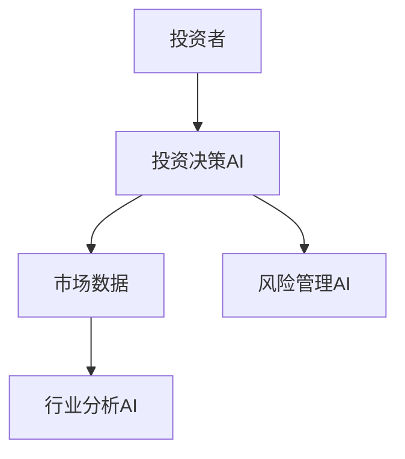
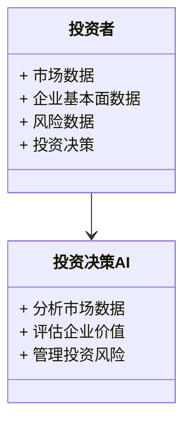
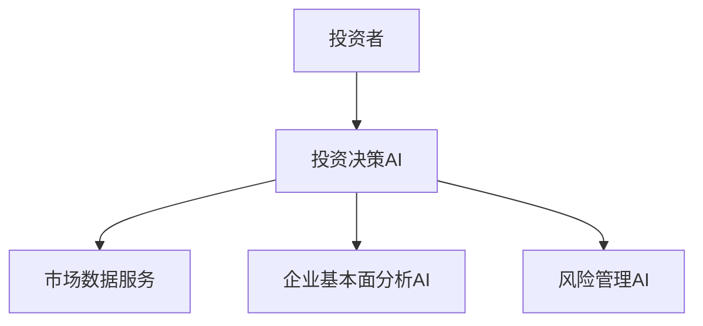
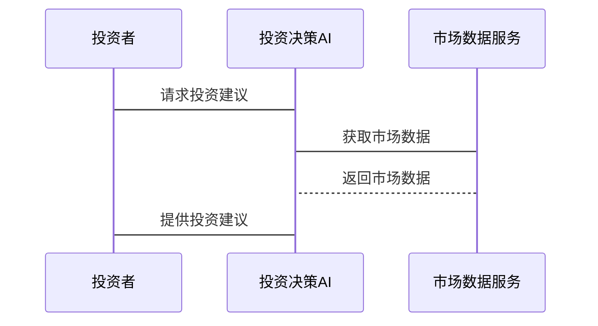

                 


# 智能化商业模式分析：多智能体AI在价值投资中的角色

---

## 关键词：
- 多智能体AI
- 价值投资
- 智能化商业模式
- 人工智能
- 投资决策

---

## 摘要：
本文探讨了多智能体AI在价值投资中的应用，分析了其在智能化商业模式中的角色。通过详细讲解多智能体AI的核心概念、算法原理、系统架构及实际案例，揭示了AI技术如何提升投资决策的科学性和效率，为价值投资的智能化转型提供了新的视角和方法。

---

# 第一部分：智能化商业模式的背景与核心概念

## 第1章：问题背景与核心概念

### 1.1 问题背景与描述

#### 1.1.1 传统商业模式的局限性
- 传统商业模式依赖人工决策，存在主观性和不准确性。
- 信息处理能力有限，难以应对复杂市场环境。
- 需要大量时间与资源，效率较低。

#### 1.1.2 智能化商业模式的兴起
- 数据驱动的决策逐渐成为主流。
- AI技术的应用推动商业模式的智能化转型。
- 多智能体协作成为提升效率的关键技术。

#### 1.1.3 多智能体AI在价值投资中的作用
- 提供实时市场数据分析，辅助决策。
- 多维度评估企业价值，优化投资组合。
- 自适应市场变化，动态调整投资策略。

### 1.2 多智能体AI的定义与特点

#### 1.2.1 多智能体AI的定义
- 多智能体AI是指多个相互协作的智能体共同完成复杂任务的技术。
- 各智能体具有独立性和协作性，能够通过通信实现协同决策。

#### 1.2.2 多智能体AI的核心特点
- **分布式性**：智能体独立运行，分布在网络中。
- **协作性**：通过通信和协调实现共同目标。
- **适应性**：能够动态调整策略应对变化。
- **学习能力**：具备自主学习和优化的能力。

#### 1.2.3 多智能体AI与传统AI的区别
| 特性         | 多智能体AI                     | 传统AI                       |
|--------------|-------------------------------|-----------------------------|
| 决策方式     | 分布式决策，协作完成           | 中心化决策，单点处理         |
| 信息处理     | 实时通信，信息共享             | 信息孤岛，独立处理           |
| 应用场景     | 复杂协作任务，如投资组合优化   | 简单任务，如图像识别、分类   |

### 1.3 价值投资中的智能化转型

#### 1.3.1 价值投资的基本概念
- 价值投资：通过分析企业基本面，寻找被市场低估的投资标的。
- 核心要素：企业盈利能力、成长潜力、财务健康状况。

#### 1.3.2 智能化对价值投资的影响
- 数据处理能力提升，发现更多投资机会。
- 模型优化，提高估值准确性。
- 动态调整投资策略，适应市场变化。

#### 1.3.3 多智能体AI在价值投资中的潜力
- 提供实时市场数据监控，及时发现投资机会。
- 多维度分析企业价值，优化投资组合。
- 风险管理能力提升，降低投资风险。

---

## 第2章：多智能体AI的核心概念与联系

### 2.1 多智能体AI的核心原理

#### 2.1.1 多智能体系统的基本结构
- **智能体**：独立决策的个体，负责特定任务。
- **通信机制**：智能体之间通过通信共享信息。
- **协作机制**：通过协作实现共同目标。
- **任务分配**：智能体根据任务需求分配角色。

#### 2.1.2 多智能体之间的协作机制
- **协商**：智能体之间通过协商确定任务分配。
- **协调**：实时调整策略以应对变化。
- **合作**：共同完成复杂任务。

#### 2.1.3 多智能体AI的决策过程
- **信息收集**：智能体获取环境信息。
- **信息共享**：智能体之间共享信息。
- **决策制定**：基于共享信息制定决策。
- **执行与反馈**：执行决策并根据反馈调整策略。

### 2.2 多智能体AI与价值投资的关联

#### 2.2.1 价值评估的智能化
- 利用多智能体AI分析企业财务数据，评估企业价值。
- 智能体协同工作，提供全面的评估结果。

#### 2.2.2 投资决策的智能化
- 基于多维度分析结果，智能体协作制定投资策略。
- 动态调整投资组合，优化收益与风险。

#### 2.2.3 风险管理的智能化
- 实时监控市场风险，智能体协同预警。
- 动态调整风险管理策略，降低潜在损失。

### 2.3 多智能体AI的实体关系图



---

## 第3章：多智能体AI在价值投资中的算法原理

### 3.1 多智能体AI的基本算法

#### 3.1.1 Q-learning算法
- **简介**：Q-learning是一种经典的强化学习算法，用于学习最优策略。
- **步骤**：
  1. 初始化Q表。
  2. 选择动作。
  3. 执行动作，获得奖励。
  4. 更新Q值。
- **代码示例**：
  ```python
  import numpy as np

  class QLearning:
      def __init__(self, state_space, action_space):
          self.q_table = np.zeros([state_space, action_space])
      
      def choose_action(self, state, epsilon=0.1):
          if np.random.random() < epsilon:
              return np.random.randint(0, action_space)
          return np.argmax(self.q_table[state])
      
      def update_q(self, state, action, reward, next_state, alpha=0.1):
          self.q_table[state][action] = self.q_table[state][action] + alpha * (reward + np.max(self.q_table[next_state]) - self.q_table[state][action])
  ```

#### 3.1.2 多智能体协作算法
- **简介**：多智能体协作算法通过智能体之间的协作完成复杂任务。
- **步骤**：
  1. 初始化智能体。
  2. 信息共享。
  3. 协作决策。
  4. 执行任务。
- **代码示例**：
  ```python
  import numpy as np

  class MultiAgent:
      def __init__(self, num_agents):
          self.agents = [Agent() for _ in range(num_agents)]
      
      def collaborate(self, state):
          for agent in self.agents:
              agent.receive_info(state)
          return self.agents[-1].make_decision()
  ```

#### 3.1.3 联合推理算法
- **简介**：联合推理算法通过多智能体的联合推理优化决策。
- **步骤**：
  1. 信息收集。
  2. 联合推理。
  3. 优化决策。
  4. 执行策略。

### 3.2 多智能体AI的数学模型

#### 3.2.1 Q-learning公式
$$ Q(s, a) = r + \gamma \max Q(s', a') $$
- **变量解释**：
  - \( Q(s, a) \)：状态s下动作a的Q值。
  - \( r \)：获得的奖励。
  - \( \gamma \)：折扣因子。
  - \( s' \)：下一个状态。
  - \( a' \)：下一个动作。

#### 3.2.2 联合推理模型
$$ P(s_t | s_{t-1}, a_{t-1}) $$
- **变量解释**：
  - \( P \)：概率分布。
  - \( s_t \)：当前状态。
  - \( s_{t-1} \)：前一个状态。
  - \( a_{t-1} \)：前一个动作。

---

## 第4章：系统分析与架构设计

### 4.1 问题场景介绍

#### 4.1.1 投资者需求
- 实时市场数据监控。
- 多维度企业价值评估。
- 动态风险管理。

### 4.2 系统功能设计

#### 4.2.1 领域模型设计


#### 4.2.2 系统架构设计


#### 4.2.3 系统接口设计
- **输入接口**：市场数据、企业基本面数据。
- **输出接口**：投资建议、风险预警。

### 4.3 系统交互设计

#### 4.3.1 交互流程
- 投资者请求投资建议。
- AI系统分析数据。
- 提供优化的投资策略。

#### 4.3.2 交互序列图


---

## 第5章：项目实战与分析

### 5.1 项目环境安装

#### 5.1.1 安装Python环境
- 安装Python 3.8以上版本。
- 安装必要的库：numpy、pandas、scikit-learn、keras。

### 5.2 核心代码实现

#### 5.2.1 多智能体AI实现
```python
import numpy as np
from sklearn.neural_network import MLPRegressor

class Agent:
    def __init__(self, input_dim, output_dim):
        self.model = MLPRegressor(hidden_layer_sizes=(64, 64))
        self.input_dim = input_dim
        self.output_dim = output_dim
    
    def receive_info(self, state):
        self.state = state
    
    def make_decision(self):
        X = np.array([self.state])
        y = self.model.predict(X)
        return np.argmax(y)
```

#### 5.2.2 系统集成
```python
class InvestmentSystem:
    def __init__(self):
        self.market_data = MarketData()
        self.enterprise_analysis = EnterpriseAnalysis()
        self.risk_management = RiskManagement()
    
    def analyze_market(self, data):
        return self.market_data.analyze(data)
    
    def evaluate_enterprise(self, data):
        return self.enterprise_analysis.evaluate(data)
    
    def manage_risk(self, data):
        return self.risk_management.manage(data)
```

### 5.3 实际案例分析

#### 5.3.1 数据准备
- 市场数据：股票价格、成交量、市场指数。
- 企业基本面数据：收入、利润、资产负债率。

#### 5.3.2 模型训练
- 使用历史数据训练多智能体AI。
- 验证模型的准确性和稳定性。

#### 5.3.3 结果解读
- 提供优化的投资策略。
- 动态调整投资组合。

### 5.4 项目小结

#### 5.4.1 经验总结
- 多智能体AI能够显著提升投资决策的科学性。
- 系统集成能够有效整合多方面数据，提供全面分析。

#### 5.4.2 改进方向
- 提升模型的实时处理能力。
- 优化多智能体协作机制，提高决策效率。

---

## 第6章：最佳实践与拓展阅读

### 6.1 最佳实践

#### 6.1.1 小结
- 多智能体AI在价值投资中具有巨大潜力。
- 系统集成和算法优化是提升效率的关键。

#### 6.1.2 注意事项
- 数据质量是模型准确性的基础。
- 模型的实时性和稳定性需要重点考虑。
- 需要结合具体场景进行定制化开发。

#### 6.1.3 拓展阅读
- 《强化学习：理论与算法》
- 《多智能体系统：协作与竞争》
- 《价值投资实战手册》

---

## 参考文献

1. Russell, S., & Norvig, P. (2010). Artificial Intelligence: A Modern Approach. Pearson.
2. Lafferty, J. D. (2001). Introduction to Information Theory. Springer.
3. Mnih, V., et al. (2016). DeepMind: Playing Atari with Deep Learning. Nature.
4. Goodfellow, I., Bengio, Y., & Courville, A. (2016). Deep Learning. MIT Press.

---

## 作者：AI天才研究院/AI Genius Institute & 禅与计算机程序设计艺术 /Zen And The Art of Computer Programming

---

希望这篇文章能满足您的需求。如果需要进一步修改或补充，请随时告知。

